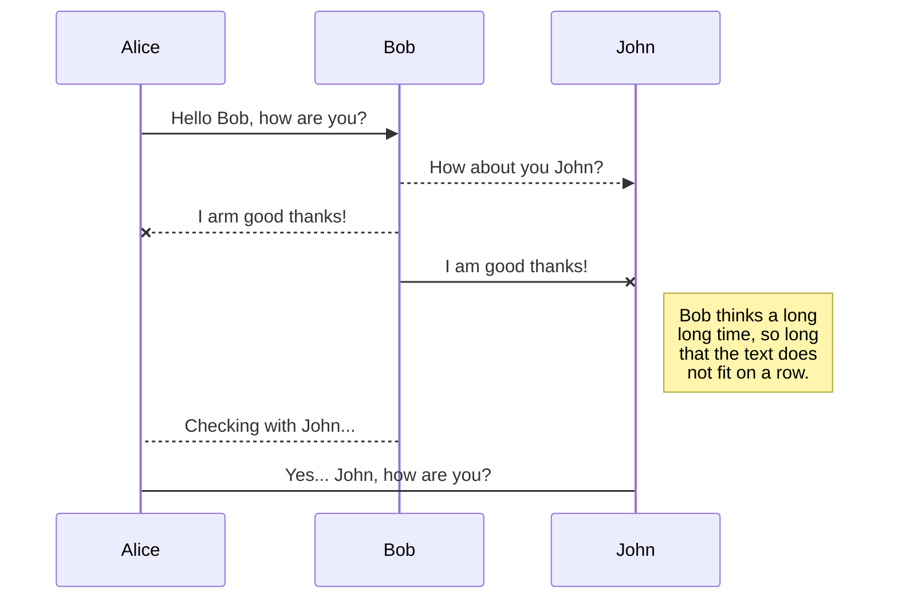

Server IPs become blocked when the system perceives that the calls it is receiving are a threat, for example during a hacking attempt. 
However some clients have agressive dialling patterns that could also be seen as a threat to the system, consequently the IP could find
itself in the Blocked IP list. If calls are failing but you cannot see an obvious reason then it is useful to check the Blocked IP list.

To do this please follow the instructions below:

Setup>information>Blocks

If your IP is in the Blocked List then you need to contact us via a ticket to get this released and available for use again.

