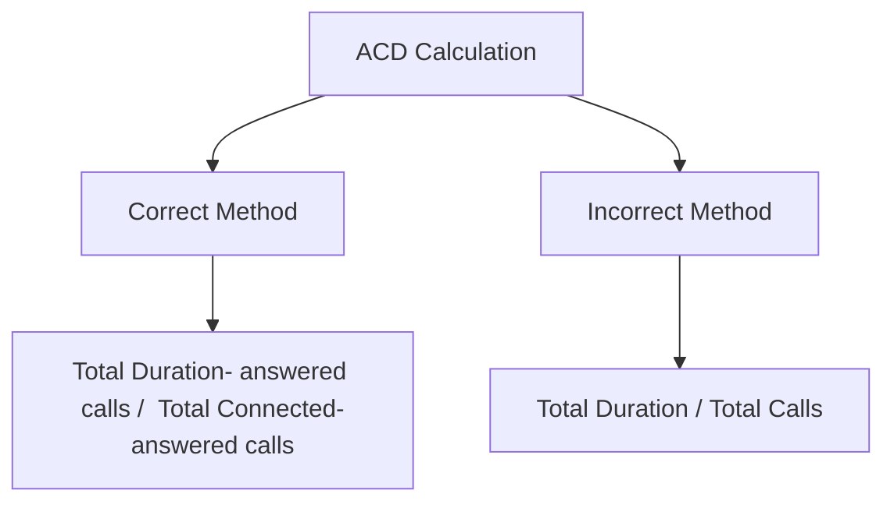

# Acronyms and Definitions

ConnexCS uses standard telephony terminology in our Control Panel and documentation.

Find below the definitions for the most relevant telephony terms, along with some general networking terms and ConnexCS specific terms.

|Term|Definition|Explanation|
|---|---|---|
|**ACD \ ALOC**|*Average Call Duration \ Average Length of Call*|The average length of calls. Average Call Duration or otherwise called Average Length of Call is a retrospective calculation of how long calls last, that is the mean average. Typically only connected calls are included in this calculation, so it is simply the total time that all of the calls were connected divided by the total number of connected calls.|
|**ASR**|*Answer-Seisure Ratio*|The call answer rates as a percentage (connected calls divided by total calls).|  
|**Channel**|n/a|An ongoing live call on the system. |
|**CLI**|*Calling Line Identification*|Identifies the caller's telephone number, which is often displayed to the call recipient in the form of Caller-ID.|
|**CPS**|*Calls Per Second*|The volume of calls, referred to the number of calls handled per second, rather than the number of calls a system can receive.|
|**CDR**|*Call Detail Records*|In-depth information about calls that pass through a VoIP exchange. CDRs are a source data for billing and consumer tracking.|
|**Codec**|*Coder-Decoder*|Encodes and decodes data between analog and digital signals, with some form of compression.|
|**DID**|*Direct Inward Dial*|By assigning a public number to an internal location, outside callers can reach a destination without going through a PBX.|
|**DTMF**|*Dual-Tone Multi-Frequency*|A signalling system that connects points in the telephony network, typically between telephone equipment, communications devices, and switching centers. See [**Wikipedia DTMF**](https://en.wikipedia.org/wiki/Dual-tone_multi-frequency_signaling) for more details.|
|**E.123**|*Specific Number Format*|A standard that includes a number format beginning with a + followed by a country code and subscriber number.|
|**E.164**|*Specific Number Format*|As described by the ITU, the E.164 general format must contain only digits split as follows: Country code (1 to 3 digits) Subscriber number (max 12 digits).|
|**FAS**|*False Answer Supervision*|A kind of billing fraud, it bills a call for a length of time that was longer than the actual call duration.|
|**Flow Speed**|n/a|The number of allowed calls per second. ConnexCS uses this term and **Calls Per Second (CPS)** interchangeably.|
|**FQDN**|*Fully Qualified Domain Name*|A domain name, which also includes a hostname, that points to or references an IP. For example, sip.connexcs.com.|
|**IVR**|*Interactive Voice Response*|Sometimes known as a "phone tree," this allows callers to select different options that connect them to different end-points (For example, extensions or users) in your system.|
|**Jitter**|n/a|This refers to the variation in time between received packets. In a VoIP system, Jitter may explain voice quality issues such as robotic-sounding voices, static, or choppy audio.|
|**LCR**|*Least-Cost Route*|The practice of managing traffic in a VoIP network in the least expensive way. 'Expensive' can relate to the actual cost, or it can abstractly refer to time and effort.|
|**LRN**|*Location Routing Number*|[**Wikipedia LRN**](https://en.wikipedia.org/wiki/Location_routing_number). A number portability system used to route NPA-NXX calls and allow the receiving carrier to find the price of the call, not the destination number.|
|**MOS**|*Mean Opinion Score*|This score can show the general call quality of a system, a carrier, or a customer.|
|**NAT**|*Network Address Translation*|This is a networking practice that allows private IPs in a defined network to share a public IP that can route over the internet, helping to conserve the dwindling supply of public IPs.|
|**NER**|*Network Effectiveness Ratio*|Measures a network's ability to deliver phone calls independent of user actions like a terminal reject.|
|**NPA-NXX**|*Numbering Plan Area-1st 3 digits*|The number is followed by four more identifying digits, making it NPA-NXX-XXXX.  The 'N' in NXX is different because it represents digits from 2 9 instead of 0–9, as it's with 'X'. See [**USA Routing**](https://docs.connexcs.com/routing-usa/) for further explanation.|  
|**P-Asserted-ID**|n/a|A header field in the SIP INVITE that has the identity of the caller (typically used for caller-ID / network identifier). It shouldn't be delivered to the end-user.|
|**PDD**|*Post-Dial Delay*|The time between the last digit dialled and a ringer or equal action on the other end. This is useful to check to see if a carrier is slow to connect a call.|
|**PSTN**|*Public Switched Telephone Network*|A broad term that encompasses most telephone networks, including telephone lines, mobile networks, and communication satellites.|
|**RTP**|*Real-time Transfer Protocol*|A network protocol used to move media across IP-based systems.|
|**SIP**|*Session Initiation Protocol*|A TCP/IP-based network protocol used in VoIP telephony to establish connections for telephone calls.|
|**SIP Trace**|n/a|A log of SIP signalling messages, this is an essential tool for troubleshooting registration, call completion, and other issues.|
|**Transcoding**|n/a|Converts file from one format to another. In ConnexCS, this refers to the process of converting audio from one codec to another, often when there is low-bandwidth.|
|**Channel**|n/a| Channels are analogous to dialogs. Channels are counted even if the call wasn't connected or even ringing hasn't begun. It's counted even if the call geeing setup. For example, if 100 channels exist, it means 100 active calls exist.|
|**Dialog**|n/a| A Dialog is a single call.|

!!! info

!!! Info
    | S.No | ASR Score     | Inference          |
    |------|---------------|--------------------|
    | 1.   | 60% and above | Exceptionally good |
    | 2.   | 40% to 50%    | Acceptable         |
    | 3.   | Less than 40% | Poor               |

!!! Note

    1. **ASR Calculation**
    Total Connected / Total Calls
    
    2. **Strict ASR (Removing NER) Calculation**
    Total Connected / Non-carrier failure

    3. **NER Calculation**
    Client Side Response Codes / Client + Server Codes
    4. **Channels** = CPS * ACD

!!! note "CLI vs PAID"
    **PAID** is the address of the person who placed the call. This is same as the address in the "From" header, but it may change if the caller uses several identities and needs to represent the one that applies to the destination.

    For example, consider a call from alice@sip.com to the PSTN, where the P-Asserted-Identity field can be changed to the "alice" phone number.

    **CLI** gives the calling phone's number to the party receiving the call. CLI is used to determine the caller or the place where a call originated.

    The P-Asserted-Identity contains the caller id information for the call on the INVITE SIP packet. P-asserted-ID header may contain either Tel URI or SIP URI. For CLI identification purposes multiple P-Asserted-ID headers should not be used unless there is a P-asserted-ID containing Tel URI and/or a P-asserted-ID containing SIP URI and user=phone. In this case both type of URIs must contain the same phone number. If none of the above exist and contain a valid E.164 number, CLI will not be considered valid.

!!! note "Missed Call Traffic"
    Missed Call Traffic is placing calls which DONT connect and / or have a VERY SHORT duration.
    It's not advisable not to have large volumes of Missed Call Traffic.
  