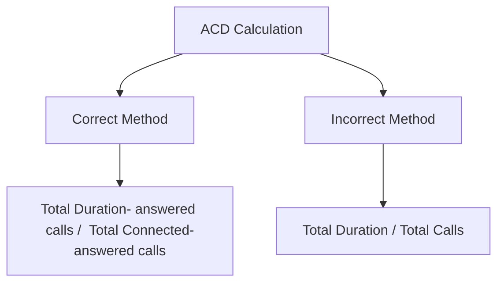

# Acronyms and Definitions

 
<strong>Document Metadata</strong>
  

<strong>Category</strong>: Acronyms & Definitions 
<strong>Audience</strong>: Administrators, Engineers, Support Team 
<strong>Difficulty</strong>: Beginner 
<strong>Time Required</strong>: 5–10 minutes 
<strong>Prerequisites</strong>: Access to the documentation portal; basic familiarity with telecom/VoIP terms 
<strong>Related Topics</strong>: <a href="https://docs.connexcs.com/setup/information/dial-code-destination/">Dial Code / Destination</a> (for number-format definitions), <a href="https://docs.connexcs.com/billing-basics/">Billing Basics</a> (uses many of the same metrics) 
<strong>Next Steps</strong>: Use the acronym list to align your internal documentation + glossary; ensure all team members use consistent terminology. 

|Term|Definition|Explanation|
|---|---|---|
|**ACD \ ALOC**|*Average Call Duration \ Average Length of Call*|The average length of calls. Average Call Duration or otherwise called Average Length of Call is a retrospective calculation of how long calls last, that is the mean average. Typically only connected calls are included in this calculation, so it is simply the total time that all of the calls were connected divided by the total number of connected calls.|
|**ASR**|*Answer-Seisure Ratio*|The call answer rates as a percentage (connected calls divided by total calls).|  
|**Channel**|n/a|An ongoing live call on the system. |
|**CLI**|*Calling Line Identification*|Identifies the caller's telephone number, which is often displayed to the call recipient in the form of Caller-ID.|
|**CPS (Flow Speed)**|*Calls Per Second*|The number of allowed calls per second. ConnexCS uses this term and **Calls Per Second (CPS)** interchangeably.|
|**CDR**|*Call Detail Records*|In-depth information about calls that pass through a VoIP exchange. CDRs are a source data for billing and consumer tracking.|
|**Codec**|*Coder-Decoder*|Encodes and decodes data between analog and digital signals, with some form of compression.|
|**DID**|*Direct Inward Dial*|By assigning a public number to an internal location, outside callers can reach a destination without going through a PBX.|
|**DTMF/MF4/Touch-Tone**|*Dual-Tone Multi-Frequency*|A signalling system that connects points in the telephony network, typically between telephone equipment, communications devices, and switching centers. See [**Wikipedia DTMF**](https://en.wikipedia.org/wiki/Dual-tone_multi-frequency_signaling) for more details.|
|**E.123**|*Specific Number Format*|A standard that includes a number format beginning with a + followed by a country code and subscriber number.|
|**E.164**|*Specific Number Format*|As described by the ITU, the E.164 general format must contain only digits split as follows: Country code (1 to 3 digits) Subscriber number (max 12 digits).|
|**FAS**|*False Answer Supervision*|A kind of billing fraud, it bills a call for a length of time that was longer than the actual call duration.|
|**FQDN**|*Fully Qualified Domain Name*|A domain name, which also includes a hostname, that points to or references an IP. For example, sip.connexcs.com.|
|**IVR**|*Interactive Voice Response*|Sometimes known as a "phone tree," this allows callers to select different options that connect them to different end-points (For example, extensions or users) in your system.|
|**Jitter**|n/a|This refers to the variation in time between received packets. In a VoIP system, Jitter may explain voice quality issues such as robotic-sounding voices, static, or choppy audio.|
|**LCR**|*Least-Cost Route*|The practice of managing traffic in a VoIP network in the least expensive way. 'Expensive' can relate to the actual cost, or it can abstractly refer to time and effort.|
|**LRN**|*Location Routing Number*|[**Wikipedia LRN**](https://en.wikipedia.org/wiki/Location_routing_number). A number portability system used to route NPA-NXX calls and allow the receiving carrier to find the price of the call, not the destination number.|
|**MOS**|*Mean Opinion Score*|This score can show the general call quality of a system, a carrier, or a customer.|
|**NAT**|*Network Address Translation*|This is a networking practice that allows private IPs in a defined network to share a public IP that can route over the internet, helping to conserve the dwindling supply of public IPs.|
|**NER**|*Network Effectiveness Ratio*|Measures a network's ability to deliver phone calls independent of user actions like a terminal reject.|
|**NPA-NXX**|*Numbering Plan Area-1st 3 digits*|The number is followed by four more identifying digits, making it NPA-NXX-XXXX.  The 'N' in NXX is different because it represents digits from 2 9 instead of 0–9, as it's with 'X'. See [**USA Routing**](https://docs.connexcs.com/routing-usa/) for further explanation.|  
|**PDD**|*Post-Dial Delay*|The time between the last digit dialled and a ringer or equal action on the other end. This is useful to check to see if a carrier is slow to connect a call.|
|**PSTN**|*Public Switched Telephone Network*|A broad term that encompasses most telephone networks, including telephone lines, mobile networks, and communication satellites.|
|**RTP**|*Real-time Transfer Protocol*|A network protocol used to move media across IP-based systems.|
|**SIP**|*Session Initiation Protocol*|A TCP/IP-based network protocol used in VoIP telephony to establish connections for telephone calls.|
|**SIP Trace**|n/a|A log of SIP signalling messages, this is an essential tool for troubleshooting registration, call completion, and other issues.|
|**Transcoding**|n/a|Converts file from one format to another. In ConnexCS, this refers to the process of converting audio from one codec to another, often when there is low-bandwidth.|
|**Channel**|n/a| Channels are analogous to dialogs. Channels are counted even if the call wasn't connected or even ringing hasn't begun. It's counted even if the call geeing setup. For example, if 100 channels exist, it means 100 active calls exist.|
|**Dialog**|n/a| A Dialog is a single call.|
|**2FA/TFA**|*Two-Factor Authentication*|A login method requiring two types of verification, usually a password plus a code or approval from a device. This adds an extra security layer beyond just a password.|
|**Web Auth N / FIDO2**|*Web Authentication / Fast Identity Online 2*|A modern authentication standard that allows secure, passwordless logins using methods like security keys, biometrics, or device-based credentials. It reduces reliance on passwords and strengthens protection against phishing|
|**ASR+**|*Answer Seizure Ratio+*|ASR Plus is a proprietary ConnexCS technology that filters known failed, non-existent / working numbers between the customer and the terminating, or destination, carrier.|
|**AnyEdge**|n/a| It balances the traffic between the SIP servers and the customers.|
|**Spam Scout Scoring**|n/a| It blocks Spam calls based on the CLIs.|
|**IPQS**|*IP Quality Score*|Tt blocks the calls based on the spam score. The spam score is provided by a third party IPQS.|
|**PAID**|*P-Asserted-ID*|A header field in the SIP INVITE that has the identity of the caller (typically used for caller-ID / network identifier). It shouldn't be delivered to the end-user.|
|**RTP Firewall**|n/a|It will bypass the media Firewall.|
|**STIR/Shaken**|*STIR*: Secure Telephone Identity Revisited*  *SHAKEN*: Signature-based Handling of Asserted Information Using toKENs* |Required step for call origination providers to authenticate and validate caller identities.|
|**CIDR**|*Classless Inter-Domain Routing*|A method of allocating IP addresses and routing that replaces the older class-based system. It uses a suffix (e.g., /24) to show how many bits define the network portion of the address. For example, 192.168.1.0/24 represents 256 IP addresses from 192.168.1.0 to 192.168.1.255.|
|**STUN**| *Session Traversal Utilities for NAT*|Clients can use STUN to determine their external IP address and update SIP packets accordingly.|
|**ALG**|*Application Layer Gateway*|NAT devices can rewrite SIP packets to use external IP addresses, though this method is unreliable.|
|**Far-end NAT Traversal**|n/a| The system can detect and adjust for NAT by checking IP headers and assuming the correct external IP address.|
|**UAC**|*User Agent Client*|Acts as a client, typically used when sending calls out.|
|**UAS**|*User Agent Server*| Acts as a server, typically used when receiving calls.|
|**Tech Prefix**|n/a|A unique code assigned to each customer sharing an IP, enabling the switch to identify the route, correctly route calls, and distinguish between different rate cards.|
|**Dial String**|n/a| Restricts outgoing calls to numbers matching the defined dial string or pattern. If left blank, all calls are allowed|
|**Dial String Prefix Set**|n/a| A collection of commonly used prefixes (e.g., for the UK) that can be selected for customers, avoiding the need to enter each prefix individually.|
|**FTC DNC Report ANI Block (USA)**|n/a|Blocks known spam numbers.|
| **DNO** |*Do Not Originate*| Blocks numbers that should never be used for outgoing calls, including spoofed, unassigned, unallocated, or inbound-only numbers. Helps prevent illegal, fraudulent, or malicious traffic.|
|**DNC**|Do Not Call| The customer won't be able to able to dial the numbers in the specified DNC list.|
|**TCPA Litigator DNC**|*TCPA*: Telephone Consumer Protection Act*.  *DNC: Do Not Call*|Prevents calls to phone numbers reported as TCPA litigators, reducing the risk of legal action under the Telephone Consumer Protection Act (TCPA).|
|**SST**|*SIP Session Timer*|Prevents ghost or long-duration calls.|
|**Active RTCP Generation** |n/a|Controls RTCP packet generation|
|**RTP Codec**|n/a|Manages audio/video codecs|
|**Ptime(ms)**|*Packetization Time*|Sets how much audio/video data each RTP packet carries; higher values = longer chunks, lower = shorter.|
|**ASR+ (Low)**|*Answer Seizure Ratio+ Low*|Active on 30% of calls|
|**ASR?**|n/a|When ASR+ gets enabled on the provider card
|**ASR+?**|n/a|When ASR+ gets enabled on the provider card, only known connected calls pass-through specific providers
|**ASR++**|n/a|Only known connected calls pass-through|
|**Channel Breach**|n/a|This will identify instances when customers have exceeded your preset thresholds.|
|**404 Hits**|n/a|It indicates the number of times an unavailable URL on your website has been accessed.|
|**200 Hits**|n/a|It indicates the number of successful requests.|
|**No Matches**|n/a|It indicates the number of misses.|
|**FTC Block**|n/a|It indicates the number of calls blocked by the FTC Block.|
|**CPS Breach**|n/a|When a customer is passing more calls per second than permitted.|
|**KYC**|*Know Your Customer*|A process used to verify the identity of customers to prevent fraud, money laundering, or other illegal activities.|
|**Circuit Test**|n/a|For trouleshooting purposes.|
| **First Reply Timeout** |n/a|*Carrier initial response time* |
|**PDD Timeout**|*Post-dial delay limit*|Time for the carrier to respond to the call before trying another.|
|**Ring Timeout**|n/a|Time the call rings after carrier selection.|
|**Code Consistency**|n/a| Identifies route quality and detect carriers who may misrepresent call outcomes.|
|**Failover**|n/a|Lists calls that failed with this carrier but succeeded with another, helping troubleshoot carrier issues and identify FAS.|
|**Reverse LCR**|n/a|First, it selects the most expensive route.|
|**Tier**|n/a| Distributes calls across rate cards based on assigned weights.|
|**LCR Performance**|n/a|Chooses lowest-cost carriers, prioritizing those with better performance.|
|**Max Duration**|n/a|Ends calls after a set time or via SIP Ping checks if the other side is still active.|
|**RTP Timeout**|n/a|Ends calls if no RTP (audio) is detected for a set interval; not effective in direct RTP mode.|
|**CPS Spike Buffer**|n/a|Spreads sudden spikes of calls over time by buffering, then releasing them at the set calls-per-second rate.|
|**Balance Disconnect**|n/a| Checks balance every 60s and disconnects calls if balance plus debit limit drops below $0.|
|**TTS**|*Text-to-Speech*|Converts your text intto audio.|
|**OCN**|*Operating Company Number*|A unique identifier assigned to telecommunications service providers.|
|**FRN**|*Firm Registration Number*|A registration number used to identify a company or firm in official records.|
|**SMTP**|*Simple Mail Transfer Protocol*|Standard protocol used to send, relay, and route emails between mail servers and clients.|
|**Cluster**|n/a| Group servers to share information such as dialogues and throughput.|
|**UAC Auth**|n/a|Enables ConnexCS to register as a UAC (rather than a UAS) with upstream providers with a username and password.|
|**WebRTC**|*Web Real Time Communication*|Enables real-time voice, video, and data sharing directly in web browsers without plugins.|
|**TLS**|*Transport Layer Security*|Secures communication over networks by encrypting data and ensuring privacy and integrity.|
|**TCP**|*Transmission Control Protocol*| Ensures reliable data delivery with error checking, acknowledgments, and retransmissions.|
|**UDP**|*User Datagram Protocol*|Faster but unreliable; sends data without guaranteeing delivery or order, commonly used for streaming and VoIP.|
|**DNS**|*Domain Name System*|Converts domain names into IP addresses so computers can find each other on a network.|
|**TTL**|*Time To Live*|Specifies how long data (like DNS records or IP packets) remains valid before being discarded or refreshed.|
|**A Record**|*Address record*|Maps a domain name to an IPv4 address.|
|**SRV Record**|*Service record*|Specifies the host and port for specific services (e.g., SIP, XMPP) within a domain.|
|**SPOF**|*Single Point Of Failure*|A component whose failure would stop the entire system from working, making it a risk for reliability.|
|**MRC**|*Monthly Recurring Charges*|A fixed monthly fee charged for a service.|
|**SIP Profile**|n/a|Groups users who share the same features and services when logging in via SIP.|
|**Barge Group**|n/a| Allows a user to listen in on conversations of a specified group using the Barge feature.|
|**Reseller Account**|n/a|Allows carriers to sell their services through resellers or agents.|
|**CPM**|*Calls Per Minute*|The amount of calls sent in any single minute.|
|**Parallel (Hunt Groups)**|n/a|Rings a call to all members of the group simultaneously.|
|**Sequential**|n/a|Routes a call in a sequential order based on the order under Group Members.|
|**AKey**|*Application Key*|It's a secret key that's used to authenticate your application with Duo Security.|
|**PWA**|*Progressive Web Application*|A type of web app that can be installed on a device as a standalone application.|
|**Dial Code/Destination**|n/a|Allows quick lookup of country codes, number types (mobile/landline), and sometimes the provider.|
|**PKI**|*Public Key Infrastructure*|For authentication of calls.|
|**ATIS**|*Alliance for Telecommunications Industry Solutions*|A standards organization that develops technical and operational standards for the ICT industry, including telecom, 5G, and network interoperability.|
|**CAs**|*Certificate Authorities*|Provide SHAKEN certificates|
|**STI-PA**|*Secure Telephone Identity – Policy Administrator*|Manages and enforces STIR/SHAKEN policies to verify caller identity and reduce fraudulent or spoofed calls.|
|**SPC**|*Service Provider Code*|A unique code used to identify a service provider within telecom networks.|
|**NCEA**|*National Exchange Carrier Association*|Provides services, numbering resources, and regulatory support to telecom carriers in the U.S.|
|**Restful JSON**|n/a|Uses REST principles to exchange data in JSON (JavaScript Object Notation) format between clients and servers.|
|**CRUD**|*Create, Read, Update, Delete*|The four basic operations of persistent storage in databases and applications.|
|**SSL**|*Secure Sockets Layer Certificates*|Digital certificates that encrypt data between a web server and browser and verify the server’s identity.|
|**HSTS**|*HTTP Strict Transport Security*|Instructs browsers to only connect to a website using HTTPS, preventing insecure HTTP connections.|
|**OCSP Stapling**|*Online Certificate Status Protocol*|Server provides certificate status to browsers, reducing separate OCSP requests.|
|**PHC**|*Password Hashing Competition*|Competition to identify strong, secure password hashing algorithms.|
|**TOTP**|*Time-Based One-Time Password, RFC 6238*| Generates short-lived, time-based passwords for two-factor authentication.|
|**ICMP Ping**|*Internet Control Message Protocol*|Sends packets to check if a host is reachable and measure response time.|
|**MTR**|*My Traceroute*|Tools to trace the route and measure latency between source and destination.|
|**IDS / IPS**|*Intrusion Detection/Prevention System*| Monitors network traffic to detect (IDS) or block (IPS) malicious activity.|
|**SSML**|*Speech Synthesis Markup Language*|Allows controlling pronunciation, pauses, formatting of acronyms, dates, times, and censoring in TTS audio output.|
|**Internal Number Block**|n/a|Ensures number allocations are managed efficiently.|
|**Alias**|n/a|Rewrites the destination number partially or completely before further processing.|
|**MAC**|*Media Access Control*|A unique hardware address assigned to a network interface for communications on a local network.|
|**IMEI**|*International Mobile Equipment Identity*| A unique number assigned to mobile devices to identify them on cellular networks.|
|**UUID**|*Universally Unique Identifier*| A 128-bit identifier used to uniquely identify objects or information in computer systems.|
|**Network Latency**|n/a|Measures data travel delay.|
|**Application Latency**|n/a|Primarily server-side processing delay, independent of network transmission times.|
|**SIP Ping Latency**|n/a|Combines network latency and SIP server processing delays.|
|**VoIP Latency**|n/a|The time it takes for a voice packet to travel from sender to receiver in a VoIP call.|
|**Ofcom**|*Office of Communications, UK*|Independent authority regulating and enforcing UK communication laws, setting rules, and protecting public interest.|
|**TRAI**|*Telecom Regulatory Authority of India*| Independent authority regulating India’s telecom sector, enforcing laws, capping tariffs, and promoting pricing transparency.|
|**ACMA**|*Australian Communications and Media Authority*| Independent authority regulating communications and media services, managing airwaves, licensing, and enforcing rules in Australia.|
|**MIIT**|*Ministry of Industry and Information Technology, China*|Governs China’s telecommunications sector, sets and enforces regulations, and handles licensing for electronic, digital, and satellite communications.|
|**GDPR**|*General Data Protection Regulation*|Legal framework governing the collection, processing, and storage of personal data of EU residents, with strict enforcement and heavy penalties for violations.|
|**RTCP**|*RTP Control Protocol*|Does not carry media itself but reports delivery and quality statistics for
|**Smokeping / Long-Running Pings**|n/a|Sets continuous pings to track long-term trends in customer or carrier latency.|
|**Call Recording / Packet Capture**|n/a|Records calls and captures packets on customer or carrier ends for analysis and comparison.|
|**MI Termination**|n/a|Ends calls when no audio is detected or when the dialog is closed, sending BYE messages to both parties.|
|**Ping Timeout**|n/a|Ends calls if the originator or receiver fails to acknowledge periodic SIP OPTION packets, preventing long-duration inactive calls.|
|**SRTP**|*Secure Real-Time transport*| Encrypts and authenticates real-time audio and video streams, ensuring secure voice and video communications over IP.|
|**SMPP**|*Short Message Peer-to-Peer*| Protocol for exchanging SMS messages between Short Message Service Centers (SMSC) and external entities like applications.|
|**SMS**|*Short Message Service*|Standard service for sending text messages between mobile devices.|
|**Guard Rails**|n/a|In AI, guardrails are rules or constraints that guide the model’s behavior to ensure safe, reliable, and context-appropriate outputs.|
|**LATA**| *Local Access and Transport Area*|Calls rated based on Local Access and Transport Area boundaries.|
|**RC**|*Rate Center*|The specific geographic rate center in the U.S. tied to the prefix.|
|**JWT**|*JSON Web Tokens*|It ensures verifiability of a payload.|
|**Refresh Tokens**|n/a|Ensure seamless user sessions while improving security.|
|**Token Hash**|n/a|A unique identifier for the JWT, helping track and manage tokens securely.|
|**JTI**|*JWT ID*|Its a unique identifier for each JWT, ensuring that each token is distinguishable and can be tracked or revoked individually|
|**TPS**|*Telephone Preference Service*|UK national opt-out register for consumers who do not wish to receive unsolicited marketing calls.|
|**DMA**|*Direct Marketing Association*|DMA in the UK is the leading trade body for the data and marketing industry.|
|**ICO**|*Information Commissioner's Office*|UK's independent authority upholding information rights, enforcing data protection (like GDPR) and Freedom of Information laws, investigating breaches, issuing fines, and ensuring data privacy and public openness for individuals and organizations.|
|**DCM**|*Document Content Module*|DCM uses $ placeholders in ConnexCS Page Builder that are replaced with real data to personalize pages dynamically.|
|**USA NANPA**|*North American Numbering Plan Administrator*|Manages area codes and prefixes for the U.S., Canada, and parts of the Caribbean under FCC oversight.|

## ACD Calculation Method

## ASR Inference

| S.No | ASR Score     | Inference          |
|------|---------------|--------------------|
| 1.   | 60% and above | Exceptionally good |
| 2.   | 40% to 50%    | Acceptable         |
| 3.   | Less than 40% | Poor               |

## ASR Calculations

1. **ASR Calculation** = Total Connected / Total Calls

2. **Strict ASR (Removing NER) Calculation** = Total Connected / Non-carrier failure

3. **NER Calculation** = Client Side Response Codes / Client + Server Codes

4. **Channels** = CPS * ACD

## CLI vs PAID

**PAID** is the address of the person who placed the call. This is same as the address in the "From" header, but it may change if the caller uses several identities and needs to represent the one that applies to the destination.

!!! Example
    Consider a call from alice@sip.com to the PSTN, where the P-Asserted-Identity field can be changed to the "alice" phone number.

**CLI** gives the calling phone's number to the party receiving the call. CLI is used to determine the caller or the place where a call originated.

The P-Asserted-Identity contains the caller id information for the call on the INVITE SIP packet. P-asserted-ID header may contain either Tel URI or SIP URI. For CLI identification purposes multiple P-Asserted-ID headers should not be used unless there is a P-asserted-ID containing Tel URI and/or a P-asserted-ID containing SIP URI and user=phone. In this case both type of URIs must contain the same phone number. If none of the above exist and contain a valid E.164 number, CLI will not be considered valid.

## Missed Call Traffic

Missed Call Traffic is placing calls which DONT connect and / or have a VERY SHORT duration.

It's not advisable not to have large volumes of Missed Call Traffic.
  