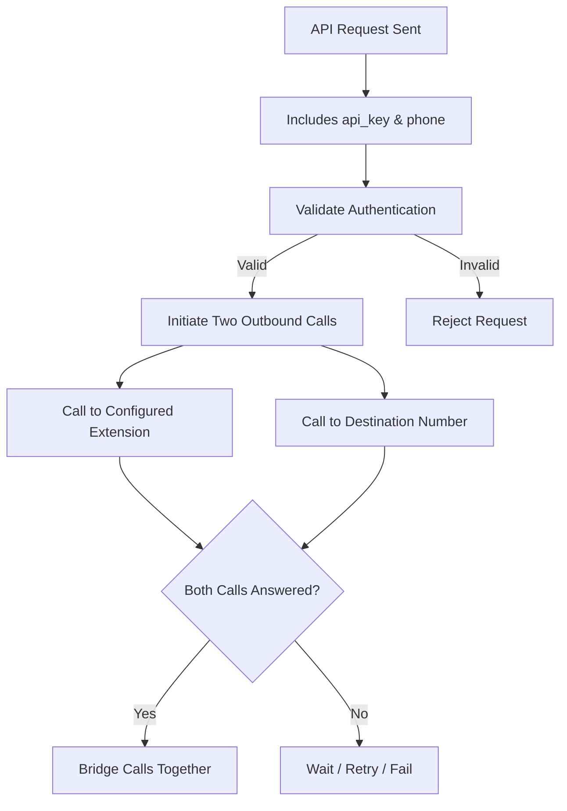

# Click-2-Dial (Programmatic API Calling)

 
<strong>Document Metadata</strong>
  

<strong>Category</strong>: Setup / Application Store & App Deployment 
<strong>Audience</strong>: Administrators, Engineers, Product Team 
<strong>Difficulty</strong>: Intermediate 
<strong>Time Required</strong>: Approximately 10–15 minutes 
<strong>Prerequisites</strong>: Active ConnexCS account with Setup privileges; a configured Class 4 server, Class 5 server, and Customer Portal domain; basic understanding of the Apps platform and API authentication. 
<strong>Related Topics</strong>: <a href="https://docs.connexcs.com/setup/appstore/">App Store</a> 
<strong>Next Steps</strong>: Configure the Class 4/Class 5 servers and Customer Portal domain, generate an API key for the target customer, and test the API endpoint with a valid <code>api_key</code> and destination <code>phone</code> number. 

## Overview

**Click-to-Dial API** enables applications, websites, or software systems to initiate phone calls with a single click or programmatic command.

Instead of manually dialing a phone number, users or systems can trigger a call directly from an interface, making the process faster, more efficient, and less error-prone.

## Call Flow (How it works?)

## Steps to Use the App

1. Navigate to **Setup :material-menu-right: App Store :material-menu-right: Click-2-Dial** and click `Install`.   

2. A window will appear, hit `Install` again.   

3. In the `Installed Versions` tab click `Config`.   

4. A window will open, prompting you to enter the following details:
      + Select the `Class 4 server` (from the drop-down) that routes outbound calls to the destination number through the configured carriers.
      + Select the `Class 5 server` that manages customer extensions and places the call to the configured extension before connecting it to the destination.
      + `Customer Portal Domain`: Select the customer portal domain that hosts the Click-2-Dial application and generates the API endpoint. The API endpoint used by external applications to send Click-2-Dial requests. Applications must send a POST request with a valid API key and destination phone number.
      + `API Keys`:
          + `Customer`: Select the customer account that will be authorized to use the Click-2-Dial API. The generated API key is associated with this customer.
          + `API Key`: A unique authentication key generated for the selected customer. External applications must include this key in every Click-2-Dial API request to authenticate and initiate calls.
          + `CLI`: Specify the Caller Line Identification (Caller ID) that is displayed to the destination party when the outbound call is placed. Enter the number in international format (for example, 441234567890).
          + `Extension`: Specify the extension that should be called first. When a valid API request is received, the Click-2-Dial application rings this extension and, once answered, connects it to the destination number.
          + `Add Row`: Click Add Row to create a new Click-2-Dial API configuration for another customer.
          + `Delete`: Click the Delete icon to remove the selected customer's API key configuration from the Click-2-Dial application.
5. Click `Save`.