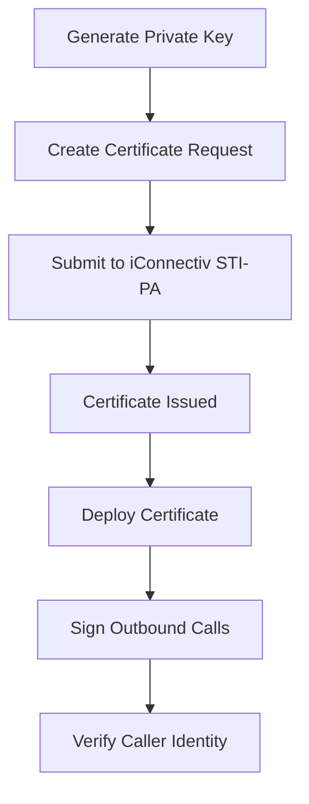

# Peering Hub

 
<strong>Document Metadata</strong>
  

<strong>Category</strong>: Setup / Application Store & App Deployment 
<strong>Audience</strong>: Administrators, Engineers, Product Team 
<strong>Difficulty</strong>: Intermediate 
<strong>Time Required</strong>: Approximately 20–30 minutes 
<strong>Prerequisites</strong>: Active ConnexCS account with Setup privileges; an iConnectiv (STI-PA) account for STIR/SHAKEN certificate provisioning; basic understanding of the Apps platform and STIR/SHAKEN concepts. 
<strong>Related Topics</strong>: <a href="https://docs.connexcs.com/setup/appstore/">App Store</a> 
<strong>Next Steps</strong>: Generate a private key and certificate signing request in PeeringHub, submit it through iConnectiv (STI-PA), and once approved, deploy the certificate to your ConnexCS platform to begin signing outbound calls. 

## Overview

**Peering Hub** is a **STIR/SHAKEN certificate management application** that helps telecommunications service providers securely manage the complete lifecycle of STIR/SHAKEN certificates.

It simplifies the process of generating cryptographic keys, requesting certificates from an authorized Certification Authority (CA) through **iConnectiv (STI-PA)**, and deploying certificates to ConnexCS platforms for signing outbound calls.

## Why Use Peering Hub?

STIR/SHAKEN is an industry framework designed to combat caller ID spoofing by verifying the authenticity of telephone calls.

Peering Hub provides a centralized interface to:

* Generate and manage private/public key pairs.
* Request and renew STIR/SHAKEN certificates.
* Manage certificate deployments.
* Configure signing credentials for ConnexCS platforms.
* Monitor certificate status and validity.

---

## Key Features

* **Private Key Management**: Securely generate and store cryptographic private keys used for call signing.

* **Certificate Provisioning**: Request and manage STIR/SHAKEN certificates through **iConnectiv (STI-PA)**.

* **Certificate Deployment**: Deploy approved certificates to ConnexCS platforms for outbound call authentication.

* **Certificate Lifecycle Management**: Track certificate issuance, expiration, renewal, and replacement.

* **Centralized Administration**: Manage all STIR/SHAKEN resources from a single application.

---

## How It Works

## Typical Workflow

1. Generate a cryptographic key pair.
2. Create a certificate signing request (CSR).
3. Submit the request through **iConnectiv (STI-PA)**.
4. Receive the approved STIR/SHAKEN certificate.
5. Deploy the certificate to the ConnexCS platform.
6. Outbound calls are digitally signed, allowing receiving carriers to verify the caller's identity.

## Benefits

* Reduces caller ID spoofing.
* Improves trust in outbound calls.
* Simplifies STIR/SHAKEN certificate management.
* Centralizes certificate deployment and renewal.
* Helps service providers comply with STIR/SHAKEN requirements.

## How to use Peering Hub?

1. Navigate to **Setup :material-menu-right: App Store :material-menu-right: Peering Hub** and click `Install`.   

2. A window will appear, hit `Install` again.   

3. In the `Installed Versions` tab click `Config`. This section is used to configure the API endpoint that the Peering Hub application uses to communicate with the Peering Hub service. The configured URL is used for all requests related to STIR/SHAKEN certificate management.   

4. A window will open, prompting you to enter the following details:
      1. `API Base URL`: Specify the base URL of the Peering Hub API. The application sends all requests, such as certificate provisioning, key management, and deployment, to this endpoint. **Only change this value if you need to connect to a different Peering Hub environment, such as a testing or private deployment.**
      2. Click `Save` to apply and store the configured API Base URL. All future requests from the Peering Hub application will use the saved endpoint.
      3. Click `Reset to Default` to restore the API Base URL to the default Peering Hub endpoint (https://app-api.peeringhub.io). Use this option to discard any custom configuration and reconnect to the default service.

5. Navigate to **Setup :material-menu-right: Information :material-menu-right: STIR/SHAKEN Cert**. Click on the `PeeringHub` button.   

6. Sign in to PeeringHub.     After login you can directly migrate your certificate. 
