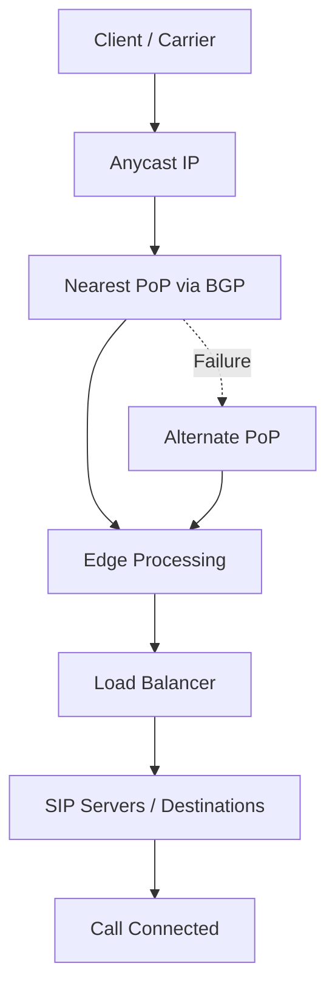

# AnyEdge

 
<strong>Document Metadata</strong>
  

<strong>Category</strong>: Setup & Configuration 
<strong>Audience</strong>: Administrators, Engineers 
<strong>Difficulty</strong>: Intermediate 
<strong>Time Required</strong>: Approximately 1–2 hours 
<strong>Prerequisites</strong>: Active ConnexCS account, access to AnyEdge configuration permissions 
<strong>Related Topics</strong>: <a href="https://docs.connexcs.com/anyedge/anyedge/#anyedge-setup">AnyEdge Setup</a>, <a href="https://docs.connexcs.com/anyedge/anyedge/#anyedge-domain">AnyEdge Domain</a>, <a href="https://docs.connexcs.com/anyedge/anyedge/#anyedge-destinations">AnyEdge Destinations</a> 
<strong>Next Steps</strong>: <a href="https://docs.connexcs.com/anyedge/anyedge/#capabilities">Capabilities of AnyEdge</a>, <a href="https://docs.connexcs.com/anyedge/anyedge/#inbound-proxy-dispatcher-load-balancer">Inbound Proxy / Dispatcher / Load Balancer</a> 

**Setup :material-menu-right: AnyEdge**

## Overview

AnyEdge is a dynamic, distributed solution designed to optimize call distribution and load balancing across multiple regions. It enhances redundancy, improves call routing efficiency, and ensures high availability for VoIP traffic.

ConnexCS **AnyEdge** acts as a load balancer / dispatcher. It balances the traffic between the SIP servers and the customers.

It's a next-generation solution for the Edge Session Initiation Protocol (SIP).

It provides high-reliability and custom Call Distribution algorithms (Weights and Priorities).

!!! Info "Global Redundancy"
    Global redundancy in AnyEdge ensures high availability by distributing traffic across multiple edge servers located in different geographical regions.
    This minimizes downtime and provides seamless service continuity even during outages or failures in any single location.

Each customer benefits from a unique, dedicated IP address through AnyEdge

Calls are routed to the nearest AnyEdge server for optimal performance and reduced latency.

!!! Info "AnyEdge Features"
    1. Supports up to 10,000 CPS per customer.
    2. All our customers benefit from 10Gbps DDoS protection.

### Key Features

+ **Global Load Balancing**: Routes calls intelligently based on region and performance.
+ **Failover Protection**: Ensures seamless call routing in case of outages.
+ **Optimized Call Distribution**: Distributes traffic efficiently to reduce latency.
+ **Flexible Configuration**: Supports various routing policies and priority settings.

### How Traffic Flows Through AnyEdge

### Benefits

+ **Improved Redundancy**: Avoids downtime by automatically rerouting calls.
+ **Optimized Call Routing**: Ensures better call quality and lower latency.

---

## Anycast Architecture: Global IP Routing, BGP Behavior, and PoP Selection

AnyEdge uses **Anycast architecture** to provide high availability, low latency, and automatic failover for voice traffic.

### What is Anycast?

Anycast is a networking technique where the **same IP address is advertised from multiple geographic locations** (Points of Presence or PoPs).

This allows incoming traffic to be routed to the **nearest or best-performing location** instead of a single fixed destination.

### Role of BGP in Routing

AnyEdge relies on **Border Gateway Protocol (BGP)** to route traffic.

* Each PoP advertises the same Anycast IP
* BGP determines the **optimal path** based on network conditions such as latency, hop count, and availability
* Traffic is automatically directed to the **closest or most efficient PoP**

This ensures that calls enter the network at the most optimal location without manual intervention.

### Points of Presence (PoPs)

PoPs are **distributed edge locations** where AnyEdge infrastructure is deployed.

Each PoP:

* Receives incoming traffic via the Anycast IP
* Performs initial routing and validation
* Forwards traffic to the appropriate destination or backend system

Having multiple PoPs ensures **geographic redundancy and improved performance**.

### Automatic Failover

If a PoP becomes unavailable due to network issues or outages:

* BGP automatically withdraws routes from the affected PoP
* Traffic is rerouted to the **next closest available PoP**
* No manual failover configuration is required

This provides **seamless failover** and minimizes service disruption.

### Traffic Flow Overview

1. A call is sent to the Anycast IP
2. BGP routes the call to the nearest PoP
3. The PoP processes and forwards the call to the configured destination
4. If the PoP is unavailable, traffic is automatically rerouted to another PoP

### Key Benefits

* **Low Latency** – Traffic enters the network at the nearest location
* **High Availability** – Multiple PoPs ensure redundancy
* **Automatic Failover** – No manual intervention required
* **Scalability** – Traffic is distributed globally across infrastructure

---

## Failover Behavior and Traffic Recovery

AnyEdge is designed to provide **automatic and seamless failover** to maintain service continuity during network or infrastructure issues.

### What Triggers Failover?

Failover is automatically triggered when a routing endpoint or PoP becomes unavailable due to:

* Network connectivity loss
* SIP server or destination failure
* Timeout or no response from destination
* Health check failures
* Routing capacity limits being exceeded

### Health Checks and Monitoring

AnyEdge continuously monitors the health of routing destinations and infrastructure using:

* **SIP response validation** (e.g., no response, error responses)
* **Connectivity checks** to endpoints
* **Performance indicators** such as latency or failures

If a destination fails these checks, it is temporarily excluded from routing.

### Failover Behavior

When a failure is detected:

1. Traffic is immediately removed from the affected destination or PoP
2. Routing shifts to the next available destination based on configured logic (e.g., Sort Index, Weight, or Random)
3. If an entire PoP is unavailable, BGP automatically reroutes traffic to the nearest available PoP
4. Calls continue to be processed without manual intervention

### Failover Timing

* Failover is **near real-time**, depending on detection speed and network conditions
* No manual switching is required
* Recovery is automatic once the failed destination becomes healthy again

### Recovery Behavior

* Once a destination or PoP is restored and passes health checks, it is automatically reintroduced into routing
* Traffic distribution resumes based on the configured routing logic

### Operational Considerations

* Ensure multiple destinations or PoPs are configured to enable effective failover
* Monitor call failures and routing patterns via CDRs
* Validate routing priorities (Sort Index / Weight) to control fallback behavior

---

## Load Balancing Logic and Routing Strategies

AnyEdge uses multiple routing strategies to distribute traffic efficiently across destinations.

Understanding when and how to use each method is essential for optimal performance and reliability.

### Routing Methods Overview

| Method | Purpose|Behavior|
| -------|--------|--------|
| **Priority (Sort Index)** | Control routing order | Calls are attempted in a defined sequence (lower index first) |
| **Weight-Based Routing**  | Distribute load proportionally | Calls are distributed across destinations based on assigned weights |
| **Random Routing**| Simple load distribution | Calls are distributed randomly across all destinations |

### Priority-Based Routing (Sort Index)

**How it works:**

* Destinations are grouped by Sort Index
* Calls are routed to the lowest index first
* If all destinations in a group fail, routing moves to the next index

**When to use:**

* For **primary → secondary failover setups**
* When you want strict routing order

### Weight-Based Routing

**How it works:**

* Applied within the same Sort Index group
* Calls are distributed based on weight ratio (e.g., 10:1)
* Higher weight receives more traffic

**When to use:**

* For **load balancing across multiple active destinations**
* When destinations have **different capacities**

### Random Routing

**How it works:**

* Calls are distributed randomly across all configured destinations
* No priority or weighting is considered

**When to use:**

* For **simple load distribution**
* When all destinations have **equal capacity and priority**

### Capacity-Based Routing

**How it works:**

* Traffic is distributed based on the **handling capacity of each destination**
* Prevents overloading endpoints

**When to use:**

* When destinations have **defined CPS or concurrency limits**
* In high-traffic environments

### Health-Based Routing

**How it works:**

* Only **healthy and responsive destinations** are included in routing
* Unhealthy endpoints are automatically excluded

**When to use:**

* Always enabled implicitly for **reliability and failover**

### Dynamic Rebalancing

**How it works:**

* Traffic distribution adjusts automatically based on:

  * Destination availability
  * Performance
  * Failures

**When to use:**

* In environments requiring **high availability and adaptive routing**

## How These Work Together

Routing decisions typically follow this order:

1. **Health Check** → Only healthy destinations are considered
2. **Priority (Sort Index)** → Select routing group
3. **Weight / Random** → Distribute traffic within the group
4. **Capacity Check** → Ensure limits are not exceeded
5. **Dynamic Rebalancing** → Adjust in real time

---

## Real-World Routing Scenarios

### Scenario 1: Destination Server Failure

**Situation:**
A configured SIP destination becomes unavailable or stops responding.

**Behavior:**

* The system detects failure through SIP timeouts or error responses
* The destination is temporarily removed from routing
* Calls are automatically routed to the next available destination based on routing logic (Sort Index, Weight, or Random)

**NOC Action:**

* Verify destination status (IP, port, SIP response)
* Check recent CDRs for failure patterns
* Confirm fallback routes are correctly configured

### Scenario 2: Complete PoP Failure

**Situation:**
An entire PoP becomes unreachable due to network outage or infrastructure failure.

**Behavior:**

* BGP withdraws the affected PoP route
* Traffic is automatically redirected to the next closest available PoP
* No manual intervention is required

**NOC Action:**

* Monitor traffic shift in real time
* Validate connectivity to alternate PoPs
* Check for increased latency or load on other PoPs

### Scenario 3: Traffic Spike (High Load)

**Situation:**
Call volume increases significantly (e.g., peak traffic or sudden spike).

**Behavior:**

* Traffic is distributed across available destinations based on configured weights and routing rules
* Load is balanced to prevent overloading a single endpoint
* System continues routing within configured capacity limits

**NOC Action:**

* Monitor CPS and concurrency levels
* Ensure sufficient routing capacity is configured
* Scale destinations if required

### Scenario 4: CPS Limit Exceeded

**Situation:**
Call attempts exceed configured Calls Per Second (CPS) limits.

**Behavior:**

* Excess calls may be throttled, queued, or rejected depending on configuration
* Routing continues for calls within allowed CPS

**NOC Action:**

* Review CPS configuration
* Check rejection or failure reasons in CDRs
* Adjust limits or increase capacity if needed

### Scenario 5: Destination Failure Within Same Priority Group

**Situation:**
One destination within a Sort Index group fails.

**Behavior:**

* Traffic is redistributed among remaining destinations in the same group
* Weight-based distribution continues among available endpoints

**NOC Action:**

* Verify remaining destinations are healthy
* Check if traffic distribution aligns with configured weights

### Scenario 6: Uneven Traffic Distribution

**Situation:**
Traffic appears uneven across destinations.

**Behavior:**

* Distribution follows configured weights or random logic
* Short-term imbalance may occur due to randomness

**NOC Action:**

* Validate weight configuration
* Analyze CDR trends over time (not just short intervals)

---

## AnyEdge Setup

### Configure AnyEdge

Click the :material-plus: button to set the following:

* **User Account Control (UAC) Test (NAT)**: Select the method used to detect whether NAT is in use.

    See [**Far-End NAT Traversal**](https://docs.connexcs.com/anyedge/anyedge/#far-end-nat-traversal) for details.

* **Algorithm**: How to distribute calls.

    See [**Inbound Proxy / Dispatcher / Load Balancer**](https://docs.connexcs.com/anyedge/anyedge/#inbound-proxy-dispatcher-load-balancer) for details.

* **CPS**: Total calls per second allowed.

    See [**Metrics**](https://docs.connexcs.com/anyedge/anyedge/#metrics) for details

* **Insertion**: Set whether the server acts 'Stateless' (no reply needed) or 'Transactional' (waits for a reply).
  
* **Validate**: Find the checks to use, if any.

    **For example**, a Basic Check will verify if all the fields are appropriately formed, or else it will reject the package (protecting from attacks such as buffer overflow).

    Select one or more checks to validate those fields.

    See [**SIP Packet Validation**](https://docs.connexcs.com/anyedge/anyedge/#sip-packet-validation) for details.

* **Compress In**: Select method(s) to compress inbound data, not only for lower bandwidth use but also to avoid User Datagram Protocol (UDP) fragmentation.

    See [**Compaction and Compression**](https://docs.connexcs.com/anyedge/anyedge/#compaction-and-compression) for details.

* **Compress Out**: Helps when using Outbound Proxy.

    See [**Compaction and Compression**](https://docs.connexcs.com/anyedge/anyedge/#compaction-and-compression) for details.

* **Flags**: You may choose from 2 types of flags:
    * **Registrations to AnyReg**: The AnyReg registration server will hold the AnyEdge registrations for all your customers.
    * **AnyEdge SIP Ping Replies**: [**Click here**](https://docs.connexcs.com/anyedge/anyedge/#anyedge-sip-ping-replies) to know more.
  
* **Primary Attempts**: (not useful for less than 3 servers) Set the number of attempts before going to a second zone.
  
* **Secondary Attempts**: (not useful for less than 3 servers) Set the number of attempts before going to a third zone.

!!! Note "Increase AnyEdge Ports"
    1. Login to your account.
    2. Navigate to **Setup :material-menu-right: AnyEdge :material-menu-right: blue `+` icon :material-menu-right: modify CPS limit**.

    

### AnyEdge Domain

After AnyEdge configuration is complete, click **:material-plus:** next to **Domains** to configure a specific domain with the same settings as Configure AnyEdge.

It can provide added **Transport Layer Security (TLS)/ Secure Sockets Layer (SSL)** configuration for SIP protection.

1. You can choose various versions of SSL and TLS certificates from the drop-down menu.
2. If you enable the **Verify Certificate** option, then it will verify the client's certificate.
3. If you enable the **Require Certificate** option, it means the client should have the certificate.

!!! Info "Custom TLS Ciphers & Curves"
     ConnexCS AnyEdge supports custom TLS ciphers, cryptographic algorithms and elliptic curves, allowing administrators to precisely configure security protocols and ensure compatibility with specific client or server requirements.

### AnyEdge Destinations

Click :material-plus: button to specify the Destination IP, and one or more Limit (Primary) and Backup (Secondary) Zones.

* **Destination**: Enter the Customer's server's IP address.
* **Weight**: You can allocate the weight to the server that permits the highest traffic or call volume through that server. This means the server with the highest weight will handle more traffic or calls compared to other servers.

!!! Note
    You can now set weight up to 50 now for server under Anyedge.

* **Limit Zones**:  Limit Zones control access to specific servers within a load balancer. By defining limit zones, you restrict access to certain servers from designated zones. For example, if Sydney isn't added to the limit zone configuration, individuals from Sydney will be unable to access this designated server within the load balancer.
* **Backup Zones**: Whenever the server of the main zone fails, the traffic will route to the zone selected in the Backup Zones field.

## Capabilities

The ConnexCS **AnyEdge** load balancer is a high-performance application designed for maximum throughput using several cores.

Combined with global PoPs and detailed metrics, we’ve got you covered even if you have requirements that exceed 10K calls per second.

### Far End NAT Traversal

NAT (Network Address Translation) is a technique that intermediates communication between a LAN (Local Area Network) and a WAN (Wide Area Network aka. Internet).

When a packet traverses NAT, the UDP packet headers are appropriately rewritten by your NAT device; thus, the headers in the SIP packet are often not rewritten.

Here are some ways that AnyEdge facilitates these SIP rewrites:

1. Hardcode the external IP Address.
2. Session Traversal Utilities for NAT (STUN) to find the external IP address.
3. SIP (Session Initiation Protocol) ALG (Application Layer Gateway).
4. Far End NAT Traversal.

You can use any of the following indicators to detect if NAT is present in the UAC.

* Search the Contact header  field for occurrences of RFC1918 / RFC6598 addresses.
* Use the "received" test: "address in Via" to compare against the source IP address used for signaling.
* Search the top-most VIA for the occurrences of RFC1918 / RFC6598 addresses.
* Search the Session Description Protocol (SDP) for the occurrences of RFC1918 / RFC6598 addresses.
* Test if the source port is different from the "port in Via."
* Compare the "address in Contact" with the source IP address used for signaling.
* Compare the "Port in Contact" with the source port used for signaling.

### Inbound Proxy / Dispatcher / Load Balancer

The primary use case for **AnyEdge** is to disseminate calls to a pool of SIP Servers. You can configure the following call strategies as follows:

* Hash over callid
* Hash over from uri
* Hash over to uri
* Hash over request-uri
* Weighted round-robin (next destination) - the destination's weight determines the number of times it's selected before going to the next on
* Hash over authorization-username (Proxy-Authorization or "normal" authorization) - If a username isn't found, use weighted round-robin.
* Random (using *rand()*)
* It selects the first entry in the set.

### Metrics

You must set the load balancer's CPS limit. You can view both the CPS and the totals for the number of calls that failed because of the CPS breach.

Use the following graphs to view the metrics:

1. CPS - Calls Per Second
2. CPS Breach

### SIP Packet Validation

Malformed packets can cause problems for your internal network, such as, buffer overflow attacks.

To avoid these problems, you can select some specific options while enabling SIP Packet Validation:

* Check the integrity of the SDP body (if it exists).
* Check the format and the integrity of each header body.
* Don't check the "Max-Forwards" header.
* Checks the "R-URI" and whether the domain has valid characters.
* Checks the URI of the "From" field and whether the domain has valid characters.
* Checks the URI of the "To" field and whether the domain has valid characters.
* Checks the URI of the "Contact" field.

If a packet fails to validate, you can select a method to handle it. You can handle this with a "400" error or with an "X-Validate-Fail" header.

The reasons why a packet fails to validate are:

* No SIP message
* Header Parsing error
* No "Call-ID" header
* No "Content-Length" header for transports that require it (for example, TCP)
* Invalid Content-Length, different from the size of the actual body
* SDP body parsing error
* No "Cseq" header
* No "From" header
* No "To" header
* No "Via" header
* Request URI parse error
* Bad hostname in "R-URI"
* No "Max-Forwards" header
* No "Contact" header
* Path user for non-Register request
* No "Allow" header in the 405 reply
* No "Min-Expire" header in the 423 reply
* No "Proxy-Authorize" header in the 407 reply
* No "Unsupported" header in the 420 reply
* No "WWW-Authorize" header in the 401 reply
* No "Content-Type" header
* "To" header parse error
* "From" header parse error
* Bad hostname in the "To" header
* Bad hostname in "From" header
* "Contact" header parse error

### Compaction and Compression

To reduce the size of packets (to prevent fragmentation), you can apply compaction and compression.

Compression uses an algorithm such as "gzip" and compressing the message at the level of the data.

Compaction uses well-established short notations for longer headers.

#### Compaction

To use compaction, you need to select **Compact Enabled.**

You can also create an allow list of fields if you don't want to compact them.

You can enable Compaction for calls in and/or calls out.

See the table for available headers.

|Abbreviation|Header|Abbreviation|Header|
|:---:|---|:---:|---|
|a|Accept-Contact|m|Contact|
|b|Referred-By|o|Event|
|c|Content-Type|r|Refer-To|
|d|Request-Disposition|s|Subject|
|e|Content-Encoding|t|To|
|f|From|u|Allow-Events|
|i|Call-ID|v|Via|
|j|Reject-Contact|x|Session-Expires|
|k|Supported|y|Identity|
|l|Content-Length|||

#### Compression

You can enable Compression or Decompression for Inbound and/or Outbound by selecting either "Compress Enabled (Deflate)," "Compress Enabled GZip," or "Decompress Enabled."

The process of data compression depends on how auxiliary flags control it.

### Registration Proxy

Having High Availability (HA) with registrations ensures that you will always have an IP address which matches the hole punched when the UAC registers.

Unlike other HA setups, **AnyEdge** ensures that standard NAT hole-punching can work with UAC > UAS calls / messages even after the end-point connected to the UAC fails.

### Outbound Proxy

If you have a pool of several servers, you can proxy your communications via **AnyEdge**, allowing a single IP address to communicate externally.

## AnyEdge SIP Ping Replies

The UAS is pinging the AnyEdge Load Balancer and further, the Load Balancer passes the pings to the Opensips Servers. Further, the Opensips Servers reply to the Load Balancer, and then the ping gets to the UAS. In case, any of the SIP servers are slow, it slows down the AnyEdge Load Balancer as well. Thus, introducing Latency in the system.

Therefore, the AnyEdge SIP Ping Replies feature will help fix this issue. This feature will allow the AnyEdge Load Balancer to reply to the UAS ping messages without passing them to the Opensips Server. This feature will fix the latency issue, and the application latency will be closer match to what we expect.

This feature adds another capability where the AnyEdge Load Balancer is aware of the latency of the Opensips (backend) servers. The AnyEdge Load Balancer measures the latency on backend servers by checking that the servers are online. This can be done by adding the **Timestamps**.

According to RFC 3261, there is a proper header Timestamp available. We include this Timestamp header with the message we're going to send. When we get a reply, it comes along with the Timestamp as well. The Timestamp of the message and reply should be identical, which measures the latency or calculates the difference.

### How to Enable AnyEdge SIP Ping Replies

1. Go to Setup :material-menu-right: AnyEdge and click on the `Edit` button. 
2. You will see a window, select the **AnyEdge SIP Ping Replies** from the dropdown in **Flags** to enable this feature. 
3. Click on `Save`.

---

## Security and Traffic Protection

AnyEdge provides multiple layers of security to protect the network from malicious traffic, unauthorized access, and service disruption.

### DDoS Protection

**How it works:**

* Incoming traffic is distributed across multiple PoPs using Anycast
* High volumes of traffic are absorbed and filtered at the edge
* Suspicious or excessive traffic is rate-limited or dropped

**What is blocked:**

* Traffic spikes intended to overwhelm the system
* Repeated connection attempts from suspicious sources

### SIP Validation

**How it works:**

* SIP messages are inspected for correctness and compliance
* Invalid or malformed SIP requests are rejected

**What is allowed:**

* Properly formatted SIP requests (e.g., valid INVITE, REGISTER)
* Authenticated and expected traffic

**What is blocked:**

* Malformed SIP packets
* Unauthorized or spoofed SIP messages
* Requests that do not follow protocol standards

### Traffic Hygiene

**How it works:**

* Filters are applied to ensure only legitimate traffic enters the system
* Unknown or untrusted sources can be restricted
* Rate limits and validation checks maintain clean traffic flow

**What is allowed:**

* Traffic from configured and trusted sources
* Requests within defined limits and thresholds

**What is blocked:**

* Unknown IPs (if restricted)
* Excessive or abnormal traffic patterns
* Suspicious or non-compliant requests

### Attack Mitigation

**How it works:**

* Continuous monitoring detects abnormal behavior
* Traffic is automatically adjusted or rerouted to maintain stability
* Unhealthy or malicious endpoints are excluded from routing

**Examples of mitigated threats:**

* SIP flooding attacks
* Call spoofing attempts
* Traffic anomalies indicating fraud or misuse

### Combined Protection Flow

1. Incoming traffic reaches the nearest PoP
2. Traffic is validated and filtered (SIP + hygiene checks)
3. Malicious or invalid traffic is blocked or rate-limited
4. Clean traffic is forwarded to routing and processing layers

### Operational Considerations

* Ensure only trusted IPs and endpoints are configured
* Monitor unusual traffic patterns via CDRs and logs
* Review rejection reasons to identify potential threats
* Regularly validate routing and authentication settings

---

## NAT Handling and Edge Cases

AnyEdge supports NAT traversal and pinholing mechanisms to ensure reliable communication when endpoints are behind Network Address Translation (NAT).

---

### What is NAT and Why It Matters

NAT (Network Address Translation) allows multiple devices to share a single public IP address. While common, it can create issues for SIP-based communication because:

* Private IPs are not directly reachable from external networks
* SIP signaling and media (RTP) may not align correctly
* Sessions can fail if return traffic cannot find the correct path

### NAT Traversal

**How it works:**

* Ensures SIP signaling and media streams can pass through NAT devices
* Maintains correct mapping between internal (private) and external (public) IPs

**Why it is important:**

* Allows endpoints behind NAT to communicate with external SIP servers
* Prevents one-way audio or call setup failures

### NAT Pinholing

**How it works:**

* When a call is initiated, a temporary “pinhole” is created in the NAT device
* This allows return traffic (SIP/RTP) to flow back to the originating device
* The pinhole remains open for the duration of the session

**Why it is important:**

* Ensures bidirectional communication
* Maintains session continuity for calls

### When to Use NAT Handling

NAT handling is required when:

* SIP endpoints (phones, PBXs) are behind private networks
* Traffic passes through firewalls or routers performing NAT
* Calls involve external carriers or remote endpoints

### Common NAT-Related Issues

| Issue | Cause | Impact |
| ------|-------|--------|
| **One-way audio** | RTP not correctly routed through NAT| Only one party hears audio |
| **Call setup failure** | SIP signaling blocked or misrouted | Calls fail to connect |
| **Dropped calls** | NAT mapping expires mid-session| Call disconnects unexpectedly |
| **Incorrect IP in SIP headers** | Private IP exposed instead of public IP | Routing failures|

### Example Scenarios

**Scenario 1: Endpoint Behind NAT**

* A customer device is behind a router using private IPs
* NAT traversal ensures SIP signaling reaches the correct destination
* Pinholing allows RTP audio to flow correctly

**Scenario 2: Firewall Restrictions**

* A firewall blocks unsolicited inbound traffic
* NAT pinholing allows return traffic only for established sessions

**Scenario 3: Multi-Region Routing**

* Calls pass through different PoPs
* NAT handling ensures consistent routing and session stability across regions

### Operational Considerations

* Ensure correct SIP headers (Contact, Via, SDP) reflect reachable IPs
* Monitor for one-way audio or failed calls in CDRs
* Validate firewall and NAT timeout settings
* Use proper routing configurations to support NAT environments

---
