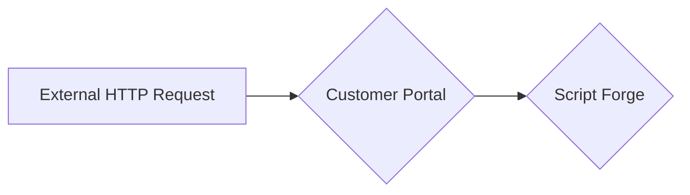
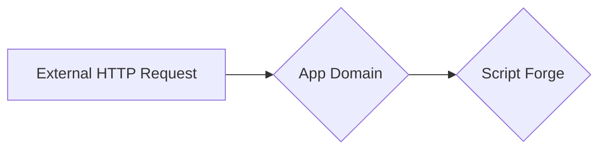

# How to Map a ScriptForge API Endpoint to a Public API Endpoint

## Abstract

### Application Programming Interface (API)

An **API endpoint** is a unique URL that acts as a gateway for communicating with a service via an API.

Each endpoint is associated with a certain function that the API provides, enabling clients to access, create, update, and remove data resources.

Consider an endpoint to be the official route for communication between an API-exposing underlying system and a client application.

### Mapping ScriptForge to Public API Endpoints

Mapping refers to the process of connecting a particular ScriptForge API endpoint to a corresponding public API endpoint.

Thus, we're exposing our **Internal API** to the **External Internet** without any authentication requirements.

This capability allows our customers or external users to connect to our system for example, databases, libraries etc. even if they don't have an account with us.

It's mainly used to receive the `http request`, process the request and respond.

!!! Example
    ConnexCS wants to share payment status to an external person who doesn't have an account with ConnexCS.
	Thus, we use an API endpoint to automatically update the payment status.

### Use Cases

1. **Integration**: Mapping endpoints helps in integrating various systems or services.
2. **Automation**: By utilising API's endpoints, scripts and programmes can communicate with them to automate various tasks in the system.
3. **Data Exchange**: Public APIs frequently offer useful information or features. You can leverage external services without having to start from scratch by mapping ScriptForge endpoints to public ones.

### Methods to access the Script at ConnexCS (Externally)

1. **From the Customer Portal:**
**`${host}/api/script/${scriptUuid}/${functionName}`**



2.**From the App Domain:**



## Libraries

## Script Example

``` javascript linenums="1"
function myCustomFunction () {
	return 'Hello from My Custom Function`;
}
```

### **Customer Portal Example**

1. Create a Script in the IDE section. [Click here](https://docs.connexcs.com/apps/architecture/script/#build-script) to follow the steps. In this example, we've used the above Script Example.
2. Login to the [Postman website](https://web.postman.co/home). Click on `New Request`.
3. Place the URL mentioned above in the `GET` field, `https://portal.test.connexcs.com/api/script/accb960b-3211-11ef-9324-d05099d1f064/myCustomFunction` and hit the `Send` button.
4. You can get the `Script UUID` from the `Settings` option.


### **App Domain Example**