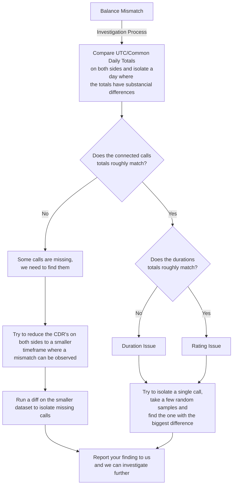

# Billing Basics

## How ConnexCS does billing

### Floating Balances

At any time, you can check the balance of your customer accounts. The balance that you will read is a floating balance.

When a call is completed, it is passed over to the billing engine, which produces a Call Detail Record (CDR) record and updates the balance. The balance should correlate with the CDR.

However, there are scenarios (such as recalculations and rounding's deduplication) that means the balance may drift slightly. For this reason, the balance gets recalculated from CDR records between 60 seconds and 5 minutes.

### Breakout Reports

The breakout report calculates:

* Every hour for the past 3 hours
* Every day for the past 3 days

The reason for this is to correct any delayed records or recalculations.

### How to bill

You should NEVER bill based on the balance, or any associated delta. Equally, you should NOT bill based on the Breakout Report. Although these figures are as accurate as possible, they are not the source of the truth; both were derived from CDRs.

You should avoid billing for the present day and, wherever possible, export figures 24 hours after the last day for which you are billing.

## Why is "Minutes" X "Cost Per Minute" not the same as what my totals say

Although there are some carriers that bill using this method, it's NOT the industry standard. It's unlikely that you will be charged this way.

Below is a simple example of why this doesn't work:

**Scenario**

* Rate: $0.005 USD
* Calls: 100
* Duration: (on all calls) 9.1 seconds
* Per Second Rounding: Full-Up

**Minutes X Duration (Incorrect Method)**

* 100 calls * 9.1 seconds = 910 seconds = 15.16 minutes.
  
* 15.16 * $0.005 = $0.0758 USD.

*This is the wrong way*

**Correct Method**

Calculate each call (in this scenario, we will do the same for all 100 calls).

* 9.1 / 60 * 0.005 =  $0.00075833 (round up to 4dp = 0.0008)

Repeat this process for each call (in this *example*, all 100 calls are the exactly the same).

* 100 * 0.0008 = $0.08

## Balance Mismatch

If you get an estimated value from balances, which is OK different systems update the balance at different times. Some systems also automatically deduct a buffer balance to prevent overspending.

!!! note "We don't entertain unsupported "balances don't match" statements. We can't do anything to help you investigate this type of problem."

Balances should be derived from a ledger (your CDR records).

## Investigating Balance / Billing issues

