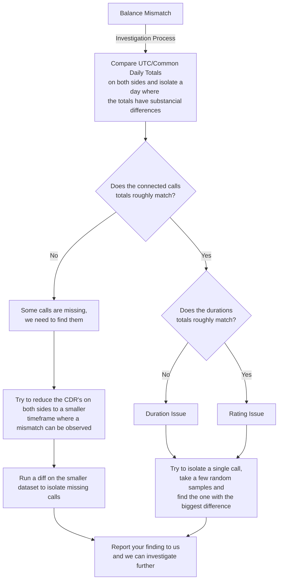

# Billing Basics

## Balance Refresh Interval

The ConnexCS balance gets updated every 60 seconds.

### Breakout Reports

Breakout Reports update in Real-time scenario and the consistency checked every 24-hours.

### How to bill

Please make sure you aren't billing the customer based on the balance or associated delta.

Please make use of the CDR data for billing purposes.

You should try to avoid Billing for the current and wherever possible, export data 24 hours following the final day for which you are billing.

## Why is "Minutes" X "Cost Per Minute" not the same as what my totals say

Although there are some carriers that bill using this method, it's NOT the industry standard. It's unlikely that you're charged this way. Below is a simple example of why this doesn't work:

| **Scenario**                             | **Rate X Duration (Incorrect Method)**                | **Correct Method**                                                                         |
|------------------------------------------|-------------------------------------------------------|--------------------------------------------------------------------------------------------|
| **Rate**: $0.005 USD                     | 100 calls * 9.1 seconds = 910 seconds = 15.16 minutes | 1. Calculate each call (in this scenario, we will do the same for all 100 calls).          |
| **Calls**: 100                           | 15.16 (Duration) * $0.005 (Rate)= **$0.0758 USD**     | (9.1 / 60) * 0.005 = $0.00075833 (round till to 4 decimal places = 0.0008)                 |
| **Duration**: (on all calls) 9.1 seconds |                                                       | 2. Repeat this process for each call (in this *example*, all 100 calls are the exact same) |
| **Per Second Rounding**: Full-Up         |                                                       | 100 * 0.0008 = $0.08                                                                       |

## Balance Mismatch

It's acceptable to get estimates of spends while comparing the balances on two different systems. Although, some systems also automatically deduct a buffer balance to prevent overspend.

!!! note "Please make sure you support your balance mismatch with some statements, else we will have difficulties supporting this problem."

You should derive Balances from a ledger (your CDR records).

## Investigating Balance / Billing issues

