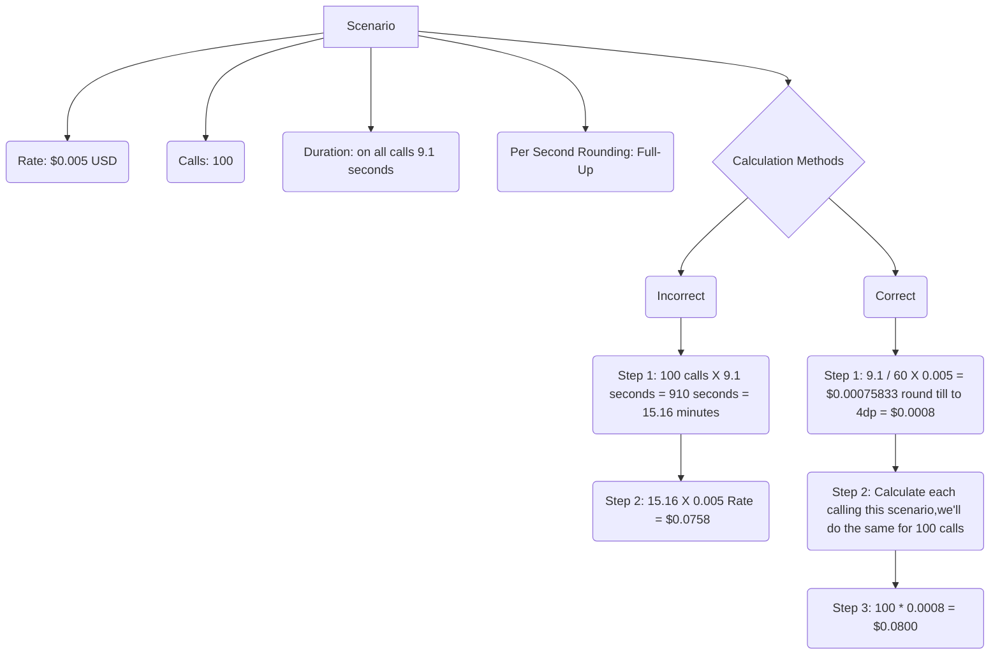

# Billing Basics

---

**Document Metadata**  **Category**: Billing Basics 
 **Audience**: Administrators, Engineers, Finance/Accounting Team   **Difficulty**: Intermediate 
 **Time Required**: 10–20 minutes  **Prerequisites**: Understanding of telecom billing fundamentals (CDRs, call durations, rate slopes), access to usage data and CDRs  **Related Topics**: [Billing Guide](https://docs.connexcs.com/guides/billing-guide/) (for broader context) , [ConnexCS Billing](https://docs.connexcs.com/billing/) (tariff models)  **Next Steps**: Review your current billing increments and rounding strategies; apply the rules when configuring rate-cards or reconciling bills

---

## Balance Refresh Interval

The ConnexCS balance gets updated every 60 seconds.

### Breakout Reports

Breakout Reports update in Real-time scenario and the consistency checked every 24-hours.

### How to bill

Please make sure you aren't billing the customer based on the balance or associated delta.

Please make use of the CDR data for billing purposes.

You should try to avoid Billing for the current and wherever possible, export data 24 hours following the final day for which you are billing.

### Billing Increments

Billing Increments provide a breakdown of the minimum and incremental time units that get utilized to determine each call's duration.

Billing intervals might be as short as 6 seconds or as long as 60 seconds.

A "60/6" billing denotes a minimum of 60 seconds and following 6-second intervals. This implies, that a call lasting 10 seconds on a 60/6 billing scheme will get billed as 60 seconds; a call lasting 61 seconds on a 60/6 scheme will get billed as 66 seconds; if your call lasts for 67 seconds you will get billed for 72 seconds.

Here "30/6" means, "30" is **Minimum Call Duration (MCD)** and "6" is the **Pulse**. Here, **MCD** is the effective call duration.

For example,

| S.No | Actual Call Duration (seconds) | Billing Increments | Billing Duration (seconds) | Billing Rate ($) | Cost of Call ($) | Net Effective Rate ($) [(Billing Rate / Call Duration) * 60] |
|------|--------------------------------|--------------------|----------------------------|------------------|------------------|--------------------------------------------------------------|
| 1.| 7|6/6|12|0.015|0.00300| 0.02571|
| 2.| 7|12/6|12|0.015|0.00300| 0.02571|
| 3.| 7|30/6|30|0.015|0.00750| 0.06429 |
| 4.| 7|60/6|60|0.015|0.01500| 0.12857 |

### Duration Rounding, Billing Rounding and Precision

1. **Duration Rounding:** This method rounds the call duration up the nearest whole second.
   For example;

   A call with a duration of 1 second 400 milliseconds will get rounded down to the nearest whole second. The call duration will get recorded as 1 second.

   A call with a duration of 1 second 500 milliseconds will get rounded up to the nearest whole second. The call duration will get recorded as 2 seconds.

| S.No | Seconds | Full-Down | Full-Up | Half-Up | Half-Down |
|------|---------|-----------|---------|---------|-----------|
| 1.   | 60.0    | 60        | 60      | 60      | 60        |
| 2.   | 60.1    | 60        | 61      | 60      | 60        |
| 3.   | 60.4    | 60        | 61      | 60      | 60        |
| 4.   | 60.5    | 60        | 61      | 61      | 60        |
| 5.   | 60.6    | 60        | 61      | 61      | 61        |

2. **Billing Rounding and Precision**

Carriers use cost rounding with billing increments to alter the price of each call and the net effective rate you get charged. This can have a big effect on the final cost in call centres since the vast majority of calls last under 30 seconds.

Precision means till what decimal places we want to do our billing calculations.

For example,

| S.No | Call Duration (seconds) | Rounded to | Cost of Call ($) | Net Effective Rate ($) [(Charged Amount / Call Duration) * 60] |
|------|-------------------------|-------------------|------------------|----------------------------------------------------------------|
|1.| 9| 2nd decimal place |0.01| 0.0666|
|2.| 9| 3rd decimal place |0.002| 0.0133|
|3.| 9| 4th decimal place |0.0018| 0.012|
|4.| 9| 5th decimal place |0.00175| 0.0116|

### Pulse Billing vs Effective Rate

**Effective Rate** is the amount charged after the billing rounding get processed.

In **Pulse Billing** each pulse represents an incremental cost.

For instance, if one pulse is 20 seconds and the cost of one pulse fixed at, say, $0.015 consumers will have to pay $0.015 even if they talk on the phone for less than 20 seconds. In other words, callers will have to pay $0.015 even they have talked on the phone for 10 seconds.

#### Profitability

Profitability doesn't always mean that Selling price should be greater than Buying Price.

For example,

**Scenario:** You are buying at Buying at $0.005 with 60/60 (MCD / Pulse) and with 3dp Full-up rounding strategy.

 You are Selling at $0.006  with 1/1 (MCD / Pulse) and with 4dp Full-down rounding strategy.

**1/1** is always preferable to **Buying**.
**60/60** is preferable to **Selling**.

!!! info "Why is low ACD and ASR undesirable?"
    **Low ACD** means that your switch has to do more amount of work while the call doesn't last long.

    For example, you want to do 1000 minutes a day, the most promising way to make it cost-effective is that your switch processes a single call for 1000 minutes. This means your server has to process just one call.
    But if it's the other way round, meaning your server has to process 1000 calls which lasted for a minute, which means your switch has to do a lot of work.

    **Low ASR** means that the calls you dial don't get connected, but your switch is processing these calls and you don't get paid for it.

## Why is "Minutes" X "Cost Per Minute" not the same as what the totals say

Multiplying the call duration by the calling rate won't give you an accurate call cost.

Although there are some carriers that bill using this method, it's NOT the industry standard.

It's unlikely that you will may get charged this way.

Let simple example explaining why this doesn't work.

Let’s consider a scenario where the call rate is: $0.005, the total number of calls made is 100, the duration of all the calls was 9.1 seconds with full-up duration technique.

The incorrect method includes multiplying 100 calls with the call duration of 9.1 seconds and the rate which is $0.005 which gives you $0.00758.

Here, we've converted 910 seconds to minutes as the rate gets billed per minute.

This isn't the correct generated bill.

For calculating the bill in the right manner for the customer we need to calculate the rate for each call individually.

**Like what we did in the above method is we calculated the rate for 100 calls altogether, which isn't recommended.**

**We should always calculate each call individually and then add all the calls together, like we've done in the correct method of calculation.**

First convert 9.1 seconds to minutes which is 0.1516 minutes.

Then multiply it with $0.005 which will give you $0.00075833.

Here, we're using Full-up rounding with 4 decimal places so $0.00075833 gets rounded up to $0.0008.

The above calculation is for a single call.

In this scenario we've 100 calls, so we multiply 100 with $0.0008 which gives you a total of $0.08.

Please note here we're multiplying 100 directly with $0.08 because its mentioned in the scenario that the duration on calls is 9.1 seconds for all the calls.

If there were some calls with different durations then we would have calculated the cost for each separate call and then added the costs of all the calls.

We see here the discrepancy in the bill generated by the incorrect and correct method.

Thus, it becomes necessary to follow the right method for bill calculation.

!!! info "Important Note"
    Calculate the rate for each single call **INDIVIDUALLY** and then add the rates for all the calls.

## Balance Mismatch

It's acceptable to get estimates of spends while comparing the balances on two different systems. Although, some systems also automatically deduct a buffer balance to prevent overspend.

!!! note "Please make sure you support your balance mismatch with some statements, else we will have difficulties supporting this problem."

You should derive Balances from a ledger (your CDR records).

## Investigating Balance / Billing issues

