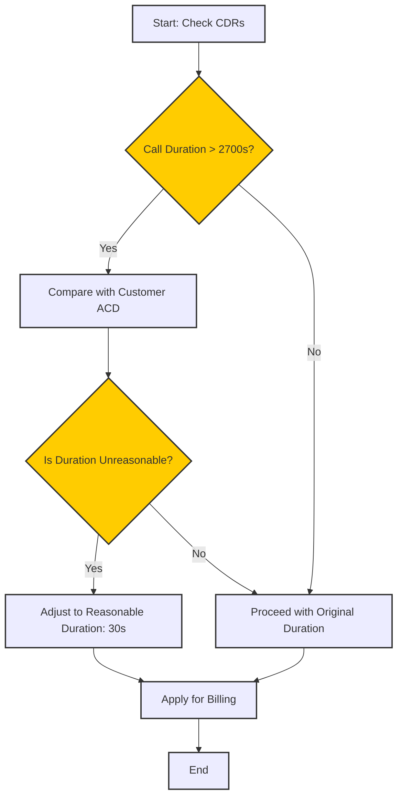

# Call Detail Record

**Management :material-menu-right: Carrier :material-menu-right: CDR**

See [**Customer CDR**](https://docs.connexcs.com/customer/cdr/#recalculate-cdr) for details.

The **CDR** tab displays call drop rates. Use **`Recalc CDR`** when CDR records aren't accurate.

<<<<<<< HEAD
=======
See [**Customer CDR**](https://bani-ankmeg--connexcs-docs.netlify.app/customer/cdr/#recalculate-call-detail-record) for details.

>>>>>>> aacc0445e2fa3852a071fa1dfc2dba476f721438
!!! danger "Rerating CDRs"
    If you select either "Rerate" option when recalculating CDRs, this will change your CDRs and isn't reversible. You can revise Original call durations according to the criteria selected.

## CDR Recalculation

The CDR Recalculation feature is used to correct and update Call Detail Records (CDRs) when call records are inaccurate.

!!! question "When to Use CDR Recalculation?"
    + **Balance Inaccuracy**: When account balances need correction.
    + **Rate Adjustments**: If incorrect rate cards were uploaded.
    + **Long Duration Calls (LDC)**: When unusually long call durations need adjustment.

### Key Features

1. **Recalculate Balances**:
Clicking "Run" recalculates account balances based on existing call records.

2. **Re-rate Calls**:
      1. Adjusts the cost of calls by reapplying the correct rate card.
      2. Allows specification of:
            1. Minimum duration (e.g., 1 second) to exclude very short calls.
            2. Date/time range (in UTC) to apply recalculations to a specific period.
            3. Release reasons (e.g., disconnect due to timeout, upstream or downstream issues) to refine recalculations.

3. **Recalculate Long Duration Calls (LDC)**:
      1. Identifies and adjusts calls with excessive durations (e.g., 3600 seconds or more).
      
      2. **Process**:
         1. Check CDRs for calls longer than a specified duration (e.g., 2700 seconds / 45 minutes).
         2. Compare with the customer's Average Call Duration (ACD).
         3. Adjust call duration to a reasonable time (e.g., 30 seconds) for billing purposes.

!!! Warning
    This is a destructive operation that permanently changes call data.
    If applied incorrectly, all call durations may be rewritten, affecting billing accuracy.

### Benefits of CDR Recalculation

+ **Ensures Billing Accuracy**: Prevents incorrect charges due to inaccurate rate cards or call durations.
+ **Corrects Anomalies in Call Data**: Detects and adjusts excessively long calls to prevent overcharging.
+ **Enhances Customer Satisfaction**: Addresses customer complaints regarding incorrect call charges efficiently.