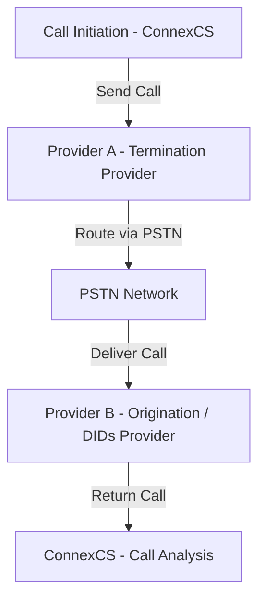

# Circuit Test

**Management :material-menu-right: Circuit Test**

## Overview

The Circuit Test feature in ConnexCS allows users to initiate test calls to verify call routing, audio quality, and provider reliability.

This feature creates a full loop by sending a call out through one provider and receiving it back through another, enabling detailed analysis and troubleshooting.

A **Circuit Test** can aid troubleshooting by providing details such as False Answer Supervision (FAS), Real-time Transport Protocol (RTP) quality, Mean Opinion Score (MOS), release reason, jitter, packet loss percentage, and answer delay measurement.

The test initiates a call on the switch, which routes out to a termination provider through the PSTN network. It's then routed to an origination provider, which routes the call back to ConnexCS and a specific DID provision on the system.

Its considered active testing (the call is actively placed on the network) as opposed to passive testing such as [**Stats**](https://docs.connexcs.com/customer/stats/) and [**Reports**](https://docs.connexcs.com/report/).

### Key Features

+ **Full Circuit Testing**: Calls are sent out and returned to ConnexCS for end-to-end verification.
+ **Provider Testing**: Primarily used for termination provider evaluation.
+ **Detailed Logging**: Comprehensive call logs with key metrics.
+ **False Answer Supervision (FAS) Detection**: Identifies cases of incorrect billing due to premature call connection signals.
+ **Audio Quality Analysis**: Measures MOS score and engagement delay.
+ **Customizable Call Scheduling**: Allows automated periodic testing.
+ **Active vs. Passive Testing**: Differentiates between live testing and passive data collection.

#### Additional Features

+ **Carrier Settings**:
    + **Carrier Portal Information**: Stores credentials for easy login access.
      + **Consecutive Fail Back-Off**:
        + Reduces call attempts to failing providers to prevent call delays.
        + Gradual restoration of calls when the provider resumes service.

    + **Peer-Asserted ID (PAID)**:
        + **Default**: Passes the PAID through.
        + **Remove**: Strips PAID data.
        + **If Available**: Adds PAID if provided.
        + **Required**: Blocks calls without PAID.

    + **Propagate Username**:
        + Retains username information in the From header.
        + Useful for regulatory CLI identification requirements.

#### Testing Capabilities

+ Verifies that the CLI (Caller Line Identification) remains intact.
+ Measures Post-Dial Delay (PDD) and Ring Time.
+ Detects FAS (False Answer Supervision).
+ Checks for Audio Engagement Delay (time taken for two-way audio to establish).
+ Confirms that the Codecs used are as expected.
+ Records release reasons and answer/release delay metrics.

### How it works?

**Circuit Test Traffic Flow**

## Circuit Test Log

View a history of completed circuit tests, including the provider the call routed through, FAS and MOS scores. Troubleshooting examples include:

+ View FAS and FAS Time.
+ View MOS to find call quality.
+ Compare CLI IN (from the customer) and OUT (sent to the provider) to ensure parameter rewrite is correct.
+ Audio Engagement Delay (includes PDD, ring time, and other metrics) shows how long it takes to answer a call.

### View Modification

+ **Columns** pop out on the right allowing you to add or remove options and change column order. For some cases, you can create row groups and total values for pivot functionality.
+ **Filters** pop out on the right allowing you to filter some of your data.
+ Adjust the Column ordering.

|Parameter|Description|
|---------|-----------|
|**Created**| Indicates the date when the log was generated (mm/dd/yyyy)|
|**Provider**|List of your providers|
|**MOS- Mean Opinion Score**|Used to evaluate the perceived quality of audio|
|**DTMF- Dual Tone Multi Frequency**|DTMF is detected or Not Detected in this test|
|**Answered**|Indicates that the call has been successfully connected and answered|
|**Destroyed**|Indicates that the call has been terminated|
|**Direction**|Specifies whether the call is **Termination** or **Origination**|
|**Card**|Displays Card-ID/Name|
|**Destination Number**|The recipient's phone number|
|**Caller**|1. **ID**: Caller's ID number   2. **Display Name** of the caller   3. **IP**: IP address of the caller|
|**Called**|1. **ID**: Recipient's ID number   2. **Display Name** of the recipient   3. **IP**: IP address of the recipient|
|**SIP Call ID**|SIP call ID number|
|**Disconnection**|1. **Code**: Standardized SIP response codes.   2. **Status**: Specific reason why a call was terminated unexpectedly.   These **codes** and **status **are crucial for troubleshooting issues, analyzing network performance, and understanding call quality.|
|**Released By**|Indicates whether the call termination was initiated by **Upstream** or **Downstream**|
|**Answer Delay**|Time it takes between the initiation of a call and the moment the called party answers. It's a crucial metric used to gauge responsiveness and efficiency in call handling, impacting both user experience and operational effectiveness.|
|**_100_Delay**|Delay between an INVITE message and 100 Trying request|
|**_180_Delay**|Delay between 100 Trying and 180 Ringing request|
|**_183_Delay**|Delay between 180 Ringing and 183 Session Progress|
|**_100_183_Delay**|Delay between 100 Trying and 183 Session Progress|
|**Audio Signal Delay (Latency)**| Time it takes for an audio signal to travel from the sender to the receiver. Its a crucial factor in the quality of voice and video communication in telecommunication systems|
|**Latest RBT Delay**|The delay between selecting a Ring Back Tone (RBT) and it actually playing for callers can vary significantly|
|**Early Media Peak Signal Level**|The highest volume level measured during the initial audio exchange before the call is fully connected. This information could be useful for QoS, Network troubleshooting, Media optimization|
|**Active Media Peak Signal Level**|Refers to the highest power level attained by the audio or video signal during a call or streaming session| This information could be useful for Audio/video quality, Network performance, Regulation compliance|
|**Recorded**| Recorded received call file name, transmitted call file name, mix file name|
|**Answered Duration**| Duration of the answered call|
|**Current Calls Count**|Number of current calls|
|**SIP Pcap FileName**|Filename of a SIP Pcap (packet capture) file|
|**SIP and RTP Pcap FileName**|Filename of a SIP and RTP Pcap (packet capture) file|
|**RTP Codec**|Name of the RTP Codec used in the call|
|**RTP Caller**|1. **Address** of the caller.   2. **Port** used by the caller for call sessions.   3. **Synchronization Source (SSRC)** identifier for a specific source of synchronized multimedia data within an RTP session   4. **G107R** is a codec   5. **G107MOS** is a codec   6. **Packets Count**: Number of packets.   7. **Lost Packets**: Number of packets lost in transmission   8. **Max RFC3550 Jitter**: Refers to the maximum value of the calculated jitter for an RTP stream over a specified measurement interval. High jitter can negatively impact the quality of real-time applications such as voice and video calls, as it can lead to stuttering, delays, and distortions.   9. **Mean RFC3550 Jitter**: Refers to the average deviation of the time it takes for consecutive RTP packets to arrive at the receiver, compared to the sender's timestamps. It's a measure of the variability in the packet arrival times, which can be caused by various factors such as network congestion, routing changes, and packet loss.   10. **Max Delta**: Refers to the largest difference in arrival times between two consecutive RTP packets received at the receiver. It essentially measures the maximum variation in the time it takes for packets to arrive, which can be an indicator of network issues like congestion or variable latency.   11. **Min Delta**: Minimum time difference between RTP packets.   12. **Packet Time**: The time packet was sent or received   13. **Non Silent Percentage**: Proportion of time during a call when there is actual conversation happening   14. **Delay**: Time it takes for an RTP packet to travel from the sender to the receiver|
|**RTP Called**|1. **Address** of the recipient.   2. **Port** used by the recipient for call sessions.   3. **Synchronization Source (SSRC)** identifier for a specific source of synchronized multimedia data within an RTP session   4. **G107R** is a codec   5. **G107MOS** is a codec   6. **Packets Count**: Number of packets.   7. **Lost Packets**: Number of packets lost in transmission   8. **Max RFC3550 Jitter**: Refers to the maximum value of the calculated jitter for an RTP stream over a specified measurement interval. High jitter can negatively impact the quality of real-time applications such as voice and video calls, as it can lead to stuttering, delays, and distortions.   9. **Mean RFC3550 Jitter**: Refers to the average deviation of the time it takes for consecutive RTP packets to arrive at the receiver, compared to the sender's timestamps. It's a measure of the variability in the packet arrival times, which can be caused by various factors such as network congestion, routing changes, and packet loss.   10. **Max Delta**: refers to the largest difference in arrival times between two consecutive RTP packets received at the receiver. It essentially measures the maximum variation in the time it takes for packets to arrive, which can be an indicator of network issues like congestion or variable latency.   11. **Min Delta**: Minimum time difference between RTP packets.   12. **Packet Time**: The time packet was sent or received   13. **Non Silent Percentage**: Proportion of time during a call when there is actual conversation happening   14. **Delay**: Time it takes for an RTP packet to travel from the sender to the receiver|
|**RTCP RTT**|1. **Max**: This represents the longest measured round-trip time for any of the received RTCP packets during a specific interval.   2. **Min**: This represents the shortest measured round-trip time for any of the received RTCP packets during a specific interval.|
|**RTCP Caller**|1. **Jitter Max**: Highest recorded difference between the arrival times of consecutive RTP packets received from the caller (sender). It signifies the maximum variation in packet arrival times, which can contribute to audio/video distortion and choppiness.   2. **Jitter Mean**: This value represents the average difference between the arrival times of consecutive RTP packets received from the caller. It provides a general sense of the overall variability in packet arrival times, impacting perceived quality.   3. **Lost Packets**: This value indicates the number of RTP packets sent by the caller that weren't received by the receiver.|
|**RTCP Called**|1. **Jitter Max**: largest observed absolute difference between consecutive packet arrival times, expressed in the same units as the sender's timestamp clock.   2. **Jitter Mean**: Average amount of jitter experienced by the receiver, calculated as the average of the absolute differences between consecutive packet arrival times, again using the sender's timestamp units.   3. **Lost Packets**: Total number of packets that the receiver didn't receive out of the expected number sent by the sender.|
|**Test ID**|Randomly generated ID for the created test|
|**RTP Rx Packets**|1. **Total**: Total number of received packets.   2. **Discarded**: Total number of discarded received packets.   3. **Discarded Duplicated**: Total number of duplicated discarded received packets.   4. **Discarded Early**: Refers to RTP packets that are received but not processed or delivered by the receiving party. These packets are dropped early on, before they even reach the application handling the call (like a video conferencing app).   5. **Discarded Late**: Refers to packets that are dropped or ignored because they arrived after a certain threshold of time has passed.   6. **Discarded Error**: Indicates that a packet with a detected error wasn't processed by the receiver. This can happen due to the severity of the error, limited resources, or specific configuration settings.|
|**RTP Codec Sample Rate**| Refers to the number of times per second that an audio or video signal is sampled for encoding and decoding within the RTP framework. It plays a crucial role in determining the quality and bandwidth requirements of the media content being transmitted.|
|**Ingress ID**|Ingress ID of the call|
|**RTCP caller DSCP**|RTP caller DSCP refers to the Differentiated Services Code Point (DSCP) value assigned to outgoing RTP media packets by the sender (caller). DSCP is a mechanism used in network traffic management to prioritize specific types of traffic based on predefined classes.|
|**RTCP called DSCP**|RTP called DSCP refers to the DSCP value assigned to incoming RTP media packets to the recipient|

### Run Circuit Test

To create a *one-time Circuit Test*, go to **Management :material-menu-right: Circuit Test :material-menu-right: Log**:

1. Click **`Run`**.
2. Select the **Carrier** and associated **Rate Card** to test.
3. The **CLI** is any number to send the call to.
4. **Destination Number** is a DID in ConnexCS. Toggle the button on the right to select from a list of DIDs presently configured in the account.

    See [**Customer DID**](https://docs.connexcs.com/customer/did/) for configuration.

    

## Schedule

+ **Scheduling & Automation**:
    + Users can set up automated scheduled tests at predefined times.
    + Calls can be programmed for specific days and hours.
    + Logs are generated for scheduled test calls.
    + Active Testing: Actual test calls placed on the network.
    + Passive Monitoring: Collects call data without initiating new calls.

To schedule *recurring Circuit Test*, go to **Management :material-menu-right: Circuit Test :material-menu-right: Schedule**, Click :material-plus:.

***Click each tab to view the configuration details:***

=== "Basic"

    + Select the **Carrier** and **Rate Card** to test.
    + Enter the **CLI** to send the call to.
    + The **Destination Number** is a DID configured on the system. Toggle the button to select from an available DID. 

=== "Schedule"

    + Enter a **Name** for the circuit test.
    + Check the **Set Schedule** box.
    + **Minutes** indicates the minute of the hour the test will run. 
    + **Hours** indicates the hour of the day the test will run (this is denoted in a 24 hour clock, ex: 2:00pm is 14). 
    + Select the **Day of the Week** and/ or **Day of a Month** to run the test.

When the scheduled test run, the results are visible on the "Log" tab.

!!! note "Multiple selections allowed"
    Most fields under Schedule allow for multiple selections. For example, you can schedule the test for multiple days of the week.

