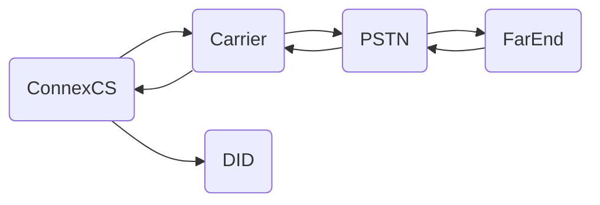

# Circuit Test
**Management :material-menu-right: Circuit Test**

A **Circuit Test** can aid troubleshooting by providing details such as FAS, RTP quality, MOS, release reason, jitter, packet loss percentage, and answer delay measurement. The test initiates a call on the switch which is routed out to a termination provider, through the PSTN network, then to an origination provider which routes the call back to ConnexCS and a specific DID provisioned on the system. This is considered active testing (the call is actively placed on the network) as opposed to passive testing such as [**Stats**](https://docs.connexcs.com/customer/stats/) and [**Reports**](https://docs.connexcs.com/report/). 

Circuit Test Traffic Flow:

## Circuit Test Log
View a history of completed circuit tests, including the provider the call routed through, FAS and MOS scores. Troubleshooting examples include:

+ View FAS and FAS Time
+ View MOS to determine call quality
+ Compare CLI IN (from customer) and OUT (sent to provider) to ensure parameter rewrite is correct
+ Audio Engagement Delay (includes PDD, ring time and other metrics) can demonstrate how long it takes for a call to be answered

### View Modification
+ **Columns** pop out on the right allows you to add/remove options, change column order, in some cases you can create row groups and aggregate values for pivot functionality
+ **Filters** pop out on the right allows you to filter some of your data
+ Adjust Column ordering

### Run Circuit Test
To create a *one-time Circuit Test*, go to **Management :material-menu-right: Circuit Test :material-menu-right: Log**:

1. Click the **`Run`**.
1. Select the **Carrier** and associated **Rate Card** to test. 
2. The **CLI** is any number to send the call to. 
3. **Destination Number** is a DID in ConnexCS. Toggle the button on the right to select from a list of DID currently configured in the account. (See [**Customer DID**](https://docs.connexcs.com/customer/did/) for configuration.)

## Schedule
To schedule *recurring Circuit Test*, go to **Management :material-menu-right: Circuit Test :material-menu-right: Schedule**, Click the :material-plus: button.

*click each tab to view configuration details*:

=== "Basic"

    + Select the **Carrier** and **Rate Card** to test.
    + Enter the **CLI** to send the call to.
    + The **Destination Number** is a DID configured on the system. Toggle the button to select from an available DID. 
    
=== "Schedule"

    + Enter a **Name** for the circuit test.
    + **Minutes** indicates the minute of the hour the test will run. 
    + **Hours** indicates the hour of the day the test will run (this is denoted in a 24 hour clock, ex: 2:00pm is 14). 
    + Select which the *Day of the Week* to run the test

When the scheduled test run, the results will be visible on the "Log" tab. 

!!! note "Multiple selections allowed"
    Most fields under Schedule allow for multiple selections. Ex: you can schedule the test for multiple days of the week. 

[circuittest]: /misc/img/circuittest.png "Circuit Test"
