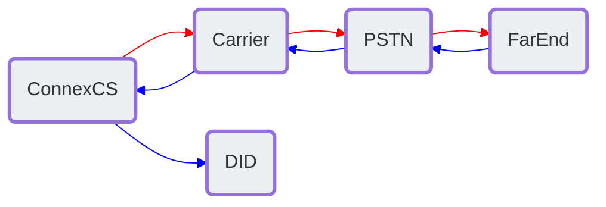

# Circuit Test

**Management :material-menu-right: Circuit Test**

A **Circuit Test** can aid troubleshooting by providing details such as False Answer Supervision (FAS), Real-time Transport Protocol (RTP) quality, Mean Opinion Score (MOS), release reason, jitter, packet loss percentage, and answer delay measurement. The test initiates a call on the switch, which routes out to a termination provider through the PSTN network. It's then routed to an origination provider, which routes the call back to ConnexCS and a specific DID provision on the system. Its considered active testing (the call is actively placed on the network) as opposed to passive testing such as [**Stats**](https://docs.connexcs.com/customer/stats/) and [**Reports**](https://docs.connexcs.com/report/).

**Circuit Test Traffic Flow**

## Circuit Test Log

View a history of completed circuit tests, including the provider the call routed through, FAS and MOS scores. Troubleshooting examples include:

+ View FAS and FAS Time.
+ View MOS to find call quality.
+ Compare CLI IN (from the customer) and OUT (sent to the provider) to ensure parameter rewrite is correct.
+ Audio Engagement Delay (includes PDD, ring time, and other metrics) shows how long it takes to answer a call.

### View Modification

+ **Columns** pop out on the right allowing you to add or remove options and change column order. For some cases, you can create row groups and total values for pivot functionality.
+ **Filters** pop out on the right allowing you to filter some of your data.
+ Adjust the Column ordering.

### Run Circuit Test

To create a *one-time Circuit Test*, go to **Management :material-menu-right: Circuit Test :material-menu-right: Log**:

1. Click **`Run`**.
2. Select the **Carrier** and associated **Rate Card** to test.
3. The **CLI** is any number to send the call to.
4. **Destination Number** is a DID in ConnexCS. Toggle the button on the right to select from a list of DIDs presently configured in the account.

    See [**Customer DID**](https://docs.connexcs.com/customer/did/) for configuration.

    ![alt text][circuit-test]

## Schedule

To schedule *recurring Circuit Test*, go to **Management :material-menu-right: Circuit Test :material-menu-right: Schedule**, Click :material-plus:.

***Click each tab to view the configuration details:***

=== "Basic"

    + Select the **Carrier** and **Rate Card** to test.
    + Enter the **CLI** to send the call to.
    + The **Destination Number** is a DID configured on the system. Toggle the button to select from an available DID. 

=== "Schedule"

    + Enter a **Name** for the circuit test.
    + **Minutes** indicates the minute of the hour the test will run. 
    + **Hours** indicates the hour of the day the test will run (this is denoted in a 24 hour clock, ex: 2:00pm is 14). 
    + Select the **Day of the Week** and/ or **Day of a Month** to run the test.

When the scheduled test run, the results are visible on the "Log" tab.

!!! note "Multiple selections allowed"
    Most fields under Schedule allow for multiple selections. For example, you can schedule the test for multiple days of the week.

[circuit-test]: /misc/img/circuit-test.png "Run Circuit Test"
