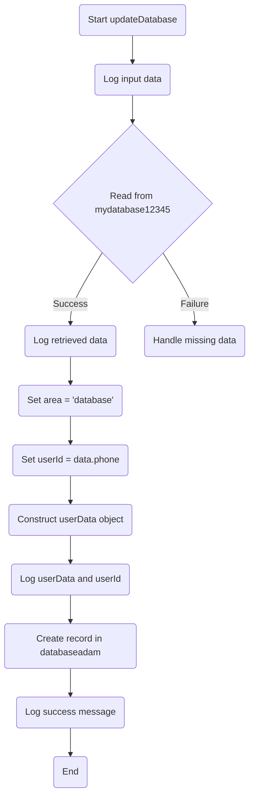

# AI Agent

**Class 5 :material-menu-right: AI Agent**

# Overview

ConnexCS's AI Agent promise to deliver cutting-edge solutions that simplify and enhance your telecom experience.

The AI Agent in ConnexCS is an advanced, automated system that handles inbound and outbound calls using AI-driven speech recognition, Natural Language Processing (NLP), and Machine Learning (ML). It enhances call efficiency by automating responses.

The AI Call Center Agent in ConnexCS enhances operational efficiency, reduces costs, and improves customer interactions through intelligent automation.

### Use Cases

+ **AI Receptionist**:
    + Front Desk Automation
    + Appointment Scheduling,
    + Customer Query Handling,
    + After hours support.
+ **Conversational Data Collection**
+ **Scheduling call back**

### Benefits

+ 24/7 Availability
+ Reduced Operational Costs
+ Faster Query Resolution
+ Improved Appointment Management
+ Automatic collection and updation of records
+ Reduced Transfer Time
+ Improved Customer Experience
+ Optimized Call Handling
+ Personalized Follow-Ups
+ Higher Conversion Rates 

## Steps to create AI Agent

1. Login to your account.
2. Navigate to **Class 5 :material-menu-right: AI Agent**.
3. Click on the blue `+` icon.

4. A window will open up where you can create your customizable AI Agent for your customers.

5. Fill in the following fields to setup your AI model:

=== "Basic"

    + **Name**: Give a name to your AI Agent.
    + **App**: Associate the AI model with the [Application](https://docs.connexcs.com/apps/architecture/app/) in the IDE. Its done using the ScriptForge, for example, the AI model can call a function from the ScriptForge when these two are associated.
    + **Host**: It refers to a system, environment, or platform where you need deploy the AI Agent.
    + **Destination**: Enter the Extension for the callers to call (essentially, the dial-in number).
    + **Company**: Associate the AI model with a customer.
    + **PBX Server**: Select the PBX Server from the drop-down.
    + **Platform**: Use either **OpenAI**, **ConnexCS Converse** or **ConnexCS Converse Direct** to model the AI Agent.
    + Click `Save`.
         

=== "Model"

    + **Model**: Select a model for the selected platform. A model is a specific version or configuration of an AI system to perform tasks like text generation, real-time interactions etc.

        !!! Info
            Different Platforms offer specific Models suited to their capabilities.
    
    + **First Message**: The initial message spoken by the agent. For example, when the agent begins the conversation.
    + **LLM Timeout (sec)**: Refers to the predefined time-frame during which an LLM is granted permission to process a request, or the number of attempts the LLM makes in performing back-end tasks.
    + **LLM Retries**: Refers to the predefined time-frame during which an LLM is granted permission to process a request, or the number of attempts the LLM makes in performing back-end tasks.
    + **Prompt**: The prompt field allows you to enter the set of instructions to guide the AI model to perform certain tasks. It provides as the foundation for the AI to comprehend the context, interpret the user's purpose, and generate relevant results.
    + Click `Save`.
        

=== "Transcriber"

    + **Transcriber**: Select the transcriber service to convert spoken words to text. You can select the transcriber depending on the selected platform.
    + **Answer Machine Detection Keywords**: It helps distinguish between live calls and voicemail by analyzing speech patterns, audio cues, and specific phrases. If an LLM detects a phrase indicative (like an) of an answering machine, such as "Please leave a message," it will automatically disconnect the call to optimize call handling efficiency.
    + **Transcriber Timeout**: It defines the maximum time the system waits for a response during speech-to-text transcription before terminating the process.         If no speech is detected within this period, the transcriber stops listening and times out. On timeout `<SILENT_TIMEOUT>` will be sent to the LLM. You should advise your LLM to handle this accordingly. 
    + **End Call Phrases**: Phrases or messages used to conclude a call or interaction with a customer.
    + Click `Save`.
       

=== "Voice"

    + **Voice**: Select the voice for the text-to-speech service.
    + **Filler Words**: non-lexical or low-information speech elements that do not contribute semantic meaning but serve as pauses, hesitation markers, or conversational regulators in spoken language. Select multiple filler words.
    + **Text To Speech(TTS)**: Select from various TTS models to convert your text into audio. You can select the transcriber depending on the selected platform.
    + **Min Filler Word Delay (sec)**: If the AI model fails to respond within the designated time-frame, the system will automatically utilize the predefined filler words to maintain communication with the customer.
    + **Interrupt Delay (sec)**: Refers to the latency or time taken by the model to halt its current operation or response generation when interrupted by a user or system signal.
    + Click `Save`.
        

=== "Advanced"

    + **Built-in Functions**:
        + **Hangup**: Use this flag to terminate the call. You can include a prompt such as, "When call ended, hangup.
        + **Set Variable**: Set variables locally. For example, in a prompt, you could ask, "What's your name?" and save the response to the variable `name`.
    + **Tool Call Allow List**: defines the specific functions permitted from ScriptForge within the system. 
    + **Guard Rails**: These are mechanisms or strategies designed to ensure the safe, reliable, and ethical use of models. These measures help steer the model’s behavior, preventing misuse, reducing errors, and ensuring its outputs align with specific requirements or constraints.
    + **Flags**: Select from various flags:
          + **Async Guard Rails**: *Currently not in use*.
          + **Local Voice Activity Detection**: It optimizes VoIP performance by identifying speech in real-time at the user’s device. By suppressing silence and background noise, it reduces bandwidth usage, lowers latency, and improves call quality. 
          + **LLM Failover**: If one LLM Model fails, it will failover to another LLM.
          + **Disable ScriptForge**: Disables Scriptforge completely.
          + **Listen First**: Enabling this flag ensures efficient VoIP transmission by checking for an active signal before sending data. This prevents packet collisions, reduces interference, optimizes bandwidth usage, enhances call stability and overall communication reliability.
    + **Office Background Volume**: This feature enables the playback of background office sounds, creating a more authentic experience, as if the person is operating from a call center environment.
    + **Temperature**: Refers to a parameter that controls the creativity of the model's output.
        + **Low temperature (close to 0)** makes the model's responses more predictable by selecting the most probable words.
        + **High temperature (closer to 1 or above)** increases randomness, leading to more diverse and creative but potentially less coherent responses.
    
    + **Vars**<sup>TOML</sup>:  Select the variables you want pass into the ScriptForge script.
    
    + Click `Save`.
         
    

!!! Example "Example Prompt"
    You are an AI agent representing ConnexCS, a leading telecommunications company specializing in advanced VoIP and cloud communication solutions. Begin by introducing yourself and letting the customer know you’re here to assist. Then, ask whether they would like information about specific products and services or billing details.

    Introduction:
    Hello, and welcome! I am your AI assistant from ConnexCS, a leading provider of advanced VoIP and cloud communication solutions. I’m here to provide professional, concise, and accurate information tailored to your needs.

    Ask the Customer:
    Would you like to know more about our products and services, such as Class 4 SIP Cloud Switch, WebRTC as a Service, or STIR/SHAKEN compliance? Or are you interested in details about billing plans and pricing options?

    Products and Services You Can Provide Information About:

    Class 4 SIP Cloud Switch: A robust cloud-based carrier service for high-quality, cost-effective VoIP calls.
    Class 5 PBX: A multi-tenant PBX solution built on globally redundant infrastructure for reliable and scalable business communication.
    Anycast SIP Load Balancers: Ensures exceptional availability and scalability while preventing service disruptions.
    WebRTC as a Service: A seamless SIP-to-WebRTC gateway solution for enhanced call connectivity across devices.
    STIR/SHAKEN Compliance: Supports call authentication to ensure trust and reduce the likelihood of calls being marked as spam.
    Carrier-Grade SIP Switching: Enables high-volume VoIP communication with global reliability and performance.
    Call Recording & Transcription: Advanced solutions for compliance, performance monitoring, and actionable insights.
    Anycast Load Balancing: Maintains uninterrupted call flow by eliminating potential points of failure.
    Billing Plans Available:

    Per Channel Plan: $1 per channel per month.
    Per Minute Plan: zero point zero zero zero three dollars per minute, with channels allocated based on specific usage requirements.

    Server Cost: $20 per server.
    AnyEdge: $20 per server.
    Guidelines for Responses:

    Tailor responses to suit both technical and non-technical users.
    Provide pricing information where relevant.
    Keep answers clear, concise, and professional.
    Offer follow-up details or further clarification if requested.
    Avoid abbreviations (e.g., use “for example” instead of “e.g.”).

    !!! Tip "Note: You have NOT YET collected any customer  information, ignore any pre-set variables"
        Add this in the prompt to tell your LLM that no customer information has been gathered so far, and any variables or configurations that might have been pre-set should be disregarded at this stage. This ensures that the process begins with a clean slate, without relying on or being influenced by previously defined or assumed data.  

### AI Platforms, Models, Voices, TTS, Transcribers

|Platform|Model|Transcriber|Text To Speech (TTS)|Voice|
|--------|-----|-----------|--------------------|-----|
|**OpenAI**|GPT 4o, GPT 4o Mini, GPT 4o Realtime|OpenAI|Google|
|**ConnexCS Converse**|Gemma 2 9bn, Gemma 7bn, Lamma 3 Tools 70bn, Lamma 3 Tools 8bn, Lamma 3.1 Tools 70bn, Lamma 3.1 Tools 8bn, Mixtral 8x7bn||Rime AI, Neets, Azure|Select from multiple options|
|**ConnexCS Converse Direct**|Select from the multiple options|ConnexCS Internal|Google|

!!! Note "While accessing the **ConnexCS Converse Direct** Platform, you will notice that models in the drop-down menu are labeled with **"(Tools)"**. Selecting a model without the (Tools) designation will prevent you from accessing **ScriptForge** and performing behind-the-scenes tasks."

|Transcriber|Description|
|-----------|-----------|
|**OpenAI**|Converts spoken language into text using advanced machine learning models. It handles various accents, languages, and audio qualities to provide accurate transcripts for voice assistants, transcription services, and content creation|
|**ConnexCS Internal**|ConnexCS offers a transcription service that converts live and recorded calls into text with English as the default language and additional language support upon request. It includes configurable duration limits per call, advanced search with query modifiers and Boolean operators, and the ability to set custom pricing. The service integrates easily into existing workflows, enabling seamless incorporation of transcriptions into reports and analytics for improved efficiency|

|Text To Speech (TTS)|Description|
|--------------------|-----------|
|**Google**|Excels in naturalness, global language support, and customization, making it ideal for diverse applications|
|**Rime AI**|Focuses on emotional expressiveness and real-time interaction, suitable for conversational agents|
|**Neets**|Offers a simpler, cost-effective solution for basic TTS needs with limited features|
|**Azure**| It stands out for its extensive language and voice options, enterprise-grade security, and advanced customization capabilities|
|**Aura**|Delivers high-quality text-to-speech conversions with advanced customization options|
|**Edge TTS**|Offers low-latency, real-time text-to-speech processing for seamless communication|

## How to use Functions for the Large Language Models (LLMs)?

1. Develop an application utilizing the provided [link](https://docs.connexcs.com/apps/architecture/app/).
2. Create an **Agent** using the provided [link](https://bani-converse--connexcs-docs.netlify.app/class5/ai-agent/#steps-to-create-ai-agent).
3. Click on [Scriptforge](https://docs.connexcs.com/apps/architecture/script/) to create a script to access the AI Agent.

!!! Example "Example Script"
    ```js
    /**
    * update the database with user details. 
    * @param {Object} param - Param Object
    * @param {String} param.last - last name.
    * @param {String} param.first - first name.
    * @param {String} param.phone - phone number.
    * @param {String} param.address - address.
    * @param {String} param.from - from
    */
    async function updateDatabase(data) { // Declares an asynchronous function named `updateDatabase`, which takes `data` (an object) as a parameter.
	
	
	    console.log(data) // Prints the `data` object to the console for debugging purposes.

	    const data2 = await cxUserspace.read('mydatabase12345', data.from) // Reads a record from the datastore `mydatabase12345` using `data.from` as a key
	    console.log(data2) // Prints the retrieved database entry (`data2`) to the console for debugging
	    const area = 'databaseadam'; // Datastore name
	    const userId = data.phone; // Unique key for the user record
	    const userData = { // Constructs an object (userData) containing user details
		    first_name: data.first,
		    last_name: data.last,
		    phone_code: data.phone,
		    address1: data.address,
		    middle_initial: data2.value // The middle_initial field is extracted from data2.value, which was fetched from the database earlier

	    };
	    console.log(userData) // Logs userData (the new user details) to the console.
	    console.log(userId) // Logs userId to the console.
	    await cxUserspace.create(area, userId, userData); // Saves the user record in the 'databaseadam' datastore. Uses `userId` (phone number) as the unique key and stores `userData` as the associated record
	    console.log('User created successfully!'); // Logging Success Message
    }
    ```
    


!!! Note "JSDoc Notation"
    Using JSDoc for optimizing function usage within LLMs:

     +  Provides clear descriptions of each function, parameter, and return type, making the purpose and behavior of LLM-related functions easy to understand.
     
     +  Reduces confusion and errors.
     
     +  With multiple developers working on an LLM project, JSDoc serves as a standardized way to share knowledge.
     
     +  LLM will exactly know how to interact with the code (Scriptforge).

    !!! Tip "The function description must be brief, sharp, and accurate. Expanding it unnecessarily may create significant risks."

### Unlock Reseller Potential with Our AI Agent

Our AI Agent comes equipped with robust reseller capabilities. For instance, if you’ve created and assigned a package to a customer, you can associate their company with the AI model. Once this connection is in place, charges for using the AI model are automatically deducted. With the package already linked to your customer, managing reselling becomes effortless and efficient.

!!! question "How does it work?"
    1. Create a package under **Setup :material-menu-right: Config :material-menu-right: Packages**. Click on the blue `+` sign.
    2. Enter the **Name** of the package (`Test123` in this example).
    3. Enter cost in the **Retail** field.
    4. Select the **ConnexCS Package** like ConnexCS Converse, ConnexCS Converse Direct etc.
    5. Click `Save`. 
    6. Then Navigate to **Management :material-menu-right: Customer :material-menu-right: Customer [Name] :material-menu-right: Packages**. Click on the blue `+` sign.
    7. Select the **Package** (`Test123` in this example), **Quantity**, **Start Date**, always enable **Auto Decrement Credit**.
    8. Click `Save`. 