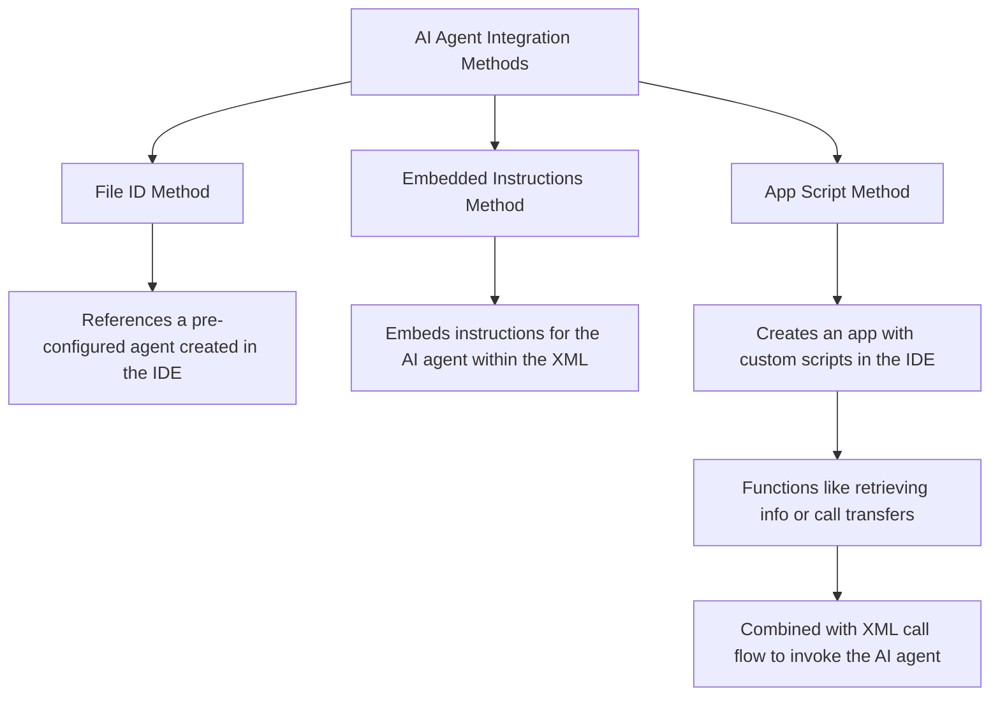
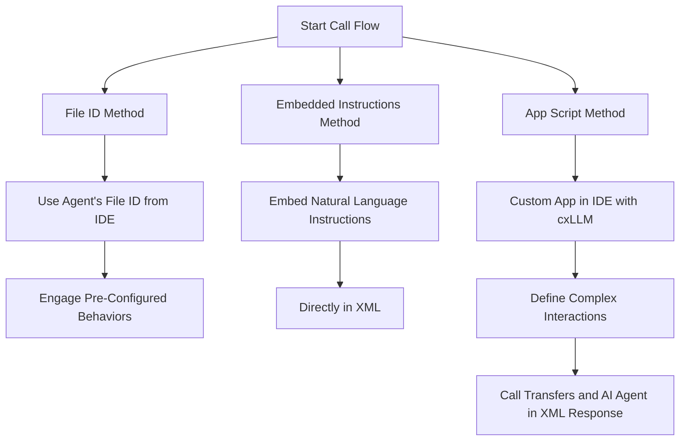

# ConneXML

---

**Document Metadata**
<br>**Category**: Class 5 Services / ConneXML Scripting & Application Control</br>
<br>**Audience**: Administrators, Engineers, Support Team</br>
<br>**Difficulty**: Intermediate to Advanced</br>
<br>**Time Required**: Approximately 1–2 hours</br>
<br>**Prerequisites**: Active ConnexCS account with Class 5 module access; familiarity with XML scripting, IVR logic, and call-flow constructs.</br>
<br>**Related Topics**: [Class 5 Apps & Workflow Builder](https://docs.connexcs.com/class5/apps/), [Class 5 IVR Configuration](https://docs.connexcs.com/class5/creating-ivr/)</br>
<br>**Next Steps**: Create a new ConneXML application, author XML logic using supported verbs (e.g., `<Play>`, `<Gather>`, `<Dial>`), test with sample calls, then attach the application to a DID or inbound route for real-time execution.</br>

---

**Class 5 :material-menu-right: ConneXML**

## Introduction

### What's ConneXML?

ConneXML is a set of instructions you can use to tell Class 5 Applications what to do when you receive an incoming call.

When the customers receive an External or Internal Call, it hits the [DID](https://docs.connexcs.com/customer/did/) section.

In the DID section you can allocate the calls at different places. Click on Call :material-menu-right: Destination:

1.**URI**: Its points to a client's server. You can send the call either to the Destination DID or an IP address.


2.**External**: Allows you to re-direct the call out back again to the network.


3.**Internal**: Allows you to route the call internally like a SIP user or a Queue.


Later, the Class5 Applications makes an HTTP request to the URL endpoint you configured for that number. The endpoint will contain instructions telling ConnexML what to do next with the call.

### How does ConneXML work?

In a general call scenario, the call goes from the Carrier to ConnexCS Class 4 to the Customer.

Now let's understand how ConneXML can control calls.

In this case, the call goes from Carrier to ConnexCS Class 4 to ConnexCS Class 5.

The Class 5 initially doesn't pass the call to the Customer.

The call gets terminated here and instead Class 4 sends a request to the Routing Engine via HTTP and then the HTTP replies back to the Class 4 system.

Class 4 passes the call to Class 5. Then Class 5 asks the Routing Engine how to handle the call.

Further, the Routing Engine questions the same thing to the Customer on how to handle the call. The Customer can ask to collect some information or play a music or something else via a an HTTP Request. The same request is sent to the Class 5 from the Routing Engine. The Class 5 then replies to the requests of the customer.

Another scenario might be when the Routing Engine might talk to the ConnexCS Applications like `ScriptForge`, `ConneXML`, `Call Flow Builder`.
In case it hits the `ConneXML` application, `ConneXML` can as to direct it (Routing Engine) to a 3<sup>rd</sup> party customer and that customer can access the 3<sup>rd</sup> party data hit back to `ConneXML`, then the Routing Engine followed by Class 5 Application and lastly the Customer.

ConneXML uses the standard [`.xml` markup](https://en.wikipedia.org/wiki/XML) language.

.

### How to reach and code the ConneXML Editor?

To get ConneXML working you will need to:

1. Go to Class 5 :material-menu-right: Apps.
2. On the top right click on blue `+` sign.
3. Add new and make sure you choose App Type = ConneXML. The destination can be alpha-numeric and contains an endpoint, for example "customer_a_connexml".


4.After saving the above information. Click on `Go to App` to enter the ConneXML editor. Write your code and click `Save`.


5.If you initially want this to hit a customers server same as before, you can use something like this in the XML field.

``` xml
<?xml version="1.0" encoding="UTF-8"?>
<Response>
    <Redirect method="POST">https://yourdomain.com/yourscript.php</Redirect>
</Response>
```

6.Point the DID to internal and then the name of the endpoint that you created (for example customer_a_connexml)

7.**Select Code Snippet**: Enables you to choose pre-made ConneXML codes for faster and more convenient use. You choose from multiple available options.


### ConneXML Components

In ConneXML, the XML components can be divided into 4 categories:

1. `Response`: Its the root element tag that defines the main body of the ConneXML document. All the **verbs** must be contained inside the Response body.
2. `Verbs`: Just like in english language, Verbs are action words which tells what action to perform on the received call.
3. `Attributes`: These are the methods for each Verb. Verbs may have optional XML attributes that override the flow of execution, allowing you customize the verb behavior.
4. `Nouns`: As the name suggests, a noun can described on which the action has to be performed. For example, it can be a phone number on which a Dial action has to be performed.

!!! example
    ``` xml
    <Response> <!--Body of the code>
        <!-- Here, Play and Dial are the Verbs -->
        <Play loop="2">http://www.music.com/fun.wav</Play>
        <Dial>
            <!-- Number is a Dial Noun -->
            <Number>189765441</Number>
        </Dial>
    </Response>
    ```

!!! note
    **Verbs** and **Nouns** are **case-sensitive**.

In the next section, we shall discuss the various `Verbs`,`Attributes` and `Nouns`.

## Verbs, Attributes and Nouns

### Hangup

The current call is terminated with the `Hangup` verb.

It has **no attributes** and doesn't include any **nouns**.

!!! example
    ``` xml
    <?xml version="1.0" encoding="UTF-8"?>
    <Response>
        <Hangup/>
    </Response>
    ```

### Pause

The `Pause` verb waits silently for a given amount of time, or by default, 5 seconds.
`Pause` doesn't use any nouns, and a self-closing tag is mandatory.

!!! example
    ``` xml
    <?xml version="1.0" encoding="UTF-8"?>
    <Response>
        <Say>I will pause default time starting now!</Say>
        <Pause/>
    </Response>
    ```

|**Attribute**|**Description**|**Seconds**|**Default Value**|
|-------------|---------------|----------|-|
|`length`|How many seconds for waiting|`1-180`|`5`|

!!! example
    ``` xml
    <?xml version="1.0" encoding="UTF-8"?>
    <Response>
        <Pause length="10"/>
        <Say>I just paused 10 seconds</Say>
    </Response>
    ```

### Say

Text to speech is enabled for any application by using the `Say` verb, which speaks the provided text back to the caller.

!!! example
    ``` xml
    <?xml version="1.0" encoding="UTF-8"?>
    <Response>
        <Say>This is better  text to speech.</Say>
    </Response>
    ```

!!! warning "Note"
    The **Text to Speech** package needs to be added to your account for this feature to work.

### Reject

This verb rejects the current call.

!!! note
    `Reject` can't be nested in any other verb and reject can't include any other verb.

!!! example
    ``` xml
    <?xml version="1.0" encoding="UTF-8"?>
    <Response>
        <Reject/>
    </Response>
    ```

|**Attribute**|**Description**|**Options**|**Default**|
|-------------|---------------|-----------|-----------|
|`reason`|The sound to play in order to explain why the call was turned down|`rejected`, `busy`|`rejected`|

!!! example
    ``` xml
    <?xml version="1.0" encoding="UTF-8"?>
    <Response>
        <Reject reason="busy"/>
    </Response>
    ```

### Play

The `Play` verb allows you to play back to the caller a WAV audio file.

You can use `Play` as a verb  standalone or as a noun nested inside `Gather` to play audio while you wait for DTMF tones.

|**Attribute**|**Description**|**Options**|**Default Value**|
|-------------|---------------|------------|---------|
|`loop`|How many times you wish to repeat the audio|`[1-100]`| `1`|

The value of Play can either be:

1. **Local files**: You can play from default built-in messages. List of default sounds to follow.
2. **Remote HTTP**: You can play from a remote datasource, the file can be anywhere on the internet; starts with HTTP.
3. **User Files**: You can play the audio that you have uploaded with ConnexCS. Login to your account :material-menu-right: Management :material-menu-right: File :material-menu-right: Upload.

!!!example
    1. **Loop**
    ``` xml
    <?xml version="1.0" encoding="UTF-8"?>
    <Response>
        <Play loop="3">ivr/ivr-invalid_number_format.wav</Play>
    </Response>
    ```

    2. **Local Files**
    ``` xml
    <?xml version="1.0" encoding="UTF-8"?>
    <Response>
        <Play>ivr/ivr-invalid_number_format.wav</Play>
    </Response>
    ```
    3. **Remote HTTP**
    ``` xml
    <?xml version="1.0" encoding="UTF-8"?>
    <Response>
        <Play>https://file-examples.com/storage/fef3ad87fb6568c5a9d7b04/2017/11/file_example_WAV_1MG.wav</Play>
    </Response>
    ```
    4. **User Files**
        ``` xml
        <?xml version="1.0" encoding="UTF-8"?>
        <Response>
            <Play>user/adam.wav</Play>
        </Response>
        ```

### Redirect

The current call gets transferred to another ConnexCS Class 5 application using the `Redirect` verb.

`Redirect` doesn't allow for the nesting of nouns.

!!! Example
    ``` xml
    <?xml version="1.0" encoding="UTF-8"?>
    <Response>
        <Redirect>http://yourdomain.com/connex/test.xml</Redirect>
    </Response>
    ```

|**Attribute**|**Description**|**Options**|**Default Method**
|-------------|---------------|-----------|-------|
|`method`|The type of redirect method used URL|`GET`, `POST`| `POST`|

!!! example
    ``` xml
    <Response>
        <Redirect method="GET">https://yourdomain.com/yourscript.php</Redirect>
    </Response>
    ```

!!! Note
    After `Redirect`, all verbs are unreachable and disregarded.

### Gather

During a call, the `Gather` verb accumulates DTMF tones.

You can create an interactive IVR with text-to-speech by nesting `Say` within `Gather`.

!!! example
    ``` xml
    <?xml version="1.0" encoding="UTF-8"?>
    <Response>
        <Gather actionOnEmptyResult="false" action="https://yourdomain.com/youwebserver.php" method="GET" numDigits="6" finishOnKey="*" timeout="120">
            <Play>https://samplelib.com/lib/preview/wav/sample-12s.wav</Play>
        </Gather>
        <Say>Sorry.The entered number in invalid</Say>
    </Response>
    ```

|**Attribute**|**Description**|**Options**|**Default Method**
|-------------|---------------|-----------|-------|
|`method`|The type of redirect method used URL|`GET`, `POST`| `POST`|
|`action`|Delegates the current call's control to the returned TeXML file| `URLs`|
|`actionOnEmptyResult`|When there is no DTMF input, you can still force `Gather` to send a webhook to the action URL by using `actionOnEmptyResult`.<br> When `Gather` runs out of time while awaiting DTMF input, it will automatically move on to the following ConneXML command| `true`, `false`|
|`numDigits`|Total number of digits to be gathered|
|`minDigits`|Minimum number of digits to be gathered|[`1-128`]|`1`|
|`maxDigits`|Maximum number of digits to be gathered|[`1-128`]|`128`|
|`timeout`|You can configure the `timeout` to determine how long ConnexCS will wait (in seconds) before sending data to your action URL to wait for the caller to press or say another number|`[1-120]`|`5`|

|**Noun**|**Description**|
|-------------|----------|
|`Say`|Reads the supplied text back to the caller|
|`Play`|Plays the audio URL back to the caller|

### Enqueue

The current call is enqueued in a call queue using the `Enqueue` verb.

!!! example
    ``` xml
    <?xml version="1.0" encoding="UTF-8"?>
    <Response>
        <Enqueue>1000</Enqueue>
    </Response>
    ```

### Dial

An existing call is transferred to a different destination using the `Dial` verb.

 `Dial` will end this call if:

   * The called person doesn't answer.
   * The number is invalid.
   * ConnexCS receives a busy signal.
  
!!! example
    ``` xml
    <?xml version="1.0" encoding="UTF-8"?>
    <Response>
        <Dial>123456</Dial>
    </Response>
    ```

|**Attribute**|**Description**|**Options**|**Default Method**|
|-------------|---------------|-----------|-------|
|`callerId`|Caller ID that must be a valid E.164 format number|
|`fromDisplayName`|The fromDisplayName string to be used as the caller ID name (SIP From Display Name) presented to the destination. The string should have a maximum of 128 characters, containing only letters, numbers, spaces, and -_~!.+ special characters. If omitted, the display name will be the same as the number in the callerId field|
|`hangupOnStar`|By tapping the `*` key on their phone, the initial caller can hang up on the called party using the hangupOnStar attribute. It doesn't apply for `Conference` noun|`true`, `false`| `false`|
|`ringTone`|The ringback tone played back to the caller|`at`,`au`,`bg`,`br`,<br>`be`,`ch`,`cl`,`cn`,`cz`,</br>`de`,`dk`,`ee`,`es`,`fi`,<br>`fr`,`gr`,`hu`,`il`,`in`,<br>`it`,`lt`,`jp`,`mx`,`my`,<br>`nl`,`no`,`nz`,`ph`,`pl`,<br>`pt`,`ru`,`se`,`sg`,<br>`th`,`uk`,`us`,`us-old`,`tw`,<br>`ve`,`za`|`us`|
|`timeout`|timeout in <Dial> lets you specify the maximum waiting time in seconds for the dialed party to answer|||
|`hangupOnStarContext`|Hangs up on `*` only in the **specified context**|

|**Noun**|**Description**|**Default Method**|
|--------|---------------|------------------|
|`Number`|Its is an E.164 phone number|
|`Queue`|Its a queue name|
|`Client`|It specifies a client identifier to dial|
|`Conference`|You can connect to a conference room using the `Dial` verb's `Conference` noun|
|`Voicemail`| You can access Voicemail using the `Dial` verb's `Voicemail` noun. [Click here](https://docs.connexcs.com/class5/voicemail/#voicemail-dialpad-options) to know more about Voicemail Dialpad options|
|`barge`|Allows you to join an ongoing call, without alerting the participants| `whisper`, `bridge`, `commands`|

|**Noun**|**Attribute**|**Description**|**Options**|**Default Method**|
|--------|--------|-----|-----------|------------------|
|`Voicemail`|`Inbox`| It sends you to the inbox to leave a message|
||`user`|The user attribute specifies the SIP user|
|`Barge`| `whisper`|If enabled, allows you to speak privately to one or both legs of the call without the other party hearing.|`a`(aleg), `b`(bleg), `ab`(both legs)|`ab`|
||`bridge`|Allows an eavesdropper to listen in on a call without being an active participant. The eavesdropper can monitor the conversation on one or both legs of the call|`a`(aleg), `b`(bleg),`ab` (both legs)|`ab`|
||`command`|DTMF signals during eavesdrop|`true`, `false`|`true`|
|`Client`|`statusCallbackEvent`|An outbound call starts when you use `Dial` to dial out to a client. When the phone rings, the call switches from the `initiated` event to the `ringing` event, `answered` when the call is answered, and `completed` when the call is ended. You can also sign up for the webhooks for the various call events.|`initiated`, `ringing`, `answered`, `completed`|none|
||`statusCallback`|For every event listed in the `statusCallbackEvent` attribute, you may define a URL to send webhook requests to using the `statusCallback` attribute Non-relative URLs (underscores aren't allowed) require a valid hostname|any `URL`|none|
||`statusCallbackMethod`|Lets you define the `HTTP` method ConnexCS should use when making requests to the URL specified in the `statusCallback` attribute.|`GET`, `POST`|`POST`|
|`Queue`|`music`| Music attribute specifies the music file to play when a caller is in the queue|
||`action`|When `action= pickup`agent is assigned to the queue||

!!! Info
    1. `Conference` is similar to how the `Number` noun lets you connect to another phone number.

!!! example
    1. **callerId**
    ``` xml
    <?xml version="1.0" encoding="UTF-8"?>
    <Response>
        <Dial callerId="1234">12345</Dial>
        <Say>This is after hangup.</Say>
    </Response>
    ```

    2. **fromDisplayName**
        ``` xml
        <?xml version="1.0" encoding="UTF-8"?>
        <Response>
            <Dial fromDisplayName="1234">12345</Dial>
            <Say>This is after hangup.</Say>
        </Response>
        ```

    3. **hangupOnStar**
        ``` xml
        <?xml version="1.0" encoding="UTF-8"?>
        <Response>
            <Dial hangupOnStar="true">12345</Dial>
            <Say>This is after hangup.</Say>
        </Response>
        ```
    4. **ringTone**
        ``` xml
        <?xml version="1.0" encoding="UTF-8"?>
        <Response>
            <Dial fromDisplayName="1234" ringtone="in">160</Dial>
        </Response>
        ```
    
    5. **timeout**
        ``` xml
        <?xml version="1.0" encoding="UTF-8"?>
        <Response>
            <Dial timeout="60">123456</Dial>
        </Response>
        ```

    6. **Number**
        ``` xml
        <?xml version="1.0" encoding="UTF-8"?>
        <Response>
            <Dial>
                <Number>4423456789</Number>
            </Dial>
        </Response>"
        ```
    7. **Queue**
        ``` xml
        <?xml version="1.0" encoding="UTF-8"?>
        <Response>
            <Dial>
                <Queue>1000</Queue>
            </Dial>
        </Response>
        ```

    8. **Client**
        ``` xml
        <?xml version="1.0" encoding="UTF-8"?>
        <Response>
            <Dial>
                <Client>test1</Client>
            </Dial>
        </Response>
        ```
    9. **Conference**
        ``` xml
        <?xml version="1.0" encoding="UTF-8"?>
        <Response>
            <Dial>
                <Conference>Room5</Conference>
            </Dial>
        </Response>
        ```
    
    10. **Voicemail**
        ``` xml
        <?xml version="1.0" encoding="UTF-8"?>
        <Response>
            <Dial>
                <Voicemail />
            </Dial>
        </Response>
        ```
    
    11. **Voicemail Inbox**
        ``` xml
        <?xml version="1.0" encoding="UTF-8"?>
        <Response>
            <Dial>
                <Voicemail inbox="true">
                 </Voicemail>
            </Dial>
        </Response>
        ```

    12. **Barge (Default Method)**
        ``` xml
        <?xml version="1.0" encoding="UTF-8"?>
        <Response>
            <Dial>
                <Barge></Barge>
            </Dial>
        </Response>
        ```
    
    13.  **Barge**
        ``` xml
        <?xml version="1.0" encoding="UTF-8"?>
        <Response>
            <Dial>
                <Barge>
                    whisper="a" <!-- Enables whisper mode in the A leg-->
                    bridge="b" <!-- Enables listen to B leg -->
                    commands="false" <!-- Disables DTMF signals/commands during barge -->
                </Barge>
            </Dial>
        </Response>
        ```

    14. **Barge (Group)** 
        ``` xml
        <?xml version="1.0" encoding="UTF-8"?>
        <Response>
            <Dial>
                <Barge
                >GROUPA</Barge> <!-- Listens to the conversation of the specified group. If no group is mentioned, it can listen to any ongoing calls for this customer -->
            </Dial>
        </Response>
        ```
    15. **statusCallbackEvent, statusCallback, statusCallbackMethod**
        ``` xml
        <?xml version="1.0" encoding="UTF-8"?>
        <Response>
            <Dial>
                <Client
                statusCallbackEvent="initiated ringing answered completed"
                statusCallback="https://api.example.com/compile?rateCompact=true&ampids=101,202,303"
                statusCallbackMethod="POST">
                7900
                </Client>
            </Dial>
        </Response>
        ```
        Send updates about the call's lifecycle (initiated, ringing, answered, and completed) to the callback URL via HTTP POST requests.
    
    16. **Queue music**
        ``` xml
        <?xml version="1.0" encoding="UTF-8"?>
        <Response>
            <Dial>
                <Queue music="user/Adamcall.wav">20000</Queue>
            </Dial>
        </Response>
        ```
    
    17. **Queue action**
        ``` xml
        <?xml version="1.0" encoding="UTF-8"?>
        <Response>
            <Dial>
                <Queue action="pickup" music="ivr/ivr-invalid_number_format.wav">20000</Queue>
            </Dial>
        </Response>
        ```
    18. **user**
        ``` xml
        <?xml version="1.0" encoding="UTF-8"?>
        <Response>
            <Dial>
                <Voicemail inbox="true" user="2890">
                </Voicemail>
            </Dial>
        </Response>
        ```
    19. **hangupOnStarContext**
        ``` xml
        <?xml version="1.0" encoding="UTF-8"?>
        <Response>
            <Enter>A</Enter>

            <Press dtmf_leg="a" digit="#0" context="A">
    
                <Dial hangupOnStar="true" callerId="+44123">4421927526</Dial>

            </Press>
            <Dial hangupOnStar="true" hangupOnStarContext ="A">2919</Dial>
        </Response>
        ```
!!! Warning "In ConneXML, use `&amp`; in place of `&` when specifying the `AND` operator."

#### Dynamic Dial

Dynamically dial a phone number based on a `substring` of a variable named `Extension`.

!!! Example "Example 1"
    ```xml
    <?xml version="1.0" encoding="UTF-8"?>
    <Response>
        <Dial>
            <Number>>{{ substring Extension 5 }}</Number>
        </Dial>
    </Response>
    ```
    **Purpose**: Initiates a call to a number extracted from the Extension variable.

    **Actions**: Extracts a substring from the Extension variable starting at the 5th character and uses it as the number to dial.

!!! Example "Example 2"
    Assuming the `Extension variable` is set to `"1234567890"`:
    The `substring` starting at the `5th character` is `"67890"`.
    The system will dial the number `"67890"`.

!!! Example "Example 3"
    Assuming the `Extension variable` is set to `"afwd_[a-z0-9]+"`:
    It means if you dial `newsetup_160` and
    ```xml
    <?xml version="1.0" encoding="UTF-8"?>
    <Response>
        <Dial>
            <Number>{{ substring Extension 9 }}</Number>
        </Dial>
    </Response>
    ```
    The system will dial the number `"160"`

### Press

It helps to define on which leg of the call the DTMF will work. For example, `dtmf_leg ='a'` or `dtmf_leg ='b'`.

!!! Example
    When the digit `3` is pressed on the call leg `b` within the specified context `A`, the call will be transferred to `test4`.
    ``` xml
    <?xml version="1.0" encoding="UTF-8"?>
    <Response>
        <Press dtmf_leg ='b'digit="3" context="A">
            <Transfer>test4</Transfer>
        </Press>
    </Response>
    ```

|**Noun**|**Description**|  
|--------|---------------|
|`Transfer (Blind)`|Transfers the call to the given extension given immediately without verifying whether the recipient is available or willing to take the call|
|`Attended Transfer`|The transferring party confirms the recipient's availability before completing the transfer.|

!!! Example "Example Attended Transfer"
    ``` xml
    <?xml version="1.0" encoding="UTF-8"?>
    <Response>
        <Transfer attended="true">
        +1234567890
        </Transfer>
    </Response>
    ```

### Before

It initializes variables before executing other commands.

!!! Example
    ``` xml
    <?xml version="1.0" encoding="UTF-8"?>
    <Response>
        <Before><Set name="newHome" value="Adam"/><Set name="headerName" value="Joe"/></Before>
    </Response>
    ```
    Sets the variable `newHome` to "**Adam**".<br>Sets the variable `headerName` to "**Joe**"</br>.

### Stream

`Stream` is a noun is used in conjunction with either `Start` or `Connect`.

When the `<Start><Stream>` command is used during a call, the call's raw audio stream is streamed to your WebSocket server near real-time.

!!! Example
    ``` xml
    <?xml version="1.0" encoding="UTF-8"?>
    <Response>
        <Start>
            <Stream url="wss://your-websocket-server.com/your-endpoint" />
        </Start>
    </Response>
    ```

|**Attribute**|**Description**|**Options**|**Default Method**|
|-------------|---------------|-----------|-------|
|`url`|The WebSocket destination address for stream delivery||none|
|`statusCallback`|For every event listed in the `statusCallbackEvent` attribute, you may define a URL to send webhook requests to using the `statusCallback` attribute. Non-relative URLs (underscores aren't allowed) require a valid hostname|any `URL`|none|
|`statusCallbackMethod`|Lets you define the `HTTP` method ConnexCS should use when making requests to the URL specified in the `statusCallback` attribute.|`GET`, `POST`|`POST`|
|`mix_type`| Determines the type of audio stream|1. `mono`: Single channel with only the caller's audio.<br> 2. `mixed`: Single channel combining both caller and callee audio.</br><br> 3.`stereo`: Two channels; one for the caller and one for the callee.</br>|`mono`|

|**Noun**|**Description**|  
|--------|---------------|
|`Parameter`|Its used to send key-value pairs to the WebSocket server.|

!!! Example "Example"
    ``` xml
    <?xml version="1.0" encoding="UTF-8"?>
    <Response>
        <Start>
            <Stream url="ws://fr1js1.connexcs.net:3001" mix_type="stereo" >
                <Parameter name="Hello" value="how are you, " />
            </Stream>
        </Start>
    </Response>
    ```

### Echo

`Echo` plays back everything that's spoken/played, like voice, audio, DTMF, etc.

It enables loopback on the calling channel.

It's an effective and quicker way to check a customer's audio quality and call path delay.

!!! Example
    ``` xml
    <?xml version="1.0" encoding="UTF-8"?>
    <Response>
       <Echo></Echo>
    </Response>
    ```

### Set

`Set` defines headers to be included in the SIP INVITE and set variables.

!!! Example "Example 1"
    ``` xml
    <?xml version="1.0" encoding="UTF-8"?>
    <Response>
        <Set name="name" value="Adam"/>
        <Set name="{{ x-name }}" value="Water" header="true" />
        <Dial>
            <Number>160</Number>
        </Dial>
    </Response>
    ```
    Sets the **name** to the value of **Adam**.<br>Sets the **x-name header** to the value of **Water**.</br><br>Result call will be sent to 160 and will have header **INVITE sip:160@domain.com SIP/2.0**.</br>

!!! Example "Example 2"
    ```xml
    <?xml version="1.0" encoding="UTF-8"?>
    <Response>
        <Before>
            <Set name="newHome" value="Adam"/>
            <Set name="headerName" value="Joe"/>
        </Before>
        <Set name="name" value="{{headerName}}" header="true"/>
        <Set name="{{ x-name }}" value="{{newHome}}" header="true" />
        <Say>Hello my name is newHome</Say>
        <Say>Hello my name is headerName</Say>
        <Say>Hello my name is {{ x-name }}</Say>
        <Dial>
            <Number>160</Number>
        </Dial>
    </Response>
    ```
    Upon running this script, the subsequent actions take place:

    1. The variables `newHome` and `headerName` are initialized.
   
    2. The SIP INVITE message is prepared with headers:
          1. `name: Joe`
          2. `x-name: Adam`

    3. The system plays the following audio prompts:
          1. `Hello my name is Adam`.
          2. `Hello my name is Joe`.
          3. `Hello my name is`.

    4. Finally, the system dials the number `160`.

    5. This script ensures that specific headers are included in the SIP INVITE if specified with `header="true"` and provides clear audio prompts before connecting the call.

    6. If the **Set elements** don't include `header="true"`, they will only set the variables and not as headers in the SIP INVITE.

### Enter

 The `Enter` command tells the phone system to switch to a different menu or section (called a context or realm) during a call.

|**Noun**|**Description**|**Example**|
|--------|---------------|-----------|
|`context`|Enables the same DTMF input to perform different actions depending on the current state of the call.|Call starts in `context B`, pressing `1` switches to `context A`, pressing `2` **hangs up** (in B) or **plays a sound** (in A)|

!!! Example "Example 1"
    ```xml
    <?xml version="1.0" encoding="UTF-8"?>
    <Response>
        <Enter>B</Enter>
        <Press digit="2" context="A">
            <Play>user/adam.wav</Play>
        </Press>
        <Press digit="2" context="B">
            <Hangup/>
        </Press>
        <Press digit="1" context="B">
            <Enter>A</Enter>
        </Press>
    </Response>
    ```
    `Digit 2` can be used to `Play` an **audio file** if you are in `context A` Or can be used to `hangup` if you are in `context B`.

|**Verbs/Attributes/Nouns**|**ConnexCS (ConneXML)**|**Twilio<sup>TM</sup> (TwiML)[^1]**|**Telnyx (TeXML)[^2]**|
|----------------------------|------------|--------------|------------|
|**Play**|✅|✅|✅|
|➡️loop|✅|✅|✅|
|**Hangup**|✅|✅|✅|
|**Pause**|✅|✅|✅|
|➡️length|✅|✅|✅|
|**Say**|✅|✅|✅|
|➡️voice|❌|✅|✅|
|➡️language|❌|✅|✅|
|➡️loop|✅|✅|✅|
|**Reject**|✅|✅|✅|
|➡️reason|✅|✅|✅|
|**Dial**|✅|✅|✅|
|➡️Conference|✅|✅|✅|
|➡️callerId|✅|✅|✅|
|➡️fromDisplayName|✅|✅|✅|
|➡️hangupOnStar|✅|✅|✅|
|➡️hangupOnStarContext|✅|❌|❌|
|➡️ringTone|✅|✅|✅|
|➡️Number|✅|✅|✅|
|➡️Queue|✅|✅|✅|
|➡️Client|✅|✅|❌|
|🟦statusCallbackEvent|✅|✅|✅|
|🟦statusCallback|✅|✅|✅|
|🟦statusCallbackMethod|✅|✅|✅|
|➡️Voicemail|✅|❌|❌|
|🟦Inbox|✅|❌|❌|
|➡️Barge|✅|❌|❌|
|🟦whisper|✅|❌|❌|
|🟦bridge|✅|❌|❌|
|🟦commands|✅|❌|❌|
|➡️**Dynamic Dial**|✅|❌|❌|
|**Enqueue**|✅|✅|✅|
|**Play**|✅|✅|✅|
|**Redirect**|✅|✅|✅|
|➡️method|✅|✅|✅|
|**Gather**|✅|✅|✅|
|➡️method|✅|✅|✅|
|➡️action|✅|✅|✅|
|➡️actionOnEmptyResult|✅|✅|❌|
|➡️numDigits|✅|✅|❌|
|➡️minDigits|✅|✅|✅|
|➡️maxDigits|✅|✅|✅|
|➡️timeout|✅|✅|✅|
|**digits**|❌|✅|✅|
|**Stop**|❌|❌|✅|
|**Transcription**|❌|❌|✅|
|**Stream**|✅|✅|✅|
|🟦url|✅|✅|✅|
|🟦statusCallbackMethod|✅|✅|❌|
|🟦statusCallback|✅|✅|❌|
|**Refer**|❌|✅|✅|
|**Record**|❌|✅|✅|
|**HttpRequest**|❌|❌|✅|
|**Leave**|❌|✅|✅|
|**Pay**|❌|✅|❌|
|**Connect**|❌|✅|❌|
|**Suppression**|❌|❌|✅|
|**Press**|✅|❌|❌|
|➡️transfer|✅|❌|❌|
|**Before**|✅|❌|❌|
|**Set**|✅|❌|❌|
|**Echo**|✅|❌|❌|
|**Enter**|✅|❌|✅|
|🟦context|✅|✅|✅|

[^1]:  https://www.twilio.com/docs/voice/twiml
[^2]:  https://developers.telnyx.com/docs/v2/voice/programmable_voice/texml/texml-translator/texml_translator/

!!! Note
    TwiML is a trademark of TWILIO.

## Adding AI Agents

### Overview

The **AI Agent** allows integration of AI agents into your call flow using three methods:

* **File ID Method**: References a pre-configured agent created in the IDE.
* **Embedded Instructions Method**: Directly embeds instructions for the AI agent within the XML.
* **App Script Method**: Involves creating an app in the IDE with custom scripts that handles specific functions, such as retrieving information or managing call transfers, combined with XML call flow that invokes the AI agent.



### How It Works

* **File ID Method**: Uses the agent's file ID from the IDE to engage pre-configured behaviors.
* **Embedded Instructions Method**: Embeds natural language instructions directly in the XML.
* **App Script Method**: Uses a custom app built in the IDE with cxLLM to define complex interactions, such as call transfers, and combines this with an AI agent in the XML response.



!!! Example "Example: File ID method"
    ```xml
    <?xml version="1.0" encoding="UTF-8"?>
    <Response>
        <Dial>
            <LLM-Agent>asst_MTbETp3jyb9tG9eAepFGxgPb</LLM-Agent>
        </Dial>
    </Response>
    ```
    File ID of agent: `asst_MTbETp3jyb9tG9eAepFGxgPb`, created and configured in the IDE.

!!! Example "Example: Embedded Instructions Method" 
    ```xml
    <?xml version="1.0" encoding="UTF-8"?>
    <Response>
        <Dial>
            <LLM-Agent>You are a knowledgeable fitness coach, providing advice on workout routines, nutrition, and healthy habits. Offer personalized guidance based on the user's fitness level, goals, and preferences, and motivate them to stay consistent and make progress toward their objectives.</LLM-Agent>
        </Dial>
    </Response>
    ```

!!! Example "Example: XML Integration (App Script Method)"
    **App Script Example (within the IDE):**

    ```js linenums="1"
        const llm = require('cxLLM');
        // Retrieves the current day of the week
        function dayOfWeek() {
            return 'Monday';
        }

        // Transfers the call to a specified person
        function transfer({name}) {
            console.log(`We are going to transfer the call to ${name}`);
            return {action: 'transfer', data: {number: '160'}};
        }
    ```

!!! Example "Example: XML Response"
    ```xml
    <?xml version="1.0" encoding="UTF-8"?>
    <Response>
        <Say>Hi, we are redirecting your call to our revolutionary AI Agent.</Say>
        <Dial>
            <LLM-Agent appId="0506a202-4377-11ef-9324-d05099d1f064">
            You are the friendly and professional receptionist for a company Test Account specializing in revolutionary technology. Begin each conversation by saying 'Hello' and then pausing briefly. Greet callers and provide information, informing them that there are 5 key members in the organization: Jonathan Hulme, Rizwan Syed, Adam Nawaz, Ankit Patel, and Bani Gandhi. Let the caller know that you can transfer them to any of these individuals. However, if none of these names are mentioned, politely inform the caller that you cannot transfer the call and encourage them to continue the conversation. Always be polite, concise, and clear in your responses.
            </LLM-Agent>
        </Dial>
    </Response>
    ```

## Condition Field

A condition field determines if a given condition is met before performing a corresponding action or logic.

It functions as a decision-making component that determines a system's flow or behavior.

!!! Example "Example"
    ```xml
    <?xml version="1.0" encoding="UTF-8"?>
    <Response>
	    <!-- Initial Greeting -->
	    <Say>Welcome to the conference system. Please enter your 1-digit conference code.</Say>
	    <Gather actionOnEmptyResult="true" method="GET" numDigits="1" timeout="120">
		    <Play>https://samplelib.com/lib/preview/wav/sample-12s.wav</Play>
	    </Gather>
	    <!-- Logic for conference -->
	    <Condition field="${gather_result}" expression="1">
		    <Say>You have pushed 1, which was the correct digit and connecting to the conference.</Say>
		    <Dial>
			    <Conference>MyConferenceRoom</Conference>
		    </Dial>
	    </Condition>
	    <!-- If no valid input, play an error message -->
	    <Say>No input received.</Say>
    </Response>
    ```
    **Initial Greeting:**
    The user hears a welcome message and is prompted to enter a 1-digit conference code.
    A `Gather` tag collects the user's input, allowing up to 120 seconds for a response.

    **Processing the Input:**
    The `Condition` tag evaluates a specific field (`field="${gather_result}"`) against a condition (`expression="1"`).
    `Field`: `${gather_result}` refers to the value collected from the user's input (via the `Gather` tag).
    `Expression: "1"` specifies the required value for the condition to be true
    
    **Handling Valid and Invalid Inputs**:
    If the condition is met (user pressed 1), the system responds accordingly.
    If no input is received or the input doesn't match the condition, an error message is played.

### Variables

**Variables** refer to the fields or parameters being tested to see if the provided condition is `true` or `false`.
These variables are typically set dynamically by previous operations or user inputs, such as collected values, system-generated data, or context-specific states.

#### Types of Variables

|**Attribute**|**Description**|**Acceptable Values**|
|-------------|---------------|---------------------|
|year|calendar year|0 - 9999
|yday|day of year|1 - 366|
|mon|month (Jan = 1, Feb = 2, etc.)|1 - 12|
|mday|date of month|1 - 31|
|week|week of year|1 - 53|
|mweek|week of month|1 - 6|
|wday|day of week, numeric (sun = 1, mon = 2, etc.)|1 - 7|
|sunmontuewedthufrisat|day of week|sun, mon, tue, wed, thu, fri, sat|
|hour|hour|0 - 23|
|minute|minute (of the hour)|0 - 59|
|minute-of-day|minute of the day (midnight = 1, 1am = 60, noon = 720, etc)|1-1440
|time-of-day|time range|`hh:mm-hh:mm`|Example: 08:00-17:00|
||time range, with seconds|`hh:mm:ss-hh:mm:ss-hh:mm:ss-hh:mm:ss`|
|date-time|date time range, note the ~ delimiter|`YYYY-MM-DD hh:mm**~**YYYY-MM-DD hh:mm`|Example: 2010-10-01 00:00:01**~**2010-10-15 23:59:59|
||date time range, with seconds, note the ~ delimiter|`YYYY-MM-DD hh:mm:ss**~**YYYY-MM-DD hh:mm:ss`|

!!! Example "Variable Examples in Condition Field"
    1. `year`: calendar year
    ```xml
    <?xml version="1.0" encoding="UTF-8"?>
    <Response>
        <Condition year="2024">
            <Say>Welcome to the events of 2024!</Say>
        </Condition>
    </Response>
    ```

    2. `yday`: day of the year
    ```xml
    <?xml version="1.0" encoding="UTF-8"?>
    <Response>
        <!-- Welcome Message -->
        <Say>Welcome to the system. Checking the day of the year.</Say>
        <!-- Condition to check the value of yday -->
        <Condition yday="1">
            <Say>It's the first day of the year!</Say>
        </Condition>
    </Response>
    ```

    3. `mon`: month
    ```xml
    <?xml version="1.0" encoding="UTF-8"?>
    <Response>
        <Condition mon="1">
            <Say>Welcome! It's January, starting the month strong!</Say>
        </Condition>
    </Response>
    ```

    4. `mday`: date of the month
    ```xml
    <?xml version="1.0" encoding="UTF-8"?>
    <Response>
        <Condition mday="1">
            <Say>Welcome! It's the first day of the month.</Say>
        </Condition>
    </Response>
    ```

    5. `week`: week of the year
    ```xml
    <?xml version="1.0" encoding="UTF-8"?>
    <Response>
        <Condition week="1">
            <Say>Welcome to Week 1 activities.</Say>
        </Condition>
    </Response>
    ```

    6. `mweek`: week of the month
    ```xml
    <?xml version="1.0" encoding="UTF-8"?>
    <Response>
        <Condition mweek="2">
            <Say>Welcome to the second week of the month. Stay tuned for updates.</Say>
        </Condition>
    </Response>
    ```

    7. `wday`: day of the week
    ```xml
    <?xml version="1.0" encoding="UTF-8"?>
    <Response>
        <Condition wday="3">
            <Say>Today is Tuesday. Keep going!</Say>
        </Condition>
    </Response>
    ```

    8. `sunmontuewedthufrisat`: days of the week
    ```xml
    <?xml version="1.0" encoding="UTF-8"?>
    <Response>
        <Condition sunmontuewedthufrisat="mon,tue,wed,thu,fri">
            <Say>It's a weekday. Let's get to work!</Say>
        </Condition>
    </Response>
    ```
    
    9. `hour`
    ```xml
    <?xml version="1.0" encoding="UTF-8"?>
    <Response>
        <Condition hour="12">
            <Say>Good afternoon! You are connecting at noon.</Say>
        </Condition>
    </Response>
    ```

    10. `minute`
    ```xml
    <?xml version="1.0" encoding="UTF-8"?>
    <Response>
        <Condition minute="30">
            <Say>It's 30 minutes past the hour, proceeding with the action.</Say>
        </Condition>
    </Response>
    ```

    11. `minute-of-day`
    ```xml
    <?xml version="1.0" encoding="UTF-8"?>
    <Response>
    <!-- Check if the time is before noon (720 minutes) -->
        <Condition minute-of-day="720">
            <Say>The time is before noon. Connecting you to morning services.</Say>
        </Condition>
    </Response>
    ```
    
    12. `time-of-day`
    ```xml
    <?xml version="1.0" encoding="UTF-8"?>
    <Response>
        <!-- Check time of day and respond accordingly -->
        <Condition time-of-day="09:00-17:00">
            <Say>Good day! Our office hours are from 9 AM to 5 PM.</Say>
        </Condition>
    </Response>
    ```

    13. `time-of-day`: time range with seconds
    ```xml
    <?xml version="1.0" encoding="UTF-8"?>
    <Response>
        <!-- Check time range -->
        <Condition time-of-day="09:00:00-17:00:00">
            <Say>Welcome! You are accessing the system during business hours.</Say>
        </Condition>
    </Response>
    ```

    14. `date-time`
    ```xml
    <?xml version="1.0" encoding="UTF-8"?>
    <Response>
        <!-- Evaluate date-time range -->
        <Condition date-time="2024-11-22 10:00**~**2024-11-22 14:00">
            <Say>The current time is within the specified range.</Say>
        </Condition>
    </Response>
    ```

    15. `date-time`: date-time range with seconds
    ```xml
    <?xml version="1.0" encoding="UTF-8"?>
    <Response>
        <Condition date_time="2024-11-22 14:00:00**~**2024-11-22 16:00:00">
            <Say>The date-time is within the specified range. Proceeding with the action.</Say>
            <Dial>
                <Number>+123456789</Number>
            </Dial>
        </Condition>
        <Say>The date-time is outside the specified range. Please try again later.</Say>
    </Response>
    ```

#### Wrap-Around

Time and date variables can use wrap-around to handle ranges that span across boundaries.
It can include days, months, or years, ensuring continuous coverage even when transitioning from the end of one period to the beginning of the next.
A wrap-around condition allows a range of time or dates to seamlessly cross a natural boundary.

!!! Example "Wrap Around Condition Examples"
    1. **Time Range (Crossing Midnight)**
    ```xml
    <Condition time="22:00-06:00">
    <!-- Handles times from 10 PM to 6 AM (crossing midnight) -->
    </Condition>
    ```

    2. **Month Range (Crossing Year End)**
    ```xml
    <Condition mon="10-2">
    <!-- From October to February -->
    </Condition>
    ```

#### Blocks

A **block** of time is a continuous period, such as `9:00–11:00` or `14:00–16:00`.
**Comma-separated values** let you specify multiple such periods in one statement.
This approach is useful for defining non-continuous time ranges within a single field.

!!! Example "Example"
    ```xml
    <?xml version="1.0" encoding="UTF-8"?>
    <Response>
        <condition time="09:00-12:00,14:00-17:00">
            <Say>The support system is available during this time. Connecting you to a support agent now.</Say>
            <Dial>
                <Number>+123456789</Number>
            </Dial>
        </condition>
        <Say>The support system is currently unavailable. Please try again during our working hours: 09:00-12:00 or 14:00-17:00 GMT.</Say>
    </Response>
    ```
