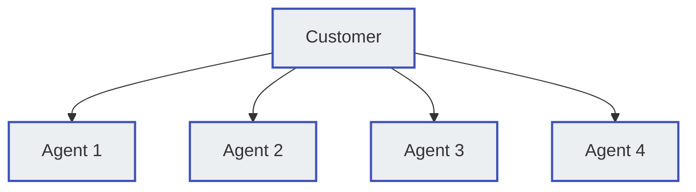
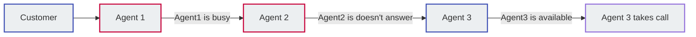
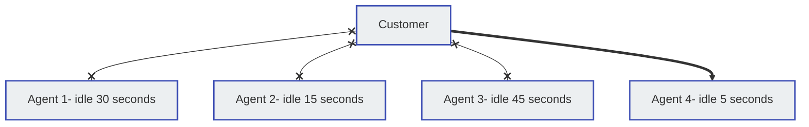

# Groups
**Class 5 :material-menu-right: Group**

A **Group**, or Call Queue, allows you to construct a team of individuals to receive calls placed to a specified number or extension based on the routing strategy you configure. (Ex: Create a number that customers can call which routes them to a team of Technical Support Specialists who can fix the technical issues with their laptop.)

For individual customers, navigate to **Management :material-menu-right: Customer :material-menu-right: [Customer Name] :material-menu-right: Class5 :material-menu-right: Groups**

## Group Call Routing strategies
Each Group is configured with a routing strategy which determines how calls will be routed to the members of the group:

**Parallel** Rings a call to all members of the group simultaneously. The members' extensions ring for the length of time you specify. You can assign unique timeout timers for individual members. Note: this rings all members, even if they are already on a call. 

**Sequential** Routes a call in a sequential order based on the order under Group Members.  By default, a call is routed to the member with the highest value of the extension number (for example, 5021).

+ If the member is busy on another call or does not receive the call for a specific time duration, the call is routed to the member with the second highest value of the extension number (for example, 4097). 
+ If the member with second highest extension number does not respond, the call is routed to the extension with the third highest value (for example, 4095). This process continues until a member receives the call. 

**Queue** Places the caller in a call queue before routing the call to the next available member (whoever has been waiting longest to receive a call). If you use this routing strategy:

+ You can upload audio files that greet the caller and play music when the caller or the member puts the call on hold.
+ You don't need to specify the members of a group. Individuals who want to join the group must dial a specific extension number from their phone. To leave the group, they dial another number from their phone. So, a group that uses a Queue routing strategy does not necessarily have a fixed number of members. 

## Group planning 
If you want to use audio files for the group, they will need to be uploaded to the system first. 
    
1. Download or create the audio files to greet the caller, chime tunes, and the music that will be played while on hold, in the .pcm or .wav format.
2. Upload the audio files to **Management** :material-menu-right: **File**.

## Create a Group
To create a new Group, click the :material-plus: icon.

+ **Name**: Enter the name for the group.
+ **Customer**: Select the customer the group will be applied to from the drop-down list.
+ **Extension**: Callers will use this extension to connect to this group from the drop-down list.
+ **Group Type**: See **Group call routing strategies** above.
    
    :material-menu-right: `Parallel` or `Sequential`- Select **`Save and Stay`** to configure the Group Members tab: 
        
     + Click the :material-plus: to add a new member.
     + `Ring Timeout`- This is especially helpful when calling mobile numbers as you can cancel the call before it hits the voicemail, allowing it to roll to the next Group Member.
     + Click **`Edit`** to set the `Destination` as either an External number or Internal (ConnexCS) extension, group, DID, etc. 
    
    :material-menu-right: `Queue`- strategy, you will have the following additional fields:

    |Field   |Description|
    |--------|----------------------|
    |`On Hold Music` |The audio file to play to the member and caller when the call is placed on hold.|
    |`Join Message` |The audio file that contains the Welcome Message played to the caller after they dial the group extension.|
    |`Chime List` |A list of audio files with the messages played to the call if no members of the group are available and the caller is waiting to be routed to the next available member. The message could thank them for waiting, play an advertisement, reference them to online or email support, and so on.|
    |`Chime Interval` |The time duration between successive chime messages. During this interval, the system will play the selected On Hold Music.|
    |`Agent Login Destination` |The extension number an individual must dial to join the group.|
    |`Agent Logout Destination` |The extension number an individual must dial to quit the group.|
    |`Agent Offhook Destination` |An extension number an individual must dial to receive calls immediately after joining the group.|

Once all changes have been made, select **`Save`**. 
