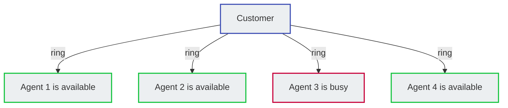
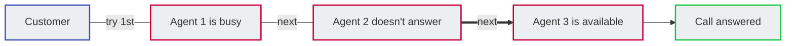
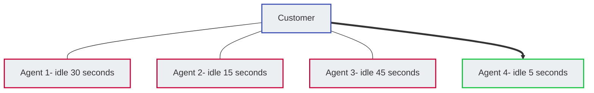

# Groups

**Class 5 :material-menu-right: Group**

Use **Group** or **Call Queue** to construct a team of individuals to receive calls placed to a specified number or extension based on the routing strategy you configure.

A **Group** in our system mapped to a **Queue** is exactly same as the FIFO (First In First Out).

For example, create a number that customers can call that routes them to a team of Technical Support Specialists who can fix the technical issues with their laptops.

For individual customers, navigate to **Management :material-menu-right: Customer :material-menu-right: [Customer Name] :material-menu-right: Class5 :material-menu-right: Groups**

## Group call routing strategies

The routing strategy set up for each group controls the routing of the calls to group members:

**Parallel:** Rings a call to all members of the group simultaneously. The member's extensions ring for the length of time you specify.

You can assign unique timeout timers for individual members.

**Note:** This rings all members, even if they're already on a call.

**Sequential:** Routes a call in a sequential order based on the order under Group Members.

By default, a call routes to the member whose extension number has the highest value. **For example**, 5021.

+ If the member is busy on another call or doesn't receive the call for a specific time duration, the call routes to the member with the second highest value of the extension number (**for example**, 4097).
+ If the member with the second-highest extension number doesn't respond, the call routes to the extension with the third-highest value (for example, 4095). This process continues until a member receives the call.

**Queue:** Places the caller in a call queue before routing the call to the next available member (whoever has been waiting for the longest to receive a call).

If you use this routing strategy:

+ You can upload audio files that greet the caller and play music when the caller or the member puts the call on hold.
+ You don't need to specify the members of a group.

    Individuals who want to join the group must call a specific extension number.

    To leave the group, they dial another number from their phone.

    Thus, a group that uses a Queue routing strategy doesn't necessarily have a fixed number of members.

## Group planning

You must first upload the audio files to the system if you wish to use them for the group.

1. Download or create the audio files (.pcm or .wav format) to greet the caller, chime tunes, and the music that's played while on hold.
2. Upload the audio files to **Management :material-menu-right: File**.

## Create a Group

To create a new Group, click :material-plus:. 

+ **Name:** Enter the name for the group.
+ **Customer:** (Available only when you add the Group from Class5, not when in the Customer management area): From the drop-down list, select the customer to whom the group applies.
+ **Extension:** Callers will use this extension to connect to this group.
+ **Group Type** refers to the [**Group call routing strategies**](https://docs.connexcs.com/class5/creating-group/#group-call-routing-strategies) above:
    + **Parallel** or **Sequential** strategies require Group Member setup:
        + Select the strategy, then **`Save and Stay`**.
        + Go to the new **Group Members** tab.
        + Click :material-plus: to add a new member.
        + `Destination`: Click **`Edit`** to enter the Destination as either an External number or Internal (ConnexCS) extension, Session Initiation Protocol (SIP) User, group, Direct Inward Dialing (DID), etc.
        + `Ring Timeout`: This helps when calling mobile numbers, as you can cancel the call before it hits voicemail, allowing it to roll to the next Group Member.

        ![alt text][group1]

    + **Queue** strategy requires extra fields (no **Group Members** tab available):
        + `On Hold Music`: The audio file to play to the member and caller when the call is on hold.
        + `Join Message`: The audio file that has the Welcome Message plays to the caller after they dial the group extension.
        + `Chime List`: If no group members are available and the caller for connection with the next available member, a list of audio files containing the messages plays to the call. The message could thank them for waiting, play an advertisement,or refer them to online or email support.
        + `Chime Interval`: The time duration between successive chime messages. During this interval, the system will play the selected On Hold Music.
        + `Agent Login Destination`: The extension number an individual must dial to join the group.
        + `Agent Logout Destination`: The extension number an individual must dial to quit the group.
        + `Agent Offhook Destination`: An extension number an individual must dial to receive calls soon after joining the group.

        ![alt text][group2]

+ **PBX Server**: Select the desired regional server. (PBX: Private Branch Exchange)

Select **`Save`** after making all necessary changes.

[group1]: /class5/img/group1.png "Group Members Configuration"
[group2]: /class5/img/group2.png "Group Queue Configuration"
