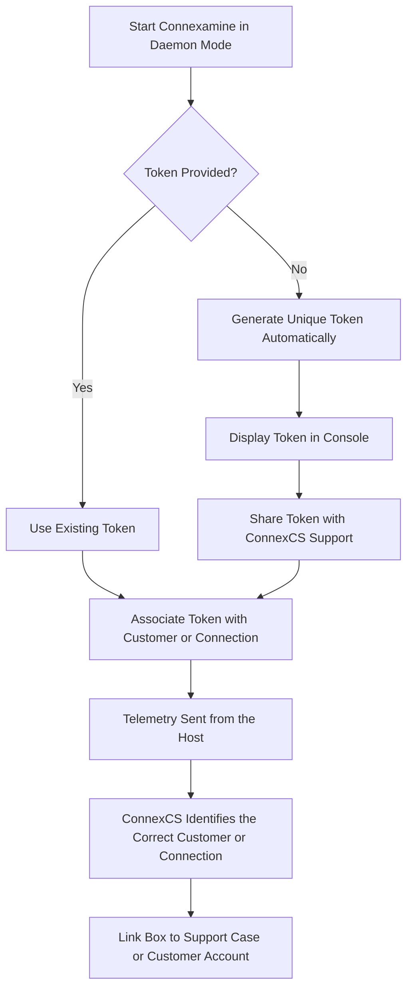

# Connexamine

<details>
<summary><strong>Document Metadata</strong></summary>
<br>

<strong>Category</strong>: Tools / Connexamine<br>
<strong>Audience</strong>: Network Administrators, VoIP Engineers, NOC Engineers, Support Team, Customers Troubleshooting SIP Connectivity<br>
<strong>Difficulty</strong>: Intermediate<br>
<strong>Time Required</strong>: Approximately 20–30 minutes<br>
<strong>Prerequisites</strong>: Linux system with root or packet capture permissions, basic understanding of SIP signalling, call setup flow, and network troubleshooting<br>
<strong>Related Topics</strong>: SIP Signalling, Call Setup Analysis, Class 4 Services, sngrep, Network Diagnostics<br>
<strong>Next Steps</strong>: Install Connexamine, run Interactive mode to analyze live call setup, or configure Daemon mode for continuous monitoring and remote diagnostics through ConnexCS.<br>

</details>

**Global :material-menu-right: ConnExamine**

## Overview

**Connexamine** is a **lightweight SIP call-setup inspector** built by **ConnexCS**.

It watches outbound SIP INVITEs on a host — a PBX, a session border controller, a trunk gateway — and tells you, in plain terms, how long call setup is taking and where it's failing: how fast the far end acknowledged the INVITE, how long it took to start ringing, and how long it took to answer.

ConnExamine is purpose-built to rapidly diagnose call setup delays and failures on a connection. Instead of functioning as a full protocol analyzer, it focuses on the key metrics required to troubleshoot SIP call establishment.

## What problem it solves

Most SIP issues escalated to a provider are not caused by complex protocol errors but by **first-hop connectivity problems**—such as a trunk that is slow to respond with `100 Trying`, a carrier that delays sending `180 Ringing`, or a destination that times out without returning a SIP response. Traditionally, diagnosing these issues requires using tools like `sngrep`, `tcpdump`, or `Wireshark` to capture SIP traffic and manually trace the INVITE-to-response sequence for each call.

**ConnExamine does that correlation automatically and surfaces just the metrics that matter for this specific problem**:

| Metric  | Measurement  | Purpose |
| --------|--------------|-------- |
| **Trying Time** | Time from **INVITE** to **`100 Trying`** | Measures how quickly the destination acknowledges the SIP INVITE, indicating whether the far end is reachable and responsive|
| **Post Dial Delay (PDD)** | Time from **INVITE** to **`180 Ringing`** or **`183 Session Progress`** | Measures the time taken before the destination starts ringing or provides early media to the caller|
| **Ring Time** | Time from **`180/183`** to **`200 OK`** | Measures how long the call rings before it is answered|
| **Final Disposition** | Final SIP response code or timeout stage | Indicates the final outcome of the call, including the SIP response code returned or the stage at which the call timed out without receiving a response. |

Every call is **color-coded** (good / average / poor) against sensible defaults, so a non-specialist can glance at a terminal and see a problem — no protocol expertise required to interpret it.

## How it compares to sngrep and similar tools

| | ConnExamine | sngrep / generic SIP capture tools |
|---|---|---|
| **Audience** | Support staff, junior NOC engineers, customers troubleshooting their own connection | Experienced SIP/telecom engineers |
| **Scope** | Outbound call **setup** on UDP/5060 only | Full SIP traffic, all transports, all dialog types |
| **Output** | Pre-computed timing metrics with color-coded pass/fail | Raw call flows and message dumps you interpret yourself |
| **Primary use case** | "Is this connection healthy? Where exactly is it slow or failing?" | General-purpose SIP debugging, deep packet-level inspection |
| **Continuous/remote use** | Yes — daemon mode reports to ConnexCS for ongoing monitoring | No — interactive, on-box, session-by-session |

ConnExamine is deliberately **narrower and more opinionated** than a general SIP capture tool.

**It doesn't aim to replace `sngrep` for deep protocol debugging (call transfers, re-INVITEs, media negotiation, non-INVITE dialogs)** — it aims to get a first-hop connectivity problem diagnosed by someone who isn't a SIP specialist, in minutes, without needing to learn how to read a SIP ladder diagram.

## The two modes

ConnExamine runs in one of two modes, selected at startup:

1. **Interactive mode** (`default`) — a live terminal session for hands-on debugging.
2. **Daemon / auto mode** (`--auto`) — an unattended background service for continuous monitoring, reporting to ConnexCS.

---

## Interactive mode

This is the default mode — run the binary and it captures live, printing a color-coded table to the terminal as calls happen.

```bash
sudo connexamine
```

!!! Example "Typical use"
    A support engineer or customer runs this directly on the box while reproducing or observing a problem, watches call setup timings scroll by in real time, and immediately sees which stage (Trying / PDD / Ring) is slow or timing out, and against which SIP response code.

```
     UTC Date/Time      │   Trying Time   │      PDD      │    Ring Time    │       SIP Code - Reason        │ Call-ID
                        │   FROM Number   │   TO Number   │                 │                                │
═══════════════════════════════════════════════════════════════════════════════════════════════════════════════════
2026-07-29 01:03:20.219 │         1023 ms │       5000 ms │        15000 ms │ 200 - OK                       │ abc123@...
                        │    +15551234567 │    +15559876543 │                 │                                │
```

**Key options**:

| Flag | Purpose |
|---|---|
| `-i, --interface <name>` | Network interface to capture on (default: `any`) |
| `--trying-timeout`, `--pdd-timeout`, `--ring-timeout` | Thresholds (ms) at which a stage is considered a timeout rather than just slow |
| `--destination-ip <ip>` | Only show calls to a specific destination |
| `--sip-code <code>` | Only show calls that ended with a specific final SIP response code |
| `--debug` | Verbose packet-processing output |
| `--test-mode` | Simulate call traffic instead of capturing — no root/pcap needed, useful for a quick demo |

Interactive mode is entirely local: nothing is sent off the box. It ends when you exit the process (`Ctrl+C`).

Because it only needs raw packet access (or the `cap_net_raw` capability — see [Security](#security--what-does-this-program-do)), it can be run ad hoc without any lasting install or configuration, which is what makes it approachable for a one-off debugging session.

---

## Daemon mode (`--auto`)

**Daemon mode** runs the same capture and analysis engine unattended, in the background, and streams the resulting metrics to a ConnexCS-operated endpoint instead of a terminal.

It turns a one-off debugging session into **continuous monitoring of a customer's connection**, so ConnexCS support can see call-setup health on an upstream trunk over time — without anyone needing to be logged into the box, running the tool, or reading its output.

```bash
sudo connexamine --auto
```

### Token Generation Flow

On the first run, Connexamine automatically generates a unique token if one is not provided. This token is used to associate the monitored host with the correct customer account or support case in ConnexCS.



### What it does once running

- **Installs itself as a persistent service.** On a systemd host it installs a proper `systemd` unit so it restarts on boot/crash like any other service; where systemd isn't available (e.g. many containers) it detaches into a supervised background process instead. Either way, a single `--auto` invocation is enough — there's no separate "now install the service" step.
- **Streams call-setup metrics continuously** (every 5 seconds): counts of INVITEs sent and Trying responses received, and latency statistics for both the Trying stage and fully-connected calls, broken out per destination — the same signal you'd see in the interactive table, aggregated for a support engineer watching remotely.
- **Reports host health** alongside it: load average, CPU, memory, disk free, process uptime — so a support engineer can tell "the connection is slow" apart from "the box itself is overloaded."
- **Samples real failures** every 60 seconds — actual Call-IDs behind a spike in `486`s or timeouts, so support can pull a specific case rather than just seeing a count go up.
- **Flags clock problems.** A box with a badly wrong system clock produces confusing, hard-to-correlate timestamps; auto mode checks for this continuously and reports it.
- **Accepts limited remote diagnostics.** ConnexCS support can ask the box to run a `ping` or `mtr` toward a specific IP and stream the result back — useful for confirming a routing/network issue without needing separate remote access to the box. This is deliberately narrow (see [Security](#security--what-does-this-program-do)): only `ping`/`mtr`, only against a literal IP address, nothing else can be executed this way.
- **Keeps itself up to date.** It checks weekly for a newer release and applies it automatically (`--no-auto-update` disables just this automatic check); ConnexCS can also trigger an update on demand.

### Why this is useful

Here's a cleaner, documentation-friendly bullet list:

* Enables **continuous monitoring** of call setup performance instead of one-time troubleshooting sessions.
* Eliminates the need for customers to **reproduce issues** while support engineers monitor an interactive session.
* Streams **real-time call setup metrics** to the ConnexCS backend for ongoing analysis.
* Provides **per-destination performance metrics**, making it easier to identify issues with specific carriers or trunks.
* Collects **failure samples** to help diagnose intermittent or recurring call setup problems.
* Reports **host health information**, including CPU, memory, disk usage, and system load, to distinguish network issues from server performance problems.
* Gives ConnexCS support **continuous visibility** into connection health through the ConnexCS portal.
* Bridges the gap between **interactive, on-demand debugging** and **long-term remote monitoring**, enabling faster issue detection and resolution.


See the full wire protocol in the project's `WS-SCHEMA.md` if you need the exact message shapes.

---

## Security — what does this program do?

This section details the operational behavior of ConnExamine, including the network traffic it inspects, the data it collects, and the security measures implemented to support safe deployment in production environments, particularly when running in `Daemon (--auto)` mode.

### What it looks at

ConnExamine only inspects **SIP signaling traffic on UDP port 5060**. **It does not capture or process**:

- Media (RTP/audio) at all
- SIP over TCP, TLS (SIPS), or non-standard ports
- Any non-SIP traffic on the interface it's watching

Within that SIP traffic, it only actively **tracks** outbound INVITEs — calls your host originates. Inbound INVITEs and other SIP methods (BYE, REGISTER, etc.) may be seen in passing but are not tracked or reported as calls.

### What it collects, and why

| Data | Collected? | Why |
|---|---|---|
| Call timing (Trying/PDD/Ring, per call) | Yes | This is the entire point of the tool — measuring call-setup health |
| SIP response codes / timeout reasons | Yes | Distinguishes a real carrier rejection (e.g. `486 Busy`) from a silent timeout, which point to very different root causes |
| Call-ID | Yes | The only way to let a human correlate a reported metric back to a specific, real call for investigation |
| Destination/source IP | Yes | Identifies *which* upstream connection a problem belongs to — essential when a box has more than one trunk |
| Host vitals (CPU, memory, disk, load, uptime) | Yes, in `--auto` mode only | Distinguishes "the connection is unhealthy" from "the box itself is overloaded," which otherwise look identical from the outside |
| **Caller / called phone numbers (FROM/TO)** | **Shown locally only — never transmitted** | Interactive mode displays them on-screen for the person actively debugging, because they're often necessary context in the moment. Daemon mode's telemetry to ConnexCS deliberately omits them — they aren't needed to measure call-setup timing, and there's no reason for that data to leave the box |
| Call content / audio | Never | Connexamine never touches media, only signaling headers |
| SIP message bodies (SDP, etc.) | Never | Only specific signaling headers (Call-ID, From, To, response codes) are parsed |

In short: what leaves the box in `--auto` mode is *timing statistics, response codes, Call-IDs, IPs, and host health* — the minimum needed to diagnose a connectivity problem remotely. It is not a call log and cannot be used to reconstruct who called whom.

### Encryption and transport

- Daemon mode reports over a WebSocket connection to ConnexCS (`wss://`, TLS-encrypted) using `rustls` — no traffic is sent to ConnexCS in plaintext.
- Self-update downloads are fetched over HTTPS (also `rustls`-backed) from ConnexCS's CDN.
- The **API token** that identifies a box to ConnexCS is the sole authentication mechanism on the WebSocket connection. It's persisted to disk with restrictive permissions (mode `0600`, readable only by the owner — root when installed as a service) and, when supplied via `--token-file` rather than `--token`, never appears in the process list (`ps`/`/proc`) where any local user could otherwise read it off the command line.

### Remote diagnostics are deliberately constrained

`Auto mode` lets ConnexCS remotely request a `ping` or `mtr`. This is the one feature that involves the server asking the box to *do* something, so it's worth being explicit about its limits:

- The target **must parse as a literal IPv4/IPv6 address** — hostnames aren't accepted, and the value is never passed through a shell, so it cannot be used to inject arbitrary commands.
- Only `ping` and `mtr` can be run — nothing else.
- Request parameters (iteration count, timeout) are clamped on the box itself regardless of what's requested, so a malicious or malfunctioning server can't trigger a resource-exhausting flood.
- At most 5 such requests can run concurrently; anything beyond that is rejected outright.

### Self-update

By default, the running binary checks weekly for a new release and, if one is available, downloads and applies it automatically (disable via `--no-auto-update`). Downloads happen over TLS from a ConnexCS-controlled CDN. An on-demand update can also be triggered remotely by ConnexCS support — this is treated as an explicit, audited action and is honored even with automatic checks disabled, since it only ever happens in response to a deliberate request, not silently.

### Summary

Connexamine is built to be safe to run unattended, with production SIP traffic, on a customer's edge:

- It only looks at SIP signaling, never media or call content.
- What it sends off the box is deliberately minimal — enough to diagnose connectivity problems, nothing that amounts to a call log.
- Everything sent over the network is encrypted in transit.
- The one remote-control surface (diagnostics) is narrowly scoped and validated before anything is ever executed.

## How to use?

1. Login to your account.
2. Navigate to **Global :material-menu-right: ConnExamine**.
3. Click on the `+ Claim Box` button.
4. Enter the `Code`- which is the `Deamon Token` or the `IP Address`.
5. Click on `Claim`. <br></br>
6. All the session information is visible on the ConnExamine dashboard.<br></br>
7. Click on the `Session ID` to get more insights on the current session.<br></br>
8. Session details explained:

* **Overview**

Displays general information about the active Connexamine monitoring session.

| Field  | Description |
| -------|------------ |
| **Session ID**   | Unique identifier assigned to the monitored Connexamine agent. This identifier is used to associate telemetry with the corresponding customer or support session|
| **IP** | Public IP address of the monitored host|
| **Customer** | Customer account associated with the monitored host. Displays **-** until the session has been linked to a customer|
| **Last Updated** | Date and time when the most recent telemetry was received from the agent|

**Box Info**

Displays information about the monitored host and the installed Connexamine agent.

| Field  | Description  |
| -------|------------- |
| **Hostname** | Hostname of the monitored system|
| **Agent Version** | Version of the installed Connexamine agent|
| **OS / Arch**     | Operating system and CPU architecture of the monitored host|
| **Capabilities**  | Lists the features supported by the connected agent. Each capability indicates functionality that is available for monitoring or remote diagnostics|

**Capability Definitions**

| Capability | Description |
| -----------|------------ | 
| **metrics** | Reports aggregated call setup metrics to the ConnexCS portal|
| **vitals** | Reports host health metrics, including CPU, memory, disk usage, uptime, and system load. |
| **failure_samples**  | Collects representative failed call samples for troubleshooting|
| **clock_skew** | Detects and reports system clock drift or synchronization issues|
| **diagnostics_ping** | Allows remote ICMP ping diagnostics to a specified IP address|
| **diagnostics_mtr**  | Allows remote MTR (My Traceroute) diagnostics for network path analysis|
| **self_update**| Supports automatic and remotely triggered agent updates|

**Vitals**

Displays the current health and resource utilization of the monitored host.

| Field | Description |
| ------|-------------|
| **Load Avg (1 \| 5 \| 15 min)** | Average system load over the previous 1, 5, and 15 minutes|
| **CPU** | Current CPU utilization of the monitored host|
| **Memory (Used / Total)**  | Amount of memory currently in use compared to the total installed memory|
| **Disk Free** | Available disk space on the monitored host|
| **Uptime** | Time elapsed since the monitored system was last restarted|

**Metrics (5s)**

Displays call setup statistics collected during the previous **5-second** reporting interval.

| Field | Description |
| ------|------------ |
|**By Destination** | Groups call setup metrics by destination IP address. Each destination includes aggregated statistics such as INVITE count, Trying responses, latency measurements, and other call setup metrics for that reporting interval|

**Failure Samples (60s)**

Displays representative call failures collected during the previous **60-second** sampling interval.

| Field | Description |
| ------|------------ | 
| **Categories** | Groups failures by SIP response code or timeout category (for example, `sip_480`, `sip_481`, `sip_503`). Selecting a category displays representative failed call samples to assist with troubleshooting recurring issues|

**Some Additional Fields**

| Field  | Description  |
| -------|--------------|
| **Location** | Geographic location of the monitored host, determined from its public IP address or associated metadata|
| **Status** | Current connection status of the Connexamine agent (for example, **Connected** or **Disconnected**)|
| **Window (s)** *(Metrics)*| Specifies the reporting interval, in seconds, over which call setup metrics are aggregated before being sent to the ConnexCS portal|
| **Window (s)** *(Failure Samples)* | Specifies the sampling interval, in seconds, during which failed call samples are collected and grouped before being reported|

