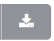

# Payments

View the list of all **Payments** made to date.

+ **Date / Time**: When the selected payment gets completed.
+ **Total**: Payment amount.
+ **Status**: The payment may show Pending, Cancelled, or Completed.

    **Note:** Pending and Cancelled payments aren't included in the balance calculation.

+ **Description**: Name of the payment.

!!! info "Bulk Payment Download"
    If you wish to download all the Payment details click on  on the extreme right side and a **.csv** file will be downloaded to your system.

## Make payment

To add a new payment, select **`Make Payment`**.

1. **Pay via**: (required)
    + **Bank Transfer**: You can select the Payment Amount and Currency. This sets the Payment Status to Pending until it's processed.
    + **PayPal**: You can select the Payment Amount and Currency.
    + **Credit Card**: Enter your Credit Card Number, Month and Year of expiry and CVC. Then you can select the Amount and Currency.
    + **Razor Pay**: You can select the Payment Amount and Currency.
    + **Pay Stack**: You can select the Payment Amount and Currency.
    + **Now Payments**: You can select the Payment Amount and Currency.
    + **Voucher**: Requires Voucher number and Currency.

2. Click **`Pay`**.

!!! warning "Negative Payments"
    If you make some kind of purchase on the account, it will appear as a negative amount under **Total**.
