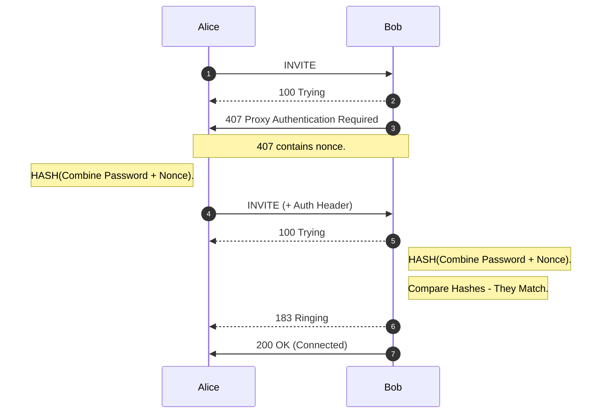
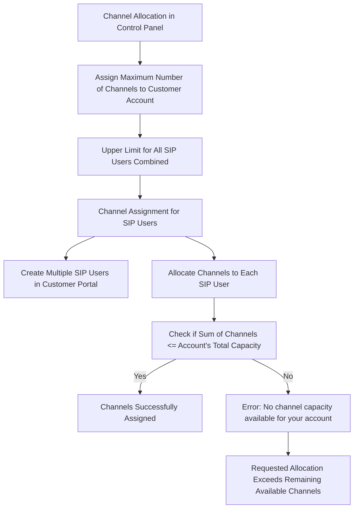
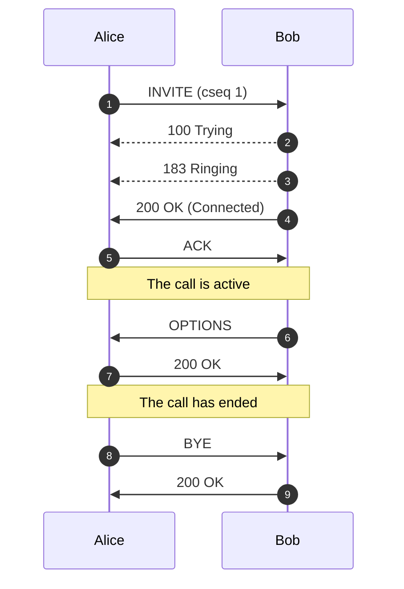
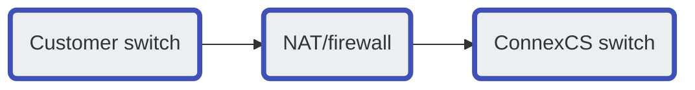

# Auth

**Management :material-menu-right: Customer :material-menu-right: [Customer Name] :material-menu-right: Auth**

Use the **Auth** tab to configure IP or SIP (Username / Password) Authentication for users.

!!! note "Global IP and SIP Authentication"
    You can also configure and manage both IP and Session Initiation Protocol (SIP) Authentication for Customers and Carriers in **Global :material-menu-right: IP Authentication** or **SIP User Authentication**.

## IP Authentication

When you enable **IP Authentication**, you link a customer switch's IP address to their account.

 It involves verifying incoming traffic based on the source IP address.

 This adds a layer of security by ensuring the calls are coming from a trusted source.

!!! Question "How it works"
    **Matching IP Addresses**: When a packet arrives from a specific IP address (e.g., 1.1.1.1), the system matches it to the corresponding customer.

!!! error "Newly added IP immediately marked as Blocked under IP Authentication"
    This occurs because call requests were sent from the new IP before it's authorized. As a result, ConnexCS fraud detection in the firewall blocked the unauthorised IP. Attempted calls from this IP won't get completed.

    To resolve the blocked IP, go to **Setup :material-menu-right: Advanced :material-menu-right: Firewall**. Select the blocked IP, then delete it from the firewall. This unblocks the IP, but it will take up to 15 minutes for the change to become active in the switch. 
    
    See [**Threat Detection**](https://docs.connexcs.com/setup/advanced/firewall/) for more details.

### Enable IP Authentication

To enable, click **:material-plus:** next to IP Authentication:

**Click each tab to view the configuration details**

=== "Basic"

    + **IP/CIDR**: Enter specific IPs or use CIDR notation to specify an entire subnet.<br>**FQDN can be used for Ingress-only switches.** You can assign multiple IPs.
    + **Switch Direction**: The available options are from the perspective of the customer switch (PBX, dialer, etc), and describe how that switch interacts with the ConnexCS switch. For switches that send and receive calls from ConnexCS, there should be separate entries for each direction. Two types of switches are as follows:    
        
        :material-menu-right: **This endpoint receives calls**. This switch *receives* calls from ConnexCS. (Note: When selected, this gives the option of using the FQDN rather than the switch IP.)
        
        :material-menu-right: **This endpoint receives calls**. This switch *sends* calls to ConnexCS.
        
    + **Channels**: Set the maximum number of concurrent calls for this switch. 
    + **Flow Speed**: Set the Calls Per Second (CPS) (0 = unlimited calls). A value of zero represents unlimited.
    
        

=== "Advanced"

    + **Manufacturer and Version**: These references fields allow you to enter the customer switch Manufacturer and Version, if required (these fields are not functional; they are informational only).
    + **Protocol**: Select the protocol for SIP (call signaling) and RTP (transport / audio). 
    
        :material-menu-right: **`UDP`**: SIP and RTP are unencrypted and transported over UDP.
        
        :material-menu-right: **`TCP`**: SIP is sent over TCP, RTP over UDP. 
        
        :material-menu-right: **`TLS`**: SIP is sent over TLS (TCP), RTP over UDP. 
        
        :material-menu-right: **`TLS & SRTP`**: SIP is sent over TLS (over TCP), RTP is encrypted with SRTP.
        
        :material-menu-right: **`SMPP`**: SMPP, for SMS, is not currently supported.
    + **Port**: Default = 5060. If using TLS protocol, this should be set to 5061. **ConnexCS is compatible with non-standard ports**.
    + **Dial Pattern**: The default selection is the industry standard.
    + **CLI Prefix, Tech Prefix, Force From**:  Do NOT Use these fields. Use the Parameter Rewrite tab to modify numbers. 
    + **Username, and Password**: Set when sending calls out (egress switch direction) to a remote system. 
    Set this to allow the ConnexCS switch to operate as a client or UAC. Not typically recommended unless the customer has a very specialized system. 
    + **Force NAT**: Forces the switch to read the IP address the traffic was received from, not the IP in the SIP packet. (See [**Far-End NAT Traversal**](https://docs.connexcs.com/far-end-nat-traversal/) for more details on how ConnexCS handles NAT for SIP.)
    + **Intercept Reinvite**: The only situation where this is recommended is when a customer's equipment doesn't support REINVITES. 
    Enable this to correct issues with dropped calls by having ConnexCS respond to the INVITES, which can help keep calls up if they are being disconnected by the far-end switch. 
    + **Outbound Proxy**: Enter the IP address of a Proxy server for calls to route to before being sent to the carrier. This rewrites the UAC IP in the VIA field of the SIP header. 
    This reduces management overhead as a customer only needs to authorize a single IP. 
    Additionally, multiple addresses can be load-balanced using the AnyEdge system. 
    + **Flags**: Check **CLI Authentication** flag for situations where Accounts are unable to use [**Tech Prefix**](https://docs.connexcs.com/customer/routing/#basic) to differentiate customers using the same IP. CLI Tags is another way to do it. 
        Check **Disable NAT** flag to disable NAT settings.
  
        
    
        + **CLI Authentication**: Select this flag to distinguish between multiple customers sharing the same IP address by using CLI Authentication instead of Tech Prefix.
            
            + **Configuration**
                
                + **CLI Routing**: CLIs are used as a secondary authentication mechanism to identify which customer traffic belongs to.
                
                !!! Example
                    Joe and Bob share an IP address but have different CLIs; the system uses these CLIs to route calls correctly.
                
                + **Setup Process**
                    
                    + **Configuring IP Authentication**:
                        
                        1. Navigate to **Customer :material-menu-right: Customer [Name] Auth :material-menu-right: IP Authentication :material-menu-right: click on the blue `+` sign**.
                        
                        2. Under **Advanced settings :material-menu-right: Flag :material-menu-right: Enable CLI Authentication**.
                        
                        3. This step ensures that the system will use CLI Authentication to differentiate customers with the same IP address.

        
        
            + **Setting Up CLIs or Regular Expressions**:
                + Navigate to **Customer :material-menu-right: Customer [Name] :material-menu-right: Routing :material-menu-right: CLI :material-menu-right: click on the blue `+` sign**.
                + Enter the specific CLIs, or Regular expressions associated with the customer.
                + This configuration allows the system to match incoming call CLIs with the defined patterns.

        
    
    !!! Info
        You can Use DID for CLI Authentication

    !!! Info "Call Routing Logic"
        ```mermaid
        graph LR
        A[Call Arrives] --> B{Check Source IP Address}
        B --> |If the IP address matches with the entry in the Authentication configuration| C{Check CLI of the incoming call}
        C --> |If both CLI and IP address match the configuration for a particular customer| D{Route Call to Customer}
        ```

    !!! Warning "Ensuring Consistent CLI Authentication Flag"
        Ensure that the CLI Authentication flag is consistently added to the IP configuration across all customers sharing the same IP address.
        This is crucial for the system to correctly apply the CLI-based routing logic.

=== "Codecs"

    All Codecs are supported unless specifically set as **`Restricted`** here.

     

=== "Parameter Rewrite"

    The **Parameter Rewrite** tab is used to manipulate data as it comes into the system, particularly useful for formatting phone numbers.

    !!! question "When and Why is it useful?"
        It is most useful when you need to create **automatic replacements** for destination numbers or CLI, so a number is formatted in the appropriate [**E164 format**](https://en.wikipedia.org/wiki/E.164). 
    
    + **Configuration**:
        
        + **Number Formatting**:
            Strip leading zeros or add country codes based on regular expressions.
            
            **Example**: Changing 01782 to 441782 for international formatting.

        + **Destination Number or CLI Manipulation**:
            Apply these manipulations on either destination numbers or CLIs.

    + Steps for re-writing: 
        1. Click **`+`**.
        2. **Type**: Select the parameter to modify.
        3. **Current**: Enter the prefix for the destination number, or the CLI. You also have the option to generate a regular expression using `AI Generate Regular Expression`.
        4. **New**: Enter what should replace the current information.
        5. Use the **Testing** `Input` field to verify if the replacement is working as expected. 
        6. Click **`Save`** when done. 
        7. If a parameter rewrite is already created, you will have the ability to test it from the main tab. 
    
    !!! Example
        International calls coming in with a + should be replaced with a specific country code.

    

!!! Note
    [Click here](https://cidr.xyz/) to view an interactive IP address and CIDR range visualizer.

!!! Info "NAT Considerations"

    **Network Address Translation (NAT)**: NAT can cause issues with SIP communications due to internal vs. external IP addresses.
    
    * **STUN (Session Traversal Utilities for NAT)**: Clients can use STUN to determine their external IP address and update SIP packets accordingly.
    * **Application Layer Gateway (ALG)**: NAT devices can rewrite SIP packets to use external IP addresses, though this method is unreliable.
    
    * **Far-end NAT Traversal**: The system can detect and adjust for NAT by checking IP headers and assuming the correct external IP address.

## SIP User Authentication

When you enable **SIP Authentication**, ConnexCS will reject the initial SIP INVITE with a "407 Authentication Required". This message includes a 'nonce' (a uniquely randomly generated hashed number). The customer switch will send appropriate authentication information to ConnexCS, which will connect the call. 
SIP Authentication involves using **Usernames** and **Passwords** to authenticate SIP connections.

Generic SIP Trace showing the Challenge Response:

&emsp; ![alt text][407-trace]



For call authentication we should have a Username and a Password. The Username and Password should get to the other side.

The Username is sent on Plain-text and the user (Alice) hashes the password. [**407 Proxy Authentication**](https://en.wikipedia.org/wiki/List_of_SIP_response_codes#4xx%E2%80%94Client_Failure_Responses) contains a nonce. A nonce is a random String of which gets send over to Alice. Both Alice and Bob are aware of this random string. Authorization header is sent with the INVITE. Then Bob combines the password with the nonce and compares the nonce. If the hashes match, the call gets connected.

!!! note "407 Proxy Authentication is a part of Challenge-Response and is necessary when you proceed with SIP User Auth. Also you can't have **IP Authentication** and **User / Password Authentication** work together"

!!! Info "UAC vs. UAS"
    **UAC (User Agent Client)**: Acts as a client, typically used when sending calls out.
    **UAS (User Agent Server)**: Acts as a server, typically used when receiving calls.

### Enable SIP User Authentication

To enable, click **:material-plus:** next to SIP User Authentication:

**Click each tab to view the configuration details**

=== "Basic"

    + **SIP Profile**: You can select the created [SIP Profile](https://docs.connexcs.com/setup/config/sip-profile/) here.
    + **Username**: This will be the Username used for SIP authentication (must match configuration on the customer UAC). If the Customer has [**Internal Number Block**](https://docs.connexcs.com/customer/main/#internal-number-block) set on the **Main** tab, you can only select the Username from available extensions. If a Username is already in use on the Account, they will get an error "Duplicate User Detected". Required when sending calls out to a remote system; the switch behaves in UAC (User Agent Client) mode.
        !!! Example
            If connecting to a GSM gateway or multi-tenant system, you may need to register with a username and password.

    + **Password**: Must match with the configuration on the customer UAC.
    + **Channels**: Set the maximum number of concurrent calls for this switch. 
    + **Flow Speed**: Set the Calls Per Second (CPS) (0 = unlimited calls). 
    + **Protocol**: Select the protocol for SIP (call signaling) RTP (transport/audio). 
    
        :material-menu-right: **`UDP`**: SIP and RTP are unencrypted and transported over UDP.
        
        :material-menu-right: **`TCP`**: SIP is sent over TCP, RTP over UDP. 
        
        :material-menu-right: **`TLS`**: SIP is sent over TLS (TCP), RTP over UDP. 
        
        :material-menu-right: **`TLS & SRTP`**: SIP is sent over TLS (over TCP), RTP is encrypted with SRTP.
        
        :material-menu-right: **`SMPP`**: SMPP, for SMS, is currently not supported.

    + **IP Allow list**: Enter specific IPs or use CIDR notation to specify an entire subnet.
    + **NAT/SIP Ping**: Set behavior of pings sent from ConnexCS back to the customer through their firewall to their UAC. This helps when there are remote agents connecting to the switch. NAT/SIP Ping is used to keep the network address translation (NAT) open, ensuring calls can be received.
            
            :material-menu-right: **`Disabled`**: No pings are sent
        
            :material-menu-right: **`Enabled`**: Send UDP pings every 60 seconds, helping to keep some longer calls (1800 or 3600 seconds) up. 
        
            :material-menu-right: **`Enabled (Timeout)`**: Send UDP pings every 60 seconds and disconnect the call (terminate registration) if the pings aren't returned.

        
    !!! question "How it works?"
        1. When using NAT, outbound packets create a temporary port mapping.
        2. NAT remembers this mapping and routes responses back to the sender.
        3. UDP has no built-in KeepAlive, so NAT can close inactive ports.
        4. To prevent this, the system sends a SIP ping every 60 seconds.
        5. If no response is received, the system times out and deregisters the device.
   
    ```mermaid
    graph TD
        A[Outbound Packet Sent] --> B[NAT Creates Temporary Port Mapping]
        B --> C[NAT Remembers Port Mapping and Routes Responses]
        C --> D[UDP Has No Built-in KeepAlive Mechanism]
        D --> E[NAT Can Close Inactive Ports After Timeout]
        E --> F[System Sends SIP Ping Every 60 Seconds to Keep Alive]
        F --> G{Check for Response from Device}
            G -- Yes --> H[Response Received, Continue Operation]
            G -- No --> I[No Response, System Times Out]
            I --> J[System Deregisters Device Due to Inactivity]
    ```
        !!! danger "Common Issue"
            **Outbound calls work, but inbound calls fail**:
               + This usually indicates a NAT issue where the port has closed.
               + Enabling NAT SIP Ping keeps the port open.
    
    + **Retain DID**: When you enable this, inbound calls will retain the destination number (DID), and the call is sent into the system, rather than using the SIP Username or routing calls to a predefined destination. 
        + **Key Considerations**:
          + This does not affect the "From" number.
          + Useful for maintaining correct call routing.
        !!! Example
            + **Without Retain DID**: Call to +1234567890 routes to TestRIS1.
            + **With Retain DID**: The call retains +1234567890 as the destination.
   
    + **Smart Extension**: It simplifies call transfers and enables advanced features like call barging and interception by centralizing REFER message handling within the Class 5 system. Unlike traditional SIP workflows, where the UAC or softphone manages transfers, this approach offloads complexity to us, enhancing functionality, user experience, and control through seamless integration of Class 4 and Class 5 systems.
          
          + **Smart Extension Workflow**:
            ```mermaid
            graph TD
            %% Define node styles
            classDef startEnd fill:#d1e7dd,stroke:#0f5132,stroke-width:2px,font-weight:bold;
            classDef process fill:#f9f9c5,stroke:#d4a017,stroke-width:2px,font-weight:normal;
            classDef decision fill:#ffffcc,stroke:#999900,stroke-width:2px,color:#000,font-style:italic;

            %% Nodes
            A[UAC Initiates Call]:::startEnd
            B[Class 4 System Routes Call]:::process
            C{Upstream Carrier Determines Transfer Needed?}:::decision
            D[REFER Message Sent Back to Originating System]:::process
            E[Class 5 System Intercepts REFER Message]:::process
            F[Class 5 System Processes Transfer]:::process
            G[Class 5 System Initiates New Call]:::process
            H[New Call Flows to Class 4 System]:::process
            I[Call Routed to Updated Destination via Carrier]:::startEnd
            J[Call Continues Normally]:::process

            %% Links
            A --> B
            B --> C
            C -- Yes --> D
            D --> E
            E --> F
            F --> G
            G --> H
            H --> I
            C -- No --> J
            ```
            
            + **Advantages**
                
                + **Simplified Call Transfers**:
                    The complexity of handling REFER messages is shifted from the UAC to the Class 5 system.
                    Ensures a seamless experience for the user, as the originating device is unaware of the transfer.

                + **Advanced Call Manipulation**:
                    By routing calls through the Class 5 system, advanced features such as call barging, whispering, and interception are enabled.
                
                !!! Example "Examples"
                    1. **Call Barging**: Useful in customer service scenarios where a supervisor might need to join an ongoing call to assist or guide the agent.
                    2. **Whispering**: Ideal in training situations, allowing a mentor to provide instructions to the agent without the customer hearing.
                    3. **Interception**: Crucial in security or compliance settings, enabling a manager to take over a call in progress if necessary.
            
                + **Centralized Complexity Management**:
                Keeps call logic and transfer handling within the provider's infrastructure, reducing the burden on end-user devices.
    
                !!! Example "Use Case Example "
                    ```mermaid
                    graph TD
                    %% Define node styles
                    classDef startEnd fill:#d1e7dd,stroke:#0f5132,stroke-width:2px,font-weight:bold;
                    classDef process fill:#f9f9c5,stroke:#d4a017,stroke-width:2px,font-weight:normal;
                    classDef decision fill:#ffffcc,stroke:#999900,stroke-width:2px,color:#000,font-style:italic;
                    classDef normal fill:#f2f2f2,stroke:#666666,stroke-width:1px,color:#000;

                    %% Nodes for With Smart Extension
                    A1[UAC Calls 12345]:::startEnd
                    B1[Class 4 System Routes Call]:::process
                    C1{Upstream Carrier: Number Unavailable?}:::decision
                    D1[Upstream Carrier Sends REFER Message]:::process
                    E1[Class 5 System Intercepts REFER]:::process
                    F1[Class 5 System Processes Transfer]:::process
                    G1[Class 5 System Initiates New Call to 12346]:::process
                    H1[New Call Flows Through Class 4 System]:::process
                    I1[Call Routed to Updated Destination via Carrier]:::startEnd

                    %% Links for With Smart Extension
                    A1 --> B1
                    B1 --> C1
                    C1 -- Yes --> D1
                    D1 --> E1
                    E1 --> F1
                    F1 --> G1
                    G1 --> H1
                    H1 --> I1

                    %% Nodes for Without Smart Extension
                    A2[UAC Calls 12345]:::startEnd
                    B2[Class 4 System Routes Call]:::process
                    C2{Upstream Carrier: Number Unavailable?}:::decision
                    D2[Upstream Carrier Sends REFER Message]:::process
                    E2[UAC Receives REFER Message]:::process
                    F2[UAC Handles Transfer:Potential Failure]:::normal
                    G2[UAC Initiates New Call to 12346]:::normal
                    H2[New Call Flows Through Class 4 System]:::normal
                    I2[Call Routed to Updated Destination via Carrier]:::startEnd

                    %% Links for Without Smart Extension
                    A2 --> B2
                    B2 --> C2
                    C2 -- Yes --> D2
                    D2 --> E2
                    E2 --> F2
                    F2 --> G2
                    G2 --> H2
                    H2 --> I2

                    %% Subgraphs (optional for grouping)
                    subgraph With Smart Extension
                        direction LR
                        A1 --> B1 --> C1 --> D1 --> E1 --> F1 --> G1 --> H1 --> I1
                    end

                    subgraph Without Smart Extension
                        direction LR
                        A2 --> B2 --> C2 --> D2 --> E2 --> F2 --> G2 --> H2 --> I2
                    end

                    %% Notes outside of subgraphs
                    I1 --> |Note:| N1["Seamless Transfer"]:::normal
                    I2 --> |Note:| N2["Complexity and Potential Failures"]:::normal
                    ```
    
                !!! Note "Important Note"
                    An additional charge of $0.003 per call applies to use the Smart Extension capability.

    

=== "Codecs"

    All Codecs are supported for the SIP user unless specifically set as "Restricted" here. 
    
    

=== "Parameter Rewrite"

    The **Parameter Rewrite** tab is used to manipulate data as it comes into the system. It is most useful when you need to create automatic replacements for destination numbers or CLI, so a number is formatted in the appropriate [**E164 format**](https://en.wikipedia.org/wiki/E.164). 

    1. Click **`+`**.
    

    2. **Type**: Select the parameter to modify.
    3. **Current**: Enter the prefix for the destination number, or the CLI. You also have the option to generate a regular expression using `AI Generate Regular Expression`.
    4. **New**: Enter what should replace the current information.
    5. Use **Testing** `Input` field to verify if the replacement is working as expected. 
    6. Click **`Save`** when done. 
    7. If a parameter rewrite is already created, you will have the ability to test it from the main tab. 

    &emsp;![alt text][test-rewrite]

=== "Voice Mail"

    If you enable Voice Mail, you can set which email address receives messages, reset the Voicemail Password, and view and delete current messages.

    **Key Features**:
       
       + Enable voicemail for specific extensions.
       
       + Configure email notifications for new voicemails.
       
       + Set up a voicemail password for retrieval via an interactive menu.
       
       + To access voicemail, dial *1 (subject to confirmation in system settings). 
    
    See [**Voicemail**](https://docs.connexcs.com/class5/voicemail/) for information on accessing Voicemail. 

    
___

!!! Info "Additional Considerations"
    1. **Re-invite Mechanism**:
          + Used to maintain active calls by sending periodic invite messages to reestablish the call state.
          + Helps in managing timeouts and ensuring that both sides of the call are aware of its status.
    2. **Intercept Re-invite**:
          + Used in scenarios where customers' equipment can't handle re-invites properly; the system intercepts and responds on behalf of the customer.

### Channel Capacity Limitation

#### Overview

The Channel Capacity Limitation feature allows administrators to control the maximum number of channels available to each customer account.
It efficiently manages channel resources across multiple SIP users, ensuring the account stays within its allocated capacity.

#### How It Works?

1. **Channel Allocation in Control Panel**:

+ Each customer account is assigned a maximum number of channels via the control panel.
+ The total channel allocation is the upper limit for all SIP users within the account.

2. **Channel Assignment for SIP Users**:

+ Customers can create multiple SIP users through the customer portal.
During setup, the customer allocates a specific number of channels to each SIP user.
+ The sum of channels assigned to all SIP users can't exceed the account’s total channel capacity.

3. **Error Notification**:

+ When the customer attempts to allocate more channels than their account limit allows, they will receive an error message: **"No channel capacity available for your account."**
+ This message indicates that the requested channel allocation for the SIP user exceeds the remaining available channels in the account.



!!! Example "Example Use Case"
    + A customer account has a channel allocation of 100.
    + The customer creates two SIP users, each assigned 50 channels.
    +  If the customer creates a third SIP user and assigns even one additional channel, an error occurs because the 100-channel limit is reached.
    ```mermaid
    flowchart TD
    A[Customer Account] -->|Allocated 100 Channels| B[Create SIP User 1]
    A -->|Allocated 100 Channels| C[Create SIP User 2]
    B -->|Assign 50 Channels| D[Total Used: 50 Channels]
    C -->|Assign 50 Channels| E[Total Used: 100 Channels]
    F[Attempt to Create SIP User 3] -->|Allocate 1+ Channels| G[Error: Total Capacity Reached]
    D --> E
    E --> F
    ```

#### Benefits

+ **Resource Control**: Ensures that channel usage is kept within limits, preventing over-allocation.
+ **Improved Customer Management**: Customers understand channel limitations, promoting efficient SIP user configuration management.
+ **Error Prevention**: Proactively blocks configurations that would exceed the account's channel capacity. It helps to avoid unexpected issues in the SIP user setup.

#### Recommendations

1. **Channel Reallocation**: Customers can modify channels allotted to current SIP users to free up space.
2. **Capacity Upgrades**: Customers can request a channel increase if their needs exceed the initial limit.

This feature ensures precise control and optimization of channel resources for manageable SIP user configurations across all accounts.

### Reset SIP Password

Click the `Password` key next to the SIP user to reset the password.

You can also use `Generate Password` to generate a random and secure SIP password.

Make sure you `Copy Text` and provide this information for configuration, as this password can't be retrieved after it's set.

Customers using the Customer Portal can reset their SIP Passwords in [**Authentication**](https://docs.connexcs.com/customer-portal/cp-authentication/#reset-sip-password).

!!! warning "SIP Password security"
    SIP passwords are needed for the SIP protocol, but they can present security risks for a provider.

    You must configure them in ConnexCS when SIP authentication is setup, but they aren't available for providers to retrieve later. 
    
    Providers should generate a unique SIP password for each SIP user and send that to the customer. This gives the customer the responsibility of keeping track of the password and keeping it safe. 
    
    Additionally, the unique password will allow for traceability if the customer's system is ever compromised.

### Send message to SIP Users

Use `Send` next to the SIP User to send a SIP message to the end device which will flash on the phone.

**Key Features**:

1. Allows sending SIP messages to customer devices.
2. Works similarly to a flash message on a phone.
3. Used for notifying users (e.g., server restarts, alerts).

!!! Note "Users can't reply to messages."

### SIP Pings

**Case 1: Normal SIP Ping**



In this case, Bob sends a message to Alice called **OPTIONS** and Alice sends back **200 OK**. If **200 OK** isn't sent, the call be get disconnected.

**Case 2: Alice Disappears**

### Use Case for NAT/SIP Pings

**Troubleshooting Scenario**
The Customer reports they can register and make outbound calls, but they're unable to receive inbound calls.

**What's happening**
In a typical configuration, a packet is sent from the customer UAC out through a NAT/firewall, and then the packet gets delivered to the UAS:



+ When a packet goes out, a hole gets punched in the firewall, and the source port gets recorded. When a packet returns on that port, the firewall knows to deliver back to the UAC.  
+ This works well when using TCP, which sends regular keep-alive packets.
+ UDP doesn't send keep-alives (no connected state as with TCP). SIP does maintain a connected state, registration, but may have long periods of inactivity.
+ Without regular traffic passing between UAS and UAC in the form of keep-alives/registration (a normal occurrence), NAT will eventually time out and shut down the connection.
+ Enabling UDP or SIP pings can show the NAT/firewall that the signaling path is still valid and in use.

!!! question "How NAT/SIP Ping measures Latency"
    1. A SIP ping request is sent to the User Agent Client (UAC).
    2. When a response is received, the system calculates latency.
    3. Useful for diagnosing VoIP quality issues.
    4. Can help troubleshoot high latency due to poor mobile network connections.
    ```mermaid
    graph TD
    A[SIP Ping Request Sent to UAC] --> B[UAC Receives Request]
        B --> C[UAC Sends Response Back]
        C --> D[System Receives Response]
        D --> E[Calculate Round-Trip Time-RTT Latency]
            E --> F[Latency Calculated]
                F --> G{Evaluate VoIP Quality}
                    G -- High Latency --> H[Troubleshoot Poor Mobile Network Connections]
                        H --> J[Adjust Network Settings or Contact Provider]
                    G -- Normal Latency --> I[Continue Normal Operation]
    ```

## Summary (Features and its Benefits)

|Feature|Benefit|
|-------|-------|
| **IP Authentication**|**Simplifies authentication**: Matches incoming packets to known IPs without requiring credentials.
||**Faster call setup**: Eliminates authentication delays compared to username/password authentication.
||**Enhanced security**: Restricts SIP access to trusted IPs, reducing unauthorized access.
||**Easier troubleshooting**: Directly links calls to customers based on IP logs.|
|**SIP Authentication**|**Enhanced Security**: Prevents unauthorized access, protects against SIP fraud, and stops spoofing.|
||**Flexible Authentication Methods**: Supports both IP-based authentication for simplicity and username/password authentication for added security.|
||**Call Routing Control**: Ensures calls originate from legitimate sources, aiding in traffic management.|
||**Better Network Management**: Helps with tracking, monitoring, and debugging SIP traffic.|
||**Prevents Toll Fraud**" Ensures only authorized users can make costly calls, reducing hacking risks.|
|| **Seamless Interoperability**: Works across various VoIP platforms and protocols.|
||**Optimized Performance**: Reduces authentication latency and improves call setup efficiency.|
|**Switch Direction**|**Clear traffic direction**: Helps in identifying whether the system is sending or receiving calls.
||**Accurate routing**: Ensures correct configuration for incoming and outgoing calls.
||**Efficient call management**: Supports handling of both call directions separately when needed.|
|**FQDN (Fully Qualified Domain Name) vs. IP Address**|**Flexibility**: Using an FQDN (e.g., sip.mycompany.com) allows dynamic IP changes without reconfiguration.|
||**Scalability**: Easier to manage SIP endpoints with DNS rather than hardcoded IPs.|
||**Improved redundancy**: If a server IP changes, DNS updates can redirect calls seamlessly.|
|**Codec Filtering**|**Optimized call quality**: Allows selection of preferred codecs for better audio transmission.|
||**Bandwidth efficiency**: Removes unnecessary codecs, reducing bandwidth usage.|
||**Better compatibility**: Ensures interoperability between different VoIP systems.||
|**Force NAT**|**Ensures connectivity**: Overrides incorrect NAT settings to allow SIP communication.|
||**Fixes one-way audio issues**: Helps in cases where audio streams are not properly routed.|
||**Reduces manual intervention**: Automatically detects and corrects NAT issues without requiring user configuration.
|**Intercept Re-Invite & Call Timeout Mechanisms**|**Prevents stuck calls**: Ensures that SIP calls properly terminate when needed.|
||**Enhances call quality**: Enables re-negotiation of codecs or call parameters if needed.|
||**Avoids ghost calls & billing issues**: Ensures calls don’t remain active indefinitely due to lost BYE messages.|

[ipauth-basic]: /customer/img/ipauth-b.png "Edit Switch Basic"
[parameter-rewrite]: /customer/img/parameter-rewrite.png "Parameter Rewrite" width="200" height="400"
[ipauth-adv]: /customer/img/ipauth-adv.png "Edit Switch Advance"
[ipauth-param]: /customer/img/ipauth-param.png "Edit Switch Parameters"
[sip-b]: /customer/img/sip-b.png "SIP Codecs"
[test-rewrite]: /customer/img/test-rewrite.png "Test Parameter Rewrite"
[407-trace]: /customer/img/407-trace.png "SIP Trace Error 407"
[voicemail]: /customer/img/voicemail.png "Voicemail"
