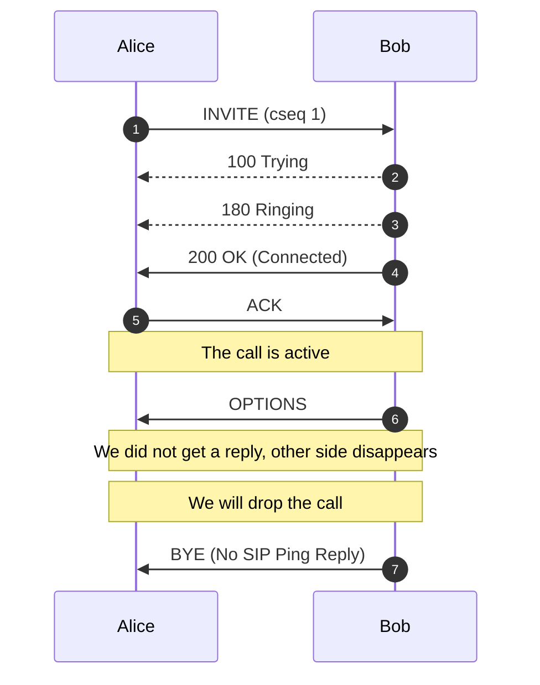
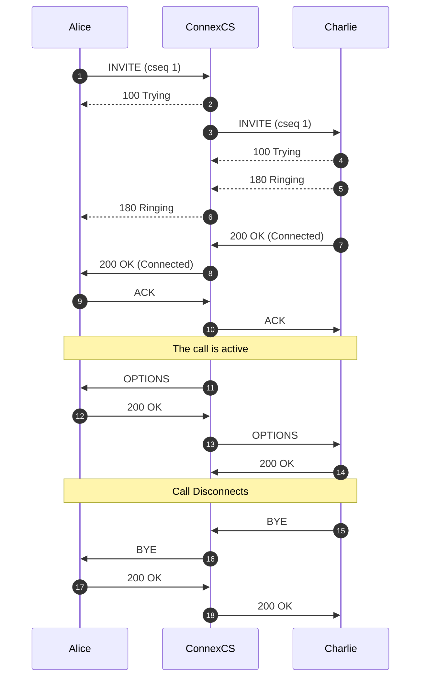
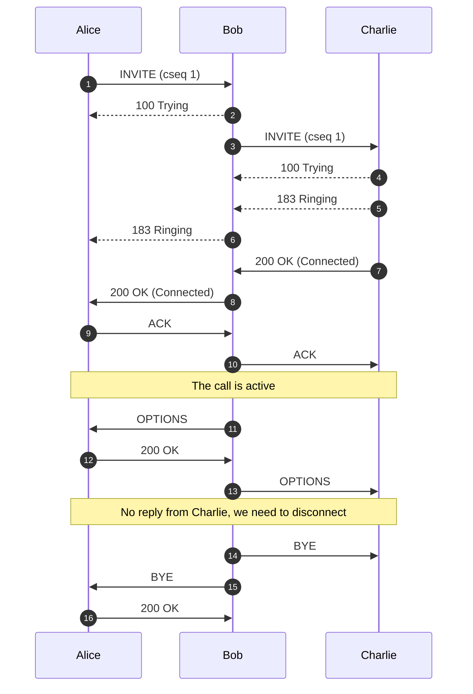
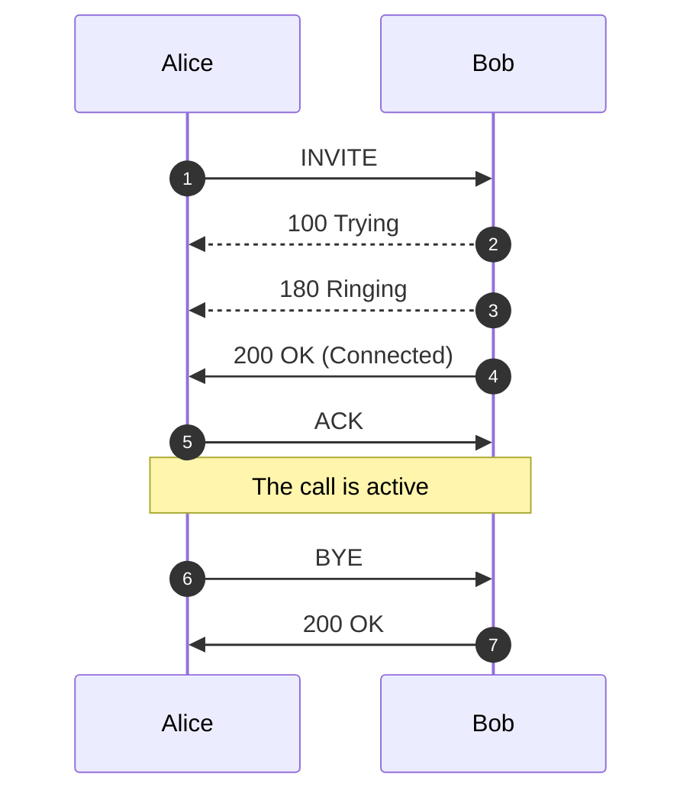
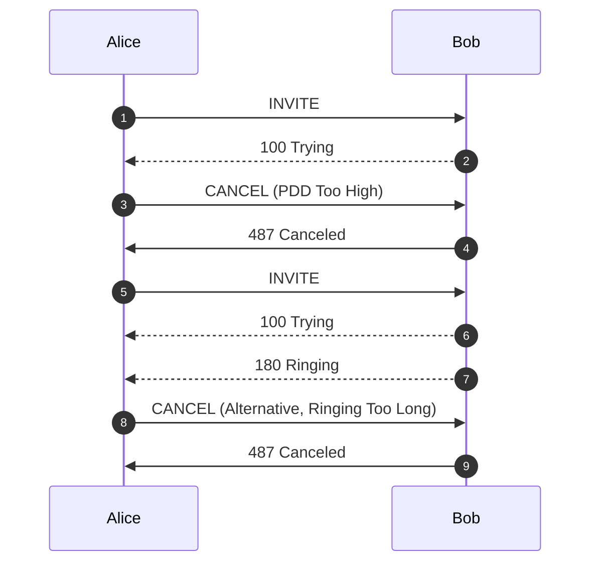

# Auth

**Management :material-menu-right: Customer :material-menu-right: [Customer Name] :material-menu-right: Auth**

Use the **Auth** tab to configure IP or SIP (Username / Password) Authentication for users.

!!! note "Global IP and SIP Authentication"
    You can also configure and manage both IP and Session Initiation Protocol (SIP) Authentication for Customers and Carriers in **Global :material-menu-right: IP Authentication** or **SIP User Authentication**.

## IP Authentication

When you enable **IP Authentication**, you link a customer switch's IP address to their account. This adds a layer of security by ensuring the calls are coming from a trusted source.

!!! error "Newly added IP immediately marked as Blocked under IP Authentication"
    This occurs because call requests were sent from the new IP before it's authorized. As a result, ConnexCS fraud detection in the firewall blocked the unauthorised IP. Attempted calls from this IP won't get completed.

    To resolve the blocked IP, go to **Setup :material-menu-right: Advanced :material-menu-right: Firewall**. Select the blocked IP, then delete it from the firewall. This unblocks the IP, but it will take up to 15 minutes for the change to become active in the switch. 
    
    See [**Threat Detection**](https://docs.connexcs.com/setup/advanced/firewall/) for more details.

### Enable IP Authentication

To enable, click **:material-plus:** next to IP Authentication:

**Click each tab to view the configuration details**

=== "Basic"

    + **IP**: Enter the IP(s) of the customer's switch. **FQDN can be used for Ingress-only switches.**
    + **Switch Direction**: The available options are from the perspective of the customer switch (PBX, dialer, etc), and describe how that switch interacts with the ConnexCS switch. For switches that send and receive calls from ConnexCS, there should be separate entries for each direction. 
        
        :material-menu-right: `Ingress`: This switch *receives* calls from ConnexCS. (Note: When selected, this gives the option of using the FQDN rather than the switch IP.)
        
        :material-menu-right: `Egress`: This switch *sends* calls to ConnexCS.
        
    + **Channels**: Set the maximum number of concurrent calls for this switch. 
    + **Flow Speed**: Set the Calls Per Second (CPS) (0 = unlimited calls).   
    
        ![alt text][ipauth-basic]

=== "Advanced"

    + **Manufacturer and Version**: These references fields allow you to enter the customer switch Manufacturer and Version, if required (these fields are not functional; they are informational only).
    + **Protocol**: Select the protocol for SIP (call signaling) and RTP (transport / audio). 
    
        :material-menu-right: **`UDP`**: SIP and RTP are unencrypted and transported over UDP.
        
        :material-menu-right: **`TCP`**: SIP is sent over TCP, RTP over UDP. 
        
        :material-menu-right: **`TLS`**: SIP is sent over TLS (TCP), RTP over UDP. 
        
        :material-menu-right: **`TLS & SRTP`**: SIP is sent over TLS (over TCP), RTP is encrypted with SRTP.
        
        :material-menu-right: **`SMPP`**: SMPP, for SMS, is not currently supported.
    + **Port**: Default = 5060. If using TLS protocol, this should be set to 5061. 
    + **Dial Pattern**: The default selection is the industry standard.
    + **CLI Prefix, Tech Prefix, Strip Digits**:  Do NOT Use these fields. Use the Parameter Rewrite tab to modify numbers. 
    + **Bandwidth, Force From**: Do NOT use these fields.
    + **Username, and Password**: Set when sending calls out (egress switch direction) to a remote system. 
    Set this to allow the ConnexCS switch to operate as a client or UAC. Not typically recommended unless the customer has a very specialized system. 
    + **Force NAT**: Forces the switch to read the IP address the traffic was received from, not the IP in the SIP packet. (See [**Far-End NAT Traversal**](https://docs.connexcs.com/far-end-nat-traversal/) for more details on how ConnexCS handles NAT for SIP.)
    + **Intercept Reinvite**: The only situation where this is recommended is when a customer's equipment doesn't support REINVITES. 
    Enable this to correct issues with dropped calls by having ConnexCS respond to the INVITES, which can help keep calls up if they are being disconnected by the far-end switch. 
    + **Outbound Proxy**: Enter the IP address of a Proxy server for calls to route to before being sent to the carrier. This rewrites the UAC IP in the VIA field of the SIP header. 
    This reduces management overhead as a customer only needs to authorize a single IP. 
    Additionally, multiple addresses can be load-balanced using the AnyEdge system. 
    + **Flags**: Set CLI Authentication for situations where Accounts are unable to use [**Tech Prefix**](https://docs.connexcs.com/customer/routing/#basic) to differentiate customers using the same IP. 

=== "Codecs"

    All Codecs are supported unless specifically set as "Restricted" here. 

=== "Parameter Rewrite"

    The **Parameter Rewrite** tab is used to manipulate data as it comes into the system. 
    
    It is most useful when you need to create automatic replacements for destination numbers or CLI, so a number is formatted in the appropriate [**E164 format**](https://en.wikipedia.org/wiki/E.164). 

    1. Click **`+`**.
    2. Type: Select the parameter to modify.
    3. Current: Enter the prefix for the destination number, or the CLI.
    4. New: Enter what should replace the current information.
    5. Use the Testing `Input` field to verify if the replacement is working as expected. 
    6. Click **`Save`** when done. 
    7. If a parameter rewrite is already created, you will have the ability to test it from the main tab. 
    
    Example: International calls coming in with a + should be replaced with a specific country code. 

    &emsp;![alt text][parameter-rewrite]

___

## SIP User Authentication

When you enable **SIP Authentication**, ConnexCS will reject the initial SIP INVITE with a "407 Authentication Required". This message includes a 'nonce' (a uniquely randomly generated hashed number). The customer switch will send appropriate authentication information to ConnexCS, which will connect the call.

Generic SIP Trace showing the Challenge Response:

&emsp; ![alt text][407-trace]

For call authentication we should have a Username and a Password. The Username and Password should get to the other side.

The Username is sent on Plain-text and the user (Alice) hashes the password. **407** contains a nonce. A nonce is a random String of which gets send over to Alice. Both Alice and Bob are aware of this random string. Authorization header is sent with the INVITE. Then Bob combines the password with the nonce and compares the nonce. If the hashes match, the call gets connected.

!!! note "407 Proxy Authentication is a part of Challenge-Response and is necessary when you proceed with SIP User Auth. Also you cannot have IP Authentication and SIP Authentication work together"

### Enable SIP User Authentication

To enable, click **:material-plus:** next to SIP User Authentication:

**Click each tab to view the configuration details**

=== "Basic"

    + **Username**: This will be the Username used for SIP authentication (must match configuration on the customer UAC). If the Customer has [**Internal Number Block**](https://docs.connexcs.com/customer/main/#internal-number-block) set on the **Main** tab, you can only select the Username from available extensions. If a Username is already in use on the Account, they will get an error "Duplicate User Detected".
    + **Password**: Must match with the configuration on the customer UAC.
    + **Channels, Flow Speed, Bandwidth**; Do NOT use these fields. 
    + **Protocol**: Select the protocol for SIP (call signaling) RTP (transport/audio). 
    
        :material-menu-right: **`UDP`**: SIP and RTP are unencrypted and transported over UDP.
        
        :material-menu-right: **`TCP`**: SIP is sent over TCP, RTP over UDP. 
        
        :material-menu-right: **`TLS`**: SIP is sent over TLS (TCP), RTP over UDP. 
        
        :material-menu-right: **`TLS & SRTP`**: SIP is sent over TLS (over TCP), RTP is encrypted with SRTP.
        
        :material-menu-right: **`SMPP`**: SMPP, for SMS, is currently not supported.

    + **IP Allow list**: Enter specific IPs or use CIDR notation to specify an entire subnet. 
    + **NAT/SIP Ping**: Set behavior of pings sent from ConnexCS back to the customer through their firewall to their UAC. This helps when there are remote agents connecting to the switch. 
    
        :material-menu-right: **`Disabled`**: No pings are sent
        
        :material-menu-right: **`Enabled`**: Send UDP pings every 60 seconds, helping to keep some longer calls (1800 or 3600 seconds) up. 
        
        :material-menu-right: **`Enabled (Timeout)`**: Send UDP pings every 60 seconds and disconnect the call (terminate registration) if the pings aren't returned.
    
    + **Retain DID**: When you enable this, inbound calls will retain the destination number (DID), and the call is sent into the system, rather than using the SIP Username. 
    + **Smart Extension**: Calls are sent to the Class5, not Class4 infrastructure. This feature is currently in Alpha and is not recommended. 

         ![alt text][sip-b]

=== "Codecs"

    All Codecs are supported for the SIP user unless specifically set as "Restricted" here. 

=== "Parameter Rewrite"

    The **Parameter Rewrite** tab is used to manipulate data as it comes into the system. It is most useful when you need to create automatic replacements for destination numbers or CLI, so a number is formatted in the appropriate [**E164 format**](https://en.wikipedia.org/wiki/E.164). 

    1. Click **`+`**.
    2. Type: Select the parameter to modify.
    3. Current: Enter the prefix for the destination number, or the CLI.
    4. New: Enter what should replace the current information.
    5. Use Testing `Input` field to verify if the replacement is working as expected. 
    6. Click **`Save`** when done. 
    7. If a parameter rewrite is already created, you will have the ability to test it from the main tab. 

    &emsp;![alt text][test-rewrite]

=== "Voice Mail"

    If you enable Voice Mail, you can set which email address receives messages, reset the Voicemail Password, and view and delete current messages. 
    
    See [**Voicemail**](https://docs.connexcs.com/class5/voicemail/) for information on accessing Voicemail. 
___

### Reset SIP Password

Click the `Password` key next to the SIP user to reset the password.

You can also use `Generate Password` to generate a random and secure SIP password.

Make sure you `Copy Text` and provide this information for configuration, as this password can't be retrieved after it's set.

Customers using the Customer Portal can rest their SIP Passwords in [**Authentication**](https://docs.connexcs.com/customer-portal/cp-authentication/#reset-sip-password).

!!! warning "SIP Password security"
    SIP passwords are needed for the SIP protocol, but they can present security risks for a provider.

    You must configure them in ConnexCS when SIP authentication is setup, but they aren't available for providers to retrieve later. 
    
    Providers should generate a unique SIP password for each SIP user and send that to the customer. This gives the customer the responsibility of keeping track of the password and keeping it safe. 
    
    Additionally, the unique password will allow for traceability if the customer's system is ever compromised.

### Send message to SIP Users

Use `Send` next to the SIP User to send a SIP message to the end device which will flash on the phone.

### SIP Pings

**Case 1: Normal SIP Ping**

In this case, Bob sends a message to Alice called **OPTIONS** and Alice sends back **200 OK**. If **200 OK** isn't sent, the call be get disconnected.

**Case 2: Alice Disappears**

In this case, the call is half-way connected and Alice doesn't reply to the message sent by Bob. Bob decides to drop the call.

If Alice is alive, then you may get a reply, if there is a reply, then this is likely a premature disconnection and there is a fault with the SIP ping on Alice's side.

**Case 3: 3-party Example**

In this case, the communication happens between 3 parties. ConnexCs is sending OPTION packets in both the directions (to Alice and Charlie).

**Case 4:Missing SIP Ping Call Disconnection (Charlie disappears)**

In this case, when we send the OPTION packet to Charlie, he doesn't reply. The OPTION message disappears and we need to disconnect the call.

Another scenario is when ConnexCS sends message to Charlie and Charlie is active on the call, he will send a BYE message to Alice and we won't see a reply to that.

+ **ACK Message**

An ACK is an **Acknowledgement** of a final reply.

+ **Cancel Message**

**CANCEL** message indicates that the previous request was terminated by the user. In this case, the CANCEL message is sent from Alice to Bob.

Cancel can be due to PDD timer being too high or ringing exists for a longer duration.

Bob should send 487 Canceled message to Alice.

### Use Case for NAT/SIP Pings

**Troubleshooting Scenario**
The Customer reports they can register and make outbound calls, but they're unable to receive inbound calls.

**What's happening**
In a typical configuration, a packet is sent from the customer UAC out through a NAT/firewall, and then the packet gets delivered to the UAS:

+ When a packet goes out, a hole gets punched in the firewall, and the source port gets recorded. When a packet returns on that port, the firewall knows to deliver back to the UAC.  
+ This works well when using TCP, which sends regular keep-alive packets.
+ UDP doesn't send keep-alives (no connected state as with TCP). SIP does maintain a connected state, registration, but may have long periods of inactivity.
+ Without regular traffic passing between UAS and UAC in the form of keep-alives/registration (a normal occurrence), NAT will eventually time out and shut down the connection.
+ Enabling UDP or SIP pings can show the NAT/firewall that the signaling path is still valid and in use.

[ipauth-basic]: /customer/img/ipauth-b.png "Edit Switch Basic"
[parameter-rewrite]: /customer/img/parameter-rewrite.png "Parameter Rewrite" width="200" height="400"
[ipauth-adv]: /customer/img/ipauth-adv.png "Edit Switch Advance"
[ipauth-param]: /customer/img/ipauth-param.png "Edit Switch Parameters"
[sip-b]: /customer/img/sip-b.png "SIP Codecs"
[test-rewrite]: /customer/img/test-rewrite.png "Test Parameter Rewrite"
[407-trace]: /customer/img/407-trace.png "SIP Trace Error 407"
[voicemail]: /customer/img/voicemail.png "Voicemail"
<!--stackedit_data:
eyJoaXN0b3J5IjpbMTUwMDY4NjkyMCwyNDI4Njg5MDgsLTEzOD
I0NTQ3NjcsLTE5MjIzMDU2NzBdfQ==
-->