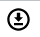

# Main

**Management :material-menu-right: Customer :material-menu-right: [Customer Name]**

The first tab in a Customer account is **Main**.

As the name suggests it allows you to manage the critical customer functions.

It offers a comprehensive set of tools to manage customer accounts, including the addition of customer contacts, invoice generation, summary reporting, and internal number allocation.

!!! Question "Why and When do we need the **Main** section?"
    1. **User-Friendly & Flexible System**:
          1. Guides customers in configuring their accounts to match their operational needs.
          2. Offers customizable options such as number blocks, verification, and aliases.
    2. **Improved Organization & Accountability**:
          1. Clearly defines how customers and their contacts are managed.
          2. Ensures that every action taken by a contact is logged, improving traceability.
    3. **Enhanced Security & Access Control**:
          1. Allows multiple logins with unique credentials for each contact.
          2. Provides authentication and password management options to secure customer access.
    4. **Efficient Number Management**:
          1. Explains how internal number blocks work to avoid conflicts.
          2. Helps customers set up structured dialing plans for better call routing.

![alt text][cust-main]

!!! note "By clicking the dropdown next to the             customer's   name, you will be redirected to the selected customer's portal. For more information, see [Access Customer Panel](https://docs.connexcs.com/customer/main/#access-customer-portal)."

## Audit Log

![alt text][audit-log]

The **Audit Log**, or Audit Trail, is a chronological set of records that shows all changes performed on a system, software, or device including **timestamps** and **IP addresses**.

It displays when the customer was created, all changes made, either directly by users or through the API. This includes all activity on the Control Panel and in the Customer Portal.

**Displays HTTP verbs** (PUT, POST, GET, DELETE) for actions taken.

Enables **viewing differences** between previous and current configurations.

You can search using Account ID, Ingress ID, etc.

!!!question "Why and when do you need to see audit logs"
    1. Audit logs can offer rich insights about what caused downtime, loss of performance, and other unexpected issues.
    2. An audit log is a primary source of information to investigate the causes of issues.
    3. Provides proof of customer changes.
    4. Prevents disputes about unauthorized setting modifications.

### Columns

| Column Name | Description|
|-------------|------------|
| **User** | User responsible for the events. An entry will display 'Portal' if you make a change there; all others were directly made in the Control Panel|
| **IP** | IP address of the computer which performed the action (from where the IP was modified)|
| **Date / Time** | Date / Time when the User made the change|
| **Primary Key** | Unique ID of the record in the database that the User modified with this action|
| **Action** | The action type performed: CREATE, DELETE, GENERATE, LOGIN, POST, PUBLISH, PUT, SEND, or UPDATE|
| **Table**| The table in the database that the User modified|
| **Message**| A simple message that defines what the user did|
| **Data**| Click `View Difference` to see the fields changed, plus previous and current values. (Data displayed in JSON format.)|

### View Difference

In the Data column, select "View Difference" to view a popup containing a diff. This shows the data before and after the action.

Here is an example of a View Data Difference pop-up for an action type = PUT.
  
   ![alt text][view-data-difference-audit-logs]

### Supplementary Functions

To view more details about the audit logs:

* To search for a specific set of audit logs by the values in the columns, enter the search criteria in the Search box and press `Enter`.
* To sort a column by the ascending or descending order of the values in the column, click the column header.
* To filter the audit logs by one or more values in a column, click the 3-lines icon in a column, click the Funnel icon, and select or enter values.

!!! tip "Data Synchronization"
    To avert the impact of data synchronisation issues and get the latest set of audit logs, click **Refresh**, located at the top-right of the table.
 [view-data-difference-audit-logs]: /setup/img/view-data-difference-audit-logs.png "view-data-difference-audit-logs"

## Contacts

The **Contacts** section allows you to manage individuals associated with a customer account.

Each customer can have multiple contacts, providing better visibility and accountability within an organization.

!!! note "Global Contacts"
    Contacts can also be modified in **Global :material-menu-right: Contacts**, which displays all Customer Contacts.

### Add Contact

Click **:material-plus:** to the right of **Contacts**.

* **Name**: The contact's real name.

* **Email**: This is the contact's login and a means to contact them.

* **Phone** or **Mobile**: To communicate with the contact.

* **Contact Type**: This field is only used for informational and organizational purposes; there is no additional function for it.

* **Auto Generate Password**: Select this to have a password generated online and sent via email. Deselect the box to enter a password manually.

    !!! Info "Login and Access Controls"
        1. Each contact can have their own login credentials.
        2. Actions taken by a contact are logged for accountability.
        3. Multiple logins help track system changes by different individuals.

* **Public Notes**: Display on the Customer Portal and is  visible to customers.

* **Private Notes**: Display in the Control Panel and its internal-only for administrative purposes.

* **Mobile Verified** and **Email Verified**: Manually set the status for each. Check in the Customer Details to confirm if the Mobile and Email are verified. Alternatively, the customer can do this in the Customer Portal.

    

Click **`Save`** to add the Contact.

!!! note "Save Options"
    + **Save and Continue**: Exit the Customer screen
    + **Save and Stay**: Save the customer, but stay in the screen (helpful when adding multiple Customers at a time)
    + **Delay and Save**: Select a time to elapse before saving the Customer, delaying the setup or change.

!!! warning
    DO NOT save passwords in either of the Contact Details notes fields.

### Reset Contact Password

Follow these steps to reset a Contact password:

1. Click the down arrow to the right of the Contact

    ![alt text][reset-password]

2. Select `Change Password`.
3. Select `Auto Generate & Email Password` to email the random password to the contact's email address, or deselect it and enter the password manually. **If auto-generate is disabled, an administrator must manually set a password.**
4. **`Save`**.

### Access the Customer Portal

It's necessary to view the Customer Portal for issues or questions they may have.

To access the Customer Portal:

1. Click the down arrow to the right of the Contact

    ![alt text][reset-password]

2. Choose `Portal Login`.

   This will load the Customer's Portal.

## Internal Number Block

Assign an **Internal Number Block** to define the range of numbers a Customer can use for setting up SIP Extensions (see [**SIP Authentication**](https://docs.connexcs.com/customer/auth/#sip-user-authentication) for configuration details).

The Internal Number Block ensures number allocations are managed efficiently.

### Key Features/Benefits

1. **Namespace and Extension Management**: 

      1. The system can be multi-tenant (domain-based) or use number allocations.
      2. Each customer operates within a unique namespace.
      3. Duplicate extensions across multiple customers are prevented.

2. **Number Allocation**:

      1. **Without a Number Block**: Any extension can be added without restrictions.
      2. **With a Number Block**: Extensions must be chosen from a predefined range.
      3. Administrators can assign number blocks to specific users.

3. **Organization of Extensions**

    **Number blocks can be structured as**:

    First few digits = **Company identifier**

    Last few digits = **Extension identifier**

    !!! Example
        A company can dial 100 internally, while the system automatically appends the required prefix.

4. **Routing and Aliases**
      1. Calls can be routed automatically using number blocks
      2. Alias functionality allows alternative ways to achieve the same result.

### Steps to implement Internal Number Block

1. Click **:material-plus:** next to **Internal Number Block**
2. The next available **Number Block** is assigned.
3. Numbers from the assigned range is then available in **Customer :material-menu-right: [Auth](/customer/auth/) for IP or SIP users**, and in **Class5 :material-menu-right: [Conference](/class5/creating-conference/)**.

!!! info "Why Define Internal Number Blocks?"
    1. Within each Account are multiple Customers, each will likely have more than one Contact.

    2. SIP Extensions are unique for the Account, not for individual Customers. 
    
    3. Without defined Internal Number Blocks, there is the risk of a Contact attempting to use an extension that's already in use by another Customer or Contact. 
    
    4. With Internal Number Blocks defined, each Customer will have a predetermined list of Usernames to select for SIP Authentication.

!!! note "Number Range parameters"
    The Number Range Start and Block Size must be defined under [**Settings :material-menu-right: Options**](https://docs.connexcs.com/setup/settings/options/) before an Internal Number Block can be assigned.

## Summary

Displays the Summaries of calls in **24 hours**, **Daily**, **Weekly**, and **Monthly** formats in 24-hour UTC. **This data is updated hourly**.

You can perform the following functions with this data:

* **Sum and Average**: Select multiple cells in a column to get sum and average values (not a true average, but an average of averages).

* **Export Data**: Select data from multiple columns and rows, then right-click to `Copy`, `Copy with Headers`, `Copy with Group Headers` or `Export`.

* **Generate Invoice**: Select one or more checkboxes under Action, and then select **`Generate Invoice`** in the upper right corner. This will create the invoice based on the Summary time frame (Daily, Weekly, Monthly) which can then be queried by a billing system.

* **Auto Generate Invoice**: Select this to generate an invoice based on the settings found in the Customer configuration (**Edit :material-menu-right: Config :material-menu-right: Invoice Schedule**) for any that are missing.  
  
* **Download CDR Report**: You now have the option to **Download** the **CDR** report in the **.csv** format. You can download the CDR report as a **Daily**, **Weekly** or **Monthly** time-frame. You just need to click on the download icon .

!!! tip "Data used for billing"
    The data found in the Customer Summary section is considered valid for billing purposes. The same data may be found in other parts of the system, but you shouldn't use it for billing.

[cust-main]: /customer/img/cust-main.png "Customer Main"
[audit-log]: /customer/img/audit-log.png "Audit Log"
[reset-password]: /customer/img/reset-password.png "Reset Password"
[main-tab]: /customer/img/41.png "Contact Details"

