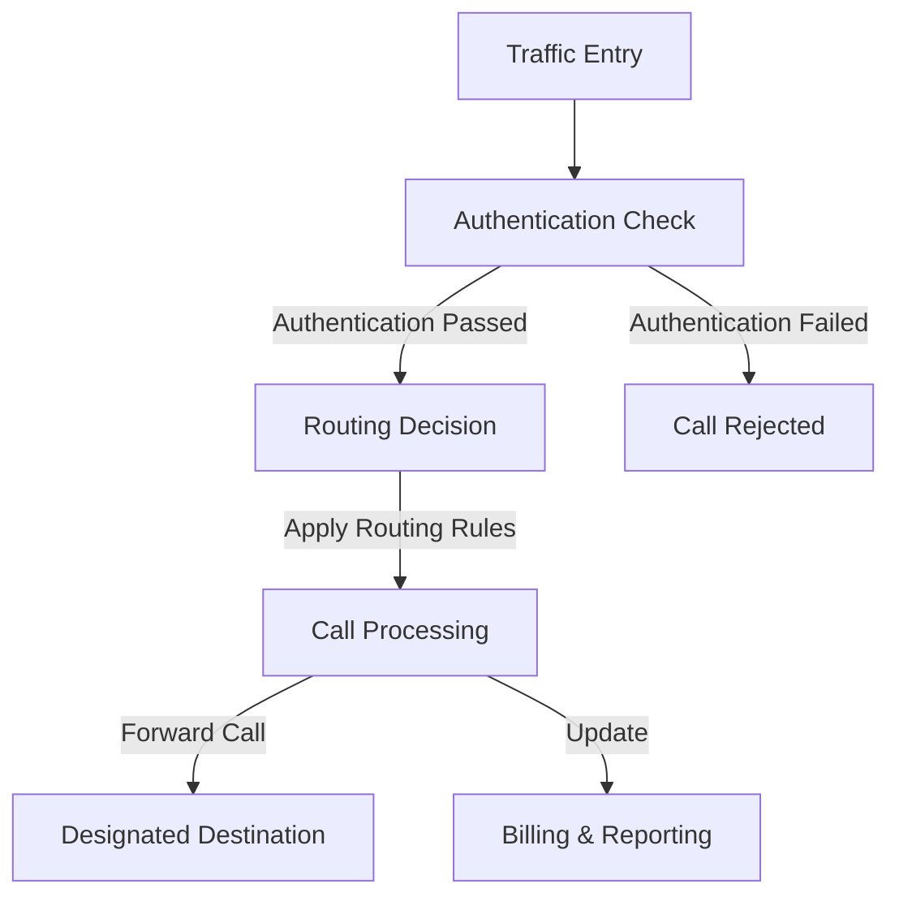
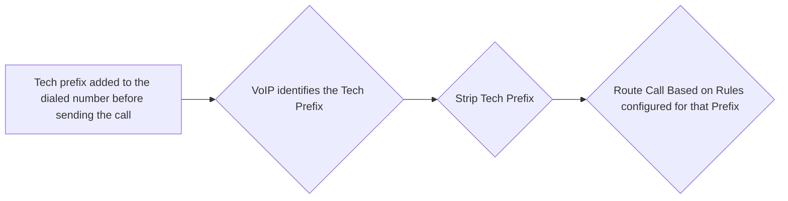
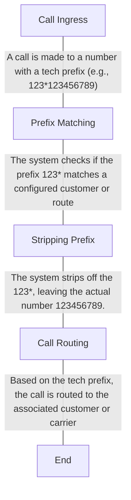

# Ingress Routing

**Management :material-menu-right: Customer :material-menu-right: [Customer Name] :material-menu-right: Routing**

## Overview

Ingress Routing in ConnexCS is a crucial component for managing and authenticating inbound traffic efficiently.

 It enables customers to define how incoming calls are handled based on various authentication methods and routing rules.

 By leveraging Ingress Routing, customers can ensure efficient, secure, and customized handling of inbound call traffic, optimizing their overall VoIP operations.

### Key Features and Benefits

+ **Customizable and Enhanced Routing Rules**: Users can define rules based on different parameters such as source IP, username, and number prefixes.

+ **Enhanced Security**: Ensures only authenticated traffic is allowed, preventing unauthorized access.

+ **Efficient Traffic Handling**: Optimizes call routing for seamless operations.

+ **Operational Efficiency**: Reduces manual intervention with automated routing.

+ **Scalability**: Supports high-volume traffic with optimized performance.

!!! question "How it works?"
    **Ingress Routing** is the process that allocates an incoming call (dialed by our customers) based on the assigned Customer Rate Card, which then Egresses the call to a specified provider. This makes it possible to deploy several rate cards both with and without a prefix.
    First, it checks the longest prefix, then it checks the shortest prefix for a match. If no prefix gets matched, it matches the rate cards with mutually exclusive destinations. If there are several rate cards with the same prefix, you must set up a dial plan with a Tech Prefix to identify the correct card.
    ```mermaid
    graph TD
    A[Incoming Call from Customer] --> B{Check Longest Prefix Match}
    B -->|Yes| C[Longest Prefix Matched] --> D[Egress Call to Specified Provider]
    B -->|No| E[No Longest Prefix Match] --> F{Check Shortest Prefix}
    F -->|Yes| G[Shortest Prefix Matched] --> D
    F -->|No| H[No Shortest Prefix Match] --> I{Check Mutually Exclusive Destinations}
    I -->|Yes| J[Mutually Exclusive Destination Matched] --> D
    I -->|No| K[Multiple Rate Cards with Same Prefix] --> L[Set Up Dial Plan with Tech Prefix] --> M[Identify Correct Rate Card] --> D

    %% Adding notes as separate nodes instead of inline
    N1[Check for longest prefix match in Customer Rate Card] -->|Note| B
    N2[If no longest prefix, check for shortest prefix match] -->|Note| F
    N3[If no prefix match, check for mutually exclusive destinations] -->|Note| I
    N4[If multiple rate cards have the same prefix, use Tech Prefix] -->|Note| K

    %% Styling nodes
    classDef highlight fill:#f9f,stroke:#333,stroke-width:2px;
    class A,B,C,D,E,F,G,H,I,J,K,L,M highlight;
    ```

### Ingress Routing Process

1. **Traffic Entry**: Incoming call traffic enters ConnexCS
2. **Authentication Check**:
      1. The system verifies the call based on the defined authentication method.
      2. If authentication fails, the call is rejected.
3. **Routing Decision**:
      1. Calls are routed based on predefined rules.
      2. Parameters such as prefixes, customer preferences, and load balancing may influence routing decisions.

4.  **Call Processing**:
    1.  Successfully authenticated calls proceed to the designated destination.
    2.  Billing and reporting data are updated accordingly.



!!! info "Routing Templates and more"
    Create templates for customer routing in [**Routing Global**](https://docs.connexcs.com/global-routing/).

    For more information on Routing, see [**Routing Setup**](https://docs.connexcs.com/video-guide/#routing-setup) in our Video Guides for a detailed walk-through. 
    
    You can find additional documentation in the [**Routing Overview**](https://docs.connexcs.com/routing/) and [**Routing Strategy**](https://docs.connexcs.com/routing-strategy/) sections.

## Configure Routing

View and configure existing routes on the Routing tab in the Customer card. To create a new route, click `+` in **Ingress Routing**.

   ![alt text][ingress-routing]

### Basic

+ **Rate Card**: Also known as Tariff, this allows you to select the rate card used on a customer's account. You can handle these calls in the following three ways:

    + **Internal**: Send a call to the ConnexCS Class5 (Voice Mail, Interactive Voice Response (IVR), etc.). If selected, the "Auto" option becomes available, which will generate dial strings from all possible internal extensions.
    + **Extension**: (uses SIP users in Customer :material-menu-right: Auth configured SIP Users) Send a call to a Session Initiation Protocol (SIP) Authenticated user on the account.
    + **Customer IP**: (uses IPs in Customer :material-menu-right: Authconfigured IPs) Send a call from an agent back to the customer's Private Branch eXchange (PBX), using either the Tech Prefix (e.g.: #9) or a Dial String (e.g.: `^[0-9](4)$`).
    + **To Carriers**: Choose a carrier to send the call to a location outside of the ConnexCS system.

+ **Tech Prefix**: This lets you distinguish a route from an inbound party.
  When several customers share the same IP address, each customer needs an individual Tech Prefix so the switch can route calls correctly.
  It enables service providers to differentiate between several rate cards.
+ **Dial String Prefix Set**: Helpful for commonly used sets of prefixes. Rather than entering a complete list of prefixes for the UK, for example, you can create a predefined Prefix Set (defined under **Setup :material-menu-right: Advanced :material-menu-right:** [**Prefix Set**](/setup/advanced/prefix-set/)) and then select it here for appropriate customers.
+ **Dial String**: Only allows a dialled number to pass through if it matches the defined dial string (or "dial pattern"). (If you customer enters nothing, it matches everything and attempts to send all calls).
  
  This doesn't work if you have more than one Rate Card as the system won't know which one to use).
  Each prefix gets listed once per line, it allows both prefixes and regular expressions:

  **Prefix**
  ```441 442```

  **Regular Expression (RegEx)**
  ```^44(1|2)```

  **Combination (UK Landline & Canada)**
  ```441 442 ^1(204|226|236|249|250|289|306|343|403|416|418|438|450|506|514|519|579|581|587|604|613|647|705|709|778|780|807|819|867|902|905)```

!!! warning "Using Rate Cards for multiple countries"
    Ingress Routing isn't independently aware of the card type you are using or,  more specifically, the appropriate dial strings it needs to send.
    For example, if you are using both UK and US cards, you need to enter appropriate dial strings in the routes you set up for each card type.

+ **Enabled**: You can enable and [disable](https://docs.connexcs.com/customer/routing/#disabled-routes) the routes here.

### Price Limits

+ **Capped Rate** and **Provider Capped Rate**: Set the maximum cost of a call. Calls that exceed the set rate won't get connected.
  **For example**, for customers with flat rate accounts, which allows to dial all UK numbers but premium numbers, you would set the Provider Capped Rate at 0.01, so any call that the provider might charge over that amount wouldn't get completed.

+ **Profit Assurance**: When `Enabled`, only calls that are profitable pass-through; any call that costs more than the retail rate aren't allowed to complete. This is particularly useful for A-Z routes or NPA-NXX [rate cards](https://docs.connexcs.com/rate-card-building/).
  Keep in mind that enabling it adds an extra Post-dial delay (PDD) to the call.

+ **Block Connect Cost**: Block any call that has a connection fee.

+ **FTC DNC Report ANI Block (USA)**: When `Enabled`, ConnexCS will take a copy of FTC data (using the [FCC's **Do Not Call (DNC) Reported Calls Data API**](https://www.ftc.gov/developer/api/v0/endpoints/do-not-call-dnc-reported-calls-data-api)) and add it to the system. We can then block callers from known spammer CLI / ANI's.

+ **DNO**: [Click here](https://docs.connexcs.com/dnc/#do-not-originate-dno-list-blocking) to know more about it.

+ **Stir Shaken Min Attest**: It enables the selection of STIR/SHAKEN attestation levels for validating incoming calls. Users can configure the system to permit only calls that meet specific attestation standards. The available validation levels are as follows:
    + **A**: Permits only calls with attestation level A, the highest level of trust. Calls with attestation levels B or C will be blocked.
    + **A + B**: Restricts incoming calls to only those with attestation levels A or B. Calls with attestation level C will be blocked.
    + **A + B + C**: Allows calls with any attestation level (A, B, or C) to pass through.

!!! Note
    In all cases, calls without attestation will also be blocked.  

### Capacity Limits

+ **Channels**: Set the maximum number of channels/live calls allowed for this route.

+ **Max Duration**: Set the maximum amount of time (in seconds) that the call gets to exist before getting terminated, typically for the case of a missed `BYE`.

!!! info "Call Timeouts"
    A VoIP call is stateful, even though its protocol is stateless. This means that both the sides should be informed on finishing of the call. They do this with a BYE message. If the BYE message goes missing, the call will continue forever.

    **Max Duration** is a method for setting up **Missing BYE Protection**. Another approach is to use a **SIP Ping** to determine when the connection has timed out. This sends a SIP packet to the remote end of the conversation every 30 seconds. This checks to see if the other side is still aware of an ongoing conversation. If it does'nt receive a response or informed that the conversation is not active, it disconnects the call.
    
    **RTP Time-out:** This is another way to check for an active call based on whether audio is passing. If there is no audio passing for a pre-set interval, our Real-time Transport Protocol (RTP) array will notify the switch and instruct it to end the call. This won't work if RTP Mode is set to direct.

!!! warning "Asterisk pings"
    Asterisk doesn't have SIP Ping (OPTIONS) enabled by default. If your customer / carrier is using Asterisk, you may need to disable this if they don't have it enabled on their side, as calls will typically disconnect after 30 seconds.

+ **Flow Speed (CPS)**: Limits the calls per second. You should set this for each customer card assigned to the customer account.

+ **CPS Spike Buffer**: Limit a spike of calls by spreading them over a longer period of time. This essentially manages a large volume of calls over a short period of time.
  Once the buffer limit reaches its threshold, the calls per second kicks in, distributing the spike of calls.

!!! note "CPS Buffering"
    **CPS Buffering**: Used to manage large volumes of calls over a short period of time. This process maximises saturation and increases call completion within a given CPS restriction. It does this by removing spikes and borrowing capacity from future seconds.

    If incoming traffic exceeds your pre-set CPS, it holds the call for one second and then tries again. You can increase the second count in the CPS Spike Buffer field. 
    
    Changing the CPS Buffering value only affects calls that exceed the CPS. The delay will show as increased PDD on the call, each second the system will emit a 100 Trying (High CPS, Buffering) response to show the status/progress of the call.

+ **ASR Plus** assists capacity management by helping you define how to handle connections for known failed numbers. For information on the ASR Plus options, see [**ASR Plus Details**](https://docs.connexcs.com/customer/routing/#asr-answer-seizure-ratio-plus-details) below.

+ **Balance Disconnect** this feature checks the balance every 60 seconds. It will disconnect the call when the **balance plus the debit limit** is below $0.

!!! note
    Balance Disconnect only takes into account the **completed calls**; it excludes any **active calls**.

### ScriptForge

+ **ScriptForge**: Set a custom JavaScript to run from within the ConnexCS platform in-line with the call. Some example operations could be checking a Do Not Call list or forcing a CLI.
  It allows running JavaScript scripts inline with call processing, enabling real-time modifications and checks.

  For more information about setup and operation, see the [**ScriptForge**](https://docs.connexcs.com/developers/scriptforge/) page.

#### Key Features and Benefits

+ **Custom Call Handling**: Modify CLI, check block lists, enforce specific caller IDs, or track call frequencies.
+ **Integration with Data Storage**: Uses TOML for configuration and variable storage.
+ **Carrier-Level Routing Controls**: Includes include (whitelist) and exclude (blacklist) carrier options.
+ **Timeout Settings**: Defines the duration a script is allowed to run before termination.
+ **Timeout**: Set how long the script may run.
+ **Timeout Action**: This option lets you decide the action when the timeout occurs.
+ **VARS [(TOML)](https://en.wikipedia.org/wiki/TOML)**: Select the variables you want pass into the ScriptForge script.

### Locks

Used for troubleshooting, you can remove carriers from a route and run a quick test.

The Lock feature allows administrators to define routing restrictions by specifying allowed or excluded carriers.

!!! Info "Benefits"
    1. Improves call reliability by dynamically managing carrier performance.
    2. Prevents routing issues from affecting end-user experience.

+ **Lock** (Allow): One or more rate cards from the list of available providers. Ensures calls are only routed through specified carriers. Blocks specific carriers from being used.
+ **Exclude** (Deny): Exclude access to one or more rate cards in the list of available providers.
+ **Redial Max Count**: This a smart limitation feature that allows the carrier to restrict the maximum number of times their customers can redial. After reaching this limit, customers must wait for a certain amount of time defined by the **Redial Max Period**. For example, you select 5 for this field, it means your customer can dial only 5 times.
+ **Redial Max Period**: It refers to the duration of time during which a customer is restricted from making further redial attempts to the same number after reaching the maximum redial count.
+ **DNC (Do Not Call) List**: The customer won't be able to able to dial the numbers in the specified DNC list. You can add the list of numbers in the [**Database**](https://docs.connexcs.com/developers/database/).

    Apart from your own DNC list you can also choose [**United States Federal DNC**](https://www.donotcall.gov/). Choosing not to accept telemarketing calls is possible because of the National Do Not Call Registry.

+ **Block Destination Type**: You can select and block the calls to various destinations (carriers) like Mobile, Fixed, Paging, etc.

+ **Spam Scout Scoring**: It blocks Spam calls based on the CLIs.
  You can either Block All, Allow All, Block Most Spam, or Block Least Spam.

!!! tip "Exclude Use Case"
    If a customer reports an issue with a carrier or route, you can come here and set the carrier / route to Exclude and **`Save`**, then come back and remove it, and do a **`Delay and Save`** for a later date.

!!! Example "Example: Redial Max Count and Redial Max Period"
    For example, if you have set Redial Max Count (maximum redials in a given time period) as 4 and Redial Max Period as 24 hours for your customer, then your customer can **resume redialling after 24 hours after the last call "starts"/last call was placed**.
    For instance, 4 Redials in 24 hours (Time starts from 9:00 AM)

    |Redial number  |Time    |
    |---------------|--------|
    |Redial number 1|10:00 AM|
    |Redial number 2|01:00 PM|
    |Redial number 3|04:00 PM|
    |Redial number 4|08:00 PM|

    The last(4<sup>th</sup> call) redial call was placed at 08:00 PM, so the customer can start redialing at 08:00 PM the next day.

 **IP Quality Score (IPQS)**: It blocks spam calls based on CLIs. It won't allow the CLIs of having a specific spam score that you've selected to pass through the system. For more information on IPQS, [click here](https://www.ipqualityscore.com/).

!!! Warning
    The **IPQS** feature requires a paid subscription. To enable this feature navigate to **Setup :material-menu-right: Settings :material-menu-right: Account** and enable this feature.

    The **cost** for a single lookup is **$0.0040**.

 You can set a **Max Daily Quantity** for your customer's lookups. This restricts them to using only the specific number you allocate, ensuring controlled usage.

!!! Note "We don't charge you again if you repeat your lookup within 24-hours of time-span."

**Flags**:

  + **TCPA  Litigator DNC**: Enabling this flag blocks outbound calls to known TCPA Litigators.

  + **On Net Call Routing**: Enabling this flag determines if a call should be routed internally  between customers to DID's.

    !!! Info "Call Routing Process"
        ```mermaid
        graph LR
        A[Customer A makes a call using the route with the ON NET CALLING flag] --> B{Syatem checks the dialed number and compares it against DIDs added to the account across all customers}
        B -- Yes: If the dialed number matches any DID in the account--> C{Route call internally to the matching DID}
        B -- No: If the dialed number doesnt match any DID in the account--> D{Route call externally via carrier as configured}
        ```

!!! Note "Enabling TCPA  Litigator DNC flag and On Net Call Routing flag"
    1. **Navigate to Management :material-menu-right: Customer :material-menu-right: [Customer Name] :material-menu-right: Routing :material-menu-right: Locks :material-menu-right: TCPA  Litigator DNC/On Net Call Routing**.
    2. Click on the checkbox to enable the required flags.
    3. Click on `Save`.
    

### Media

**Transcoding**: Transcoding manages different audio codecs to ensure compatibility between the calling and receiving systems.

Enter the number  of channels allowed for transcoding. This is a limited option. The best use case is for customers in low-bandwidth areas that want to use G.729.

!!! Danger "Be aware that if you don't have enough transcoding capacity, calls will fail."

!!! Info "Key Features and Benefits"
    **Key Features**:
       
       1. **Supported Codecs**:
          
          1. **G.711**: uncompressed, high-quality, available in ULaw & ALaw.
          
          2. **G.729**: Compressed, Bandwidth-efficient.
          
          3. **G.722, G.723** (Wideband codecs) for better sound quality.
          
          4. **Opus, Speex**: WebRTC-compatible codecs.
       
       2. **Transcoding Channels**: Limits the number of simultaneous transcoding operations.
       
       3. **Performance Considerations**: Transcoding is resource-intensive; default limits ensure scalability.

    **Benefits**:
       
       1. Enables seamless communication between different network endpoints.
       
       2. Optimizes bandwidth usage for high-quality VoIP calls.

+ **SIP Ping**: SIP Ping ensures call stability by periodically verifying call connection status.
  Send regular pings to ensure both sides of a call are still up. `Enabled` is the recommended setting.

!!! Info "Key Features and Benefits"
    **Key Features**:

    1. **Upstream & Downstream Ping**:
       
       1. **Upstream**: Verifies connection to the receiving carrier.
       
       2. **Downstream**: Checks connection from the caller's side.
    
    2. **Prevention of Long-Duration Calls (LDCs)**: Automatically disconnects calls where endpoints fail to signal disconnection.
    
    3. **Customizable Intervals**: Default interval of 30 seconds for continuous monitoring.

    **Benefits**:
       
       1. Prevents ghost calls.
       
       2. Ensures real-time call session awareness.

|Option| Result|
|------|:------|
|**Disabled**| No SIP pings will be sent |
|**Enabled Both Sides**| SIP pings sent in both directions |
|**Enabled (Downstream Only)**| SIP Pings sent to the location where the call originated |
|**Enabled (Upstream Only)**| SIP Pings sent towards where the call is TO (terminated) |

+ **SIP Session Timer (SST)**: SST is Passive by Default, but **Enabled** is the recommended setting.
  When enabled, SST ensures there is no ghost or long-duration calls get billed when one or both sides have hung up. A timer activates when the call starts and refreshes the call every X number of seconds by sending a RE-INVITE.
  SST has surpassed SIP Ping Timeout as the best way to prevent long-duration calls. Note that any SST shorter than sixty (60) seconds gets rejected.

  Session Timers periodically revalidate call sessions to ensure continued connectivity.

!!! Info "Key Features and Benefits"
    **Key Features**:

      * **Re-INVITE Mechanism**: Sends a re-invite message every 5 minutes to refresh session state.
      
      * **Selective Activation**:
      
        * Can be enabled for upstream, downstream, or both directions.
      
        * Only relevant at call-originating and terminating endpoints.
    
    * **Timer Management**:
    
        * **Suggest Timer**: Encourages the use of timers with an additional session expiration header.
    
        * **Remove Timer**: Strips out the timer header for compatibility with non-compliant carriers.

    **Benefits**:
    
    1. Reduces call drops due to session timeouts.

    2. Ensures carriers properly manage long-duration calls.

|SST Option| Result|
|----------|:------|
| **Default**| Passive SST, No headers gets changed and no SST gets engaged, all RE-INVITES will propagate through the system enables|
| **Enabled Both** | ConnexCS will send SIP Session Timers to both legs of the call|
| **Enabled (Upstream)** | ConnexCS will use SST with the carrier|
| **Enabled (Downstream)**| ConnexCS will use SST with the customer|
| **Suggest**| Session-Expire headers and Min-SE gets added to packets sent to the carrier encouraging the use of SST|
| **Disabled**| All ```timer``` headers are removed|

+ **RTP Media Proxy**: This defaults to Auto, but selecting a zone (by continent) is the current recommendation. The following options allow you to set where RTP media server for this route for this customer:

!!! Info "Functionality and Benefits"
    **Functionality**:

      + Ensures media flows through the most efficient route.
      
      + Reduces audio latency by keeping media within the same geographical region as the customer and carrier.

    **Benefits**:
        
    + Minimizes delay in audio transmission.
    + Enhances call quality by reducing packet loss.
    + Prevents "hello-hello" delays and interruptions.

   :material-menu-right: `Direct RTP (no proxy)`- Bypass ConnexCS, so media flows directly between the customer and carrier. If the customer is using a firewall or other NAT device incorrectly, then media may not flow between the carrier and the customer. Using this setting also means that if there are audio issues, the issue can't be ConnexCS. Since it isn't likely to be the carrier, the issue would typically exist on the customer's end.

!!! Warning "Disadvantages & Risks"
    1. **Leaks Carrier Information**: Direct RTP reveals the carrier’s SDP address.
    2. **Risk of Disintermediation**: Customers can bypass ConnexCS and deal with carriers directly.
    3. **NAT Issues**:
        + Incorrect SIP address rewriting can cause one-way audio.
        + If foreign NAT traversal is needed, ConnexCS cannot assist in media correction.
  
!!! Tip "Best Practice"
    1. Always inform customers about the risks associated with Direct RTP.
    2. Recommend using RTP Proxy when confidentiality and NAT traversal support are needed.

   :material-menu-right: `Zone`- Choose any of the regional servers, but it's recommended that you select a location close to a provider or your customer. Temporarily selecting a different region to route media traffic can be helpful in diagnosing call problems.

!!! tip "The recommended RTP Media Proxy servers are the **Closest (To ConnexCS) Server** or the **Closest (Elastic) Server**."

!!! warning
    **SIP Ping** and **SIP Session Timers** can't be enabled at the same time.

+ **RTP Proxy Mode**: Routes media optimally while keeping signaling intact.
If a connection via our service fails and you have selected relaxed, it will automatically fail over to the backup.

   :material-menu-right: `Strict`- This will enforce the proxy engagement. If the proxy can't engage with the call, the call won't get established. If a selected proxy server fails, the call is dropped.

!!! note "Free accounts are limited to how many RTP Proxy channels get enabled, this may prevent calls from connecting if you have more channels than our free accounts allow you to have."

   :material-menu-right: `Relaxed`- This will make the best efforts to engage the RTP Proxy; if it can't get engaged because of either network errors, or because you don't have enough RTP capacity, the calls will connect directly. •	If the selected proxy server fails, the call is routed directly to the carrier.

!!! success "When should I use RTP Proxy?"
    Use an RTP Proxy if you don't want your customers to know your providers.

!!! warning "When should I avoid using an RTP Proxy?"
    You have other equipment in your SIP set-up that will act as a Media Relay or you want to run a test to see if audio problems are related to the ConnexCS switch.

!!! info "RTP Proxy distinctions"
    When a call gets established between the customer and the provider, audio can be setup in one of two ways:
|              |**With RTP Proxy**|**Without RTP Proxy**|
|--------------|:------------------:|----------------------:|
|**Audio Path**|Indirect|Direct|
|**Audio Quality**|Excellent|Unbeatable |
|**Latency**|Low|Lowest|
|**Information Leakage**|No|Yes*|

*While it's doubtful that any information will get logged in the customer / providers switch when the audio gets engaged, it's possible for an engineer to learn this information from a SIP trace, PCAP, or by looking at transit locations. DTMF Detection ONLY works when RTP Proxy mode gets enabled.

!!! info "Private RTP Server"
    We provide deployment of the Private RTP Server (Media) to our customers, which is liable to some cost.
    You may be able to add Private RTP Servers to the following fields:

    + [Management :material-menu-right: Customer :material-menu-right: Routing :material-menu-right: Customer [Name] :material-menu-right: Media](https://docs.connexcs.com/customer/routing/#media)
  
    + [Management :material-menu-right: Tags :material-menu-right: Routing :material-menu-right: Customer [Name] :material-menu-right: Media](https://docs.connexcs.com/customer/tags/)
    
    + [Global :material-menu-right: Routing :material-menu-right: Routing](https://docs.connexcs.com/global-routing/)
    
    + [Management :material-menu-right: Customer :material-menu-right: Routing :material-menu-right: Customer [Name] :material-menu-right: DID (Edit DID `+`) :material-menu-right: Media](https://docs.connexcs.com/customer/did/#media)
    
    + [Global :material-menu-right: DID (Edit DID `+`) :material-menu-right: Media](https://docs.connexcs.com/global/#direct-inward-dial)
    
    + [Management :material-menu-right: Rate Card :material-menu-right: Provider Rate Card :material-menu-right: Add Provider Rate Card `+` :material-menu-right: Advanced :material-menu-right: Default RTP](https://docs.connexcs.com/provider-ratecard/#advanced)
    
    + [Management :material-menu-right: Rate Card :material-menu-right: Customer Rate Card :material-menu-right: Add Customer Rate Card `+` :material-menu-right: Advanced :material-menu-right: Default RTP](https://docs.connexcs.com/customer-ratecard/#advanced)

+ **Call Recording**: This allows you to record and store calls, which are then found in:

* **Logging**
* **Management:material-menu-right: Customer :material-menu-right: [Customer Name] :material-menu-right: CDR**
* **Management :material-menu-right: File :material-menu-right: Recording**
  
!!! Note "Additional Charge"
    An extra charge per recorded call of $0.003 gets added to existing fees or charges, so choose carefully how many calls to record:

:material-menu-right: `Disabled`- no calls get recorded.

:material-menu-right: `Sampling`- Choose from a 1%, 5%, 25%, or 50% sample of your calls (e.g: 1% will record 1 of every 100 calls, 25% will record 25 of every 100 calls, etc.).

:material-menu-right: `Enabled (Always On)`- Record all calls.

!!! tip "The Call Recording setting is disabled"
    You need to enable the feature first on the account in **Setup :material-menu-right: Settings :material-menu-right: [Packages](https://docs.connexcs.com/setup/settings/account/#packages)** before it gets enabled here for individual customers.

+ **Block DTMF:** This option allows you to either `pass` or `block` DTMF through your calls.

!!! note "Make sure your carrier supports the DTMF feature."

+ **RTP Codec**: This fields allows you to have more specific control over the Codecs you choose for your system. After the selection you can assign various **Permissions** to the Codecs you select.

    + **Types of Permissions include**:
        + **Except**: This permission allows you to block all the codecs apart from the ones in the Whitelist. Codecs that weren't included in the carrier's initial codec list won't be taken into consideration.
        +  **Offer**: Offer also blocks the codecs apart from the ones in the whitelist and provides flexibility to change the order of the codecs in the list as well. Thus, the first codec in the list is treated as the primary codec (at the output) even if it was the last codec in the list.
        +  **Consume**: Identical to mask but enables the transcoding engine even if no other transcoding related options are given.
        +  **Transcode**: Allows the addition of codecs in the offered codec list even if the codecs weren't included in the original list of codecs. Here, transcoding engine will be engaged meaning  behind-the-scenes translation process is happening to ensure communication.<br> You can only add those codecs which are supported by your device for both encoding and decoding process. <br>One limitation of using this option is that it will strip-off all the unsupported codecs. Note that using this option doesn't necessarily always engage the transcoding engine. If all codecs given in the transcode list were present in the original list of offered codecs, then no transcoding will be done.<br> When you use this permission it enables you to mark/modify the Ptime.
        +  **Strip**: This permission allows you to remove the selected codecs or RTP Payload types from the SDP. Codecs removed using this option behaves as if they never existed in the SDP.
  
        |Strip|Transcode|Explanation|
        |-----|---------|-----------|
        |G729A|Opus|G729A is unavailable for transcoding|

        +  **Mask**: This option allows you to filter-out the selected codec from the output. Mask works well in combination with **Transcode** option. For example,

        |Input/Offering side|Mask|Transcode|Output/Outgoing Offer|Explanation|
        |-------------------|-----|---------|--------------------|-----------|
        |G729A|G729A|Opus|Opus|Transcoding happens between G729A and Opus but output is Opus, G729A is filtered out from outgoing offer|
        |G729A||Opus|G729A and Opus| Transcoding happens between G729A and Opus but outputs are both Opus and G729A since G729A wasn't filtered out|

         + **Accept**: This option is similar to **Strip** and **Mask** but it isn't removed from the codecs offered list. When you select this option, the selected codec is offered to the remote peer (output/outgoing offer), if the remote peer rejects the offered (incoming) codec it will be used for transcoding and is accepted by the input/offering side.
        In short, Accept permission allows your device to use codecs offered by the remote peer even if they weren't your initial choice.

        |Input/Offering side|Accept|Transcode|Output/Outgoing Offer|Explanation|
        |-------------------|------|---------|---------------------|-----------|
        |G729A|G729A|Opus|Reject|Transcoding still happens between G729A and Opus|

    + **Ptime(ms)**: This value determines the length of time each box (RTP packet) can hold. A higher ptime means each packet carries a longer chunk of audio/video data (bigger box), while a lower ptime means shorter chunks (smaller boxes).

### Strategy

For advanced routing, click :material-plus: to select a [**Prefix Set**](https://docs.connexcs.com/setup/advanced/prefix-set/) and assign a [**Routing Strategy**](https://docs.connexcs.com/routing-strategy/). This gives you greater control over how routes get selected for a given customer.

### Notes

+ **Public Notes**: Notes entered here get displayed on the Customer Portal when logged in.
+ **Private Notes**: These will get displayed to the customer in the Control Panel.

### Fraud

+ **Fraud Profile**: Apply one of the Fraud Profiles configured under **Setup :material-menu-right: Advanced :material-menu-right: [Fraud Profile](https://docs.connexcs.com/setup/advanced/fraud/#setup-fraud-detection)**.
+ **Fraud Mode**: Specify how the profile will gets into application, this is dependent on the [**Fraud Mode Thresholds**](https://docs.connexcs.com/setup/advanced/fraud/#fraud-mode) configured in the Profile.

    :material-menu-right: `Disabled`

    :material-menu-right: `Low - Alert or Block Calls`

    :material-menu-right: `High - Block Calls or Account`

## Disabled Routes

Routes highlighted in red on the customer Routing page gets disabled. Open the route, click **Enabled**, and then **`Save`** to enable them

&emsp; ![alt text][routing-disabled]

## Tech Prefix

**1. What is Tech Prefix?**
   
A Tech Prefix is a string of numbers, added to the dialed number (DNIS) before sending the call.

**2. Purpose of Tech Prefix:**

   + **Customer Identification**: It allows routing calls for different customers using the same inbound IP by specifying which customer the call belongs to.
   + **Routing Control**: It can be used to direct calls to specific routes or carriers depending on the prefix.

**3. How it Works?**



**Example Workflow**



**4. Advantages**

+ Flexibility in routing calls to different customers using a shared IP or trunk.

### Use Case for the Tech Prefix

Using Tech Prefix with SIP User "Parameter Rewrites" allows for significant granularity to manage permissions for how to connect a user's calls.

1. Use Parameter Rewrite on the SIP User (found in **Customer :material-menu-right: Auth :material-menu-right: SIP User :material-menu-right: Parameter Rewrite**) to add a number for calls from this SIP User:

    

2. Add a Tech Prefix for that user in Routing. In this example, it would be 1234.
3. Set how you want those calls routed: Internal to Class5, out to a provider, etc.

!!! Example
    ```mermaid
    graph
    A[Incoming Call with 001*123456789] -- Call will be routed to Customer A --- B[Customer A Prefix: 001]
    subgraph Customers
    B[Customer A Prefix: 001] & C[Customer B Prefix: 002]
    end
    B[Customer A Prefix: 001]-- Prefix 001* will be stripped  before passing the call to the destination number 123456789 --- Destination
    ```

## Answer Seizure Ratio Plus Details

ASR (Answer Seizure Ratio) is the number of connected calls divided by the total number of calls (represented as a %).

**ASR Plus** is a proprietary ConnexCS technology that filters known failed, non-existent / working numbers between the customer and the terminating, or destination, carrier.

It's useful with larger call volumes.

Unless it's turned off or customized otherwise, ASR+ is active for 90% of calls, which grants the opportunity for the database replenishment.

It enhances call routing by tracking the validity of dialed numbers over a 30-day period. It improves efficiency by blocking known invalid numbers and allowing successful calls to proceed.

### Key Features

1. **Call History Tracking**: The system remembers if a number was successfully connected or failed in the last 30 days
2. **Automated Call Blocking**:
      + If a number failed previously with a 404 error, it is automatically blocked for future attempts.
      + If a number has never been seen, it is allowed through.
      + If a number is connected successfully, it continues to be allowed.

3. **Customizable Configurations**: Users can tweak settings to define how ASR+ handles call failures and successes.
4. **Carrier Load Optimization**: Reduces unnecessary call attempts, preventing high call-per-second rates to invalid numbers.

| Value| Description|
|-----|-------------|
|**Off** |ASR+ Disabled|
|**ASR+ (Low)**|Active on 30% of calls|
|**ASR+**|Active|
|**ASR?**|When ASR+ gets enabled on the provider card|
|**ASR+?**|When ASR+ gets enabled on the provider card, only known connected calls pass-through specific providers|
|**ASR++**|Only known connected calls pass-through (not used frequently because it's typically overly strict)|

!!! success "Advantages of ASR"
    + Prevents excessive failed call attempts from impacting service quality.
    + Reduces response time for your customers.
    + Improves the ASR of the traffic that your upstream carrier sees.
    + Highly effective for call centre traffic.
    + Enhances call completion rates.
    + Reduces wasted carrier resources and associated costs.

!!! failure "Disadvantages of ASR"
    + Marginal impact on your NER due to false positive matches. This is usually kept within tolerances of < 0.1%.
    + Doesn't offer improvements for all destinations.

[ingress-routing]: /customer/img/ingress-routing.png "Ingress Routing"
[routing-disabled]: /customer/img/routing-disabled.png "Disabled Routing"
[techprefix-usecase]: /customer/img/techprefix-usecase.png "Tech Prefix Use Case"
