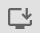

# Dashboard

 
<strong>Document Metadata</strong>
  

<strong>Category</strong>: Dashboard & Monitoring 
<strong>Audience</strong>: Administrators, Engineers, Support Team 
<strong>Difficulty</strong>: Beginner to Intermediate 
<strong>Time Required</strong>: Approximately 30–45 minutes 
<strong>Prerequisites</strong>: Active ConnexCS Platform account with access to the Customer Portal 
<strong>Related Topics</strong>: <a href="https://docs.connexcs.com/customer-portal/cp-dashboard/">Customer Portal Overview</a>, <a href="https://docs.connexcs.com/logging/">Logging & Call Trace</a>, <a href="https://docs.connexcs.com/report/">Analytics & Reporting</a> 
<strong>Next Steps</strong>: <a href="https://docs.connexcs.com/customer/alerts/">Configuring Alerts & Balance Notifications</a>, <a href="https://docs.connexcs.com/customer/stats/">Detailed Call Stats</a>, <a href="https://docs.connexcs.com/customer/cdr/">CDR Export</a> 

The ConnexCS **Dashboard** provides a real-time overview of active customers, channels, and key system metrics. It includes interactive elements for monitoring traffic, analyzing trends, and customizing data displays.

## Overview

+ Displays a summary of Live Channels, Active Customers, Carriers, and Rate Cards.

+ Quick access to essential functions.

+ For detailed account activities, use the **Menu** System on the left.

### Channels

Table view of active channels for **Customers**, **Carriers** and **DIDs** sorted by Channels in Use (highest and lowest).

### Live Channels

Displays the number of active channels in real time through a **Graph**.

### Graphs

With this new feature, you can view parameters:

+ **Channels** (historical data).
+ **CPS** (calls per second).
+ **Customer/Provider Spend**
+ **Profit** (daily stats on profit and loss, good for analysis).
+ **Registration Count** (currently registered end-points).

!!! Note "**This information is available for 7 days**"

=== "Channels"

    

=== "CPS"

    

=== "Customer/Provider Spend"

    

=== "Profit"

    

=== "Registration Count"

    

## Customization

+ Fully Customizable using [Custom Pages](https://bani-ankmeg--connexcs-docs.netlify.app/setup/settings/options/)

+ Users can modify and integrate analytics into the dashboard.

+ New reports and insights can be pushed dynamically.

This structured dashboard guide ensures customers can effectively monitor system performance, analyze data, and customize their experience with ConnexCS.
!!! Info " Download Control Panel Application"
    To download our Control Panel Application. Click  on your browser while you are logged into your account and hit Install.
    

[top of page]: /misc/img/topofpage.png "Top of Page"
[dashboard]: /misc/img/dashboard.png "Dashboard"
[profit]: /misc/img/profit.png "Graph Actions"
