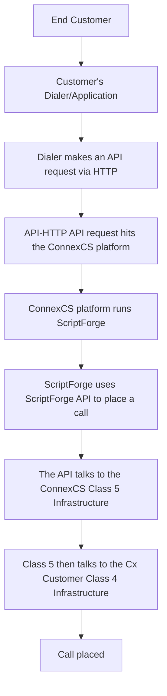

# ScriptForge

**Developer :material-menu-right: ScriptForge**

Use ConnexCS **ScriptForge** to write ECMAScript 2015 (ES6) (aka JavaScript) and execute it in a secure sandbox on the server. It's designed to have low latency and high throughput.

It's made for scripts and small applications. Any larger applications are best executed on external hardware through ScriptForge.

A fair-usage policy applies, and if there is unnecessary resource use or if there are any attempts to break the sandbox, your script may not function as expected.

It's designed to work as FaaS (Functions as a Service), and our redundant infrastructure handles your application's auto scaling needs.

## Developer Documentation

ConnexCS offers several libraries specifically for use with ConnexCS. [**Developer API Documentation is available here**](https://scriptforge-docs.connexcs.com).

### Available Modules

You can include some more modules (from npm), available for applications and drivers only.

The purpose is to keep the sandbox lightweight and include only the necessary modules:

|Modules||||
|---|---|---|---|
|**axios**|axios-cookiejar-support|card-validator|csv-parse/lib/sync|
|**data-forge**|decompress-zip|elasticemail-webapiclient|fast-csv|
|**fast-toml**|ftp|helpscout-2.0|moment|
|**rss-parser**|soap|stripe|tough-cookie|

### Sample Scripts

You can find sample scripts in our GitHub repository > [**example applications**](https://github.com/connexcs/scriptforge-examples/). Below is a list of some use cases. But with a Turing Complete language, the possibilities are endless.

* Do Not Call Lists
* Custom Fraud Detection
* Internal Automations
* Capture and process the Control Panel and Customer Portal forms
* Inbound and Outbound Call Filtering
* Class 5 Programmable Voice Applications
* DID Drivers
* Time of Day Restrictions

## Coding Basics

Scripts and Apps typically start in the `main()` function and expect to return a promise. The first parameter is typically an object called `data`.

### Throwing Errors (Class 4)

Follow the following format; [SIP code] :space: [Error Message], for throwing errors.

**For example**, to throw a 404 Not Found, you can use the following

``` js
throw new Error('404 Not Found');
```

*(**SIP:** Session Initiation Protocol, **DID:** Direct Inward Dialing)

### Class 4 Routing (Routes and Direct Inward Dial)

After the routing engine has executed its main function, the system will run the custom ScriptForge script.

This presents data as the output to the routing engine and expects the same object structure.

``` js
function main (data = {}) {
 // data.routing contains the same data you will find in the Logs
 // in the Raw Data Section
 return data;
}
```

### Class 5 Programmable Voice

You can use Programmable Voice to write smart voice applications controlled in modern JavaScript.

The call and the Programmable Voice script are both executed simultaneously, simplifying the entire process. This means that (for example) you would initially run an `await answer()`, it would not progress to the next line until the platform has finished executing the operation.

See the [**ConnexCS ScriptForge documents**](https://scriptforge-docs.connexcs.com/ctx.html) for more JavaScript examples.

Second parameter is a ctx object

``` js
function main (data = {}, ctx) {
 // ctx contains class 5 ctx object 
}
```

!!! warning "Potential Sync Issues"
    To avoid the system losing synchronisation with your script and the connection crashing, execute ALL async functions with `await`.
	If it isn't implemented correctly, it affects that billing and call stability.

### Form Submission

Used to receive data from Form Builder in ConnexCS.

You can view it in the control panel or customer portal.

``` js
function main (data = {}) {
 // data contains object containing key/value pairs from the form. 
}
```

### Driver

A driver is a module export that may contain several pre-defined functions dependent on the integration; flow is an example for a DID Driver.

``` js
module.export = {
 search: async function ({number}) {
  // Returns Array of Objects, e.g [{did:'1234'}]
 },
 allocate: async function ({did}) {
  // The information returned by this function will be passed to 
  // https://api-docs.connexcs.com/#api-Did-Create
 },
 release: async function ({did}) {
  // Returns True / False
 },
 list: async function () {
  // Returns Array of Objects, e.g [{did:'1234'}]
 }
}
```

## Configuration

### Build Script

=== "Basic"

    1. To add a script, click :material-plus:.
    2. Specify the script **Name**.
    3. Select the **Type**:
        * `Script`- This is the fastest way to execute custom code and is "synchronous" execution. This is mainly used for manipulations or calculations. It can't use libraries or work with Promises.
        * `App`- Feature rich applications which can include a preset (whitelist) of available modules, the penalty of the extra features is a slightly higher latency.
        * `Driver`- A driver works as an intermediary between ConnexCS and any external system. You can write drivers to bridge the ConnexCS DID provisioning system to a provider of your choice or build more complicated alerts.
    


    4. Click **`Save`**.
    5. Select your script from the list.
    6. Enter the code of your script.

		If script shows an error, add this and then run the script again:

  		```
  		{"routing":{}}
  		```

    7. **Global Routing Priority** means the script will run for every single call. You have 3 options to choose from:
    	* You can **disable** it if you don't want to use it.
    	* **Run first** or **Run Last** means this script will run first or after the Script Forge enabled in the Routing section.
    	* The **App** field allow you to integrate the created applications with the ScriptForge.

    8. Click the green arrow to **`Save and Run`**.

    	

    9. You can view the results onscreen.

=== "Schedule"

    The **Schedule** option allows to you run your Script Forge based on pre-determined **dates in month**, **days of a week** and you can even select the time by selecting the values of **minutes** and **hours** from the drop-down menu.

    

### Assign the Script to a Customer

1. Select **Management :material-menu-right: Customer :material-menu-right: [Customer Name] :material-menu-right: Routing**
2. Select a Rate Card from Ingress Routing.

    ![alt text][s8]  

3. Go to **ScriptForge**
4. Select the script.
5. Set the **Timeout** to specify the duration you want it to run before it times out.
6. Enter the **Timeout Action** manually and format it as **`[sip response code] [sip response message]`**.
7. Click **`Save`**.

### Assign the script to other functions

ScriptForge was initially designed to run from the routing-engine only, but it's available for the following scenarios:

**Class 4 Routing (Termination) - (App or Script)**:
Management :material-menu-right: Customer :material-menu-right: [Your Customer] :material-menu-right: Routing :material-menu-right: [Your Route] :material-menu-right: ScriptForge

**Class 4 Routing (Origination) - (App or Script)**:
Management :material-menu-right: Customer :material-menu-right: [Your Customer] :material-menu-right: DID :material-menu-right: [Your DID] :material-menu-right: ScriptForge

**Class 5 Programmable Voice - (App only)**

**Drivers - (App only)**:
Currently available for Alert & DID

## Manipulating headers from ScriptForge

This feature helps you manipulate or remove headers.

Below are some examples for removing headers for all or specific destinations.

```

function main(data) {

// Delete headers for ALL destinations
	data.remove_headers = [
		{key: 'X-Customer-ID'}
	]; 
// Delete headers for first destination
	data.egress_routing[0].remove_headers = [
		{key: 'X-Customer-ID'}
	];
// Add Headers for ALL Destinations
	data.headers = [
		{key: 'X-Customer-ID', value: '1234'}
	];
// Add Headers for first destination
	data.egress_routing[0].headers = [
		{key: 'X-Customer-ID', value: 1234}
	];
// If you want to replace a header, you must remove it, then add it.
	return data;
}
```

## Originate a Call via an API using ScriptForge

The API Dialing feature sends an API request to the ConnexCS Platform for their customer to place a call via the API.

For this feature, write an API in the ScriptForge for connecting the company to their customer via ConnexCS Platform using this API (in ScriptForge).

ScriptForge uses the `originate` feature for originating the call.

You need to include, Company ID,the Server where the call will be sent, Destination, CLI, and Extension in the script.



### Calling API Code

1. Login to your account.
2. Go to **Developer :material-menu-right: ScriptForge IDE :material-menu-right: ScriptForge**.
3. Click on the blue `+` button.
4. Enter the **Name** for the script in the **Basic Tab**.
5. You can use the **Schedule** tab to run your script.
6. Click on `Save`.
7. Click on the created script `Calling API`. 

8. Enter the below code:

```js
const apiKeys = {
'Value of the API key' : customer // apiKey, maps to the Customer SIPLink
};

async function main (data) {
	const companyID = apiKeys{data.apiKey}; // authorizing the key, maps to Customer SIPLINK (105979) UUID
	if (!companyID) throw new Error('401 Unauthorized'); // does the company exists?
	if (!data.destination) throw new Error('Missing Destination'); // does the destination exists?
	if (!data.cli) throw new Error('Missing CLI'); // does the CLI exists?
	if (!data.extension) throw new Error('Missing Extension'); // does the extension exists?
	
	var result = await originate.originate(companyID, 'enter server details the calls will be sent to', data.destination, data.cli, data.extension);
	return result;
}
```

9.Click on `Save and Run`. 
<iframe width="585 height="315" src="/developers/img/callingapi22.mp4" frameborder="0" allow="accelerometer; autoplay; encrypted-media; gyroscope; picture-in-picture" allowfullscreen></iframe>

10.You can access this feature on your **Customer Portal** using the **UUID**. We use the UUID to access ScriptForge from the customer portal URL as an API unauthenticated.
For example, your Customer Portal URL is https://api.xx.yy/api/script/**uuid** and the code will be published here.

!!! Note "How to fetch the UUID?"
	1. Login to your **Customer Portal**.
	2. Navigate to **Developer :material-menu-right: ScriptForge**.
	3. Click on your **API Calling Script**. 
	4. Press **F12** key on your keyboard.
	5. Click on **Network :material-menu-right: Preview**.
	6. Press **Control+R**.
	7. Inside the **Filter** field, search the **Script Forge ID** and you can find the associated **UUID**. 
	8. The UUID is also displayed inside the square brackets next to the **ScriptForge ID**. For example, **ScriptForge ID: xxxx [yyyyyyyy-yyyy-yyyy-yyyy-yyyyyyyyyyyyyyyy]**. Here, the **ScriptForge ID** is **xxxx** and **UUID** is **yyyyyyyy-yyyy-yyyy-yyyy-yyyyyyyyyyyyyyyy**. 
	
	<iframe width="585" height="315" src="/developers/img/uuid4.mp4" frameborder="0" allow="accelerometer; autoplay; encrypted-media; gyroscope; picture-in-picture" allowfullscreen></iframe>

!!! warning
	We're NOT building any API here.
	We're just using ScriptForge to link the internal and external platforms.

[s2]: /developers/img/176.png "s2"
[s8]: /developers/img/183.png "s8"
