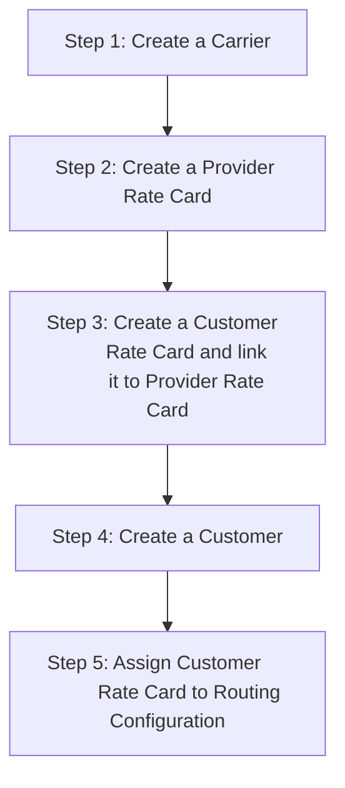

# Getting Started

Welcome to ConnexCS! Your Guide to Getting Started
We're excited to have you on board. This guide will walk you through the key features and settings you’ll need as you begin your journey with ConnexCS.

Our platform is designed to streamline your communication and billing processes, making it easier for you to manage your customers, carriers, and rate cards.

The initial setup in ConnexCS will configure a single carrier, a single customer, and a single rate card.

To get started, the initial setup in ConnexCS will configure a single carrier, a single customer, and a single rate card, providing you with a base configuration that you can expand as needed.

Whether you’re managing a few or scaling to an unlimited number of customers and recipients, ConnexCS supports seamless growth, offering flexibility and robust features to meet your business requirements.

Ready to begin? Let's walk through the steps to set up and customize your ConnexCS environment!

!!! info "Changing the UI language"
    To change the display language for the UI, click your name in the upper-right corner and select [**Change Language**](https://docs.connexcs.com/changing-language/).

!!! note "What's my server's IP Address?"
    IP addresses are deployed *after* you complete the Getting Started steps.

!!! help "Need Help?"
    If you need help, we offer free 1:1 training, which you can book at **<https://connexcs.youcanbook.me/>**.

## Prerequisites

* You have a modern web browser such as Google Chrome, Firefox, Safari, or their equivalent.
* You have a basic understanding of Telecoms--customers, providers, and rates.
* You have created an account with [ConnexCS](https://app.connexcs.com/#/register).

## Account Setup and Verification

Upon creating your account, you’ll need to complete a few key steps to ensure everything is properly set up.

Use the **Alerts** icon at the top left of the screen to view all outstanding items:

### Email Verification

You’ll receive a verification email. Click the link in the email to verify your account. ConnexCS determines if an email address is genuine.

It's a measure against unauthorized users accessing customer accounts. It works similarly to most email verification mechanisms.
The system sends a verification code to the user's email, which is verified when the user enters the code back into the verification.

To verify your email address:

1. Select `Verify Email`. The Personal Profile Screen pops up.
2. Click the orange `!` next to Email, this generates a code and sends it to the email address.
3. Click the link in the email or copy & paste the code into the Verification Code field in the Verify Email pop-up
4. Click `Verify`.

    

### Mobile Verification

**Mobile Verification** is the process by which we verify mobile phone numbers to ensure that they're genuine, and is an extension of **Email Verification**.

Mobile Verification ensures all mobile devices associated with your account are genuine.

Before verifying a mobile number, make sure the information is correct.

!!! note "Number Format"
    The number must be in E.164 format. E.164 numbers are formatted [+] [country code] [subscriber number including area code] and have a maximum of fifteen digits.

To verify a mobile number:

1. Select `Verify Mobile`. The Personal Profile Screen pops-up.
2. Make sure the number is correct and in E.164 format: [+] [country code] [subscriber number including area code] with maximum of fifteen digits.
3. Click the orange `!` next to Mobile, this will generate a code and send it to mobile number.
4. Enter the code into the Verification Code field in the Verify Mobile pop-up.
5. Click `Verify`.

    

### Other Fields to be verified

+ Company Registration
+ Company Details
+ Company Registration ID
+ Country
+ Address
+ VAT Registration ID
+ Share holder certificate

### Customer-Carrier Billing Setup

Follow the below steps to setup routing and billing.

#### Carrier Setup

**Carriers** are your VoIP route providers.

Below, we include only the required fields to set up a carrier.

For detailed instructions on carrier setup, see [**Carrier**](https://docs.connexcs.com/carrier/).

1. Navigate to **Management :material-menu-right: Carrier**:
2. Click on the `+` icon.
3. Enter the Carrier Name.
4. Select the Carrier's currency type, for example: dollars, pounds, or euros.
5. Click `Save`
6. Select **Auth** from the Carrier screen.
7. Click `+` under IP Authentication.
8. Enter the termination IP address.
9. Click `Save`

    

[Click here for video playback.](https://www.youtube.com/watch?v=7cDHJCEJDjI&t=3)

#### Rate Cards

**Rate Cards** are structured pricing tables that specify the cost associated with terminating voice traffic to different global destinations.

1. Before getting started, we recommend you review **[Building Rate Cards](https://docs.connexcs.com/rate-card-building/)**. You can also watch our **[Rate Card Setup video](https://docs.connexcs.com/video-guide/#rate-card-setup)**.
2. Setup the [**Provider Rate Cards**](https://docs.connexcs.com/provider-ratecard/) as customer cards will build off those.
3. Build the [**Customer Rate Cards**](https://docs.connexcs.com/customer-ratecard/) as needed.  

[Click here for video playback for Provider Rate Card.](https://www.youtube.com/watch?v=NYL6cNGGuaw)

[Click here for video playback for Customer Rate Card.](https://www.youtube.com/watch?v=i7vSzIuUAL4&t=31s)

#### Create a new Customer

1. Click on the `+` icon.
2. Enter the Customer's Name.
3. Select the currency to use for this account. **Please note that you can't change this later**.
4. Add a tax percentage, which is calculated for each added payment.
5. Click `Save`.

      >

!!! Note "To view outstanding actions on a customer, hover over the **Warning icon**."

    In the example below, you can see that routing and authentication hasn't been set. In that case, click on the customer's name to update their routing details.

##### Set IP Authentication

1. Select the customer to authenticate.
2. Click on the Auth menu item.
3. Under IP Authentication, click on the `+` icon.
4. Enter the Origination/Customer IP address.
5. Click **Save**.

!!! note "Additional Authentication Support"
    We support SRV (service) records & domains.

[Click here for video playback.](https://www.youtube.com/watch?v=U0lnj0Iu-Pw)

##### Set SIP User Authentication

You can authenticate a customer using SIP Username and Password.

Below are the steps to create a SIP user:

1. Select the customer to authenticate.
2. Click on the Auth menu item.
3. Under SIP User Authentication, click on the `+` icon.
4. Enter a username and password, then press the `Save` button.

!!! Warning
    We block IP addresses upon SIP authentication failures to enhance security.

##### Payments

You can add balance to a customer.

Follow the steps to add Payments:

1. Select the customer.
2. Click on the Payment menu item.
3. Click on the `+` icon.
4. Enter a Description and Total amount and select `Completed` from the drop-down menu, if the payment is made.
5. Click `Save`.

[Click here for video playback.](https://www.youtube.com/watch?v=gm3enkq5VSo)

##### Ingress Routing

To manage **Ingress Routing**,

1. Navigate to **Management :material-menu-right: Customer**:
2. Click on the customer's name.
3. Select **Routing**.
4. Click `+` under **Ingress Routing**.
5. Select the **Rate Card**.
6. Click `Save`.

For detailed routing configuration, see [**Routing**](https://docs.connexcs.com/customer/routing/).

**Summary**

**Step 1**: Create a Carrier.

**Step 2**: Create a Provider Rate Card.

**Step 3**: Create a Customer Rate Card and link it to the previously created provider rate card.

**Step 4**: Create a Customer.

**Step 5**: Assign the newly created Customer Rate Card to the routing configuration for the new customer.

#### Deploy Servers

**Deploy Servers** using these instructions.

1. Navigate to **Setup :material-menu-right: Settings :material-menu-right: Servers**.
2. Select **Deploy a Server**.
3. Choose a server location.
4. Enter a server name.
5. Check the confirmation box and deploy the server.
6. The server's IP address is emailed to your registered email address. You can also find it in the server list section.

For detailed server configuration, see **[Servers](https://docs.connexcs.com/setup/settings/servers/)**.

[Click here for video playback.](https://www.youtube.com/watch?v=QSagrJ1redI)

## Additional Options

### Timezone Settings

**Change Timezone**: You can set your local time zone by clicking on the “Time Top” option in the settings. This will affect the time format across the entire site.

Click **`Update`** to apply changes.

### Help and Documentation

+ **Help Buttons**: Throughout the platform, you'll find question mark icons. Click on them to access relevant documentation that can guide you.

### Account Balance

**View Balance**: Your current account balance is displayed here.
To make a payment, click on the balance, and you’ll have the option to pay via `PayPal` or `credit card`.
Ensure your account balance stays positive to avoid any issues.

### Setup Personal Profile

Logged-In User: The current user’s name and role are visible. You can change your password, language settings, and other preferences.

While it's not necessary to configure your Personal Profile to complete basic setup, this is a good time to get it done.

To find this, click your name in the upper right corner and select `Profile`.

=== "Basic"

    View account details such as Name, Role, Email and Mobile. 
    
    **You can only edit the Mobile field. To change email or name, contact ConnexCS Support.**
    
    **Two Factor Authentication**: This adds additional security against password guessing and theft, including brute force attacks (details [**here**](https://www.ncsc.gov.uk/guidance/multi-factor-authentication-online-services)). 
    
    To configure this on ConnexCS, click `Enable` and follow prompts for QR code. You must install a 2FA/TFA app on your phone. 
    
    ** Passkey (Web Auth N) / FIDO2**: 
    ConnexCS has restored and enhanced full support for WebAuthN, enabling modern passwordless authentication mechanisms including Passkeys, hardware security keys, and biometric verification. This update resolves previous issues where biometric authentication failed on both iPhone and Android devices (details [**here**](https://www.ncsc.gov.uk/collection/mobile-device-guidance/enterprise-authentication-policy)).

    The result is a more secure, user-friendly, and standards-compliant authentication experience across devices and browsers.

    **1. Summary of Change**

        Although this work was categorized as a feature fix, the underlying solution required significant refactoring:

        Removal of six deprecated server-side WebAuthN libraries

        Integration of one modern, fully compliant server-side library

        Addition of one new client-side WebAuthN library to improve browser compatibility

        Streamlined authentication flow and improved error handling

        This refactoring reduces technical debt while improving security and long-term maintainability.

    **2. New & Restored Authentication Capabilities**
    **2.1 Hardware Security Keys / Tokens**

    ConnexCS now fully supports hardware-based authentication using WebAuthN-compliant devices such as:

    * YubiKey
    * Titan Security Key
    * FIDO2 hardware tokens

    These provide significantly higher security than passwords alone, as authentication requires physical possession of the device.

    After configuration, users can authenticate via:

    * USB security keys
    * NFC tokens
    * Bluetooth-enabled authenticators

    **2.2 Biometric Authentication**

    Users may now enable biometric login methods, including:
    
    * Face Verification
    * Face ID / Touch ID (iOS)
    * Android Biometrics (fingerprint, facial)

    Biometric authentication works through the native WebAuthN API and is fully restored for both iPhone and Android.

    **2.3 Additional Authentication Options**

    ConnexCS also supports:

    * PIN-based verification
    * Device Security / Screen Unlock mechanisms (e.g., Windows Hello PIN, fingerprint, or camera)

    These alternative factors provide a layered security approach depending on the user’s device, browser, and platform capabilities.

    **2.4 Windows Hello Integration**

    A key enhancement is that browsers on Windows devices can now leverage Windows Hello, enabling authentication using:

    * Windows Hello PIN
    * Biometric Facial Recognition
    * Fingerprint Sensor

    This allows seamless WebAuthN authentication supported directly within the browser environment without additional plugins.

  **3. Enrolment & Configuration**

    Users can configure WebAuthN authentication directly within the ConnexCS Portal.

    **Steps**:

    1. Navigate to the Security section.
    2. Click Enroll under WebAuthN / Passkeys.
    3. Choose the authentication method to register:
        * Hardware key
        * Biometric authenticator
        * PIN or device security
    4. Complete setup following browser prompts.

    Once enrolled, a special login button appears on the ConnexCS login screen to initiate WebAuthN-based passwordless authentication.
    
    

=== "Advanced"

    Click the blue `Edit` button to manage your email subscriptions.

    

=== "KYC"

    This is the Know Your Customer tab where you can 
