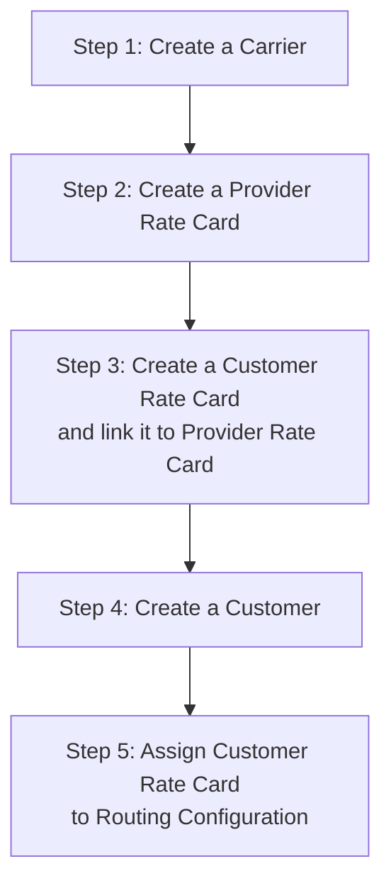

# Getting Started

---
**Document Metadata**  
**Category:** Setup & Configuration  
**Audience:** New Users, Administrators  
**Difficulty:** Beginner  
**Time Required:** 2-4 hours  
**Prerequisites:** ConnexCS account created  
**Related Topics:** [Dashboard](dashboard.md), [Carrier Setup](carrier.md), [Customer Setup](customer/customer.md)  
**Next Steps:** [Carrier Configuration](carrier.md), [Rate Card Setup](rate-card-building.md)

---

## Welcome to ConnexCS!

We're excited to have you on board. This guide will walk you through the key features and settings you'll need to begin your journey with ConnexCS.

Our platform is designed to streamline your communication and billing processes, making it easier to manage your customers, carriers, and rate cards.

### Initial Setup Overview

The initial setup in ConnexCS will configure:

* A single carrier

* A single customer  

* A single rate card

This provides you with a base configuration that you can expand as needed. Whether you're managing a few customers or scaling to handle unlimited connections, ConnexCS supports seamless growth with flexible and robust features to meet your business requirements.

Ready to begin? Let's walk through the steps to set up and customize your ConnexCS environment!

!!! info "Changing the UI language"
    To change the display language for the UI, click your name in the upper-right corner and select [**Change Language**](https://docs.connexcs.com/changing-language/).

!!! note "What's my server's IP Address?"
    IP addresses are deployed *after* you complete the Getting Started steps.

!!! help "Need Help?"
    If you need help, we offer free 1:1 training, which you can book at **<https://connexcs.youcanbook.me/>**.

## Prerequisites

Before you begin, ensure you have:

* A modern web browser such as Google Chrome, Firefox, Safari, or equivalent
* A basic understanding of telecommunications concepts (customers, providers, and rates)
* A ConnexCS account (register at [ConnexCS](https://app.connexcs.com/#/register) if you haven't already)

## Account Setup and Verification

Upon creating your account, you’ll need to complete a few key steps to ensure everything is properly set up.

Use the **Alerts** icon at the top left of the screen to view all outstanding items:

### Email Verification

You'll receive a verification email after account creation. This is a security measure to prevent unauthorized access to customer accounts and works similarly to standard email verification mechanisms.

To verify your email address:

1. Select `Verify Email`. The Personal Profile screen will appear.
2. Click the orange `!` icon next to Email. This generates a verification code and sends it to your email address.
3. Either click the link in the email or copy and paste the code into the Verification Code field in the Verify Email pop-up.
4. Click `Verify`.

    

### Mobile Verification

**Mobile Verification** ensures that all mobile phone numbers associated with your account are genuine. This is an extension of email verification and adds an additional security layer.

Before starting, ensure your mobile number information is correct.

!!! note "Number Format"
    The number must be in E.164 format: [+] [country code] [subscriber number including area code]. E.164 numbers have a maximum of fifteen digits.

To verify a mobile number:

1. Select `Verify Mobile`. The Personal Profile screen will appear.
2. Confirm the number is correct and in E.164 format: [+] [country code] [subscriber number including area code] with a maximum of fifteen digits.
3. Click the orange `!` icon next to Mobile. This will generate a verification code and send it to your mobile number.
4. Enter the code into the Verification Code field in the Verify Mobile pop-up.
5. Click `Verify`.

    

### Additional Verification Fields

You may also need to verify the following information:

* Company Registration
* Company Details
* Company Registration ID
* Country
* Address
* VAT Registration ID
* Shareholder Certificate

### Customer-Carrier Billing Setup

Follow these steps to set up routing and billing.

#### Carrier Setup

**Carriers** are your VoIP route providers. Below are the required fields for basic carrier setup.

For detailed instructions, see [**Carrier**](https://docs.connexcs.com/carrier/).

1. Navigate to **Management :material-menu-right: Carrier**.
2. Click the `+` icon.
3. Enter the Carrier Name.
4. Select the carrier's currency type (for example: USD, GBP, or EUR).
5. Click `Save`.
6. Select **Auth** from the Carrier screen.
7. Click `+` under IP Authentication.
8. Enter the termination IP address.
9. Click `Save`.

    

[Click here for video playback.](https://www.youtube.com/watch?v=7cDHJCEJDjI&t=3)

#### Rate Cards

**Rate Cards** are structured pricing tables that specify the costs associated with terminating voice traffic to different global destinations.

1. Before getting started, we recommend reviewing **[Building Rate Cards](https://docs.connexcs.com/rate-card-building/)**. You can also watch our **[Rate Card Setup video](https://docs.connexcs.com/video-guide/#rate-card-setup)**.
2. Set up the [**Provider Rate Cards**](https://docs.connexcs.com/provider-ratecard/) first, as customer cards will build upon these.
3. Build the [**Customer Rate Cards**](https://docs.connexcs.com/customer-ratecard/) as needed.  

[Click here for video playback for Provider Rate Card.](https://www.youtube.com/watch?v=NYL6cNGGuaw)

[Click here for video playback for Customer Rate Card.](https://www.youtube.com/watch?v=i7vSzIuUAL4&t=31s)

#### Create a New Customer

1. Click the `+` icon.
2. Enter the customer's name.
3. Select the currency to use for this account. **Note: You cannot change this later.**
4. Add a tax percentage, which will be calculated for each payment.
5. Click `Save`.

      

!!! Note "Viewing Outstanding Actions"
    To view outstanding actions on a customer, hover over the **Warning icon**. In the example below, you can see that routing and authentication haven't been set. Click the customer's name to update their routing details.

##### Set IP Authentication

1. Select the customer to authenticate.
2. Click the **Auth** menu item.
3. Under IP Authentication, click the `+` icon.
4. Enter the origination/customer IP address.
5. Click **Save**.

!!! note "Additional Authentication Support"
    We support SRV (service) records and domains.

[Click here for video playback.](https://www.youtube.com/watch?v=U0lnj0Iu-Pw)

##### Set SIP User Authentication

You can authenticate a customer using a SIP username and password.

Steps to create a SIP user:

1. Select the customer to authenticate.
2. Click the **Auth** menu item.
3. Under SIP User Authentication, click the `+` icon.
4. Enter a username and password, then click the `Save` button.

!!! Warning "Security Notice"
    We block IP addresses after SIP authentication failures to enhance security.

##### Payments

You can add balance to a customer account.

Steps to add payments:

1. Select the customer.
2. Click the **Payment** menu item.
3. Click the `+` icon.
4. Enter a description and total amount. Select `Completed` from the drop-down menu if the payment has been made.
5. Click `Save`.

[Click here for video playback.](https://www.youtube.com/watch?v=gm3enkq5VSo)

##### Ingress Routing

To configure ingress routing:

1. Navigate to **Management :material-menu-right: Customer**.
2. Click the customer's name.
3. Select **Routing**.
4. Click `+` under **Ingress Routing**.
5. Select the **Rate Card**.
6. Click `Save`.

For detailed routing configuration, see [**Routing**](https://docs.connexcs.com/customer/routing/).

### Setup Summary

The complete setup process follows these steps:

**Step 1:** Create a carrier

**Step 2:** Create a provider rate card

**Step 3:** Create a customer rate card and link it to the provider rate card

**Step 4:** Create a customer

**Step 5:** Assign the customer rate card to the routing configuration

#### Deploy Servers

Follow these instructions to deploy servers:

1. Navigate to **Setup :material-menu-right: Settings :material-menu-right: Servers**.
2. Select **Deploy a Server**.
3. Choose a server location.
4. Enter a server name.
5. Check the confirmation box and deploy the server.
6. The server's IP address will be emailed to your registered email address. You can also find it in the server list section.

For detailed server configuration, see [**Servers**](https://docs.connexcs.com/setup/settings/servers/).

[Click here for video playback.](https://www.youtube.com/watch?v=QSagrJ1redI)

## Additional Options

### Timezone Settings

You can set your local time zone by clicking the "Time Top" option in the settings. This will affect the time format across the entire platform.

Click **`Update`** to apply your changes.

### Help and Documentation

Throughout the platform, you'll find question mark icons. Click them to access relevant documentation and guidance.

### Account Balance

Your current account balance is displayed in the dashboard. To make a payment, click on the balance for options to pay via PayPal or credit card. Ensure your account balance stays positive to avoid service interruptions.

### Set Up Personal Profile

Your username and role are visible in the upper right corner. You can change your password, language settings, and other preferences from your profile.

While configuring your Personal Profile isn't required for basic setup, it's a good time to complete it.

To access your profile, click your name in the upper right corner and select `Profile`.

=== "Basic"

    View account details such as name, role, email, and mobile number. 
    
    **Note: You can only edit the Mobile field. To change your email or name, contact ConnexCS Support.**
    
    **Two-Factor Authentication (2FA):** This adds additional security against password guessing and theft, including brute force attacks (details [**here**](https://www.ncsc.gov.uk/guidance/multi-factor-authentication-online-services)). 
    
    To configure 2FA on ConnexCS, click `Enable` and follow the prompts to scan the QR code. You must install a 2FA/TFA app on your phone. 
    
    **Web Authentication (WebAuthN) / FIDO2:** This allows you to enable hardware security keys/tokens, which is more secure than basic password protection (details [**here**](https://www.ncsc.gov.uk/collection/mobile-device-guidance/enterprise-authentication-policy)). 
    
    To configure this on ConnexCS, click `Enroll`. Once set up, there will be a special button to click/tap when logging in to the ConnexCS portal. 

    You can also add **Biometric Security** using **Face Verification**.

    Other options include **PIN** and **Security Key**.

    These security options are available in your browser through the [**Windows Hello application**](https://support.microsoft.com/en-us/windows/learn-about-windows-hello-and-set-it-up-dae28983-8242-bb2a-d3d1-87c9d265a5f0).
    
    

=== "Advanced"

    Click the blue `Edit` button to manage your email subscriptions.
