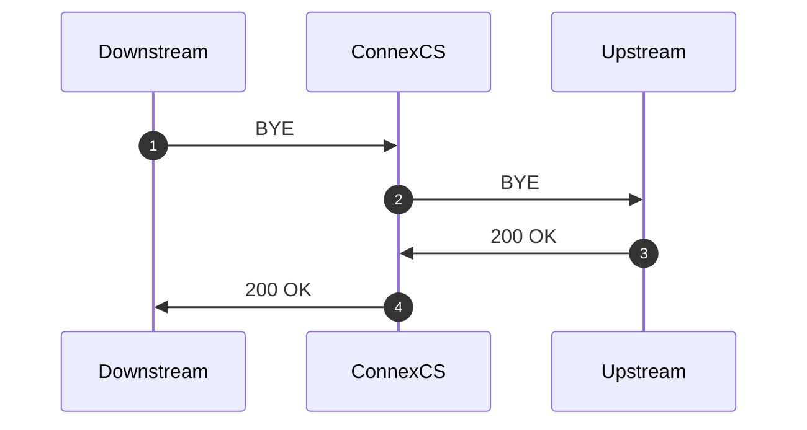
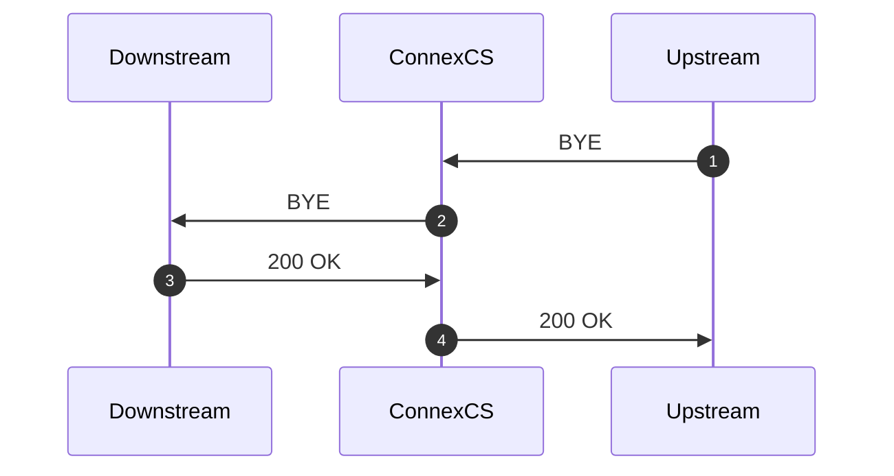
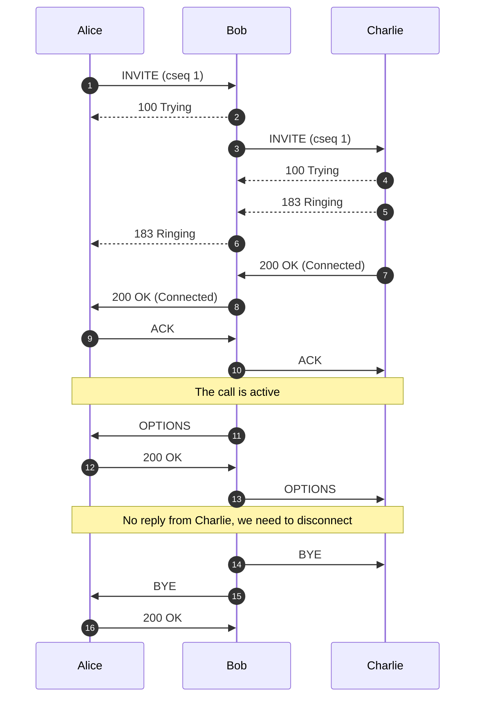

# Call Disconnection Reasons and Premature Call Disconnection

---

**Document Metadata**  **Category**: Troubleshooting & Diagnostics / Call Disconnection Reasons  **Audience**: Administrators, Engineers, Support Team  **Difficulty**: Intermediate to Advanced 
**Time Required**: Approximately 30–40 minutes  **Prerequisites**: Active ConnexCS Platform account with access to the Logging module (Call IDs, SIP traces) and familiarity with SIP/VoIP fundamentals  
**Related Topics**: [Logging & SIP Traces](https://docs.connexcs.com/logging/) , [Call Connection/Signalling Issues](https://docs.connexcs.com/guides/tshoot-signal/)   **Next Steps**: After reviewing the disconnection-reasons guide, locate affected Call IDs in the Logging panel, map the cause of disconnection (e.g., ping timeout, BYE message, no ACK) and implement corrective measures (enable SIP-Ping, check media path, verify re-INVITE timers) to reduce premature call drop-outs. 

---

## Main Reasons for Call Disconnection

1. **Downstream BYE:** When the call disconnects from the **originator's** side via a **BYE** message.

2. **Upstream BYE:** When the call disconnects from the **receiver** side via a **BYE** message.

3. **MI Termination:** The system ends the call when it finds that there has been no audio connection between the call's originator and the receiver. It also happens when the Dialog gets closed via the Control Panel / Customer Portal / Media Timeout.

     The system triggers a BYE message on both sides of the application.

4. **Ping Timeout:** If you enable the Sip Ping feature under Customer:material-menu-right: Routing, the receiver, and the originator receive OPTION packets (every X seconds).
     The originator and the receiver should reply with 200 OK after receiving the OPTION packets. If either the originator or receiver misses sending the acknowledgment, the call ends due to a "ping timeout."
     It prevents any long-duration calls as the system recognizes either the originator or receiver as inactive.

     Here's an example:

     **Missing SIP Ping Call Disconnection**

In this case, when we send the OPTION packet to Charlie, he doesn't reply. The OPTION message disappears and we need to disconnect the call.

Another scenario is when ConnexCS sends message to Charlie and Charlie is active on the call, he will send a BYE message to Alice and we won't see a reply to that.

5. **Missing ACK:** If a call gets disconnected within 5 seconds, it's because an Acknowledgement wasn't received.

    According to the [**RFC3261**](https://www.ietf.org/rfc/rfc3261.txt), any SIP device not receiving the ACK to its final 2xx reply has to disconnect the call by issuing a standard BYE request.

6. **Missing SIP Ping:** If a call gets disconnected within 20-30 seconds, it's because of a missing SIP Ping.
7. **Missing Re-Invite:** If a call gets disconnected within 5 minutes, it's because of a missing Re-Invite message
8. **Lifetime Timeout:** The reasons for a lifetime timeout can be due to:
   + **Max Call Duration**
   + **Missing ACK** or other specific missing in call packets
   + We received a BYE message when the call is still ringing

9. **Re-INVITE Ping Timeout (Upstream / Downstream):** It happens since the Dialog ended because there was no reply to re-invite pings.

10. **SIP Race Condition:** A SIP race condition is a situation that occurs when two or more processes try to access and change a shared resource together. This results in unexpected behavior.

    A race condition can occur in SIP if several messages get transmitted and received together. Also, their order of processing isn't well-defined. This can lead to inconsistencies in the state of the SIP system, as different messages may have conflicting effects on the system.

    For example, consider a SIP system in which two users, Alice and Bob, are trying to establish a call with each other. If Alice and Bob both send SIP INVITE messages at the same time, and these messages get processed all together by the SIP server; it's possible that the server will receive the messages in an order that's different from the order in which they got transmitted. This could lead to a race condition, as the server may not be able to determine the correct state of the call.

    To avoid race conditions, it's important to carefully design the protocol used to communicate between SIP components and to use appropriate mechanisms to ensure that messages get processed in the correct order.

    Also, if we've a CANCEL message, but upstream sends a 183 / 200, which means they haven't received the CANCEL message.

## Necessity for Timeout Protection

Disconnection due to inactive data transmission is a **timeout**.

For instance, if a modem connects to the Internet but has been inactive for too long, a timeout may occur.

**User Datagram Protocol (UDP)** connections keep breaking due to UDP timeout. UDP timeout means the maximum duration of a UDP connection. For timeout protection in UDP, you can either increase the UDP Timeout value or increase the Maximum UDP Connection.

Alternately, **Transmission Control Protocol (TCP)** Keep-alive Packets determine if the connection is still valid, and abort it if needed. Most hosts that support TCP also support TCP Keep-alive.
Each host (or peer) periodically sends a TCP packet to its peer, which solicits a response.

Consider a situation when there is a single server and several clients. Each client also establishes a TCP connection to communicate with the server. Three active TCP uses:

1. **TCP keep-alive:** Sent by the server to verify that the client is still alive. The server cuts off the TCP connection to the client if the client is no longer alive.

2. **Client-side keep-alive:** Clients send TCP keep-alive messages to the server to stop it from terminating the client's TCP connection.

3. **Keep-alive on both sides:** As mentioned in 1 and 2, TCP keep-alives sent by both the server and the clients.

The Keep-alive continuously keeps the port open on the NAT / Firewall.

Thus, the necessity for time-out protection is for Call-state synchronization between remote endpoints. The other person needs to know that the other party has put the phone down.

### Timeout Mechanisms

1. **Using TCP:** This has (keep-alives) timeouts built into the (Layer 4) TCP stack that will close the TCP socket if a connection gets dropped, this can be used to disconnect the call.
2. **SIP Pings:** A lightweight SIP implementation of keep-alives that ensure that both ends agree about the state of the call. This means ConnexCS sends the ping after about 30 seconds. It's like a Deadman switch where continuous pings are sent to check if the other party is active or not.
3. **SIP REINVITE / SIP Session Timers (SST):** Every 5+ minutes (ConnexCS), a RE-INVITE packet is sent to seamlessly re-establish the call. It's also like a Deadman switch.
4. **Media Inactivity Detection:**  It monitors the audio packets going via a media server. It also detects when no media packets get transmitted. You can consider it as an Internal Deadman switch because it checks the availability of the packets internally. It happens 30-60 seconds before detection kicks in.
5. **Max Call Duration (MCD):** A static config option to specify the maximum length of a call. In ConnexCS the MCD is 3600 minutes (1 hour).
