# Debugging Basics

 
<strong>Document Metadata</strong>
  

<strong>Category</strong>: Troubleshooting & Diagnostics / Debugging Guide 
<strong>Audience</strong>: Administrators, Engineers, Support Team 
<strong>Difficulty</strong>: Intermediate to Advanced 
<strong>Time Required</strong>: Approximately 40–60 minutes 
<strong>Prerequisites</strong>: Active ConnexCS account with access to system logs, call traces, and debugging tools; familiarity with network & VoIP fundamentals 
<strong>Related Topics</strong>: <a href="https://docs.connexcs.com/guides/call-disconnection-reasons/">Call Disconnection Reasons</a>, <a href="https://docs.connexcs.com/guides/tshoot-signal/">Troubleshooting – Signaling</a>, <a href="https://docs.connexcs.com/guides/tshoot-media/">Troubleshooting – Media</a> 
<strong>Next Steps</strong>: After reviewing the debugging guide, select a recent incident with repeatable symptoms, gather SIP/Media logs, apply the step-by-step methodology outlined in the document (hypothesis → reproduce → isolate → fix), and document your findings and resolution in your internal incident-tracking system. 

Debugging (identifying call problems) is an essential skill for maintaining a Voice Platform. A single character or a 10ms delay in the wrong place could cause issues in VoIP / SIP communication because it has several components and a wide range of possible configurations.

*(**VoIP:** Voice over Internet Protocol; **SIP:** Session Initiation Protocol)*

## Debugging Steps

1. **Isolate:** The first step in debugging a problem is to isolate it. This means that if a customer reports about calls not connecting, an example is necessary of where it occurs.
   * If [**Reporting a Problem**](/reporting-problems/#report-a-problem) to ConnexCS, you will need to give a [**Call-ID**](/guides/howto/callid/).
2. **Replicate (Optional):** If the problem occurs for live customers, its necessary to replicate the problem either on the live platform or in a lab environment. ConnexCS support engineers may need your help to achieve this.
3. **Fix:** Once you understand the underlying cause of an issue, you can perform a fix. The fix typically corrects configuration or setup issues.
4. **Test:** To confirm if the fix has resolved the issue, verify the fix using a live or simulated test. Upon confirmation, you can contact the customer to inform them of the resolution of the issue.

## Guidelines for RCA - Root Causes Analysis

1.**Problem Definition**
The first step in Root Cause Analysis (RCA) involves clearly identifying and articulating the problem. This includes gathering relevant data, understanding the scope and impact of the issue, and determining the specific conditions under which the problem occurs. A well-defined problem statement sets the foundation for effective analysis and ensures that all stakeholders have a common understanding of the issue.

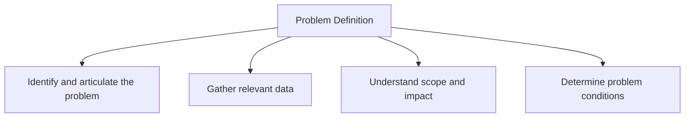

2.**Exemplify**
In this step, you provide specific examples of the problem to illustrate its characteristics and impact. This could include case studies, incident reports, or anecdotes that highlight how the problem manifests in real-world scenarios. Exemplifying the issue helps stakeholders visualize the problem and understand its context, which is essential for deeper analysis.

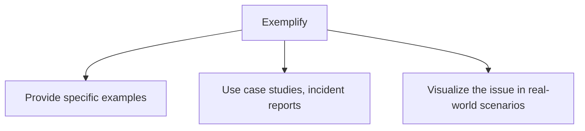

3.**Replicate (Live)**
Replicating the issue in a live environment involves recreating the conditions under which the problem occurred. This step may involve performing the same tasks or processes that led to the problem while monitoring for similar outcomes. Live replication helps confirm the problem's existence and provides insights into the factors that contribute to it.

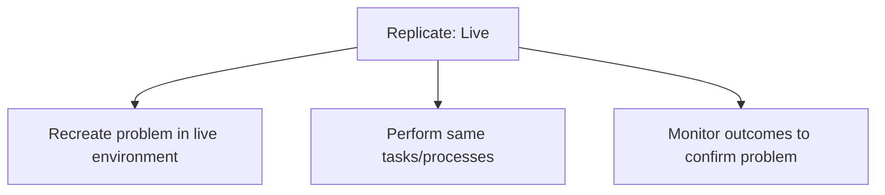

4.**Replicate (Lab)**
In this phase, the problem is replicated in a controlled laboratory or simulated environment. This allows for a more detailed examination of the issue without the constraints and variables present in the live setting. Lab replication enables teams to isolate specific factors, conduct experiments, and collect data that may not be feasible in a live situation.

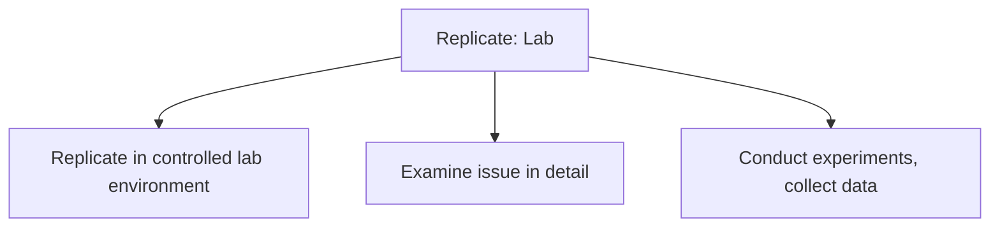

5.**Isolate**
During isolation, the team focuses on identifying and separating the specific variables or conditions that may be contributing to the problem. This step involves analyzing the data collected from both live and lab replications to pinpoint the elements that are most likely causing the issue. Isolating variables helps narrow down the potential root causes.

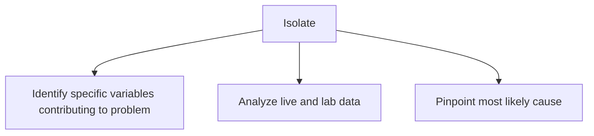

6.**Root Cause**
Once potential contributing factors are identified, the team conducts a thorough analysis to determine the root cause of the problem. This involves using tools such as the 5 Whys or Fishbone Diagrams to drill down to the underlying issue. Understanding the root cause is crucial for developing effective solutions and preventing recurrence.

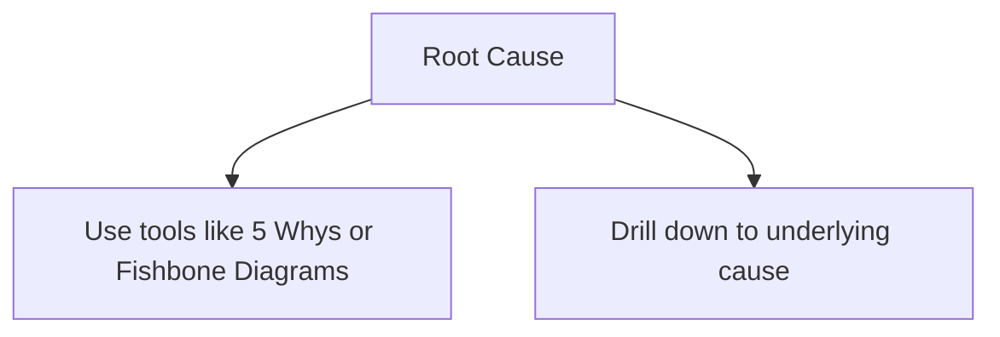

7.**Fix**
After identifying the root cause, the next step is to develop and implement a solution. This fix should directly address the root cause to ensure that the problem doesn't resurface. The solution may involve changes to processes, training, tools, or technology. It's essential to engage relevant stakeholders in this step to ensure buy-in and support for the solution.

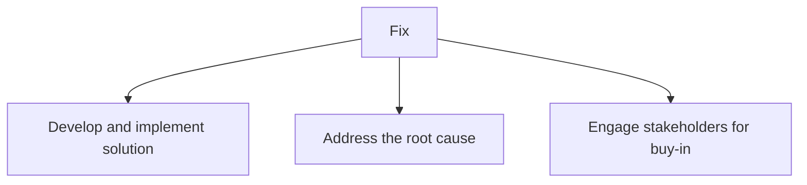

8.**QC (Quality Control)**
Quality Control (QC) involves monitoring and evaluating the effectiveness of the implemented fix. This step includes establishing metrics and benchmarks to assess whether the solution is successfully mitigating the problem. Regular reviews and adjustments may be necessary to ensure ongoing compliance with quality standards and to address any residual issues.

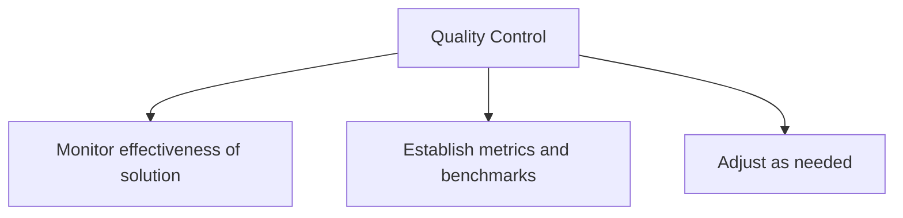

9.**Patch**
If the fix implemented is temporary or requires further refinement, a patch may be developed. This is a short-term solution designed to alleviate symptoms while a more permanent fix is in progress. The patch should be carefully monitored to ensure it doesn't introduce new issues or complications.

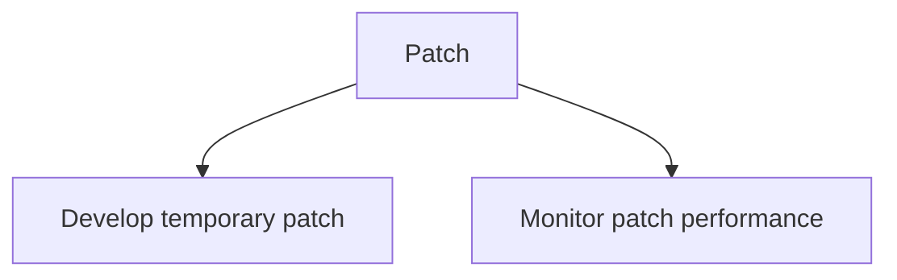

10.**Full Roll Out**
The final step is to fully implement the solution across the organization or relevant processes. This includes communicating changes to all stakeholders, providing necessary training, and ensuring resources are in place for a smooth transition. A successful full roll out involves ongoing monitoring to confirm that the problem has been resolved and that the organization is benefiting from the implemented changes.

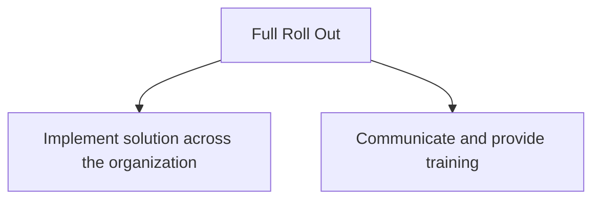

11.**Review & Learn**
The final step involves conducting a thorough review and assessment of the entire Root Cause Analysis process, focusing on lessons learned. This reflection includes evaluating how effectively the problem was identified, addressed, and resolved. The team should document key insights, challenges faced, and opportunities for improvement. This review helps to build organizational knowledge, enabling the prevention of similar issues in the future. It may also involve updating policies, procedures, or training to embed these lessons into the organization's culture and processes.

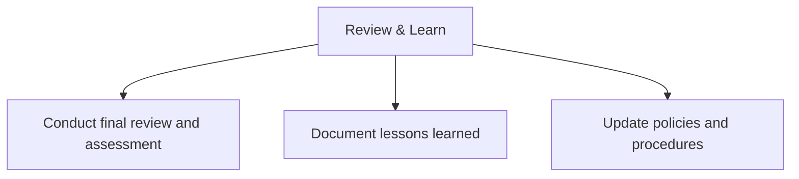

This ensures that the problem not only gets fixed but also drives continuous improvement.
