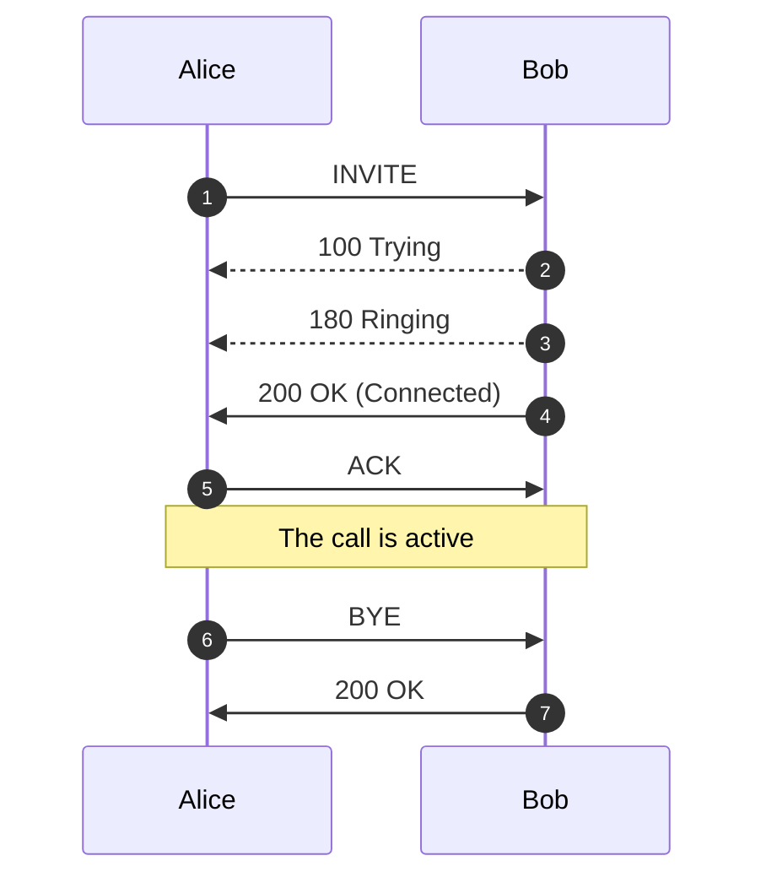
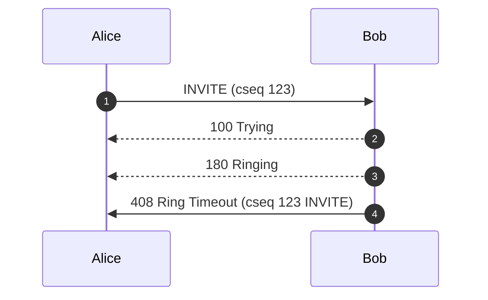
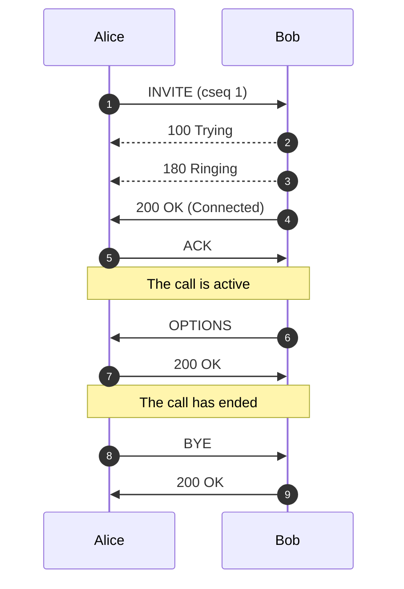
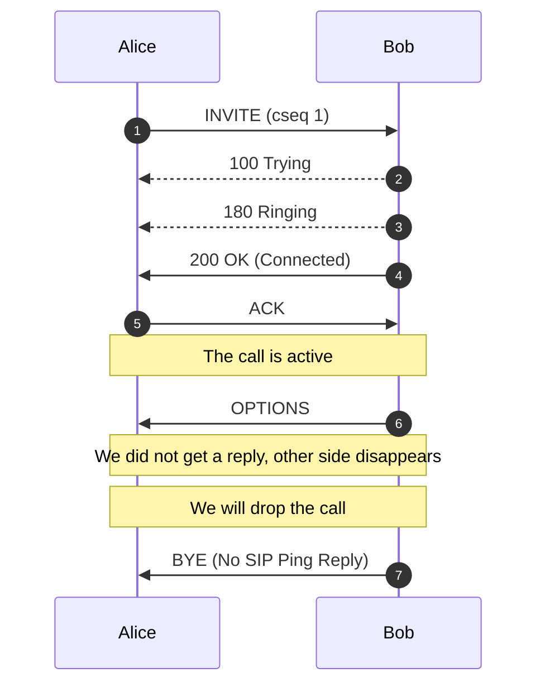
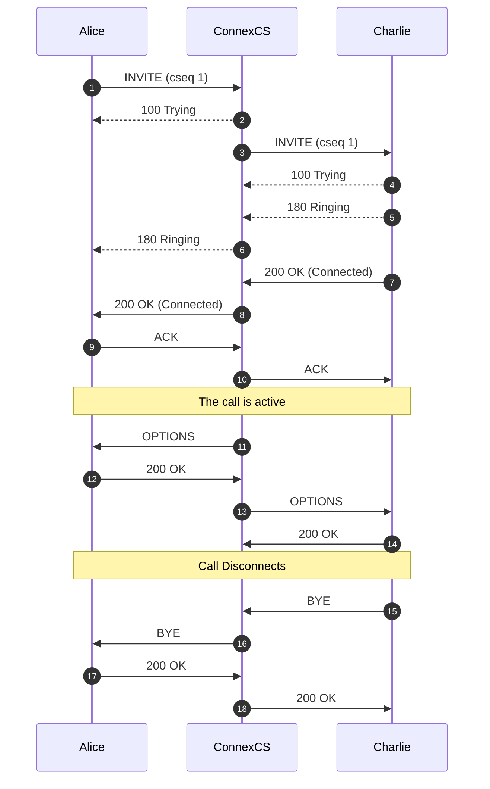
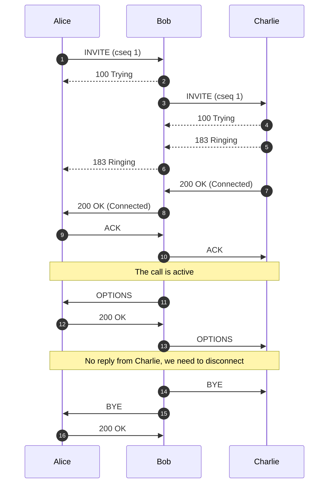
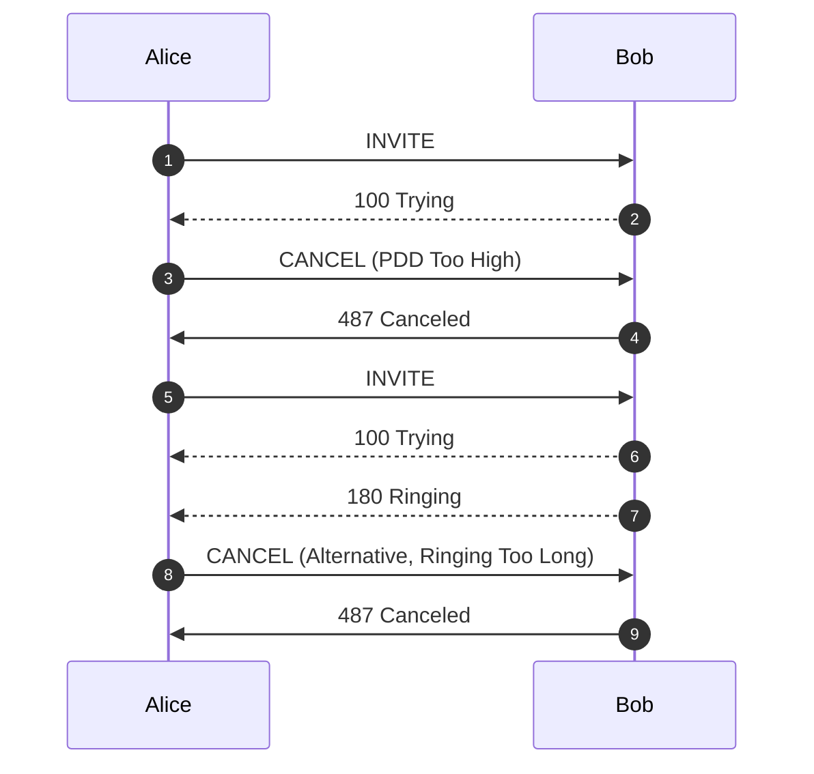
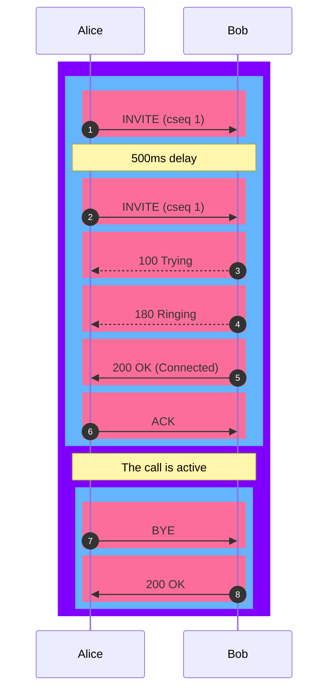
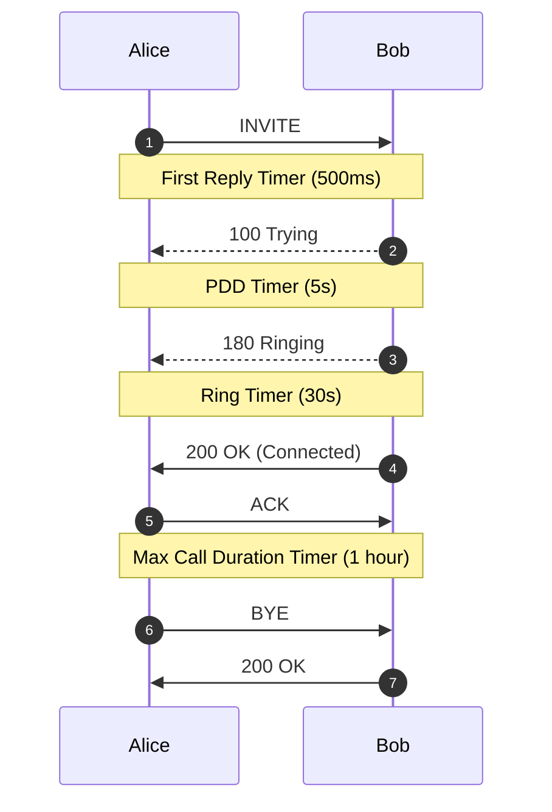

# SIP Traces, Pings and Messages

## SIP Traces

**SIP Tracing** is a diagnostic tool for phone systems using SIP (Session Initiation Protocol) for interactions across trunks and between endpoints. Traces give detailed information about calls and call attempts while debugging and troubleshooting.

Uses of SIP protocol include call setup, maintenance, and tear-down, this tool is typically used only for call connection issues.

Call quality issues are often identified using other methods.

Here is an example describing a SIP trace:

Alice and Bob represent the parties on the call. Alice sends an **INVITE** packet to Bob. Then Bob sends a **100 Trying** (provides you the feedback that your request is getting processed by a SIP Application) message together with **180 Ringing** (the Destination User Agent has received the INVITE message and is alerting the user of the call).

Further, **200 OK** is sent which means the calls are connected.

The **ACK** message is sent from Alice to Bob confirming that the call has been connected.

!!! info "SIP Trace Captures"
    The **ConnexCS** system supports always-on **SIP Trace** capture.

    We keep a record of every packet sent and received by your server over the last seven (7) days.

To view the SIP Trace of a call:

1. Click a **Call ID** to view its SIP traces.
2. Click **`SIP traces`** to view the SIP trace.

      ![alt text][logging-sip]

3. Toggle between Relative Time and Absolute Time for a specific time of day.
4. Options to download as Text or an Image.

!!! note "Known issues with SIP Traces"

    * **Missing SIP data**: SIP traces aren't always guaranteed. SIP packets are carried by UDP, which may cause the traces to be lossy at times. You can expect this due to the nature of the architecture.
    * **Missed call attempts**: If using SIP authentication, because there are two requests, it's possible that they hit our database out of order. This may cause the logging page to only display the first call attempt.
    * Considered for reporting calls and don't impact the calls directly. They're both rare, typically observed in less than 1 in every 50,000 calls.

+ **How to correlate a Reply to an Initial Request**

The correlation of a Reply to an Initial Request can be done when the Invites have the same CSequence

### SIP Pings

**Case 1: Normal SIP Ping**

In this case, Bob sends a message to Alice called **OPTIONS** and Alice sends back **200 OK**. If **200 OK** isn't sent, the call be get disconnected.

**Case 2: Alice Disappears**

In this case, the call is half-way connected and Alice doesn't reply to the message sent by Bob. Bob decides to drop the call.

If Alice is alive, then you may get a reply, if there is a reply, then this is likely a premature disconnection and there is a fault with the SIP ping on Alice's side.

**Case 3: 3-party Example**

In this case, the communication happens between 3 parties. ConnexCs is sending OPTION packets in both the directions (to Alice and Charlie).

**Case 4:Missing SIP Ping Call Disconnection (Charlie disappears)**

In this case, when we send the OPTION packet to Charlie, he doesn't reply. The OPTION message disappears and we need to disconnect the call.

Another scenario is when ConnexCS sends message to Charlie and Charlie is active on the call, he will send a BYE message to Alice and we won't see a reply to that.

## SIP Messages

### **ACK Message**

An ACK is an **Acknowledgement** of a final reply.

### **Cancel Message**

**CANCEL** message indicates that the previous request was terminated by the user. In this case, the CANCEL message is sent from Alice to Bob.

Cancel can be due to PDD timer being too high or ringing exists for a longer duration.

Bob should send 487 Canceled message to Alice.

### **200 OK Message**

**200 OK** is a Success message. In order to understand how the **200 OK** is related to we need to follow back the original cseq.

For example, if you don't see a 200 OK for a BYE message it means the other side has disappeared.

### **Re-Transmissions**

Re-transmissions occur when the same INVITE is sent more than once. This means the `same` packets were sent more than once.

Re-transmissions only happen on UDP. Re-transmissions occur when packets either don't reach the receiver or get lost in transmission. Thus, re-transmissions are done after a certain time interval using specific timers.

Here is an example describing Re-transmissions:

Alice and Bob represent the parties on the call. Alice sends an INVITE packet to Bob. INVITE is an initial request.

Then Bob sends a 100 Trying (provides you the feedback that your request is getting processed by a SIP Application) message along with 180 Ringing (the Destination User Agent has received the INVITE message and is alerting the user of the call). 100 Trying and 180 Ringing are provisional responses.

The re-invites get absorbed when they're received. When Bob receives the INVITE packet and a special timer is set (please see the below timer table) as to how long it should wait for re-transmissions. If any packet is received within this time frame, the packet gets ignored.

Further, 200 OK is sent which means the calls are connected. 200 OK is a final reply.

The ACK is message is sent from Alice to Bob confirming that the call has been connected.

Each line is a Message.

From 1 message (INVITE) to message 5 (ACK), it's considered as a single Transaction.

Similarly, messages 6 (BYE) and 7 (200 OK) are also considered as a single Transaction.

From message 1 to message 7, the whole conversation is a Dialog.

!!! note "Note"
    Message displayed in Pink color.
    Transaction displayed in Blue color.
    Dialog displayed in Violet color.

You can have take a look at the various SIP Timers in the table below:

|**Timer**|**Default value**|**Section**|**Meaning**|
|-------------|-------------------------|-------------|------------------------------------------------------------------------------|
| **T1** | 500 ms | 17.1.1.1 | Round-trip time (RTT) estimate|
| **T2** | 4 sec.| 17.1.2.2| Maximum retransmission interval for non-INVITE requests and INVITE responses |
| **T4** | 5 sec.| 17.1.2.2| Maximum duration that a message can remain in the network|
| **Timer A** | initially T1| 17.1.1.2 | INVITE request retransmission interval, for UDP only |
| **Timer B** | 64*T1| 17.1.1.2| INVITE transaction timeout timer |
| **Timer D** | > 32 sec. for UDP| 17.1.1.2 | Wait time for response retransmissions|
|| 0 sec. for TCP and SCTP|
| **Timer E** | initially T1| 17.1.2.2 | Non-INVITE request retransmission interval, UDP only|
| **Timer F** | 64*T1| 17.1.2.2| Non-INVITE transaction timeout timer|
| **Timer G** | initially T1| 17.2.1| INVITE response retransmission interval|
| **Timer H** | 64*T1| 17.2.1| Wait time for ACK receipt|
| **Timer I** | T4 for UDP| 17.2.1| Wait time for ACK retransmissions|
|| 0 sec. for TCP and SCTP|
| **Timer J** | 64*T1 for UDP| 17.2.2| Wait time for retransmissions of non-INVITE requests|
| | 0 sec. for TCP and SCTP|
| **Timer K** | T4 for UDP| 17.1.2.2| Wait time for response retransmissions|

*Table source*: [**IBM**](https://www.ibm.com/docs/en/was/8.5.5?topic=timers-sip-timer-summary); *Original Ref*: [**RFC 3261**](https://www.ietf.org/rfc/rfc3261.txt)

#### **Various Timers**

Here, Alice sends an invite to Bob and it's expected to get a reply (100 Trying) within in 500ms which is a **First Reply Timer**.

Then a **PDD timer** is set for 5s to hear the ringing. Post-dial delay (PDD) is the measurement of how long it takes for a calling party to hear a ring-back tone after initiating a call.

The time from when the respondent's phone starts ringing until it's answered; is a **Ring Timer**.

When the call is active **Max Call Duration Timer** comes into the picture. When this timer is active, the active call gets disconnected when it reaches the maximum time of an active call.

[logging-sip]: /misc/img/logging-sip.png "SIP Traces"
[logging-4]: /misc/img/236.png "logging-4"

### Re-Invite

In case of a Re-Invite, it re-establishes an entire call.

Here, Alice starts a call with Bob, the call is active without any issues and the media is through UK. But as a provider we detect the call isn't going through UK. Thus, we send the Re-Invite to Alice to send the media through us and we can place the call on a different server in real-time and in the middle of the call. Thus, a Re-Invite can contain some extra information also.
