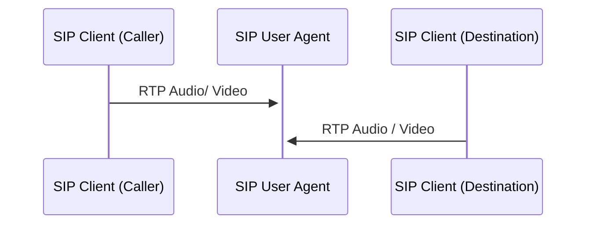

# Troubleshoot Media

Media refers to the actual audio payload part of a call. For more information about ConnexCS media servers, see [**RTP Servers**](https://docs.connexcs.com/setup/settings/servers/#rtp-servers).

**RTP (Real-time Transport Protocol)**, operating on top of User Datagram Protocol (UDP), is a data transport protocol. A signaling protocol, such as Session Initiation Protocol (SIP), initiates the RTP session. Once established, the audio gets streamed across the network.

By using UDP, data gets transmitted at higher rates, some loss will occur and can be partly mitigated by built in correction mechanisms (versus Transmission Control Protocol (TCP) which runs slower to ensure reliability).

!!! info "RTP on Wikipedia"
    For a detailed description of RTP, see the [**Wikipedia Real-time Transport Protocol article**](https://en.wikipedia.org/wiki/Real-time_Transport_Protocol).

**RTCP (RTP Control Protocol)** doesn't carry any actual data payload but helps with delivery. Use RTCP to report on media quality statistics after call completion.

!!! Info
    1. We support ZRTP and video pass-through functionalities, enabling seamless transmission from customers to carriers.
    2. Our platform provides comprehensive support for both IPv4 and IPv6 address protocols.

## ConnexCS Media Servers

ConnexCS lets you route your media through a global array of dedicated media servers.

Each regional zone encompasses several servers to provide high availability.

These servers operate independently of your server.

For example, your server could be in London and your media server runs in New York.

!!! tip "Location can impact latency"
    You should choose a media server that adds the least latency to the call.

    For example, if your customer is in Bangalore and your carrier is in New York, use either Bangalore or New York as your media proxy.

## Call Quality Issues

Call Quality / Media issues are typically related to media handling and related protocols. This could be a result of problems with the customer's equipment, the ConnexCS configuration, the carrier, or the far end.

Common issues related to the media stream can include choppy or robotic voice, echo, one-way audio, static, and anything else relating to the quality of a call that's in session.

!!! tip "Check for known issues"
    Before troubleshooting any issue, please check our [**Status Page**](https://status.connexcs.com/). We monitor 45+ metrics on each of our 30+ RTP servers.

    In the odd event that we experience media problems, it's possible that the problems are already on the **Status Page.** It saves you and your customer from unnecessary tasks by identifying the problem.

## Standard Media Troubleshooting

**Check the SIP Headers and SDP Body** If you have one-way audio, check the SDP (Session Description Protocol) body for compatible codecs and Network Address Translation (NAT) which may be causing problems.

**Check Firewalls** Check to see if there are any firewalls in place that's blocking the calls. It's important to remember that your media doesn't flow through the same server as your SIP.

**Ensure you have the best media zone** Ensure a media server that's close to your customer or carrier.

**Change the media zone** It's possible that there are latent / lossy connections between your customer and the media servers. Try changing the media server (Customer :material-menu-right: Routing :material-menu-right: Media :material-menu-right: Media Proxy).

**Try sending the media direct**  Set the media server as direct to let your media flow from your customer directly to your carrier, bypassing ConnexCS. If the issue persists, it's with either the customer, the carrier, or the far end.

!!! Warning
    If your customer (or carrier) is behind a NAT (and you change the media to Direct), ConnexCS won't be able to correctly perform Far-End-NAT Traversal, making the problem worse.

!!! Danger
    If the SIP packets and / or RTP endpoints get investigated, sending media direct exposes your carrier's identity to your customer and vice versa.

**RTCP Metrics** If you enable RTCP on your customer and carrier, meta data about the RTP stream (packet counters, round trip time) gets exchanged. This information is available on the logging page of the call. These graphs can help to identify the problems.

**User Latency** If the UAC is connecting by SIP Auth directly to ConnexCS, it's possible to view latency graphs.

For this, make sure to enable the SIP Ping from Customer :material-menu-right: Auth :material-menu-right: NAT / SIP Ping :material-menu-right: Enabled. Also, ensure to deselect the "Disable UAC Ping" in your Server.

## Advanced Media Troubleshooting

**ConnexCS Circuit Test** Setup ConnexCS to perform automated circuit tests. An outbound call is made and can complete a full circuit, as well as test other metrics and select MOS. This is a measure of audio quality; a long running test can notice trends even before your customers do.

**Modified Ping (Linux)** If the endpoint responds to the ping message, you can tweak the regular ping to make it behave like an RTP Packet. This helps debug connections further.

Make the following settings to simulate SIP packets (ulaw). You can also tweak these parameters as required to achieve your ideal test scenario.

```bash
ping 1.2.3.4 -s 160 -t 200 -i 0.02 -f
-t 200 [allowed round trip time]
-s 160 [bytes per packet]
-i 0.02 [how frequently to send packets (50 / second)]
-f [display output as .]
```

!!! Warning
    Trace Route (`tracert` / `mtr`) are great tool for checking the IP route. They're not made to analyse RTP packet loss. Also, intermediate hops DON'T prioritize Internet Control Message Protocol (ICMP) packets. They shouldn't use this as a method to debug media issues.

**Smokeping / long-running pings:** An added part of your arsenal for identifying trends outside. This may be to set up a long-standing Ping in your monitoring environment for your customers / carrier equipment. This can identify long-term trends in customer / carrier latency.

Plenty of SaaS ping monitoring systems, such as Pingdom also exist.

**Call Recording / Packet Capture** Enable call recording on ConnexCS. It also captures packets on the customer's or the carrier's end. Compare the results.

## Direct Media (Proxy ByPass)

Basically, you may browse local websites and material without connecting to the outside internet when you utilise a local server to access the internet.
Without proxy servers, which connect you to default IPs, or the outside world, these may be accessible instantly.
Some addresses will be opened as no proxy if you enter them in the bypass proxy field.

The easiest way to describe bypassing a proxy is that your device or browser won't need to search for a DNS server or connect when connecting to an address.

For example, your workplace has a website with the address 172.31.163.8 or something similar.
Simply enter 172.31.*.* in your bypass proxy box to instantly access these websites even if your internet connection from your ISP is unavailable.

### Understanding SIP and RTP

The SIP protocol can be, and usually is, routed through one or more SIP proxy servers before reaching its destination. It's similar to how email gets transmitted, in that several email servers are usually involved in the delivery process, each forwarding the message in its original form. Each email server adds a Received header to the message, to track the route the message has taken. SIP uses a Via header to track the SIP proxies that the message has passed through to get to its destination.
SIP uses a similar message format to HTTP. These are both human-readable, and use similar (if not the same) error codes. For example, both HTTP and SIP use 408 as the error code to signal a timeout error, 404 for 'not found', etc.

Now while SIP traffic passes from one server to the next to get to its destination, RTP sessions sets up directly between SIP clients.

Now SIP is a good protocol, but things kind of break down when NAT gets involved. SIP packets themselves tend to move about without too much trouble, as they 'hop' from one server to another. RTP sessions are somewhat more troublesome. Either both clients need to be aware they're behind a NAT, and substitute their local IP addresses for their public IPs in their Session Description messages and open the appropriate firewall ports, or something has to modify the SIP packets en route. Thus, Products known as Back-to-Back User Agents, can actually proxy RTP traffic.



User Agent can modify SIP packets to direct the caller and destination to establish an RTP session with itself, rather than with each other. This is useful in situations where two SIP clients may not have direct access to each other, most commonly, when one or both of the SIP clients are behind a NAT.
It's important to note that User Agent only proxy's RTP traffic when it has to, and when configured to do so. If both clients are on the same local network segment, User Agent doesn't need to play a part in the RTP session, and it will proxy only the SIP traffic.

## Echo Test

Use our class 5 features to set up an Echo Test. When dialed, all audio spoken gets echoed back. Basically, it will repeat the media straight back to you. This can be a quick way of checking a customer's audio quality.

You can create an application called **Echo Test** and provide a specific call to the Echo test. Then you can check audio quality of the call when the customer complains. You can ask the customer to dial 160 and you can get the Echo test and analyse the call.

**Setting up an Echo Test:**

1. Login to your account.
2. Go to Class5 :material-menu-right: Apps and click `+`.
3. You will see a Dialog box as shown below. 
4. Write the **Name** of your Echo test.
5. Enter the **Destination** number for your Echo Test.
6. Select the **PBX Server** for the call. The **Distributed (Default)** server will assign you the server near to your location.
7. Click on `Save`. 
8. Click on `Go to App` which is right next to the echo test you've created. You will see a screen as shown in the figure below. 
9. Then from components drag the `echo` component and connect it with your created echo test.
10. Click on the dot on the right-side of your created echo test (Echo Test in this case) and join it with the `echo component` on the right-side.
11. Then use your softfone to check for the echo test.