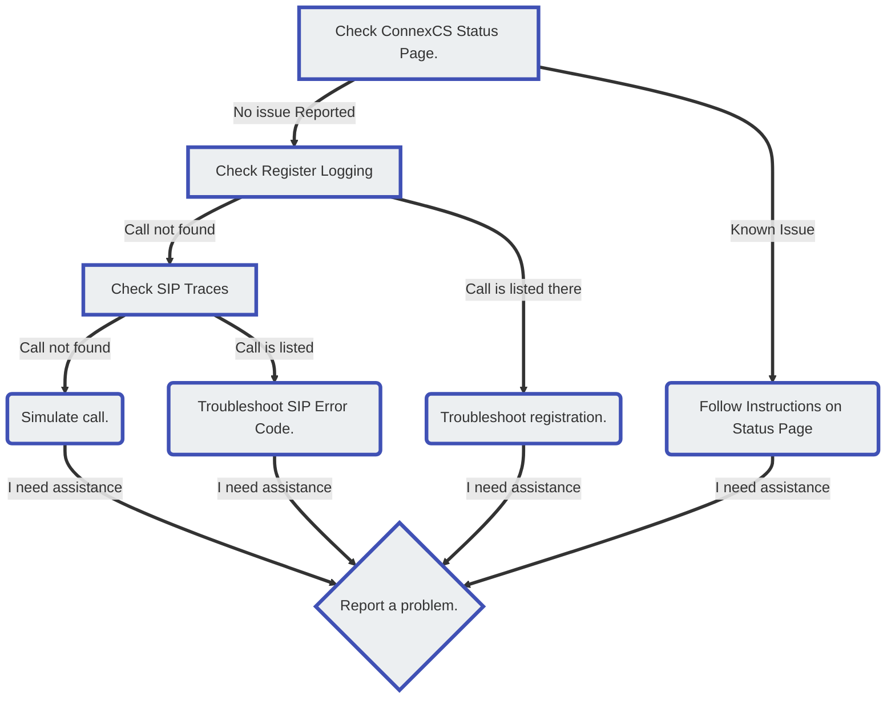

# Troubleshoot Signalling
Signalling is the process telephony systems use to establish a connection across a network or the internet. This includes functions such as device registration, setup, maintenance, and tear-down of calls. While there are many different signalling protocols used for various types of deployments, ConnexCS uses the SIP protocol. 

## Signalling Protocols
Use **SIP (Session Initiation Protocol)** to communicate between the customer's equipment and the ConnexCS platform, and from ConnexCS to the providers/carriers that connect calls to the far-end. Messages are exchanged between each leg of a path, so the elements can agree to communicate. Once a path is established, meaning all the elements between the customer and the far-end agree to carry the call, then the actual audio payload (or Media) of the call may begin. While the call is up, SIP sends periodic confirmation, maintaining the call. When one end or the other hangs up, SIP then initiates the end of the call, as each point agrees to end the connection. 

1. **Setup**- This is the process of connecting a call between our customer and an endpoint, creating path through various telecommunications devices along the way. This was either by the customer (outbound call) or from the far-end (inbound call). For an outbound call placed by the customer, this is the part of the call after the number is dialed, when the customer User Account Control (UAC) communicates with ConenxCS. It then determines where to send the call, and what caller-ID to display. All this information is transitted to the carrier till it reaches the destination number at the far-end. (This process is reversed for calls destined in to one of the customers, and we've no control of the information that's provided by the carrier delivering the call to the ConnexCS switch.)
2. **Maintenance**- Once the call is connected, SIP sends periodic registration messages while the call is active, so it doesn't get disconnected by mistake. 
3. **Tear-Down**- The process of ending a call by closing down the SIP session between all the components in the path between the two endpoints. 

!!! info "SIP on Wikipedia"
    For detailed description of SIP, see the [**Wikipedia Session Initial Protocol article**](https://en.wikipedia.org/wiki/Session_Initiation_Protocol). 

**DTMF (Dual-Tone Multi-Frequency)/MF4**, also known as "Touch-Tone", is the tones that you hear over the phone when you dial a number. In the ConnexCS system, DTMF is used between the customer phone and their SIP enabled device (UAC). The only time DTMF is used to communicate with ConnexCS is when using Class 5 features such as call conferencing or voicemail.  

!!! info "DTMF on Wikipedia"
    For detailed description of SIP, see the [**Wikipedia Dual-Tone Multi-Frequency article**](https://en.wikipedia.org/wiki/Dual-tone_multi-frequency_signaling). 
    
## Call Connectivity Issues
When calls don't connect or stay connected, it's related to signalling (connecting, maintaining, and ending calls) and related protocols. Troubleshooting should focus on the customer equipment, the ConnexCS configuration, the carrier, or the far-end. 

!!! tip "Check for known issues"
    Before troubleshooting any issue, please check our [**Status Page**](https://status.connexcs.com/). We monitor 45+ metrics on each of our 30+ RTP servers. In the odd event that we experience media problems, it's possible that the problem has already been reported here, saving you and your customer from unnecessary task identifying the problem.
    
### Calls won't connect
Calls may fail to connect, whether calls are placed by the customers or calls that are routed to the customers. 

**Outbound calls** When outbound don't connect, this could be an issue with the ConnexCS configuration or due to some sort of issue on the platform or with the carrier, or even the far-end/destination carrier/customer/configuration. 

Suggested troubleshooting flow:

**Inbound calls** that are not delivered to the correct destination may not be received by the ConnexCS switch at all.

### Calls disconnect randomly
+ Maintenance Issues- calls disconnect on their own (neither ends initiates the hang up, but the call disconnects)

### Calls don't disconnect after both sides hang up
+ Tear Down issues- customer is billed for call duration in excess of the actual call duration.

## Using SIP Traces to diagnose issues
ConnexCS records and stores SIP trace captures for all calls for 7 days. You can access this data in [**Logging**](/logging)

