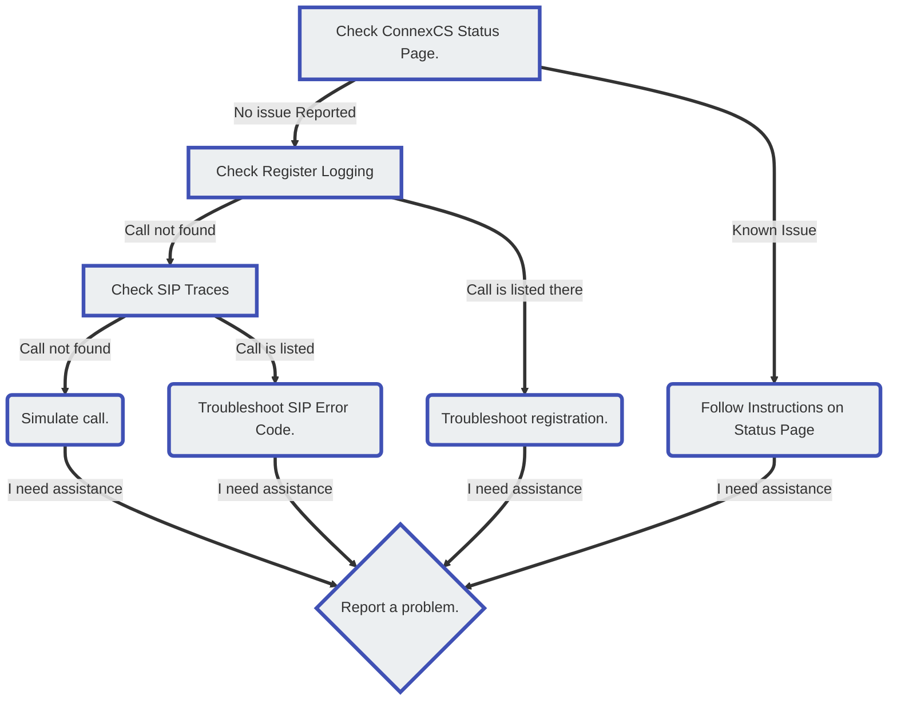

# Troubleshoot Signaling

 
<strong>Document Metadata</strong>
  

<strong>Category</strong>: Troubleshooting & Diagnostics / SIP Signaling Troubleshooting 
<strong>Audience</strong>: Administrators, Engineers, Support Team 
<strong>Difficulty</strong>: Intermediate to Advanced 
<strong>Time Required</strong>: Approximately 30–40 minutes 
<strong>Prerequisites</strong>: Active ConnexCS account with access to SIP logs, tracing tools, and the ability to capture signaling traces on your network or device 
<strong>Related Topics</strong>: <a href="https://docs.connexcs.com/guides/osi-model/">OSI Model – Networking Fundamentals</a>, <a href="https://docs.connexcs.com/makecall/">Make Call – API Reference</a>, <a href="https://docs.connexcs.com/guides/monitoring/">Monitoring & Alerts – Overview</a> 
<strong>Next Steps</strong>: After reviewing the signaling troubleshooting guide, capture a failed call’s SIP trace, identify anomalies (e.g., missing INVITE, BYE not received, authentication error), use the guide’s recommended checks (SIP headers, media negotiation, NAT issues), and document your findings for future reference or support escalation. 

Signaling is the process telephony systems use to establish a connection across a network or the internet. This includes functions such as device registration, setup, maintenance, and tear-down of calls.

As there are different signaling protocols used for various types of deployments, but ConnexCS uses the SIP protocol.

## Signaling Protocols

Use **SIP (Session Initiation Protocol)** to communicate between the customer's equipment and the ConnexCS platform. Also from ConnexCS to the providers / carriers that connect calls to the far end.

Messages get exchanged between each leg of a path, so the elements can agree to communicate.

Once a path establishes, meaning all the elements between the customer and the far end agree to carry the call, then the actual audio payload (or Media) of the call may begin.

While the call is active, SIP sends periodic confirmations, maintaining the call. When one end or the other hangs up, SIP then initiates the end of the call, as each point agrees to end the connection.

1. **Setup:** This is the process of connecting a call between our customer and an endpoint. It creates a path through various telecommunications devices along the way. This was either by the customer (outbound call) or from the far end (inbound call).

   For an outbound call placed by the customer, this is the part of the call after the customer dials the number when the customer's User Account Control (UAC) communicates with ConenxCS. It then determines where to send the call, and what caller-ID to display. All this information gets transmitted to the carrier until it reaches the destination number at the far end.

   This process gets reversed for calls destined for one of the customers. Also, we've no control over the information that's provided by the carrier delivering the call to the ConnexCS switch.

2. **Maintenance:** Once the call gets connected, SIP sends periodic registration messages while the call is active, so it doesn't get disconnected by mistake.

3. **Tear-Down:** The process of ending a call by closing down the SIP session between all the components in the path between the two endpoints.

!!! info "SIP on Wikipedia"
    For a detailed description of SIP, see the [**Wikipedia Session Initial Protocol article**](https://en.wikipedia.org/wiki/Session_Initiation_Protocol).

The tone you hear over the phone when you dial a number is **DTMF (Dual-Tone Multi-Frequency) / MF4 / Touch-Tone.**

The ConnexCS system uses DTMF between the customer's phone and their SIP-enabled device (UAC).

DTMF is only used to communicate with ConnexCS while using Class 5 features such as call conferencing or voicemail.  

!!! info "DTMF on Wikipedia"
    For a detailed description of SIP, see the [**Wikipedia Dual-Tone Multi-Frequency article**](https://en.wikipedia.org/wiki/Dual-tone_multi-frequency_signaling).

## Call Connectivity Issues

When calls don't connect or stay connected, it's related to signaling.

Signaling includes connecting, maintaining, and ending calls and related protocols.

Troubleshooting should focus on the customer equipment, the ConnexCS configuration, the carrier, or the far end.

!!! tip "Check for known issues"
    Before troubleshooting any issue, please check our [**Status Page**](https://status.connexcs.com/). We monitor 45+ metrics on each of our 30+ RTP servers.

    In the odd event that we experience media problems, it's possible that the problems are already on the **Status Page.** It saves you and your customer from unnecessary tasks in identifying the problem.

### Calls won't connect

Calls may fail to connect, whether placed by the customers or routed to them.

**Outbound calls** When outbound doesn't connect, the following reasons can be:

* Issue with the ConnexCS configuration
* Issue on the platform
* Issue with the carrier
* Issue with the far end / destination carrier / customer / configuration.

Suggested troubleshooting flow:

**Inbound calls** that aren't delivered to the correct destination. Also, the ConnexCS switch might not receive the call at all.

### Calls disconnect abruptly

* **Maintenance Issues:** Calls disconnect on their own (neither ends initiates the hang up, but the call disconnects)

### Calls don't disconnect after both sides hang up

* **Tear Down issues:** The consumer gets charged for a longer call time than the actual call time.

## Using Session Initiation Protocol Traces to Troubleshoot

ConnexCS records and stores SIP trace captures for all calls for 7 days.

You can access this data in [**Logging**](/logging).
