# IDE

 
<strong>Document Metadata</strong>
  

<strong>Category</strong>: Developer & Application Platform / IDE (Integrated Development Environment) 
<strong>Audience</strong>: Administrators, Engineers, Developers 
<strong>Difficulty</strong>: Intermediate to Advanced 
<strong>Time Required</strong>: Approximately 1–2 hours 
<strong>Prerequisites</strong>: Active ConnexCS account with platform-access; familiarity with application scripting, UI components, database concepts, and workflow logic. 
<strong>Related Topics</strong>: <a href="https://docs.connexcs.com/apps/architecture/architecture/">Apps Platform Architecture</a> 
<strong>Next Steps</strong>: Navigate to the IDE module, explore key components (Applications, Page Builder, Script Forge, Query Builder, etc.), start a new Project, define environment variables and data sources, then build and deploy your workflow or application within the ConnexCS ecosystem. 

## Overview

The **ConnexCS IDE** is a centralized workspace that enables you to build, customize, and manage applications within the ConnexCS platform.

It provides developers and administrators with all the tools required to create workflows, integrate services, and automate processes—without needing to switch between multiple systems.

The IDE is designed to support both visual configuration and custom scripting, making it flexible for a wide range of use cases.

## Key Components

### Applications

Manage all applications built within ConnexCS. [Click here](https://docs.connexcs.com/apps/architecture/app/) for more information.

### Button Builder

Create and customize UI buttons to trigger defined actions. [Click here](https://docs.connexcs.com/apps/architecture/button-builder/) for more information.

### Databases

Define and manage structured data storage for your applications. [Click here](https://docs.connexcs.com/apps/architecture/database/) for more information.

### Domain

Configure domain-level settings, including application-level mappings. [Click here](https://docs.connexcs.com/apps/architecture/domain/) for more information..

### Key Value Store

Store configuration parameters or dynamic values in a key-value format. [Click here](https://docs.connexcs.com/apps/architecture/key-value/) for more information. for more information. for more information.

### Page Builder

Build custom web pages and interfaces with a visual editor. [Click here](https://docs.connexcs.com/apps/page-builder/) for more information. for more information.

Various [drag and drop components](https://docs.connexcs.com/apps/components/alert/) of the page builder help you build the UI.

### ScriptForge

Write and manage scripts to add advanced logic, automation, and integrations. [Click here](https://docs.connexcs.com/apps/architecture/scriptforge/) for more information.

### Template

Create reusable templates. [Click here](https://docs.connexcs.com/apps/architecture/template/) for more information.

### Query Builder

This tool helps developers construct database queries. [Click here](https://docs.connexcs.com/apps/architecture/query-builder/) for more information.

### Project

Organize related applications, scripts, and resources into projects. [Click here](https://docs.connexcs.com/apps/architecture/project/) for more information.

### Pub / Sub Bus

Set up event-driven communication using the publish–subscribe messaging model. [Click here](https://docs.connexcs.com/apps/architecture/pub-sub/) for more information.

### Environmental Variables

Define and manage environment-specific variables, such as API keys or system configurations. [Click here](https://docs.connexcs.com/apps/architecture/environmental-variables/) for more information.

For detailed usage instructions and comprehensive guidance, please refer to our [Apps Platform documentation](https://docs.connexcs.com/apps/introduction/).

## Benefits of Using the ConnexCS IDE

1. **All-in-One Environment**: Access everything you need for development in one place.

2. **Flexibility**: Combine visual tools with code-based scripting for full customization.

3. **Scalability**: Build from simple workflows to complex telecom applications.

4. **Efficiency**: Reduce context switching by managing applications, logic, and configurations centrally.

## Step-by-Step IDE Guide

1. Login to your account.
2. Navigate to the **IDE** section. Click on the `+` (Create Resource) button.  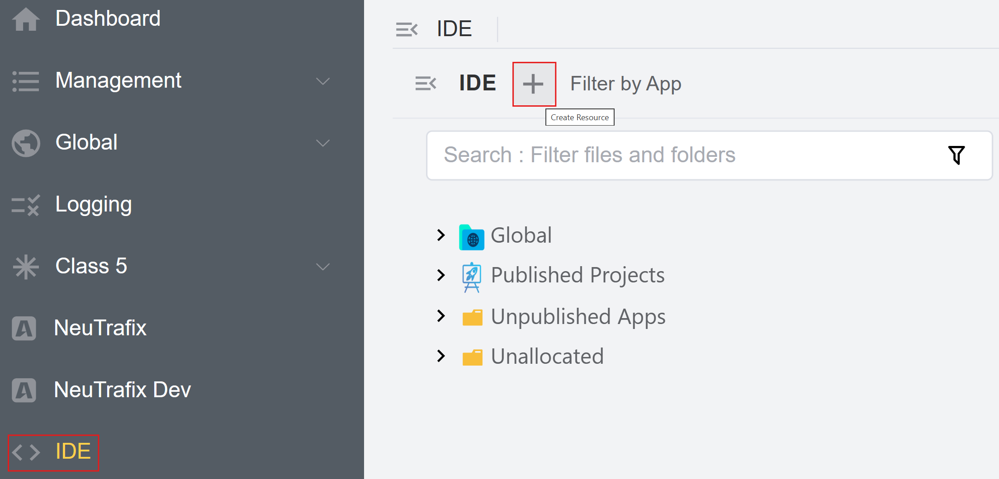 
3. Click on `App` and enter the `App Name`. Click on `Save and Continue`.  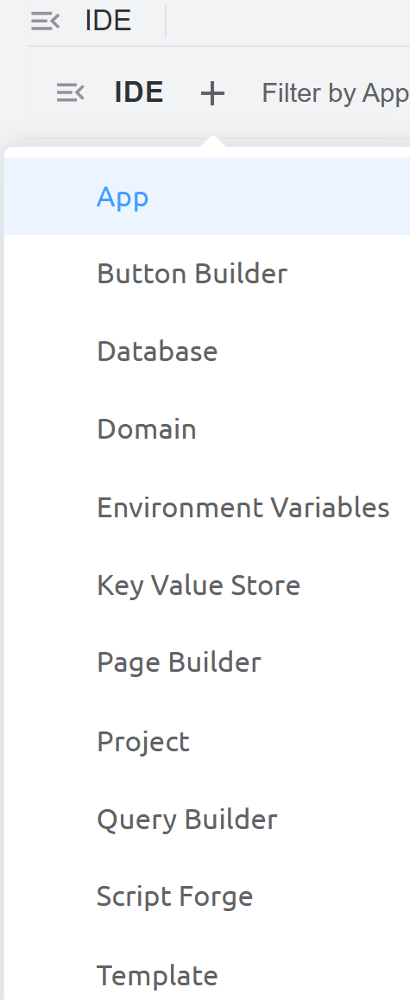  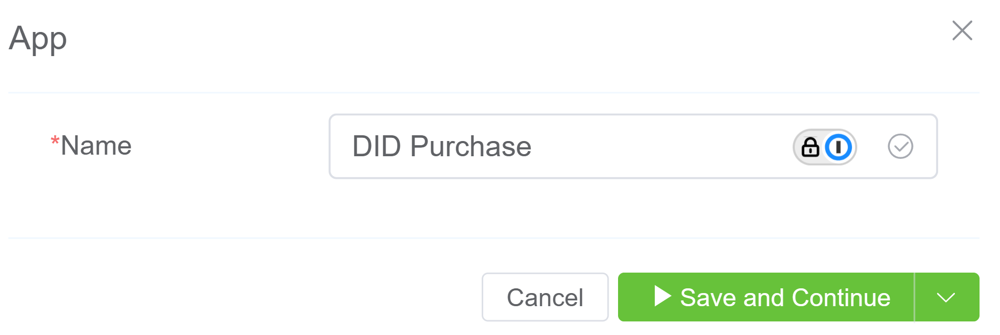 
4. The application is created under `Unpublished Apps`.  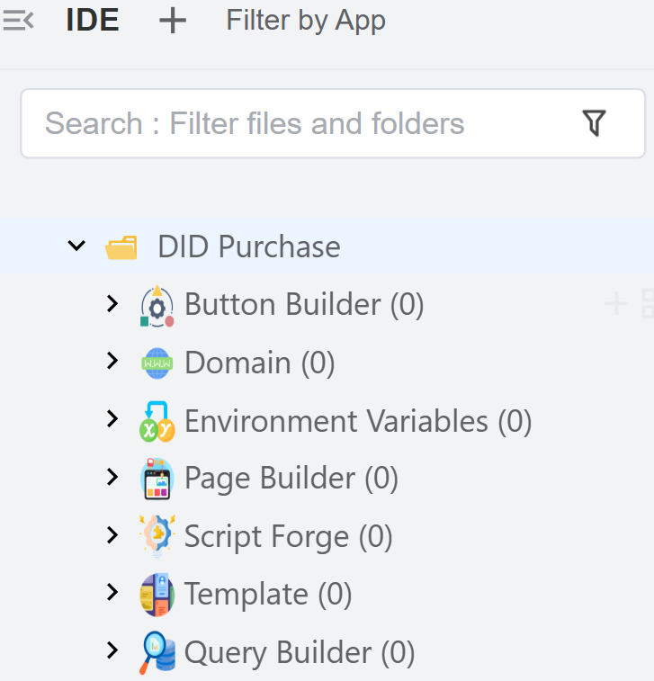 
5. **Create a Config Button**: Create and configure a button that appears in your application UI and performs specific actions.  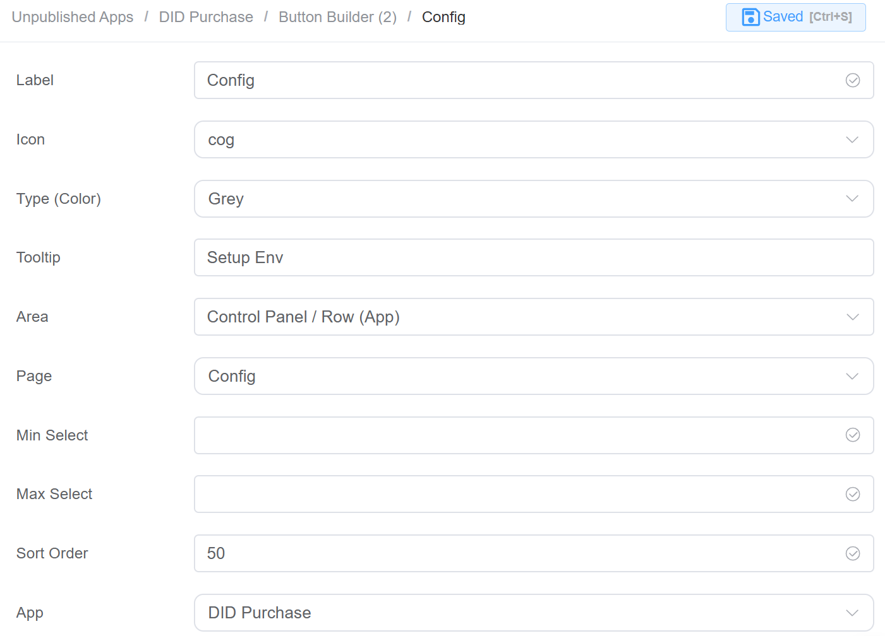 
   1. `Label`: The display name of the button.
   2. `Icon`: The icon shown alongside the button label.
   3. `Type (Color)`: Defines the button color/style.
   4. `Tooltip`: A short description shown when users hover over the button.
   5. `Area`: Determines where the button will appear in the UI.
   6. `Page`: Specifies which page opens when the button is clicked.
   7. `Min Select`: Minimum number of items a user must select before the button becomes active.
   8. `Max Select`: Maximum number of items allowed for selection when using the button.
   9. `Sort Order`: Controls the position of the button relative to other buttons.
   10. `App`: Specifies which application this button belongs to.
6. **Create a Purchase DID Now Button**.  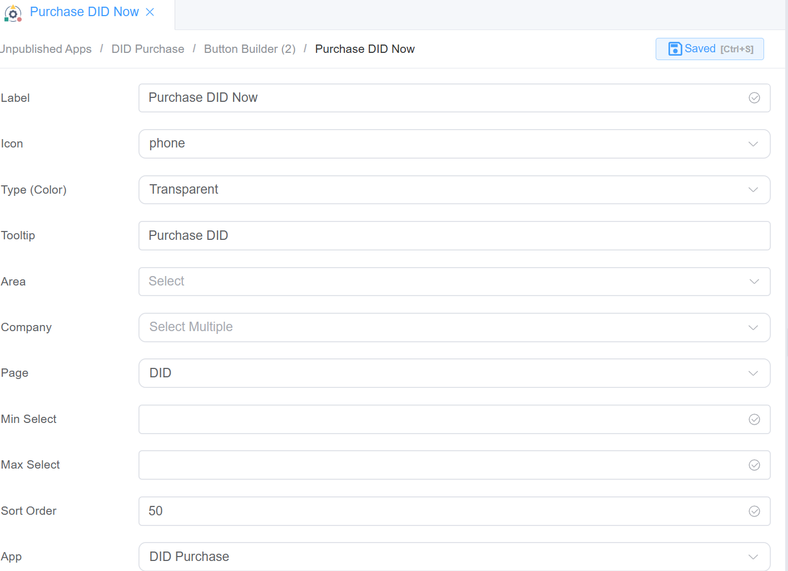 
7. **Create Environmental Variables**: This section is used to define configurable key–value pairs that can be used across the application for dynamic behavior and environment-specific settings.
   1. `App`: Specifies the application where the variable is used.
   2. `Key`: The name/identifier of the variable. Used in code or configuration to reference the value.
   3. `Value`: The actual value assigned to the key.
   4. `Flags`: These control how the variable behaves:
      1. **Protected**: Prdevents accidental modification or deletion.
      2. **Private**: Hides the value from general visibility (used for sensitive data like API keys).
      3. **Locked**: Restricts editing completely.
      4. `Default`: Marks this as the default value (used when no override is provided).
8. Create `Environmental Variables` for the following:
   1. The `currency` environmental variable is a configuration setting that defines which currency the application should use by default.  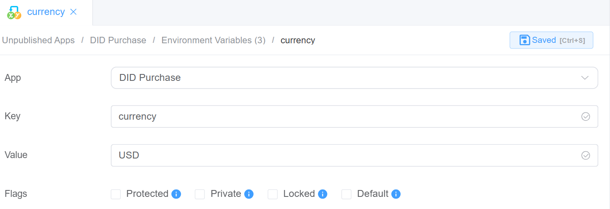 
   2. The`cx_api_user` environmental variable is used to store the username (or identifier) for API authentication within the application.  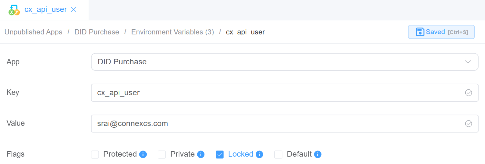 
   3. The `did_mask_size` environmental variable defines how many digits of a DID (phone number) should be masked/hidden. 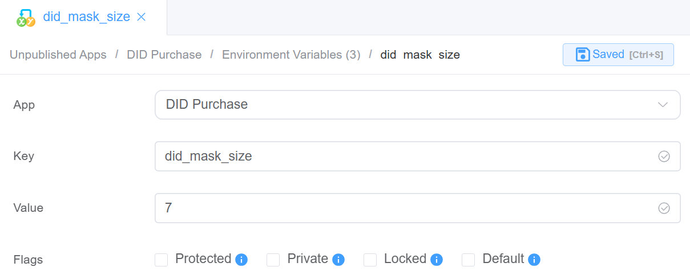 
9. Next step is to build the `UI` using `Page Builder`. This is for `Environment Variables Config`. This UI is a **form built using Page Builder components** to allow users to **view and update environment variables** for the application.

   1. **Container (env_card)**: A layout/card component that groups all fields together. Provides structure and visual separation.
   2. **Field: API User**:
      1. **Component Type:** Dropdown / Selec
      2. **Purpose:** Select the API user (`cx_api_user`). Dynamically populated from available users
   3. **Field: Currency**:
      1. **Component Type:** Text Input
      2. **Purpose:** Set the default currency (`currency`)

   4. **Field: DID Mask Size**:
      1. **Component Type:** Number / Text Input
      2. **Purpose:** Define how many digits to mask (`did_mask_size`)

   5. **Actions**

         * **Confirm Button**: Saves updated values to environment variables.
         * **Cancel Button**: Closes the form without saving changes

   6. **How It Works (Behind the Scenes)**

         * Each field is **mapped to an environment variable key**
         * On **Confirm**, values are:
         * Stored in the **Environment Variables module**
         * Used dynamically across the app

   7. **Dialog Component Attributes**

         | Field|Description |
         |------|------------| 
         **Type** | Defines the component type (here, a Dialog popup). |
         | **ID** | Unique identifier used to reference this dialog in logic or actions (`env_config`). |
         | **Title** | The heading displayed at the top of the dialog. |
         | **Width** | Controls the width of the dialog (e.g., `35rem`).|
         | **Visible** | Toggles whether the dialog is shown or hidden. |
         | **Center** | Aligns the dialog to the center of the screen if enabled. |
         | **Show Close** | Displays a close (X) button on the dialog. |
         | **Show Cancel Button** | Enables the Cancel button at the bottom. |
         | **Button Text (Cancel)** | Defines the label for the Cancel button. |
         | **Show Confirm Button** | Enables the Confirm button. |
         | **Loading (Confirm)** | Shows a loading state on the Confirm button during processing. |
         | **Margin Top** | Adds spacing from the top of the screen (e.g., `15vh`). |  
         | **Prevent Escape Key Close** | Disables closing the dialog using the Escape key. |
         | **Custom Class** | Allows applying custom CSS styling to the dialog. |
         | **Attribute Action (Data Binding)** | Enables binding the dialog data dynamically to variables or state.|

         **Action Settings**

         | Action | Description|
         | -------|------------|
         | **onCancel**  | Defines what happens when the Cancel button is clicked (e.g., close dialog or reset state). |
         | **onConfirm** | Defines what happens when the Confirm button is clicked (e.g., save environment variables). |

         **Configure the Form Attributes**

         | Field | Description |
         | ------|-------------|
         | **UI (Element / Ant Design / Vuetify)** | Selects the UI framework used for form components and styling.|
         | **Form Width** | Defines the overall width of the form (e.g., `100%` for full width). |
         | **Label Position** | Controls where labels appear relative to input fields (Left, Right, Top). |
         |**Label Width** | Sets the fixed width of labels (e.g., `100px`).  |
         | **Label Suffix**  | Adds a suffix (like `:`) after labels when enabled. |
         | **Size** | Defines the size of form components (Large, Default, Small). |
         | **Style Sheets** | Allows applying custom styling or themes to the form. |
         | **Custom Class** | Assigns a custom CSS class for additional styling or control.|
         | **Log Level** | Sets the logging level for debugging (e.g., Warn, Info, Error).|
         | **Data Source**  | Configures where the form gets or sends its data (binding/API).|
         | **Action Panel** | Defines actions like submit, reset, or custom operations for the form.|
         | **Javascript CDN Library** | Allows adding external JS libraries via CDN for extended functionality.|

10. Define the `Data source settings` under `Form Attributes`.
    1. `saveEnv`: 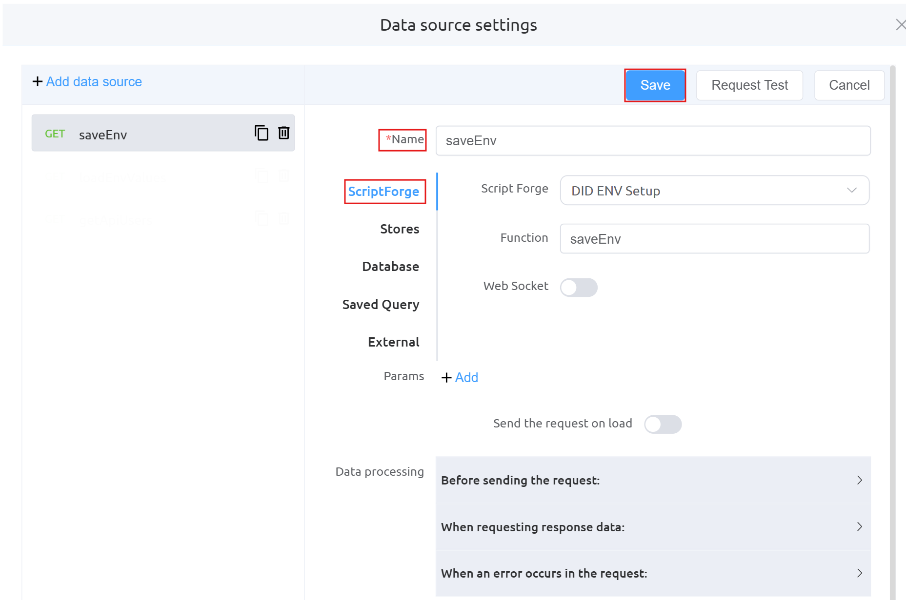 
    2. `loadEnvValues`:  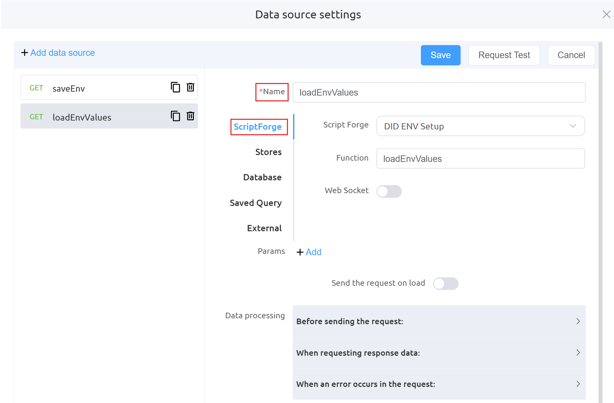 
    3. `getApiUsers`:  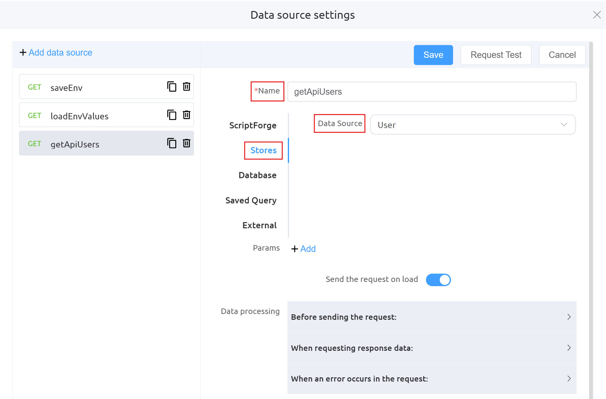  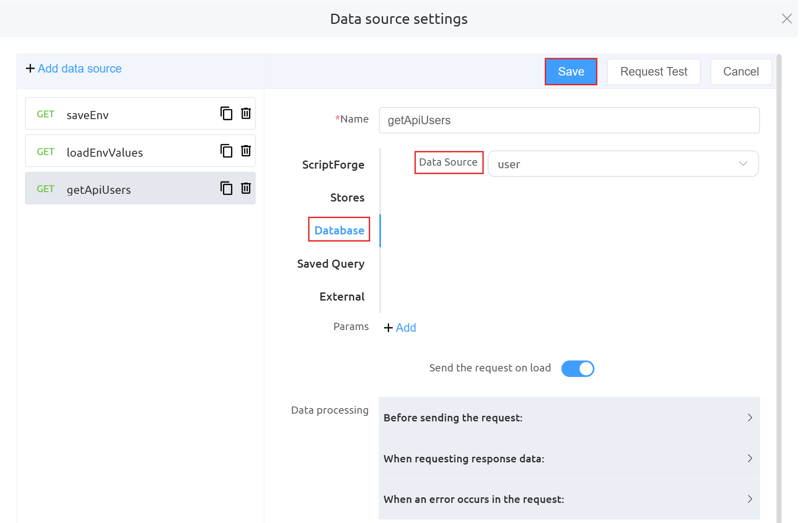  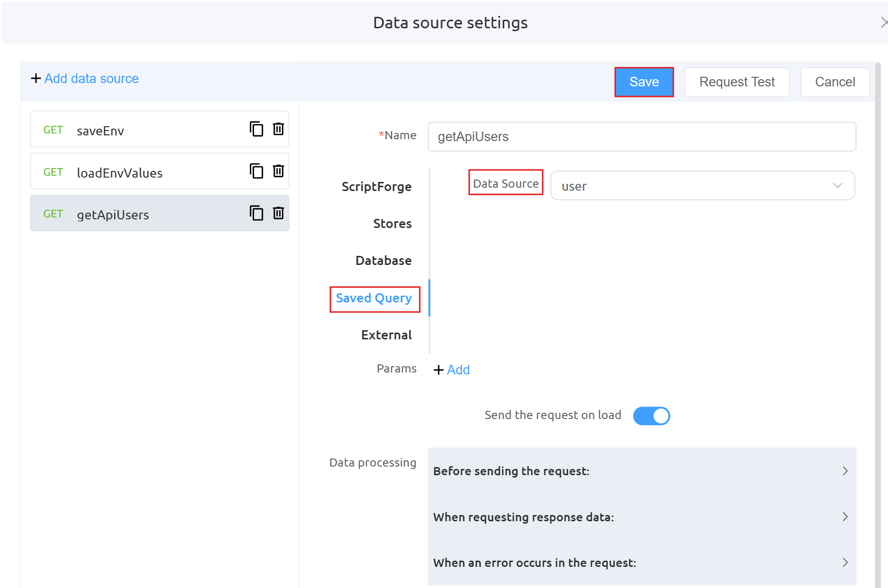 
    4. `Data Processing`:  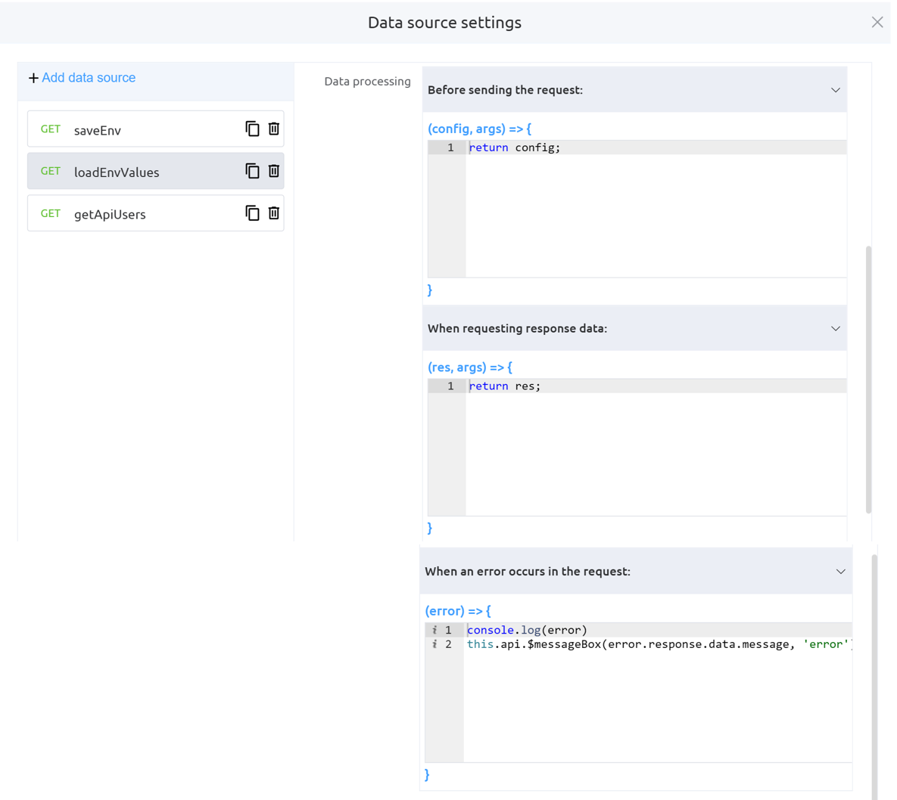 

---

