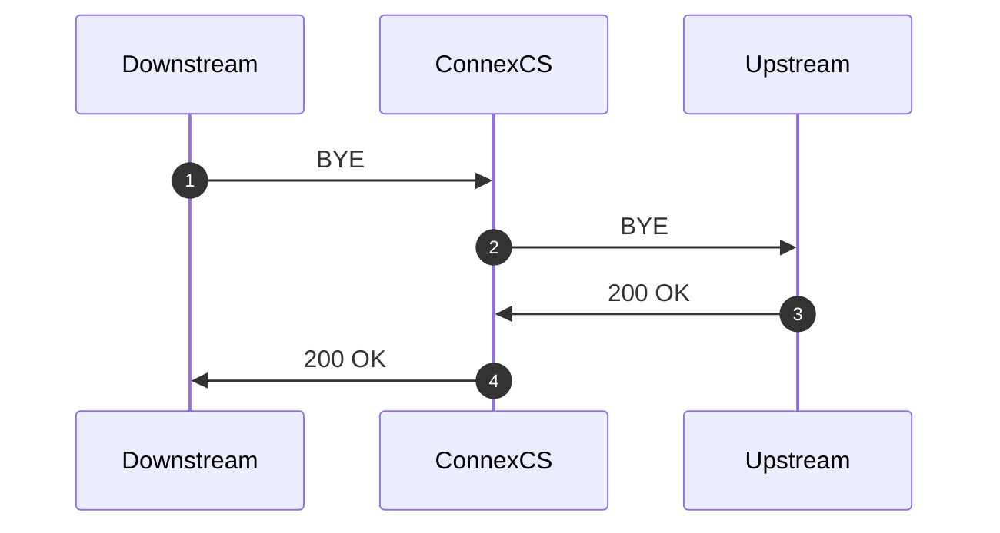
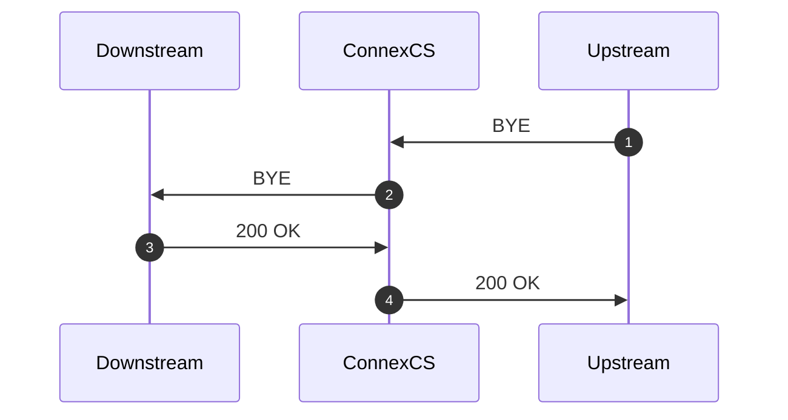
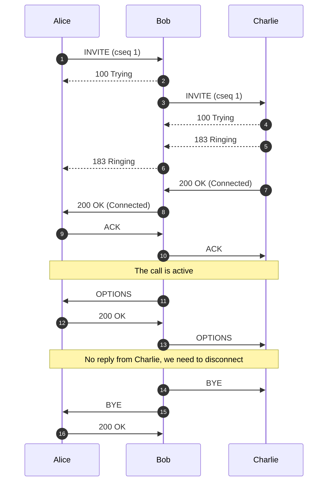

# Logging

**:material-menu-right: Logging**

The **Logging** function checks real-time call attempts, Session Initiation Protocol (SIP) traces, routing status, and simulates a call.

As soon as a call hits the ConnexCS system, it will display in the Logging area. The majority of issue debugging takes place in the Logging section.

## Register Logging

To view calls that are having issues registering, click **`Register Logging`**, and then click on a specific Call ID to view the [**Call Details**](https://docs.connexcs.com/logging/#call-id-details) and [**SIP Trace**](https://docs.connexcs.com/logging/#sip-traces).

## Fraud Logging

View the log of Fraud events. See [**Setup Fraud Detection**](https://docs.connexcs.com/setup/advanced/fraud/#setup-a-fraud-detection) for configuration.

## Simulate

Simulating calls lets providers identify areas of concern or just verify functionality, by testing in different setups and operational configurations.

To Simulate Calls:

Click **`Simulate`** either from the **Logging** screen or from within a specific **Call ID**:

&emsp;![alt text][logging-4]

+ **Dialed Number**: Where the call will end (destination).
+ **CLI/ANI**: Where the call will originate from (configured on ConnexCS).
+ **Switch IP**: Where the call will traverse.
+ **Customer IP**: The ConnexCS Customer IP address is where the call will originate.
+ **Registered User**: (Optional) Enter a SIP extension user.
+ **Routing Engine**: Select the regional zone.

Click **`Simulate`**.

The simulation call result will appear in logging. The Call ID will begin with a **`SIM`** tag. Click the Call ID to view the call's routing status.

!!! info "Testing a fixed issue"

    After you have fixed a routing issue with a specific call, you can go into the Call ID and run the Simulate tool to ensure any routing issues get resolved and the call is now successful.

## Searching the Logs

To search the Logs, at the top-right of the Logging page, enter the search for calls by phone number, Call ID, or IP address into the text box and click **`Search`**.

### Call ID Details

Click on a specific Call ID to view details and run call tools.

+ **Call Details**: The initial screen shows current details, which include Routing Status, Authentication, Induced PDD (Post-Dial Delay), Real-time Transfer Protocol (RTP), Routing Engine ID, Dual-Tone Multi-Frequency (DTMF), and more information.

    At the bottom, view the Providers, Billing details, and RTP information such as Jitter and Packet Loss.

+ **Raw Data**: Underlying data that populates the call.
  
+ **SIP Trace**: Visual representation of SIP communications, see details in **SIP Traces**.
  
+ **Simulate**: See details above for **Simulating Calls**.
  
+ **Class5**: If you use the Class5 system, there will be some extra information, such as Request Parameters.
  
+ **Refresh**: For Live calls, use **`Refresh`** to reload the logs to show the most recent changes. This is necessary, as some data processing happens through the CDR before it's displayed.

!!! Tip "More on Call-IDs"
    See [**Call-ID**](/guides/howto/callid) for further information and troubleshooting.

## Call Release Reasons

The causes of a dropped call are:

 1. **Downstream BYE:** When the call disconnects from the **originator's** side via a **BYE** message. 

 2. **Upstream BYE:** When the call disconnects from the **receiver** side via a **BYE** message.

 3. **MI Termination:** The system terminates the call when it finds that there has been no audio connection between the call's originator and the receiver.

     The system triggers a BYE message on both sides within the application.

 4. **Ping Timeout:** If you enable the Sip Ping feature under Customer:material-menu-right: Routing, the receiver and originator receives OPTION packets (every X seconds).
     The originator and the receiver should reply with 200 OK after receiving the OPTION packets. If either the originator or receiver misses sending the acknowledgment, the call terminates due to a "ping timeout."
     It prevents any long-duration calls as the system recognizes either the originator or receiver as inactive.
      Here's an example:

     **Missing SIP Ping Call Disconnection**

In this case, when we send the OPTION packet to Charlie, he doesn't reply. The OPTION message disappears and we need to disconnect the call.

Another scenario is when ConnexCS sends message to Charlie and Charlie is active on the call, he will send a BYE message to Alice and we won't see a reply to that.

5. **Missing ACK:** If a call gets disconnected within 5 seconds, its because an Acknowledgement wasn't received

6. **Missing SIP Ping:** If a call gets disconnected within 20-30 seconds, its because of a missing SIP Ping.

7. **Missing Re-Invite:** If a call gets disconnected within 5 minutes, its because of a missing Re-Invite message.

8. **Lifetime Timeout:** The reasons for a lifetime timeout can be due to:
   + **Max Call Duration**
   + **Missing ACK** or other specific missing in call packets
   + We received a BYE message when the call is still ringing

9.  **Re-INVITE Ping Timeout (Upstream / Downstream):** It happens since the Dialog ended because there was no reply to re-invite pings.

10. **SIP Race Condition:** A SIP race condition is a situation that occurs when two or more processes try to access and change a shared resource together. This results in unexpected behavior.

    A race condition can occur in SIP if several messages get transmitted and received together. Also, their order of processing isn't well-defined. This can lead to inconsistencies in the state of the SIP system, as different messages may have conflicting effects on the system.

    For example, consider a SIP system in which two users, Alice and Bob, are trying to establish a call with each other. If Alice and Bob both send SIP INVITE messages at the same time, and these messages get processed all together by the SIP server; it's possible that the server will receive the messages in an order that's different from the order in which they got transmitted. This could lead to a race condition, as the server may not be able to determine the correct state of the call.

    To avoid race conditions, it's important to carefully design the protocol used to communicate between SIP components and to use appropriate mechanisms to ensure that messages get processed in the correct order.

    Also, if we've a CANCEL message, but upstream sends a 183 / 200, which means they haven't received the CANCEL message.