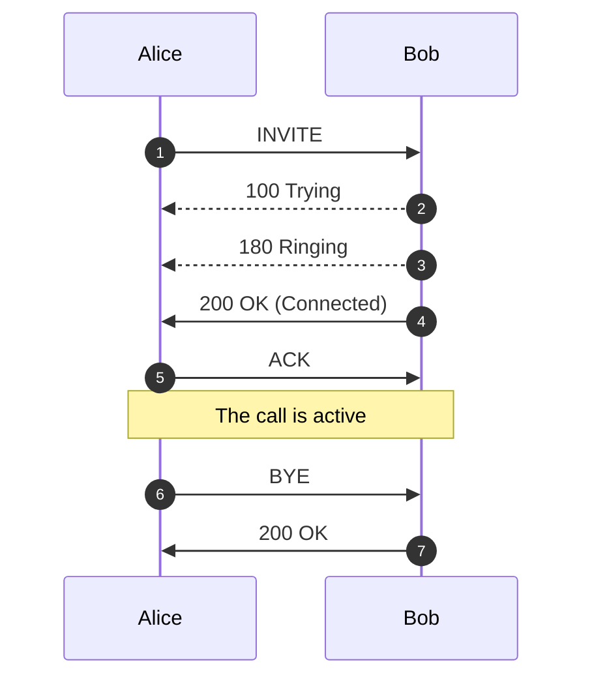
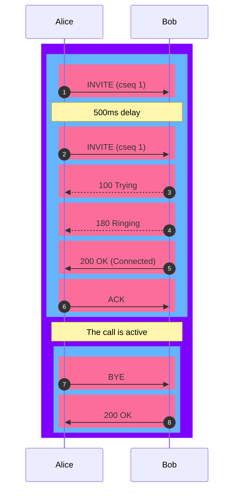
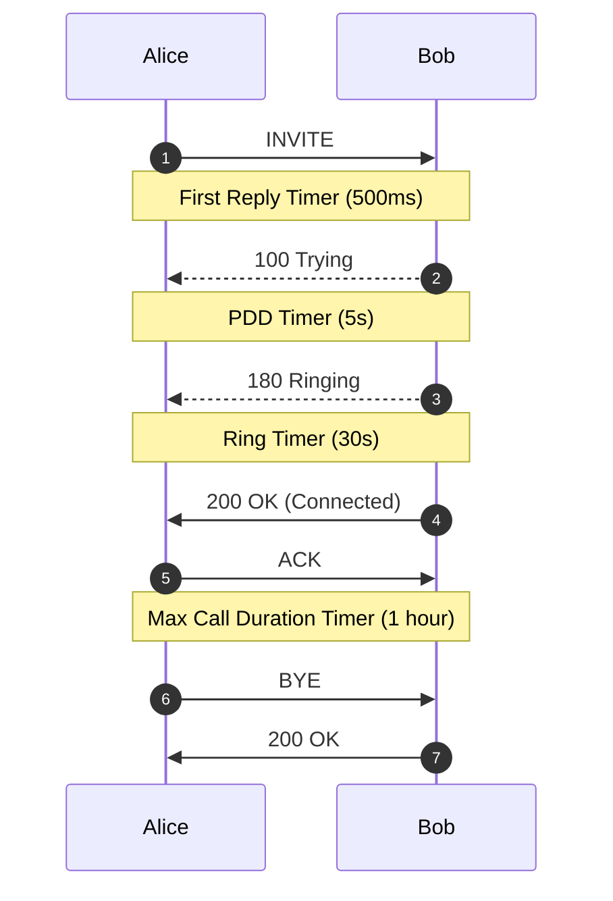
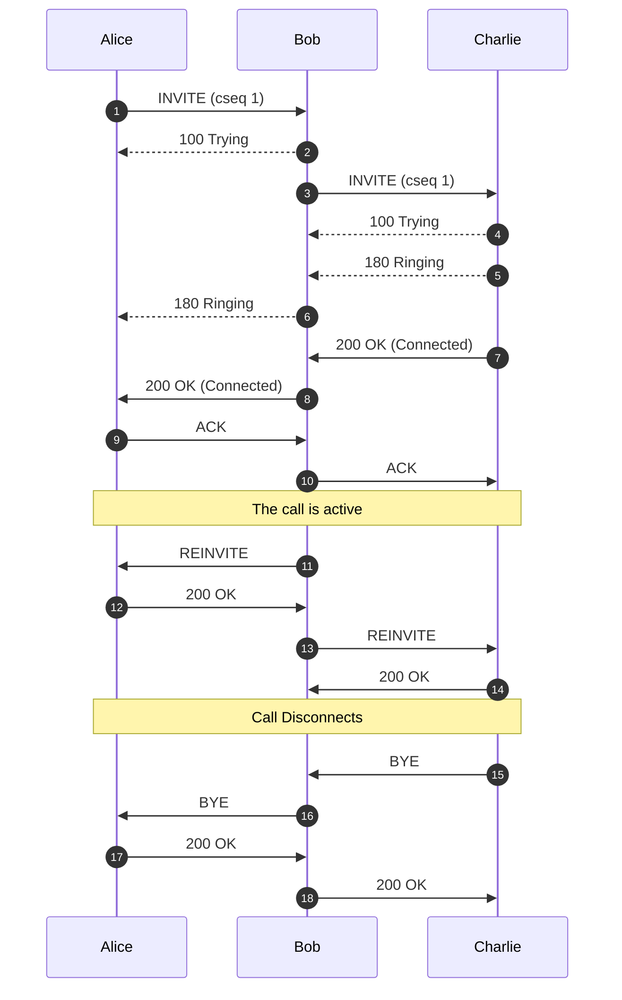

# Logging

**:material-menu-right: Logging**

The **Logging** function checks real-time call attempts, Session Initiation Protocol (SIP) traces, routing status, and simulates a call.

As soon as a call hits the ConnexCS system, it will display in the Logging area. The majority of issue debugging takes place in the Logging section.

## Register Logging

To view calls that are having issues registering, click **`Register Logging`**, and then click on a specific Call ID to view the [**Call Details**](https://docs.connexcs.com/logging/#call-id-details) and [**SIP Trace**](https://docs.connexcs.com/logging/#sip-traces).

## Fraud Logging

View the log of Fraud events. See [**Setup Fraud Detection**](https://docs.connexcs.com/setup/advanced/fraud/#setup-a-fraud-detection) for configuration.

## Simulate

Simulating calls lets providers identify areas of concern or just verify functionality, by testing in different setups and operational configurations.

To Simulate Calls:

Click **`Simulate`** either from the **Logging** screen or from within a specific **Call ID**:

&emsp;![alt text][logging-4]

+ **Dialed Number**: Where the call will end (destination).
+ **CLI/ANI**: Where the call will originate from (configured on ConnexCS).
+ **Switch IP**: Where the call will traverse.
+ **Customer IP**: The ConnexCS Customer IP address is where the call will originate.
+ **Registered User**: (Optional) Enter a SIP extension user.
+ **Routing Engine**: Select the regional zone.

Click **`Simulate`**.

The simulation call result will appear in logging. The Call ID will begin with a **`SIM`** tag. Click the Call ID to view the call's routing status.

!!! info "Testing a fixed issue"

    After you have fixed a routing issue with a specific call, you can go into the Call ID and run the Simulate tool to ensure any routing issues get resolved and the call is now successful.

## Searching the Logs

To search the Logs, at the top-right of the Logging page, enter the search for calls by phone number, Call ID, or IP address into the text box and click **`Search`**.

### Call ID Details

Click on a specific Call ID to view details and run call tools.

+ **Call Details**: The initial screen shows current details, which include Routing Status, Authentication, Induced PDD (Post-Dial Delay), Real-time Transfer Protocol (RTP), Routing Engine ID, Dual-Tone Multi-Frequency (DTMF), and more information.

    At the bottom, view the Providers, Billing details, and RTP information such as Jitter and Packet Loss.

+ **Raw Data**: Underlying data that populates the call.
  
+ **SIP Trace**: Visual representation of SIP communications, see details in **SIP Traces**.
  
+ **Simulate**: See details above for **Simulating Calls**.
  
+ **Class5**: If you use the Class5 system, there will be some extra information, such as Request Parameters.
  
+ **Refresh**: For Live calls, use **`Refresh`** to reload the logs to show the most recent changes. This is necessary, as some data processing happens through the CDR before it's displayed.

!!! Tip "More on Call-IDs"
    See [**Call-ID**](/guides/howto/callid) for further information and troubleshooting.

### SIP Traces

**SIP Tracing** is a diagnostic tool for phone systems using SIP (Session Initiation Protocol) for interactions across trunks and between endpoints. Traces give detailed information about calls and call attempts while debugging and troubleshooting.

Uses of SIP protocol include call setup, maintenance, and tear-down, this tool is typically used only for call connection issues.

Call quality issues are often identified using other methods.

Here is an example describing a SIP trace:

Alice and Bob represent the parties on the call. Alice sends an **INVITE** packet to Bob. Then Bob sends a **100 Trying** (provides you the feedback that your request is getting processed by a SIP Application) message together with **180 Ringing** (the Destination User Agent has received the INVITE message and is alerting the user of the call).

Further, **200 OK** is sent which means the calls are connected.

The **ACK** message is sent from Alice to Bob confirming that the call has been connected.

!!! info "SIP Trace Captures"
    The **ConnexCS** system supports always-on **SIP Trace** capture.

    We keep a record of every packet sent and received by your server over the last seven (7) days.

To view the SIP Trace of a call:

1. Click a **Call ID** to view its SIP traces.
2. Click **`SIP traces`** to view the SIP trace.

      ![alt text][logging-sip]

3. Toggle between Relative Time and Absolute Time for a specific time of day.
4. Options to download as Text or an Image.

!!! note "Known issues with SIP Traces"

    * **Missing SIP data**: SIP traces aren't always guaranteed. SIP packets are carried by UDP, which may cause the traces to be lossy at times. You can expect this due to the nature of the architecture.
    * **Missed call attempts**: If using SIP authentication, because there are two requests, it's possible that they hit our database out of order. This may cause the logging page to only display the first call attempt.
    * Considered for reporting calls and don't impact the calls directly. They're both rare, typically observed in less than 1 in every 50,000 calls.

### **Re-Transmissions** 
Re-transmissions occur when the same INVITE is sent more than once. This means the `same` packets were sent more than once.

Re-transmissions only happen on UDP. Re-transmissions occur when packets either don't reach the receiver or get lost in transmission. Thus, re-transmissions are done after a certain time interval using specific timers.

Here is an example describing Re-transmissions:

Alice and Bob represent the parties on the call. Alice sends an INVITE packet to Bob. INVITE is an initial request.

Then Bob sends a 100 Trying (provides you the feedback that your request is getting processed by a SIP Application) message along with 180 Ringing (the Destination User Agent has received the INVITE message and is alerting the user of the call). 100 Trying and 180 Ringing are provisional responses.

The re-invites get absorbed when they're received. When Bob receives the INVITE packet and a special timer is set (please see the below timer table) as to how long it should wait for re-transmissions. If any packet is received within this time frame, the packet gets ignored.

Further, 200 OK is sent which means the calls are connected. 200 OK is a final reply.

The ACK is message is sent from Alice to Bob confirming that the call has been connected.

Each line is a Message.

From 1 message (INVITE) to message 5 (ACK), it's considered as a single Transaction.

Similarly, messages 6 (BYE) and 7 (200 OK) are also considered as a single Transaction.

From message 1 to message 7, the whole conversation is a Dialog.

!!! note "Note"
    Message displayed in Pink color.
    Transaction displayed in Blue color.
    Dialog displayed in Violet color.

You can have take a look at the various SIP Timers in the table below:

|**Timer**|**Default value**|**Section**|**Meaning**|
|-------------|-------------------------|-------------|------------------------------------------------------------------------------|
| **T1** | 500 ms | 17.1.1.1 | Round-trip time (RTT) estimate|
| **T2** | 4 sec.| 17.1.2.2| Maximum retransmission interval for non-INVITE requests and INVITE responses |
| **T4** | 5 sec.| 17.1.2.2| Maximum duration that a message can remain in the network|
| **Timer A** | initially T1| 17.1.1.2 | INVITE request retransmission interval, for UDP only |
| **Timer B** | 64*T1| 17.1.1.2| INVITE transaction timeout timer |
| **Timer D** | > 32 sec. for UDP| 17.1.1.2 | Wait time for response retransmissions|
|| 0 sec. for TCP and SCTP|
| **Timer E** | initially T1| 17.1.2.2 | Non-INVITE request retransmission interval, UDP only|
| **Timer F** | 64*T1| 17.1.2.2| Non-INVITE transaction timeout timer|
| **Timer G** | initially T1| 17.2.1| INVITE response retransmission interval|
| **Timer H** | 64*T1| 17.2.1| Wait time for ACK receipt|
| **Timer I** | T4 for UDP| 17.2.1| Wait time for ACK retransmissions|
|| 0 sec. for TCP and SCTP|
| **Timer J** | 64*T1 for UDP| 17.2.2| Wait time for retransmissions of non-INVITE requests|
| | 0 sec. for TCP and SCTP|
| **Timer K** | T4 for UDP| 17.1.2.2| Wait time for response retransmissions|

*Table source*: [**IBM**](https://www.ibm.com/docs/en/was/8.5.5?topic=timers-sip-timer-summary); *Original Ref*: [**RFC 3261**](https://www.ietf.org/rfc/rfc3261.txt)

+ **Various Timers**

Here, Alice sends an invite to Bob and it's expected to get a reply (100 Trying) within in 500ms which is a **First Reply Timer**.

Then a **PDD timer** is set for 5s to hear the ringing. Post-dial delay (PDD) is the measurement of how long it takes for a calling party to hear a ring-back tone after initiating a call.

The time from when the respondent's phone starts ringing until it's answered; is a **Ring Timer**.

When the call is active **Max Call Duration Timer** comes into the picture. When this timer is active, the active call gets disconnected when it reaches the maximum time of an active call.

[logging-sip]: /misc/img/logging-sip.png "SIP Traces"
[logging-4]: /misc/img/236.png "logging-4"

### Re-Invite

In case of a Re-Invite, it re-establishes an entire call.

Here, Alice starts a call with Bob, the call is active without any issues and the media is through UK. But as a provider we detect the call isn't going through UK. Thus, we send the Re-Invite to Alice to send the media through us and we can place the call on a different server in real-time and in the middle of the call. Thus, a Re-Invite can contain some extra information also.

## Call Release Reasons

The causes of a dropped call are:

 1. **Downstream BYE:** When the call disconnects from the **originator's** side via a **BYE** message.
 2. **Upstream BYE:** When the call disconnects from the **receiver** side via a **BYE** message.
 3. **MI Termination:** The system terminates the call when it finds that there has been no audio connection between the call's originator and the receiver.

     The system triggers a BYE message on both sides within the application.

 4. **Ping Timeout:** If you enable the Sip Ping feature under Customer:material-menu-right: Routing, the receiver and originator receives OPTION packets (every X seconds).
     The originator and the receiver should reply with 200 OK after receiving the OPTION packets. If either the originator or receiver misses sending the acknowledgment, the call terminates due to a "ping timeout."
     It prevents any long-duration calls as the system recognizes either the originator or receiver as inactive.

5. **Missing ACK:** We can if a call gets disconnected within 5 seconds, its because an Acknowledgement wasn't received

6. **Missing SIP Ping:** We can if a call gets disconnected within 20-30 seconds, its because of a missing SIP Ping.

7. **Missing Re-Invite:** We can if a call gets disconnected within 5 minutes, its because of a missing Re-Invite message.