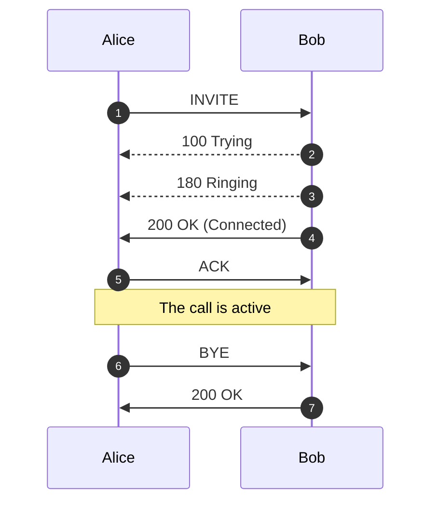
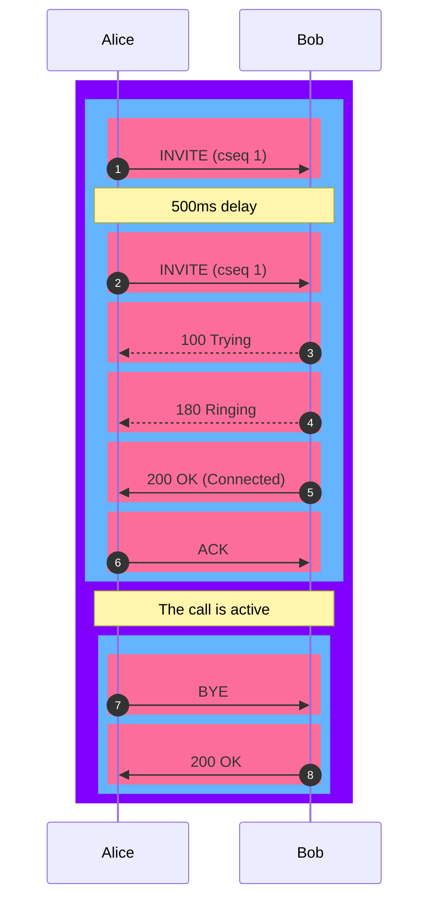

# Logging

 
<strong>Document Metadata</strong>
  

<strong>Category</strong>: Monitoring & Diagnostics / Logging & Audit Trails 
<strong>Audience</strong>: Administrators, Engineers, Support Team 
<strong>Difficulty</strong>: Intermediate 
<strong>Time Required</strong>: Approximately 25–35 minutes 
<strong>Prerequisites</strong>: Active ConnexCS account with access to the Logging module, ability to navigate call-records and SIP trace logs 
<strong>Related Topics</strong>: <a href="https://docs.connexcs.com/guides/tshoot-signal/">Troubleshooting – Signaling</a>, <a href="https://docs.connexcs.com/guides/call-disconnection-reasons/">Call Disconnection Reasons</a> 
<strong>Next Steps</strong>: After reviewing the logging guide, locate a set of recent call-records, filter for problem calls (errors, drops), export SIP traces for deeper analysis, and set up a routine review of log alerts (e.g., elevation in error codes) to proactively track system health. 

**:material-menu-right: Logging**

The **Logging** function checks real-time call attempts, Session Initiation Protocol (SIP) traces, routing status, and simulates a call.

As soon as a call hits the ConnexCS system, it will display in the Logging area. The majority of issue debugging takes place in the Logging section.

**Why do need a Logging Section?**

+ **Efficient Debugging**: Helps identify and resolve system issues quickly.
+ **Call Flow Analysis**: Tracks call routing and detects irregularities.
+ **Security Monitoring**: Logs unauthorized access attempts and suspicious activities.
+ **Performance Optimization**: Provides insights into system performance and helps with fine-tuning configurations.
+ **Regulatory Compliance**: Maintains records for audits and compliance requirements

## Register Logging

To view calls that are having issues registering, click **`Register Logging`**, and then click on a specific Call ID to view the [**Call Details**](https://docs.connexcs.com/logging/#call-id-details) and [**SIP Trace**](https://docs.connexcs.com/logging/#sip-traces).

## Fraud Logging

View the log of Fraud events. See [**Setup Fraud Detection**](https://docs.connexcs.com/setup/advanced/fraud/#setup-fraud-detection) for configuration.

## Simulate

Simulating calls lets providers identify areas of concern or just verify functionality, by testing in different setups and operational configurations.

To Simulate Calls:

Click **`Simulate`** either from the **Logging** screen or from within a specific **Call ID**:

+ **Dialed Number**: Where the call will end (destination).
+ **CLI/ANI**: Where the call will originate from (configured on ConnexCS). [Click here to know more](https://docs.connexcs.com/customer/cli/#cli-routing-rules)
+ **Switch IP**: Where the call will traverse.
+ **Customer IP**: The ConnexCS Customer IP address is where the call will originate.
+ **Registered User**: (Optional) Enter a SIP extension user.
+ **Routing Engine**: Select the regional zone.

Click **`Simulate`**.

The simulation call result will appear in logging. The Call ID will begin with a **`SIM`** tag. Click the Call ID to view the call's routing status.

!!! info "Testing a fixed issue"

    After you have fixed a routing issue with a specific call, you can go into the Call ID and run the Simulate tool to ensure any routing issues get resolved and the call is now successful.

## Compare (Call IDs)

**Compare Call IDs** refers to the process of analyzing two or more Call IDs to identify differences and similarities in their call logs.

This comparison helps in diagnosing issues by examining factors such as switch, user agent, start time, CLI, end time,proocol, sip_code, sip_reason, port number etc.

It's particularly useful for troubleshooting by highlighting discrepancies between successful and failed calls.

### How to use?

1. Login to your **Control Panel**.
2. Navigate to **:material-menu-right: Logging**.
3. Right click on the Call-IDs and click `Add to Compare`. 
4. You also have the option to `Remove from Compare` to deselect the Call IDs.
5. A **Compare** field will appear on the right corner. 
6. Click `Compare`, a widow will appear where you need to select the Call IDs for comparison. 
7. Check `View only difference lines` to view only the parameters of call logs that differ between two Call IDs. 
8. Once the comparison is complete, you can `Clear Compare` to reset all the Call IDs comparisons.

## Searching the Logs

To search the Logs, at the top-right of the Logging page, enter the search for calls by phone number, Call ID, or IP address into the text box and click **`Search`**.

### Call ID Details

Click on a specific Call ID to view details and run call tools.

+ **Call Details**: The initial screen shows current details, which include Routing Status, Authentication, Induced PDD (Post-Dial Delay), Real-time Transfer Protocol (RTP), Routing Engine ID, Dual-Tone Multi-Frequency (DTMF), and more information.

    At the bottom, view the Providers, Billing details, Graphs, and Logs of the respective call.

    + **Graphs**: It will display parameters like Re=ound Trip Time, MOS, Jitter, and Packet Loss, only if the call experiences any of these issues.

*Click each tab for field explanations:*

=== "SIP Trace"

    Visual representation of SIP communications, see details in SIP Traces.

=== "RTCP Reports"

    RTCP (Real-time Transport Control Protocol) reports provide **real-time voice quality and network performance metrics** for RTP media streams.
    
    In ConnexCS, RTCP data is aggregated hookup by call and presented to help **NOC, QA, and engineering teams** assess call quality, diagnose issues, and validate SLA compliance.
    
    +. **Duration**: Indicates the total time span of media activity that RTCP (control protocol) data covers for a call or media session.
    +. **MOS Score (Mean Opinion Score)**: Its a numerical representation of perceived voice quality, modeled to approximate what a human listener would rate the call.  **Scale**  1.0 → Poor (unusable)  3.0 → Fair (noticeable issues)  4.0+ → Good to Excellent  5.0 → Ideal (theoretical maximum) 
    +. **Packet Loss**: It easures the percentage of RTP media packets that were sent but not received.
    +. **Jitter**: It measures the variation in arrival time of RTP packets, not the delay itself.
    + **Quality Metrics Section**: It summarizes **voice quality performance** calculated from RTCP data over the duration of the call. These metrics reflect how the call would be perceived by an end user.   1. **MOS (Mean Opinion Score)**: It represents **perceived audio quality** on a scale from **1.0 (poor)** to **5.0 (excellent)**.  **Fields Explained** 
    
    | **Field**|**Description**|
    | ---------|---------------|
    | **Mean** | Average MOS calculated across all RTCP reports received during the call.|
    | **Median**| Middle MOS value when all samples are ordered. Useful for identifying skewed results. |
    | **Min**| Lowest MOS observed during the call.|
    | **Max**| Highest MOS observed during the call.|
    | **Std Dev**| Variability of MOS values across the call.|
    | **Assessment** | Quality classification derived from MOS thresholds.|
    
     2. **R-Factor**: Its a network quality score derived using the **ITU-T E-Model (G.107)**. It reflects the combined impact of **latency, jitter, packet loss, and codec behavior**.  * Scale: **0 to 100**  * Higher values indicate better call quality.   **Fields Explained** 
    
    | Field| Description|
    | -----|------------|
    | **Mean**| Average R-Factor across all RTCP samples.|
    | **Median**| Middle R-Factor value.|
    | **Min**| Lowest R-Factor observed.|
    | **Max**| Highest R-Factor observed.|
    | **Std Dev**| Degree of variation in network quality.|
    | **Assessment** | Quality classification based on R-Factor thresholds. |

        **Relationship Between MOS and R-Factor**: 

        * **R-Factor** measures **network performance**
        * **MOS** represents **user-perceived audio quality**
        * ConnexCS derives **MOS** from **R-Factor** and** RTCP statistics**.

    * **Network Statistics**: It represents **RTCP-derived network performance metrics** for the RTP media stream. These metrics describe the **health and stability of the network path** between the source and destination during the call.
    
          1. **Packet Loss Statistics**: It indicates RTP packets that were **not successfully received**. Even small loss can cause audio gaps or distortion.  **Fields Explained** 

            | Field| Description|
            |------|------------| 
            | **Mean**| Average packet loss percentage across all RTCP reports.|
            | **Median**| Middle packet loss value, useful for identifying spikes.|
            | **Min**| Lowest observed packet loss during the call.|
            | **Max**| Highest observed packet loss during the call.|
            | **95th Percentile** | Packet loss level below which 95% of samples fall. Highlights worst-case behavior. |
            | **Cumulative Lost** | Total number of RTP packets lost over the call duration.|

          2. **Jitter Statistics**: It measures the **variation in packet arrival time**. High jitter can cause buffering, delay, or choppy audio.  **Fields Explained** 

            | Field| Description|
            | -----|------------|
            | **Mean**| Average jitter across all RTCP samples (milliseconds). |
            |**Median**| Middle jitter value.|
            | **Min**| Lowest jitter observed.|
            | **Max**| Highest jitter observed.|
            | **95th Percentile** | Jitter value below which 95% of samples fall.|
            | **Std Dev**| Degree of jitter variation over time.|

          3. **Network Endpoints**: This section identifies the **media endpoints** involved in the RTP stream.

             1. **Source Endpoint**: It represents the **originating RTP media source** (IP address and UDP port).
             2. **Destination Endpoint**: It represents the **receiving RTP media endpoint**.

    + **Sender Information**: It summarizes **RTCP Sender Report (SR)** data for the RTP media stream. It describes the **media characteristics and transmission behavior** of the sending endpoint during the call. <be>This data is used to: 

          * Validate codec and bitrate usage
          * Confirm media continuity
          * Correlate media duration with signaling
          * Support quality and capacity analysis 
        
         **Sender Metrics** 
    
        |**Field**|**Description**|
        |---------|---------------|
        |**Report Count**|Number of RTCP Sender Reports received from the sending endpoint.  A single report indicates a **short-duration call** or limited reporting interval. |
        |**Total Packets**|Total RTP packets transmitted by the sender during the reported duration.|
        |**Total Data**|Total media payload size sent over RTP.|
        |**Primary Codec**|Codec used by the sender for media encoding.|
        |**Bitrate (Mean)**|Average RTP payload bitrate sent during the call.|
        |**Bitrate (Range)**| Minimum and maximum bitrate observed.  Identical values indicate **stable transmission with no bitrate fluctuation**. ||**Total Duration**|Total media transmission time reported by the sender.|
        |**Duration (Mean)**|Average duration per RTCP report. Matches total duration due to a single report. |
        |**Codec Distribution**|describes the set of audio or video codecs used during a media session and how frequently each codec appears over time.|

    + **Direction Analysis**: Its the process of analyzing RTP/RTCP media metrics independently for inbound (RX) and outbound (TX) streams to identify directional call quality and network performance issues.

    + **SSRC Details**: SSRC (Synchronization Source Identifier) is a unique identifier used in RTP and RTCP to distinguish individual media streams within a session.  In ConnexCS, SSRC details are used to track, correlate, and analyze media streams across RTCP reports. 

    + **Alerts**:It highlights **RTCP anomalies or protocol-level conditions** detected during media analysis.  Alerts do **not always indicate poor call quality**—they are intended to surface **diagnostic or signaling irregularities** that may require investigation. 

=== "RTCP Stats"

    |**Section**|**Parameter**| **Description**|
    | ----------|-------------|--------------- |
    | **Summary** | **Total Reports**| Total number of RTCP reports received during the call. Indicates how many quality samples were collected over time. |
    |             | **Avg MOS**| Average Mean Opinion Score across all RTCP reports, representing overall perceived audio quality.|
    |             | **Avg Packet Loss** | Average percentage of RTP packets lost across all reports. |
    |             | **Avg Jitter**| Average variation in packet arrival time across the call, measured in milliseconds.|

    **Quality Metrics Over Time**

    | Parameter| Description|
    | ---------|------------|
    | **MOS (Time Series)**| MOS values plotted over time to show consistency or variation in perceived audio quality during the call. |
    | **R-Factor (Time Series)** | R-Factor values plotted over time, representing network quality as calculated by the E-Model. |
    | **Time Axis**| Timestamp of each RTCP report sample, showing when metrics were recorded.|

    **MOS Score Trend**

    | Parameter| Description|
    | ---------|------------|
    | **MOS Bar Value** | Individual MOS score reported at each RTCP interval.|
    | **Consistency**| Identical values indicate stable perceived audio quality throughout the call. |

    **Packet Loss & Jitter**

    | Parameter| Description|
    | ---------|----------- |
    | **Packet Loss %** | Percentage of RTP packets lost at each RTCP interval.|
    | **Jitter (ms)** | Packet arrival time variation at each RTCP interval.|
    | **Dual Axis**| Loss and jitter are plotted together to correlate timing instability with packet loss. |

    **Codec Distribution**

    | Parameter| Description|
    | ---------|------------|
    |**Codec Name**| Audio codec used in RTP media transmission (e.g., G.711).|
    |**Report Count per Codec** | Number of RTCP reports associated with each codec.|
    |**Unknown Codec**| Reports where codec information was not available in RTCP data.|
    |**Distribution Chart**| Visual breakdown showing codec usage proportions during the call. |

    **Traffic by Direction**

    | Parameter| Description|
    |----------|------------|
    | **Source → Destination**| RTP traffic flow direction represented by source IP:port to destination IP:port. |
    |**Directional Traffic Share** | Visual representation of how much media traffic flowed in each direction.|
    |**Directional Analysis**| Helps identify asymmetric or one-way media behavior.|

    **Bitrate & Packet Count**

    | Parameter| Description|
    | ---------|------------|
    | **Bitrate (kbps)**| RTP payload bitrate over time, indicating bandwidth usage by the codec.|
    | **Packet Count**| Number of RTP packets transmitted during each RTCP interval.|
    | **Correlation Curve** | Shows relationship between bitrate and packet volume over time.|
    | **Peak Bitrate**| Maximum observed bitrate during the call.|

=== "Logs"

    Provides a chronological trace of call setup processing, showing how the system evaluated an incoming call against CLI policies, destination rules, recording configuration, and routing logic before allowing or rejecting the call.  Each entry in the log reflects a policy check or routing decision executed by the platform, confirming that the call was validated against all applicable controls before proceeding.  It captures the decision flow applied at call time, including: 

    1. Whether the incoming destination number or CLI was rewritten.
    2. Whether the CLI matched any configured rules.
    3. Whether call recording was applied.
    4. Which routing mode and selection strategy were used.
    5. Whether the destination number (DN) was evaluated against global blocklists and allow lists.
    6. Whether the CLI (ANI) was evaluated against global and custom blocklists.

=== "Raw Data"
    Underlying data that populates the call.

### SIP Traces

**SIP Tracing** is a diagnostic tool for phone systems using SIP (Session Initiation Protocol) for interactions across trunks and between endpoints. Traces give detailed information about calls and call attempts while debugging and troubleshooting.

Uses of SIP protocol include call setup, maintenance, and tear-down, this tool is typically used only for call connection issues.

Call quality issues are often identified using other methods.

Here is an example describing a SIP trace:

Alice and Bob represents party on the call. Alice sends an **INVTE** packet to Bob. Then Bob sends a **100 Trying** (provides you the feedback that your request is getting processed by a SIP Application) message together with **180 Ringing** (the Destination User Agent has received the INVITE message and is alerting the user of call).

Further, **200 OK** is sent which means the calls are connected.

The **ACK** is message is sent from Alice to Bob confirming that the call has been connected.

After the call is over the **BYE** message is sent.
!!! info "SIP Trace Captures"
    The **ConnexCS** system supports always-on **SIP Trace** capture.

    We keep a record of every packet sent and received by your server over the last seven (7) days.

To view the SIP Trace of a call:

1. Click a **Call ID** to view its SIP traces.
2. Click **`SIP traces`** to view the SIP trace.

      

3. Toggle between Relative Time and Absolute Time for a specific time of day.
4. Options to download as Text or an Image.

!!! note "Known issues with SIP Traces"

    * **Missing SIP data**: SIP traces aren't always guaranteed. SIP packets are carried by UDP, which may cause the traces to be lossy at times. You can expect this due to the nature of the architecture.
    * **Missed call attempts**: If using SIP authentication, because there are two requests, it's possible that they hit our database out of order. This may cause the logging page to only display the first call attempt.
    * Considered for reporting calls and don't impact the calls directly. They're both rare, typically observed in less than 1 in every 50,000 calls.

+ **Re-Transmissions:** Re-transmissions occur when the same INVITE gets transmitted more than once. This means the `same` packets were sent more than once.

    Re-transmissions only happen on UDP.
    Re-transmissions occur when packets either don't reach the receiver or get lost in transmission. Thus re-transmissions are done after a certain time interval using specific timers.

    Here is an example describing Re-transmissions:

Alice and Bob represents party on the call. Alice sends an **INVTE** packet to Bob. INVITE is an initial request.

Then Bob sends a **100 Trying** (provides you the feedback that your request is getting processed by a SIP Application) message along-with **180 Ringing** (the Destination User Agent has received the INVITE message and is alerting the user of call). **100 Trying** and **180 Ringing** are provisional response.

The re-invtes get absorbed when they're received. When Bob receives the **INVITE** packet and a special timer is set (please see the below timer table) as to how long it should wait for re-transmissions. If any packet is received within this time-frame, the packet gets ignored.

Further, **200 OK** is sent which means the calls are connected. **200 OK** is a final reply.

The **ACK** is message is sent from Alice to Bob confirming that the call has been connected.

Each line is a **Message**.

From 1 message (INVITE) till message 5 (ACK), it's considered as a single **Transaction**.

Similarly message 6 (BYE) and 7 (200 OK) are also considered as a single **Transaction**.

From message 1 till message 7, the whole conversation is a **Dialog**.

!!! note "Note"
    Message displayed in Pink color.
    Transaction displayed in Blue color.
    Dialog displayed in Violet color.

Here is an example describing Re-transmissions:

Alice and Bob represents party on the call. Alice sends an **INVTE** packet to Bob. INVITE is an initial request.

Then Bob sends a **100 Trying** (provides you the feedback that your request is getting processed by a SIP Application) message along-with **180 Ringing** (the Destination User Agent has received the INVITE message and is alerting the user of call). **100 Trying** and **180 Ringing** are provisional response.

The re-invtes get absorbed when they're received. When Bob receives the **INVITE** packet and a special timer is set (please see the below timer table) as to how long it should wait for re-transmissions. If any packet is received within this time-frame, the packet gets ignored.

Further, **200 OK** is sent which means the calls are connected. **200 OK** is a final reply.

The **ACK** is message is sent from Alice to Bob confirming that the call has been connected.

Each line is a **Message**.

From 1 message (INVITE) till message 5 (ACK), it's considered as a single **Transaction**.

Similarly message 6 (BYE) and 7 (200 OK) are also considered as a single **Transaction**.

From message 1 till message 7, the whole conversation is a **Dialog**.

!!! note "Note"
    Message displayed in Pink color.
    Transaction displayed in Blue color.
    Dialog displayed in Violet color.

You can have take a look at the various SIP Timers in the table below:

|**Timer**|**Default value**|**Section**|**Meaning**|
|---------|-----------------|-----------|-----------|
| **T1** | 500 ms | 17.1.1.1 | Round-trip time (RTT) estimate|
| **T2** | 4 sec.| 17.1.2.2| Maximum retransmission interval for non-INVITE requests and INVITE responses |
| **T4** | 5 sec.| 17.1.2.2| Maximum duration that a message can remain in the network|
| **Timer A** | initially T1| 17.1.1.2 | INVITE request retransmission interval, for UDP only |
| **Timer B** | 64*T1| 17.1.1.2| INVITE transaction timeout timer |
| **Timer D** | > 32 sec. for UDP| 17.1.1.2 | Wait time for response retransmissions|
|| 0 sec. for TCP and SCTP|
| **Timer E** | initially T1| 17.1.2.2 | Non-INVITE request retransmission interval, UDP only|
| **Timer F** | 64*T1| 17.1.2.2| Non-INVITE transaction timeout timer|
| **Timer G** | initially T1| 17.2.1| INVITE response retransmission interval|
| **Timer H** | 64*T1| 17.2.1| Wait time for ACK receipt|
| **Timer I** | T4 for UDP| 17.2.1| Wait time for ACK retransmissions|
|| 0 sec. for TCP and SCTP|
| **Timer J** | 64*T1 for UDP| 17.2.2| Wait time for retransmissions of non-INVITE requests|
| | 0 sec. for TCP and SCTP|
| **Timer K** | T4 for UDP| 17.1.2.2| Wait time for response retransmissions|

*Table source*: [**IBM**](https://www.ibm.com/docs/en/was/8.5.5?topic=timers-sip-timer-summary); *Original Ref*: [**RFC 3261**](https://www.ietf.org/rfc/rfc3261.txt)

[logging-sip]: /misc/img/logging-sip.png "SIP Traces"

### Decode Identity header in SIP Trace

1. Click on the **INVITE** packet in the SIP Trace.
2. A window will appear with **Raw** and **Shaken** tabs. Only if you are signing calls using **Shaken** certificate.
3. The **Shaken** tab will have the decoded information from the **Raw** tab like **Algorithm**, **Public Certificate URL**, **Attestation Level**, **Dialled Number**, **[CLI](https://docs.connexcs.com/customer/cli/#cli-routing-rules)**, **Unique Customer ID**, **Timestamp**.

## Call Release Reasons

The causes of a dropped call are:

 1. **Downstream BYE**: When the call disconnects from the **originator's** side via a **BYE** message.
 2. **Upstream BYE**: When the call disconnects from the **receiver** side via a **BYE** message.
 3. **MI Termination**: The system terminates the call when it finds that there has been no audio connection between the call's originator and the receiver.

     The system triggers a BYE message on both sides within the application.

 4. **Ping Timeout**: If you enable the Sip Ping feature under Customer:material-menu-right: Routing, the receiver and originator receives OPTION packets (every X seconds).

    The originator and the receiver should reply with 200 OK after receiving the OPTION packets. If either the originator or receiver misses sending the acknowledgment, the call terminates due to a "ping timeout."

    It prevents any long-duration calls as the system recognizes either the originator or receiver as inactive.
