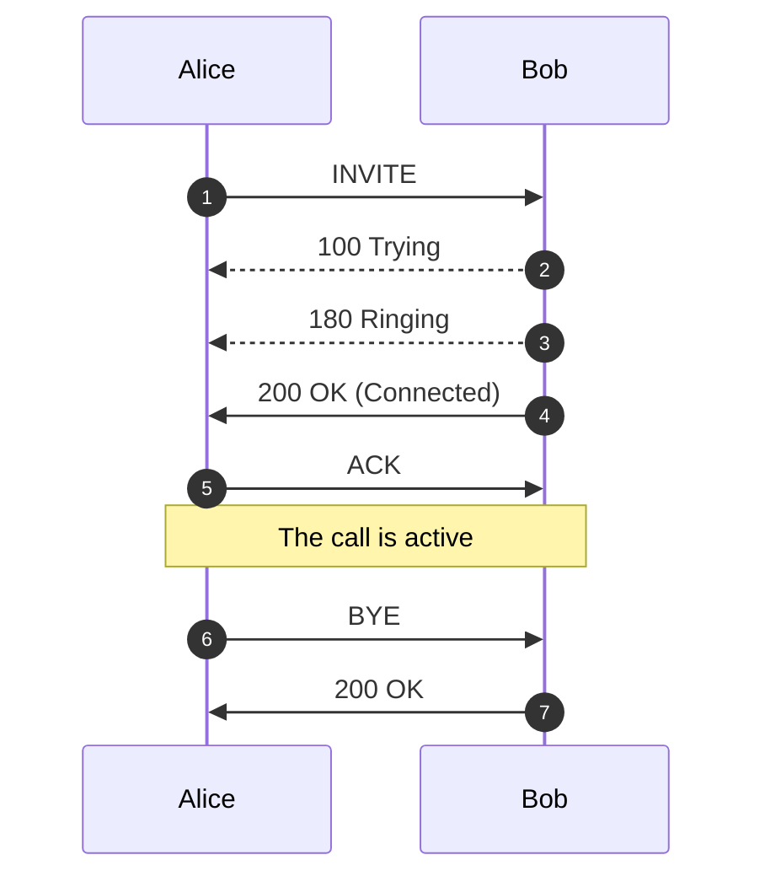
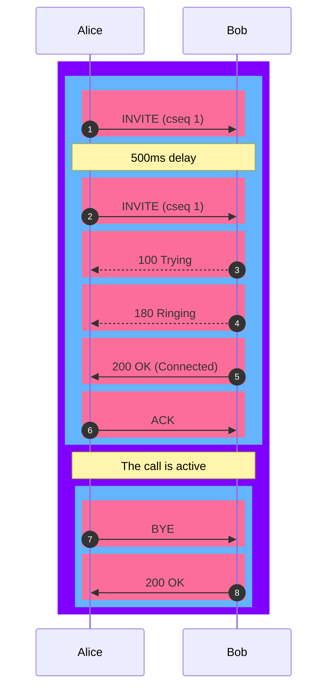

# Logging

 
<strong>Document Metadata</strong>
  

<strong>Category</strong>: Monitoring & Diagnostics / Logging & Audit Trails 
<strong>Audience</strong>: Administrators, Engineers, Support Team 
<strong>Difficulty</strong>: Intermediate 
<strong>Time Required</strong>: Approximately 25–35 minutes 
<strong>Prerequisites</strong>: Active ConnexCS account with access to the Logging module, ability to navigate call-records and SIP trace logs 
<strong>Related Topics</strong>: <a href="https://docs.connexcs.com/guides/tshoot-signal/">Troubleshooting – Signaling</a>, <a href="https://docs.connexcs.com/guides/call-disconnection-reasons/">Call Disconnection Reasons</a> 
<strong>Next Steps</strong>: After reviewing the logging guide, locate a set of recent call-records, filter for problem calls (errors, drops), export SIP traces for deeper analysis, and set up a routine review of log alerts (e.g., elevation in error codes) to proactively track system health. 

**:material-menu-right: Logging**

The **Logging** function checks real-time call attempts, Session Initiation Protocol (SIP) traces, routing status, and simulates a call.

As soon as a call hits the ConnexCS system, it will display in the Logging area. The majority of issue debugging takes place in the Logging section.

**Why do need a Logging Section?**

+ **Efficient Debugging**: Helps identify and resolve system issues quickly.
+ **Call Flow Analysis**: Tracks call routing and detects irregularities.
+ **Security Monitoring**: Logs unauthorized access attempts and suspicious activities.
+ **Performance Optimization**: Provides insights into system performance and helps with fine-tuning configurations.
+ **Regulatory Compliance**: Maintains records for audits and compliance requirements

## Register Logging

To view calls that are having issues registering, click **`Register Logging`**, and then click on a specific Call ID to view the [**Call Details**](https://docs.connexcs.com/logging/#call-id-details) and [**SIP Trace**](https://docs.connexcs.com/logging/#sip-traces).

## Fraud Logging

View the log of Fraud events. See [**Setup Fraud Detection**](https://docs.connexcs.com/setup/advanced/fraud/#setup-fraud-detection) for configuration.

## Simulate

Simulating calls lets providers identify areas of concern or just verify functionality, by testing in different setups and operational configurations.

To Simulate Calls:

Click **`Simulate`** either from the **Logging** screen or from within a specific **Call ID**:

+ **Dialed Number**: Where the call will end (destination).
+ **CLI/ANI**: Where the call will originate from (configured on ConnexCS). [Click here to know more](https://docs.connexcs.com/customer/cli/#cli-routing-rules)
+ **Switch IP**: Where the call will traverse.
+ **Customer IP**: The ConnexCS Customer IP address is where the call will originate.
+ **Registered User**: (Optional) Enter a SIP extension user.
+ **Routing Engine**: Select the regional zone.

Click **`Simulate`**.

The simulation call result will appear in logging. The Call ID will begin with a **`SIM`** tag. Click the Call ID to view the call's routing status.

!!! info "Testing a fixed issue"

    After you have fixed a routing issue with a specific call, you can go into the Call ID and run the Simulate tool to ensure any routing issues get resolved and the call is now successful.

## Compare (Call IDs)

**Compare Call IDs** refers to the process of analyzing two or more Call IDs to identify differences and similarities in their call logs.

This comparison helps in diagnosing issues by examining factors such as switch, user agent, start time, CLI, end time,proocol, sip_code, sip_reason, port number etc.

It's particularly useful for troubleshooting by highlighting discrepancies between successful and failed calls.

### How to use?

1. Login to your **Control Panel**.
2. Navigate to **:material-menu-right: Logging**.
3. Right click on the Call-IDs and click `Add to Compare`. 
4. You also have the option to `Remove from Compare` to deselect the Call IDs.
5. A **Compare** field will appear on the right corner. 
6. Click `Compare`, a widow will appear where you need to select the Call IDs for comparison. 
7. Check `View only difference lines` to view only the parameters of call logs that differ between two Call IDs. 
8. Once the comparison is complete, you can `Clear Compare` to reset all the Call IDs comparisons.

## Searching the Logs

To search the Logs, at the top-right of the Logging page, enter the search for calls by phone number, Call ID, or IP address into the text box and click **`Search`**.

### Call ID Details

Click on a specific Call ID to view details and run call tools.

+ **Call Details**: The initial screen shows current details, which include Routing Status, Authentication, Induced PDD (Post-Dial Delay), Real-time Transfer Protocol (RTP), Routing Engine ID, Dual-Tone Multi-Frequency (DTMF), and more information.

    At the bottom, view the Providers, Billing details, Graphs, and Logs of the respective call.

    + **Graphs**: It will display parameters like Re=ound Trip Time, MOS, Jitter, and Packet Loss, only if the call experiences any of these issues.

+ **RTCP Reports**: It provides a complete view of **call quality, network performance, media direction, and detected issues**.

1. **Quality Metrics**: Provides a high-level summary of perceived and technical call quality derived from RTCP reports.

2. **Metrics Displayed**:

|Parameter|Description|
|---------|-----------|
|**MOS (Mean Opinion Score)**|Calculated score representing perceived audio quality on a scale from 1.0 (Poor) to 5.0 (Excellent).|
|**R-Factor**|Technical quality score (0–100) used internally to derive MOS.|
|**Packet Loss (%)**|Percentage of RTP packets lost during transmission.|
|**Jitter (ms)**|Variation in RTP packet arrival time.|
|**Duration**| Time period over which RTCP data was collected, including the number of RTCP reports received.

3. **Statistical Breakdown**: Each metric includes:

* Mean
* Median
* Minimum
* Maximum
* Standard Deviation

These values allow identification of both overall call quality and short-term degradation.

+ **Network Statistics**: Provides detailed RTCP network-level measurements observed during the call.

1. **Purpose**:

* Network troubleshooting
* Identifying congestion or instability
* Correlating quality issues with transport behaviour

2. **Typical Information**:

* Packet transmission statistics
* Packet loss trends
* Timing and delivery variation
* Network consistency over the call duration

This data helps determine whether issues are caused by **network conditions rather than application or routing logic**.

+ **Sender Information**

The **Sender Information** tab displays RTCP data related to the RTP stream sender.

1. **Purpose**

* Which endpoint transmitted the media
* Transmission characteristics of the sender
* Potential sender-side quality issues

This information is useful when diagnosing asymmetric or one-directional quality problems.

+ **Direction Analysis**: It separates RTCP metrics by media direction.

1. **Description**: RTCP data is analysed independently for:

* Caller → Callee
* Callee → Caller

2. Use Cases

* Identifying one-way audio issues
* Diagnosing direction-specific packet loss or jitter
* Determining whether degradation is isolated to a single media path

This view is critical for troubleshooting issues that do not affect both parties equally.

+ **SSRC Details**: Provides per-stream RTCP statistics using SSRC (Synchronization Source) identifiers.

1. **Description**: Each RTP media stream is identified by a unique SSRC. This tab allows inspection of:

* Individual RTP streams
* Stream-specific packet loss and jitter
* Media behaviour across multiple streams in a call

2. Use Cases:

* Debugging multi-stream calls
* Advanced RTP and media analysis
* Identifying problematic streams in complex call scenarios

+ **Alerts**: It highlights RTCP-detected anomalies identified during the call.

1. **Typical Alerts**:

* Packet loss spikes
* Excessive jitter
* Sudden MOS degradation
* One-way audio indicators
* Network instability events

Alerts provide rapid visibility into issues without requiring manual inspection of raw RTCP metrics.

+ **Operational Use**:

a. Investigate call quality complaints
b. Validate carrier or network performance
c. Identify routing or ISP-related problems
d. Support SLA verification and dispute resolution
e. Correlate quality changes with routing or configuration updates

+ **RTCP Reports**

**Overview**

RTCP (Real-Time Control Protocol) Reports provide detailed media quality and network performance metrics for VoIP calls. RTCP operates alongside RTP and periodically exchanges statistical information between call endpoints during an active call.

ConnexCS captures and visualises RTCP data to enable:

* Call quality assessment
* Network and media troubleshooting
* Carrier and routing performance validation
* Post-call forensic analysis

---

## 2. RTCP Data Collection

RTCP reports are generated at regular intervals throughout the call. Each report represents a snapshot of call quality and network conditions at that moment in time.

ConnexCS aggregates all received RTCP reports and presents:

* Summary statistics
* Time-based trend visualisations
* Directional and stream-level insights

---

## 3. RTCP Stats Summary

The RTCP Stats header provides a high-level overview of call quality.

### Metrics Displayed

* **Total Reports**
  Number of RTCP reports received during the call.

* **Average MOS**
  Mean Opinion Score averaged across all RTCP reports.

* **Average Packet Loss (%)**
  Average percentage of RTP packets lost during transmission.

* **Average Jitter (ms)**
  Average RTP packet arrival variation.

These values provide a quick assessment of overall call quality.

---

## 4. Quality Metrics Over Time

This chart displays **MOS and R-Factor** values plotted across the call duration.

### Purpose

* Visualises call quality stability
* Identifies transient degradation not visible in averages
* Supports correlation with routing, network, or configuration events

### Interpretation

* Stable lines indicate consistent call quality
* Drops or spikes indicate momentary quality issues

---

## 5. MOS Score Trend

Displays MOS values per RTCP reporting interval.

### Purpose

* Highlights short-lived quality fluctuations
* Useful when users report brief audio issues during otherwise good calls

---

## 6. Packet Loss and Jitter

This chart displays packet loss percentage and jitter over time.

### Purpose

* Identifies network instability
* Correlates jitter increases with packet loss events

### Interpretation

* Rising jitter often precedes packet loss
* Sustained elevation indicates network congestion or instability

---

## 7. Codec Distribution

Displays the codecs observed in RTCP reports during the call.

### Purpose

* Confirms codec usage
* Identifies codec changes or unexpected codec negotiation

### Use Cases

* Validating expected codec selection
* Troubleshooting codec-related quality issues

---

## 8. Traffic by Direction

Displays RTP traffic flow between call endpoints.

### Purpose

* Confirms bidirectional media flow
* Assists in identifying one-way or asymmetric audio conditions

---

## 9. Bitrate and Packet Count

Displays RTP bitrate and packet volume over time.

### Purpose

* Verifies continuity of media transmission
* Identifies gaps, drops, or interruptions in RTP flow

### Interpretation

* Consistent bitrate and packet count indicate stable media delivery
* Drops correlate with packet loss, jitter spikes, or audio disruption

---

## 10. Operational Use

RTCP Reports and RTCP Stats can be used to:

* Investigate call quality complaints
* Diagnose network-related media issues
* Validate carrier or routing performance
* Identify direction-specific or stream-specific problems
* Support SLA verification and dispute resolution

---

## 11. Summary

RTCP Reports in ConnexCS provide a comprehensive, time-based view of call quality and media performance. By combining aggregated metrics with detailed visual trends—including MOS, R-Factor, packet loss, jitter, codec usage, and bitrate—operators can accurately assess call behaviour and efficiently identify the root cause of quality issues.

+ **Raw Data**: Underlying data that populates the call.
  
+ **SIP Trace**: Visual representation of SIP communications, see details in **SIP Traces**.
  
+ **Simulate**: See details above for **Simulating Calls**.
  
+ **Class5**: If you use the Class5 system, there will be some extra information, such as Request Parameters.
  
+ **Refresh**: For Live calls, use **`Refresh`** to reload the logs to show the most recent changes. This is necessary, as some data processing happens through the CDR before it's displayed.

!!! Tip "More on Call-IDs"
    See [**Call-ID**](/guides/howto/callid) for further information and troubleshooting.

### SIP Traces

**SIP Tracing** is a diagnostic tool for phone systems using SIP (Session Initiation Protocol) for interactions across trunks and between endpoints. Traces give detailed information about calls and call attempts while debugging and troubleshooting.

Uses of SIP protocol include call setup, maintenance, and tear-down, this tool is typically used only for call connection issues.

Call quality issues are often identified using other methods.

Here is an example describing a SIP trace:

Alice and Bob represents party on the call. Alice sends an **INVTE** packet to Bob. Then Bob sends a **100 Trying** (provides you the feedback that your request is getting processed by a SIP Application) message together with **180 Ringing** (the Destination User Agent has received the INVITE message and is alerting the user of call).

Further, **200 OK** is sent which means the calls are connected.

The **ACK** is message is sent from Alice to Bob confirming that the call has been connected.

After the call is over the **BYE** message is sent.
!!! info "SIP Trace Captures"
    The **ConnexCS** system supports always-on **SIP Trace** capture.

    We keep a record of every packet sent and received by your server over the last seven (7) days.

To view the SIP Trace of a call:

1. Click a **Call ID** to view its SIP traces.
2. Click **`SIP traces`** to view the SIP trace.

      

3. Toggle between Relative Time and Absolute Time for a specific time of day.
4. Options to download as Text or an Image.

!!! note "Known issues with SIP Traces"

    * **Missing SIP data**: SIP traces aren't always guaranteed. SIP packets are carried by UDP, which may cause the traces to be lossy at times. You can expect this due to the nature of the architecture.
    * **Missed call attempts**: If using SIP authentication, because there are two requests, it's possible that they hit our database out of order. This may cause the logging page to only display the first call attempt.
    * Considered for reporting calls and don't impact the calls directly. They're both rare, typically observed in less than 1 in every 50,000 calls.

+ **Re-Transmissions:** Re-transmissions occur when the same INVITE gets transmitted more than once. This means the `same` packets were sent more than once.

    Re-transmissions only happen on UDP.
    Re-transmissions occur when packets either don't reach the receiver or get lost in transmission. Thus re-transmissions are done after a certain time interval using specific timers.

    Here is an example describing Re-transmissions:

Alice and Bob represents party on the call. Alice sends an **INVTE** packet to Bob. INVITE is an initial request.

Then Bob sends a **100 Trying** (provides you the feedback that your request is getting processed by a SIP Application) message along-with **180 Ringing** (the Destination User Agent has received the INVITE message and is alerting the user of call). **100 Trying** and **180 Ringing** are provisional response.

The re-invtes get absorbed when they're received. When Bob receives the **INVITE** packet and a special timer is set (please see the below timer table) as to how long it should wait for re-transmissions. If any packet is received within this time-frame, the packet gets ignored.

Further, **200 OK** is sent which means the calls are connected. **200 OK** is a final reply.

The **ACK** is message is sent from Alice to Bob confirming that the call has been connected.

Each line is a **Message**.

From 1 message (INVITE) till message 5 (ACK), it's considered as a single **Transaction**.

Similarly message 6 (BYE) and 7 (200 OK) are also considered as a single **Transaction**.

From message 1 till message 7, the whole conversation is a **Dialog**.

!!! note "Note"
    Message displayed in Pink color.
    Transaction displayed in Blue color.
    Dialog displayed in Violet color.

Here is an example describing Re-transmissions:

Alice and Bob represents party on the call. Alice sends an **INVTE** packet to Bob. INVITE is an initial request.

Then Bob sends a **100 Trying** (provides you the feedback that your request is getting processed by a SIP Application) message along-with **180 Ringing** (the Destination User Agent has received the INVITE message and is alerting the user of call). **100 Trying** and **180 Ringing** are provisional response.

The re-invtes get absorbed when they're received. When Bob receives the **INVITE** packet and a special timer is set (please see the below timer table) as to how long it should wait for re-transmissions. If any packet is received within this time-frame, the packet gets ignored.

Further, **200 OK** is sent which means the calls are connected. **200 OK** is a final reply.

The **ACK** is message is sent from Alice to Bob confirming that the call has been connected.

Each line is a **Message**.

From 1 message (INVITE) till message 5 (ACK), it's considered as a single **Transaction**.

Similarly message 6 (BYE) and 7 (200 OK) are also considered as a single **Transaction**.

From message 1 till message 7, the whole conversation is a **Dialog**.

!!! note "Note"
    Message displayed in Pink color.
    Transaction displayed in Blue color.
    Dialog displayed in Violet color.

You can have take a look at the various SIP Timers in the table below:

|**Timer**|**Default value**|**Section**|**Meaning**|
|---------|-----------------|-----------|-----------|
| **T1** | 500 ms | 17.1.1.1 | Round-trip time (RTT) estimate|
| **T2** | 4 sec.| 17.1.2.2| Maximum retransmission interval for non-INVITE requests and INVITE responses |
| **T4** | 5 sec.| 17.1.2.2| Maximum duration that a message can remain in the network|
| **Timer A** | initially T1| 17.1.1.2 | INVITE request retransmission interval, for UDP only |
| **Timer B** | 64*T1| 17.1.1.2| INVITE transaction timeout timer |
| **Timer D** | > 32 sec. for UDP| 17.1.1.2 | Wait time for response retransmissions|
|| 0 sec. for TCP and SCTP|
| **Timer E** | initially T1| 17.1.2.2 | Non-INVITE request retransmission interval, UDP only|
| **Timer F** | 64*T1| 17.1.2.2| Non-INVITE transaction timeout timer|
| **Timer G** | initially T1| 17.2.1| INVITE response retransmission interval|
| **Timer H** | 64*T1| 17.2.1| Wait time for ACK receipt|
| **Timer I** | T4 for UDP| 17.2.1| Wait time for ACK retransmissions|
|| 0 sec. for TCP and SCTP|
| **Timer J** | 64*T1 for UDP| 17.2.2| Wait time for retransmissions of non-INVITE requests|
| | 0 sec. for TCP and SCTP|
| **Timer K** | T4 for UDP| 17.1.2.2| Wait time for response retransmissions|

*Table source*: [**IBM**](https://www.ibm.com/docs/en/was/8.5.5?topic=timers-sip-timer-summary); *Original Ref*: [**RFC 3261**](https://www.ietf.org/rfc/rfc3261.txt)

[logging-sip]: /misc/img/logging-sip.png "SIP Traces"

### Decode Identity header in SIP Trace

1. Click on the **INVITE** packet in the SIP Trace.
2. A window will appear with **Raw** and **Shaken** tabs. Only if you are signing calls using **Shaken** certificate.
3. The **Shaken** tab will have the decoded information from the **Raw** tab like **Algorithm**, **Public Certificate URL**, **Attestation Level**, **Dialled Number**, **[CLI](https://docs.connexcs.com/customer/cli/#cli-routing-rules)**, **Unique Customer ID**, **Timestamp**.

## Call Release Reasons

The causes of a dropped call are:

 1. **Downstream BYE**: When the call disconnects from the **originator's** side via a **BYE** message.
 2. **Upstream BYE**: When the call disconnects from the **receiver** side via a **BYE** message.
 3. **MI Termination**: The system terminates the call when it finds that there has been no audio connection between the call's originator and the receiver.

     The system triggers a BYE message on both sides within the application.

 4. **Ping Timeout**: If you enable the Sip Ping feature under Customer:material-menu-right: Routing, the receiver and originator receives OPTION packets (every X seconds).

    The originator and the receiver should reply with 200 OK after receiving the OPTION packets. If either the originator or receiver misses sending the acknowledgment, the call terminates due to a "ping timeout."

    It prevents any long-duration calls as the system recognizes either the originator or receiver as inactive.
