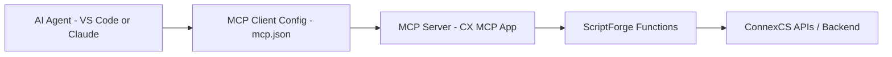

# ConnexCS MCP App – Technical Documentation

## Overview

The **CX MCP App** is an extendable **Model Context Protocol (MCP) Server** built for the ConnexCS platform.

It enables AI agents (e.g., VS Code AI, Claude Desktop, etc.) to:

* Access ConnexCS platform data
* Execute backend ScriptForge functions
* Perform diagnostics (CDR analysis, C-Trace, routing checks)
* Generate analytical reports
* Assist customers interactively via natural language

The MCP app acts as a secure bridge between:

> AI Agent ↔ MCP Server ↔ ScriptForge ↔ ConnexCS Backend APIs

---

## High-Level Architecture



### Components

|Component|Description|
| --------|-----------| 
| **AI Agent** | LLM-powered assistant (VS Code, Claude, etc.)  |
| **MCP Client**| Local configuration connecting agent to server |
| **MCP Server**| CX MCP App running inside ConnexCS|
| **ScriptForge**| Server-side function layer |
| **ConnexCS APIs** | Core platform services |

---

## Installation & Initial Setup

### Step 1: Install the MCP App

1. Navigate to **App Store**
2. Search for **CXMCP**
3. Click **Install**
4. Select version and confirm

After installation, the app appears inside the IDE under:

```
CX MCP
```

---

### Step 2: Environment Configuration

Navigate to:

```
App → Environment Variables
```

Configure:

| Variable    | Required | Description|
| ----------- | --------| ----------- |
| `USERNAME`  | Yes| Email of a valid ConnexCS user|
| `API_TOKEN` | Yes| JWT Access Token|
| `VERBOSE`   | No| Enables verbose logging for tests |

---

### Step 3: Creating JWT Access Token

Navigate to:

```
Setup → Integrations → JWT Tokens
```

1. Click **Create Token**
2. Select **Access Token**
3. Choose expiration period
4. Save
5. Copy token (displayed once)

Paste this into:

```
Environment Variables → API_TOKEN
```

---

## Working Modes

There are **two supported development approaches**.

---

### Direct IDE Development (Inside ConnexCS)

Develop directly in:

```
IDE → ScriptForge Files
```

All JavaScript files live under:

```
/source
```

Only `.js` files are executed.
TypeScript files may exist for testing but are not currently supported in production.

---

### Local Development via CX Tool (Recommended)

ConnexCS provides a CLI tool:

```
@connexcs/tools
```

Key commands:

```bash
cx configure
cx configure app
cx run <file_id>
```

### Benefits

* Work from VS Code or preferred IDE
* GitHub integration
* Version control
* CI/CD via GitHub Actions
* Backup protection
* Automated testing
* AI-assisted coding

---

## CI/CD Integration

The MCP template repository includes:

* GitHub Actions workflow
* Automated test execution
* Pull Request validation
* 24 automated tests (example)

When a PR is submitted:

1. Tests run automatically
2. Pass/Fail status returned
3. Prevents broken deployments

---

## MCP Server Implementation

### Core File

The most important file:

```
mcp.js
```

This file:

* Imports tools (functions)
* Instantiates MCP server
* Registers tools
* Defines parameters & metadata

---

## Tool Definition Structure

Each MCP tool consists of:

1. Name
2. Description
3. Handler function
4. Parameter schema

### Example

```js

Pattern : 
mcp.addTool(
  toolName,           // 👈 tool name
  toolDescription,    // 👈 description
  handlerFunction     // 👈 handler
)
  .addParameter(
    paramName,        // 👈 name
    paramType,        // 👈 type
    paramDescription, // 👈 description
    isRequired        // 👈 required
  )

Example: 
mcp.addTool(
  'getSipTrace',
  'Fetch and analyze SIP trace for a call. Returns full SIP flow with timing, auth, NAT detection, codecs, and identified issues. PRIMARY debugging tool — every call has trace data (7 days retention). Use this first when debugging any call. Endpoint: log/trace',
  getSipTraceHandler
)
  .addParameter('callid', 'string', 'SIP Call-ID (required, non-empty, max 255 chars)', true)
  .addParameter('callidb', 'string', 'Internal call identifier (optional)', false)
```

---

## Tool Execution Flow

1. AI decides which tool to call
2. Parameters validated
3. Handler function executes
4. ScriptForge function runs
5. Backend API queried
6. Response returned to AI

---

## Authentication Flow

**All tools call**:

```javascript
getAPI()
```

**Authentication occurs using**:

* `USERNAME`
* `API_TOKEN`

**Without valid token → request fails**.

---

## VS Code MCP Client Setup

Create folder:

```
.vscode/
```

Create file:

```
mcp.json
```

Example:

```json
{
  "servers": {
    "cx-mcp": {
      "url": "https://your-instance-url",
      "scriptForgeId": "838362",
      "jwt": "YOUR_ACCESS_TOKEN"
    }
  }
}
```

### Required Values

| Field         | Source                |
| ------------- | --------------------- |
| url           | ConnexCS instance URL |
| scriptForgeId | ID of MCP file        |
| jwt           | Access Token          |

---

## Example Tool Calls

### Call Analytics

User asks:

> Give me a 30-day report

AI calls:

* `search_call_logs`
* `search_documentation`
* `investigate_call`

Returns:

* Total calls
* Talk time
* Active customers
* Routing failures
* Revenue insights

---

### C-Trace Investigation

User:

> Run C-trace on failed call

AI calls:

* `investigate_call`

Returns:

* SIP Flow
* 503 Errors
* Routing diagnostics
* Prefix errors
* Provider issues
* Recommendations

---

## Example Diagnostic Output

The AI agent can:

* Detect repeated 0-duration calls
* Identify routing gaps
* Detect dial prefix duplication
* Identify SIP 503 "No route available"
* Recommend corrective actions

---

## Available Tool Categories

| Category           | Examples                  |
| ------------------ | ------------------------- |
| CDR Analysis       | search_call_logs          |
| Documentation      | search_documentation      |
| C-Trace            | get_ctrace                |
| Call Investigation | investigate_call          |
| Switch Health      | Analytics queries         |
| Customer Data      | Customer management tools |

---

## AI Model Flexibility

Users may use:

* Free models
* Paid models
* High reasoning models

Because MCP handles backend logic, even lower-cost models perform well.

Better models provide:

* Improved reasoning
* Follow-up questioning
* Better summarization
* Stronger diagnostic insight

---

## Security Considerations

* JWT Access Tokens required
* Tokens should be stored securely
* Never commit tokens to GitHub
* Token expiration recommended
* Access scope should be minimal

---

## Benefits to Customers

### Operational Benefits

* Faster troubleshooting
* Guided onboarding
* Automated diagnostics
* Call analytics via chat
* Reduced training dependency

### Development Benefits

* GitHub integration
* CI/CD pipeline
* Version control
* IDE flexibility
* Self-healing workflows

---

## Use Cases

1. Monthly switch health report
2. CDR analysis by customer name
3. Identify top revenue calls
4. Detect repeated routing failures
5. Debug AI agent calls
6. Run C-Trace without UI navigation

---

## Summary

The ConnexCS MCP App provides:

* AI-powered access to platform intelligence
* Secure backend integration
* Tool-based execution model
* IDE and GitHub compatibility
* CI/CD-ready development workflow
* Enterprise-grade extensibility

It transforms ConnexCS from a UI-driven platform into a programmable, AI-interactive system.

[Click here](https://github.com/connexcs/app-cx-mcp) to get a more comprehensive toolkit.
