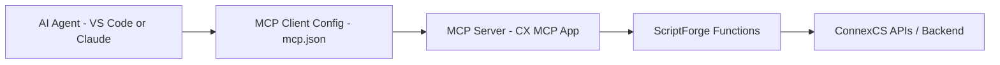

# ConnexCS MCP App – Technical Documentation

## 1. Overview

The **CX MCP App** is an extendable **Model Context Protocol (MCP) Server** built for the ConnexCS platform.

It enables AI agents (e.g., VS Code AI, Claude Desktop, etc.) to:

* Access ConnexCS platform data
* Execute backend ScriptForge functions
* Perform diagnostics (CDR analysis, C-Trace, routing checks)
* Generate analytical reports
* Assist customers interactively via natural language

The MCP app acts as a secure bridge between:

> AI Agent ↔ MCP Server ↔ ScriptForge ↔ ConnexCS Backend APIs

---

## 2. High-Level Architecture



### Components

|Component|Description|
| --------|-----------| 
| **AI Agent** | LLM-powered assistant (VS Code, Claude, etc.)  |
| **MCP Client**| Local configuration connecting agent to server |
| **MCP Server**| CX MCP App running inside ConnexCS|
| **ScriptForge**| Server-side function layer |
| **ConnexCS APIs** | Core platform services |

---

## 3. Installation & Initial Setup

### Step 1: Install the MCP App

1. Navigate to **App Store**
2. Search for **CXMCP**
3. Click **Install**
4. Select version and confirm

After installation, the app appears inside the IDE under:

```
CX MCP
```

---

## 4. Environment Configuration

Navigate to:

```
App → Environment Variables
```

Configure:

| Variable    | Required | Description|
| ----------- | --------| ----------- |
| `API_USERNAME`  | Yes| Email of a valid ConnexCS user|
| `cx_api_user` | Yes| JWT Access Token|
| `VERBOSE`   | No| Enables verbose logging for tests |

---

## 5. Creating JWT Access Token

Navigate to:

```
Setup → Integrations → JWT Tokens
```

### Steps:

1. Click **Create Token**
2. Select **Access Token**
3. Choose expiration period
4. Save
5. Copy token (displayed once)

Paste this into:

```
Environment Variables → API_TOKEN
```

---

## 6. Working Modes

There are **two supported development approaches**.

---

### 6.1 Direct IDE Development (Inside ConnexCS)

Develop directly in:

```
IDE → ScriptForge Files
```

Understood — here is a **concise technical version** without unnecessary verbosity:

---

# ScriptForge Tool Development Standard

## Location

Navigate in the IDE:

**IDE → Cx MCP → scriptforge**

The `scriptforge` folder contains all executable MCP tool scripts.
All tool logic must reside in this directory.

---

### Creating a New MCP Tool

1. **Create a new `.js` file** inside the `scriptforge` folder.

   * Use a clear, descriptive filename.
   * Example: `createCustomer.js`

2. **Implement the tool logic** inside the file.

   * Export the function using the existing ScriptForge tool pattern.
   * Follow the same execution structure as other tools in the folder.

3. **Register the tool in the MCP configuration.**

   * Add the new file to the MCP configuration so MCP can recognize it.

4. **Reload / Restart MCP** (if required).

Once registered and reloaded, the tool becomes available to the AI Agent.

---

### 6.2 Local Development via CX Tool (Recommended)

ConnexCS provides a CLI tool:

```
[https://www.npmjs.com/package/@connexcs/tools](https://www.npmjs.com/package/@connexcs/tools)
```

Key commands:

```bash
cx configure
cx configure app
cx run <file_id>
```

### Benefits

* Work from VS Code or preferred IDE
* GitHub integration
* Version control
* CI/CD via GitHub Actions
* Backup protection
* Automated testing
* AI-assisted coding

---

## 7. CI/CD Integration

The MCP template repository includes:

* GitHub Actions workflow [https://github.com/connexcs/app-cx-mcp](https://github.com/connexcs/app-cx-mcp)
* Automated test execution
* Pull Request validation
* 24 automated tests (example)

When a PR is submitted:

1. Tests run automatically
2. Pass/Fail status returned
3. Prevents broken deployments

---

## 8. MCP Server Implementation

### Core File

The most important file:

```
mcp.js
```

This file:

* Imports tools (functions)
* Instantiates MCP server
* Registers tools
* Defines parameters & metadata

---

## 9. Tool Definition Structure

Each MCP tool consists of:

1. Name
2. Description
3. Handler function
4. Parameter schema

### Example

```javascript
Pattern : 
mcp.addTool(
  toolName,           // 👈 tool name
  toolDescription,    // 👈 description
  handlerFunction     // 👈 handler
)
  .addParameter(
    paramName,        // 👈 name
    paramType,        // 👈 type
    paramDescription, // 👈 description
    isRequired        // 👈 required
  )

Example: 
mcp.addTool(
  'getSipTrace',
  'Fetch and analyze SIP trace for a call. Returns full SIP flow with timing, auth, NAT detection, codecs, and identified issues. PRIMARY debugging tool — every call has trace data (7 days retention). Use this first when debugging any call. Endpoint: log/trace',
  getSipTraceHandler
)
  .addParameter('callid', 'string', 'SIP Call-ID (required, non-empty, max 255 chars)', true)
  .addParameter('callidb', 'string', 'Internal call identifier (optional)', false)
```
---

## 10. Tool Execution Flow

1. AI decides which tool to call
2. Parameters validated
3. Handler function executes
4. ScriptForge function runs
5. Backend API queried
6. Response returned to AI

---

## 11. Authentication Flow

All tools call:

```javascript
getAPI()
```

Authentication occurs using:

* `API_USERNAME`
* `API_TOKEN`

Without valid token → request fails.

---

## 12. VS Code MCP Client Setup

Create folder:

```
.vscode/
```

Create file:

```
mcp.json
```

Example:

```json
{
{ "servers": { "connexcs-call-debug": { "url": "https://fr1dev1.connexcs.net/api/cp/scriptforge/[your_scriptforge_mcp_file_id]/run", "type": "http", "headers": { "Authorization": "Bearer YourJWTTokenHere" } } }, "inputs": [] }
```
!!! Note "How to get the file ID?"
    Navigate to IDE :material-menu-right: Click on the MCP server app :material-menu-right: Settings button :material-menu-right: Copy File URL (share). The `last four` digits are the file ID. <br></br>

### Required Values

| Field         | Source                |
| ------------- | --------------------- |
| url           | ConnexCS instance URL |
| scriptForgeId | ID of MCP file        |
| jwt           | Access Token          |

---

## 13. Example Tool Calls

### 13.1 Call Analytics

User asks:

> Give me a 30-day report

AI calls:

* `searchCallLogs`
* `searchDocumentation`
* `investigateCall`

Returns:

* Total calls
* Talk time
* Active customers
* Routing failures
* Revenue insights

---

### 13.2 C-Trace Investigation

User:

> Run C-trace on failed call

AI calls:

* `investigateCall`

Returns:

* SIP Flow
* 503 Errors
* Routing diagnostics
* Prefix errors
* Provider issues
* Recommendations

---

## 14. Example Diagnostic Output

The AI agent can:

* Detect repeated 0-duration calls
* Identify routing gaps
* Detect dial prefix duplication
* Identify SIP 503 "No route available"
* Recommend corrective actions

---

## 15. Available Tool Categories

| Category           | Examples                  |
| ------------------ | ------------------------- |
| CDR Analysis       | searchCallLogs            |
| Documentation      | searchDocumentation       |
| C-Trace            | getCTrace                |
| Call Investigation | investigateCall           |
| Switch Health      | Analytics queries         |
| Customer Data      | Customer management tools |

---

## 16. AI Model Flexibility

Users may use:

* Free models
* Paid models
* High reasoning models

Because MCP handles backend logic, even lower-cost models perform well.

Better models provide:

* Improved reasoning
* Follow-up questioning
* Better summarization
* Stronger diagnostic insight

---

## 17. Security Considerations

* JWT Access Tokens required
* Tokens should be stored securely
* Never commit tokens to GitHub
* Token expiration recommended
* Access scope should be minimal

---

## 18. Benefits to Customers

### Operational Benefits

* Faster troubleshooting
* Guided onboarding
* Automated diagnostics
* Call analytics via chat
* Reduced training dependency

### Development Benefits

* GitHub integration
* CI/CD pipeline
* Version control
* IDE flexibility
* Self-healing workflows

---

## 19. Use Cases

1. Monthly switch health report
2. CDR analysis by customer name
3. Identify top revenue calls
4. Detect repeated routing failures
5. Debug AI agent calls
6. Run C-Trace without UI navigation

---

## 20. Summary

The ConnexCS MCP App provides:

* AI-powered access to platform intelligence
* Secure backend integration
* Tool-based execution model
* IDE and GitHub compatibility
* CI/CD-ready development workflow
* Enterprise-grade extensibility

It transforms ConnexCS from a UI-driven platform into a programmable, AI-interactive system.

[Click here](https://github.com/connexcs/app-cx-mcp) to get a more comprehensive toolkit.
