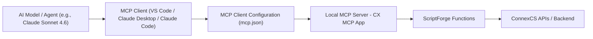

# ConnexCS MCP Server App

## Overview

The **CX MCP App** is an extendable **Model Context Protocol (MCP) Server** built for the ConnexCS platform.

It enables AI-powered MCP clients (e.g., VS Code and Claude Desktop) to access tools and functionality via the MCP protocol to:

* Access ConnexCS platform data
* Execute backend ScriptForge functions
* Perform diagnostics (CDR analysis, C-Trace, routing checks)
* Generate analytical reports
* Assist customers interactively via natural language

The MCP app acts as a secure bridge between:

> MCP Client ↔ AI Agent ↔ MCP Server ↔ ScriptForge ↔ ConnexCS Backend APIs

---

## High-Level Architecture


```mermaid
flowchart LR
    A["AI Model / Agent (e.g., Claude Sonnet 4.6)"]
    --> B["MCP Client (VS Code / Claude Desktop / Claude Code)"]

    B --> C["MCP Client Configuration (mcp.json)"]

    C --> D["Local MCP Server - CX MCP App"]

    D --> E["ScriptForge Functions"]

    E --> F["ConnexCS APIs / Backend"]
```

### Components

| Component| Description|
| ---------|------------|
| **AI Model / Agent**| The LLM that performs reasoning and generates actions (e.g., Claude Opus, Claude Sonnet, GPT-5). The model acts as the AI agent.|
| **MCP Client** | An application that hosts or connects to AI models and communicates with MCP servers. MCP clients can run locally or as web-based applications (e.g., VS Code, Claude Desktop, Claude Code). |
| **MCP Client Configuration** | Local configuration file (e.g., `mcp.json`) that defines available MCP servers and connection settings.|
| **MCP Server**| The CX MCP application running locally within the MCP client environment, exposing tools and capabilities via the MCP protocol. |
| **ScriptForge**| Server-side execution layer providing callable functions/tools exposed through the MCP server. |
| **ConnexCS APIs** | Core ConnexCS platform services accessed by ScriptForge to perform operations and retrieve data. |

---

## Installation & Initial Setup

### Step 1: Install the MCP App

1. Navigate to **App Store**
2. Search for **CXMCP**
3. Click **Install**
4. Select version and confirm

	After installation, the app appears inside the IDE under:

	```json
	CX MCP
	```

5. Navigate to **Setup :material-menu-right: Settings :material-menu-right: Option**. In the `General` tab, select the created **MCP app** from the `Custom MCP Endpoint` drop-down menu. <br>Selecting the correct MCP endpoint ensures requests are executed in the intended environment; without it, tools may fail, authenticate incorrectly, or return data from the wrong system.</br>


---

### Step 2: Environment Configuration

Navigate to:

```json
App → Environment Variables
```

Configure:

| Variable    | Required | Description|
| ----------- | --------| ----------- |
| `API_USERNAME`  | Yes| Email of a valid ConnexCS user -> **Connexcs Email**|
| `VERBOSE`   | No| Enables verbose logging for tests |

---

### Step 3: Creating JWT Access Token

Navigate to:

```
Setup → Integrations → JWT Tokens
```

1. Click **Create Token**
2. Select **Access Token**
3. Choose expiration period
4. Save
5. Copy token (displayed once)
6. Paste this into:

```
Environment Variables → CONNEXCS_API_TOKEN
```

---

## Working Modes

There are **two supported development approaches**.

!!! Note "ScriptForge files are JavaScript in both environments. <br>In the ConnexCS IDE, file extensions are not displayed.</br> <br>In cx-tools development, files are located in the `/src` directory and use the `.js` extension.</br>"

---

### Direct IDE Development (Inside ConnexCS)

Develop directly in:

```
IDE → ScriptForge Files
```

---

### ScriptForge Tool Development Standard

#### Location

Navigate to the IDE:

**IDE → Cx MCP → Scriptforge**

The `scriptforge` folder contains all executable MCP tool scripts.
All tool logic must reside in this directory.

---

#### Creating a New MCP Tool

1. Create a new `JavaScript` file.

2. **Implement the tool logic** inside the file.

   * Export the function using the existing ScriptForge tool pattern.
   * Follow the same execution structure as other tools in the folder.

3. **Register the tool in the MCP configuration**. Also,  registration happens in the `mcp javascript` file.

   * Tools must be registered within the MCP server configuration. If a tool is defined in a separate file, it must be exported from that file and imported into the MCP server where tool registration occurs.
     * ```export function toolName () { // Tool }```
     * ```import { toolName} from './toolFile'```

4. **Reload / Restart MCP** (if required).

Once registered and reloaded, the tool becomes available to the AI Agent.

---

#### Local Development via CX Tool (Recommended)

ConnexCS provides a CLI tool:

[https://www.npmjs.com/package/@connexcs/tools](https://www.npmjs.com/package/@connexcs/tools)

Key commands:

```json
cx configure
cx configure app
cx run <file_name>
```

#### Benefits

* Work from VS Code or preferred IDE
* GitHub integration
* Version control
* CI/CD via GitHub Actions
* Backup protection
* Automated testing
* AI-assisted coding

---

## CI/CD Integration

The MCP template repository includes:

[https://github.com/connexcs/app-cx-mcp](https://github.com/connexcs/app-cx-mcp)

* GitHub Actions workflow
* Automated test execution
* Pull Request validation
* 24 automated tests (example)

When a PR is submitted:

1. Tests run automatically
2. Pass/Fail status returned
3. Prevents broken deployments

---

## MCP Server Implementation

### Core File

The most important file:

```json
mcp.js
```

This file:

* Imports tools (functions)
* Instantiates MCP server
* Registers tools
* Defines parameters & metadata

---

## Tool Definition Structure

Each MCP tool consists of:

1. Name
2. Description
3. Handler function
4. Parameter schema

### Example

```js
	Pattern: 
	mcp.addTool(
	  toolName,           // 👈 tool name
	  toolDescription,    // 👈 description
	  handlerFunction     // 👈 handler
	)
	  .addParameter(
	    paramName,        // 👈 name
	    paramType,        // 👈 type
	    paramDescription, // 👈 description
	    isRequired        // 👈 required
	  )

	Example: 
	mcp.addTool(
	  'getSipTrace',
	  'Fetch and analyze SIP trace for a call. Returns full SIP flow with timing, auth, NAT detection, codecs, and identified issues. PRIMARY debugging tool — every call has trace data (7 days retention). Use this first when debugging any call. Endpoint: log/trace',
	  getSipTraceHandler
	)
	  .addParameter('callid', 'string', 'SIP Call-ID (required, non-empty, max 255 chars)', true)
	  .addParameter('callidb', 'string', 'Internal call identifier (optional)', false)
```

---

## Tool Execution Flow

1. AI decides which tool to call
2. Parameters validated
3. Handler function executes
4. ScriptForge function runs
5. Backend API queried
6. Response returned to AI

---

## Authentication Flow

**All tools call**:

```javascript
export function getApi () {
    const apiUsername = process.env.API_USERNAME
   
    if (!apiUsername || apiUsername.trim() === '') {
        throw new Error(
            'API_USERNAME environment variable is required but not set. ' +
            'Please set API_USERNAME in your environment variables to authenticate with ConnexCS API.'
        )
    }
   
    return cxRest.auth(apiUsername)
}
```

**Authentication occurs using**:

* `API_USERNAME`

**Requests fail only when a valid API username is not available. The ConnexCS API token is optional and is used solely during MCP server configuration within the MCP client. If a token is not provided, authentication can occur via OAuth login.**.

---

## VS Code MCP Client Setup

Create folder:

```json
.vscode/
```

Create file:

```json
mcp.json
```

Example:

```js
{ 
   "servers": { 
          "cx-mcp-app": { 
                   "url": "https://app.connexcs.com/api/cp/mcp/", 
                     "type": "http", 
                      "headers": { "Authorization": "Bearer YourJWTTokenHere" }
          } 
     }, 
   "inputs": [] 
}
```

### Required Values

| Field         | Source                |
| ------------- | --------------------- |
| **url**           | ConnexCS instance URL [https://app.connexcs.com/api/cp/mcp/](https://app.connexcs.com/api/cp/mcp/)|
| **jwt**           | Access Token          |

---

## Example Tool Calls

### Call Analytics

User asks:

> Give me a 30-day report

AI calls:

* `searchCallLogs`
* `searchDocumentation`
* `investigateCall`

Returns:

* Total calls
* Talk time
* Active customers
* Routing failures
* Revenue insights

---

### C-Trace Investigation

User:

> Run C-trace on failed call

AI calls:

* `investigateCall`

Returns:

* SIP Flow
* 503 Errors
* Routing diagnostics
* Prefix errors
* Provider issues
* Recommendations

---

## Example Diagnostic Output

The AI agent can:

* Detect repeated 0-duration calls
* Identify routing gaps
* Detect dial prefix duplication
* Identify SIP 503 "No route available"
* Recommend corrective actions

---

## Available Tool Categories

| Category           | Examples                  |
| ------------------ | ------------------------- |
| **CDR Analysis**| searchCallLogs|
| **Documentation**| searchDocumentation|
| **C-Trace**| getCTrace|
| **Call Investigation** | investigateCall|
| **Switch Health**| Analytics queries|
| **Customer Data**| Customer management tools |

---

## AI Model Flexibility

Users may use:

* Free models
* Paid models
* High reasoning models

Because MCP handles backend logic, even lower-cost models perform well.

Better models provide:

* Improved reasoning
* Follow-up questioning
* Better summarization
* Stronger diagnostic insight

---

## Security Considerations

* JWT Access Tokens required
* Tokens should be stored securely
* Never commit tokens to GitHub
* Token expiration recommended
* Access scope should be minimal

---

## Benefits to Customers

### Operational Benefits

* Faster troubleshooting
* Guided onboarding
* Automated diagnostics
* Call analytics via chat
* Reduced training dependency

### Development Benefits

* GitHub integration
* CI/CD pipeline
* Version control
* IDE flexibility
* Self-healing workflows

---

## Use Cases

1. Monthly switch health report
2. CDR analysis by customer name
3. Identify top revenue calls
4. Detect repeated routing failures
5. Debug AI agent calls
6. Run C-Trace without UI navigation

---

## Summary

The ConnexCS MCP App provides:

* AI-powered access to platform intelligence
* Secure backend integration
* Tool-based execution model
* IDE and GitHub compatibility
* CI/CD-ready development workflow
* Enterprise-grade extensibility

It transforms ConnexCS from a UI-driven platform into a programmable, AI-interactive system.

[Click here](https://github.com/connexcs/app-cx-mcp) to get a more comprehensive toolkit.
