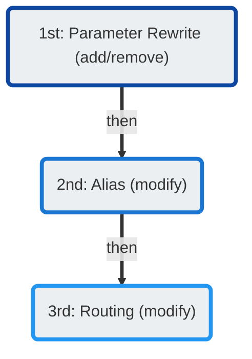

# Number Manipulation

There are several methods that ConnexCS offers for number manipulation. They are processed in the following order:

All methods of number maniulation are performed within **Management :material-menu-right: Customer**:

+ Parameter Rewrite: **Auth :material-menu-right: [IP or SIP] :material-menu-right: Parameter Rewrite**
+ Alias: **Alias**
+ Routing: **Routing :material-menu-right: CLI :material-menu-right: Rewrite CLI**
