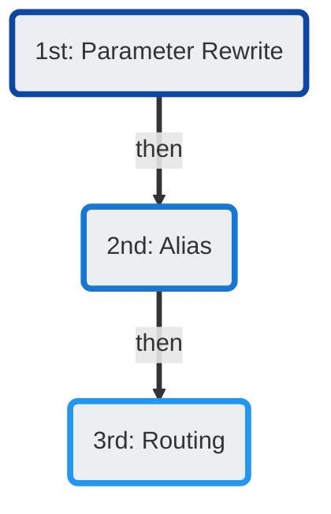

# Number Manipulation

 
<strong>Document Metadata</strong>
  

<strong>Category</strong>: ConnexCS Basics → Number Manipulation 
<strong>Audience</strong>: Administrators, Engineers, Support Team 
<strong>Difficulty</strong>: Intermediate 
<strong>Time Required</strong>: 5–10 minutes 
<strong>Prerequisites</strong>: Understanding of number formatting and call-routing prefixes; access to customer routing or CLI configuration sections. 
<strong>Related Topics</strong>: <a href="https://docs.connexcs.com/setup/advanced/prefix-set/">Prefix Set</a> (for prefix rules), <a href="https://docs.connexcs.com/customer/cli/">CLI / Number Rewrite Rules</a> (for CLI manipulation) 
<strong>Next Steps</strong>: Define your number formatting rules (e.g., strip leading zeros, add country code), then test routing flows to confirm correct number presentation. 

ConnexCS offers several methods for number manipulation.

You can perform all methods of number manipulation in **Management :material-menu-right: Customer**:

+ Parameter Rewrite (add / remove): **Auth :material-menu-right: [IP or SIP] :material-menu-right: Parameter Rewrite**
+ Alias (modify): **Alias**
+ Routing (modify: **Routing :material-menu-right: CLI :material-menu-right: Rewrite CLI**)

They're processed in the following order:

