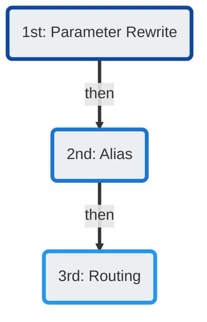

# Number Manipulation

---

**Document Metadata**  **Category**: ConnexCS Basics → Number Manipulation 
 **Audience**: Administrators, Engineers, Support Team   **Difficulty**: Intermediate 
 **Time Required**: 5–10 minutes 
 **Prerequisites**: Understanding of number formatting and call-routing prefixes; access to customer routing or CLI configuration sections.   **Related Topics**: [Prefix Set](https://docs.connexcs.com/setup/advanced/prefix-set/) (for prefix rules) , [CLI / Number Rewrite Rules](https://docs.connexcs.com/customer/cli/) (for CLI manipulation)   **Next Steps**: Define your number formatting rules (e.g., strip leading zeros, add country code) then test routing flows to confirm correct number presentation. 

---

ConnexCS offers several methods for number manipulation.

You can perform all methods of number manipulation in **Management :material-menu-right: Customer**:

+ Parameter Rewrite (add / remove): **Auth :material-menu-right: [IP or SIP] :material-menu-right: Parameter Rewrite**
+ Alias (modify): **Alias**
+ Routing (modify: **Routing :material-menu-right: CLI :material-menu-right: Rewrite CLI**)

They're processed in the following order:

