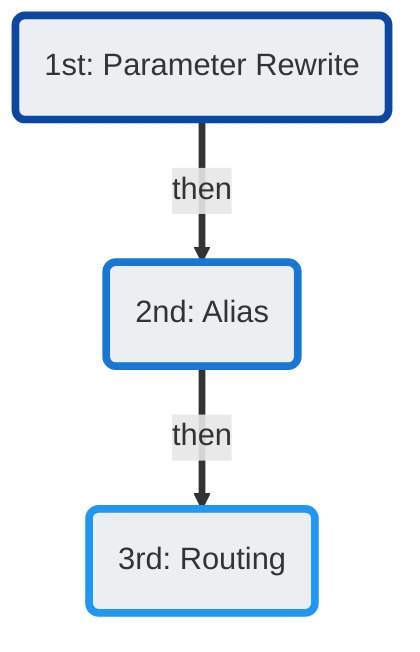

# Number Manipulation

There are several methods that ConnexCS offers for number manipulation. 

All methods of number manipulation are performed within **Management :material-menu-right: Customer**:

+ Parameter Rewrite (add/remove): **Auth :material-menu-right: [IP or SIP] :material-menu-right: Parameter Rewrite**
+ Alias (modify): **Alias**
+ Routing (modify: **Routing :material-menu-right: CLI :material-menu-right: Rewrite CLI**

They are processed in the following order:

