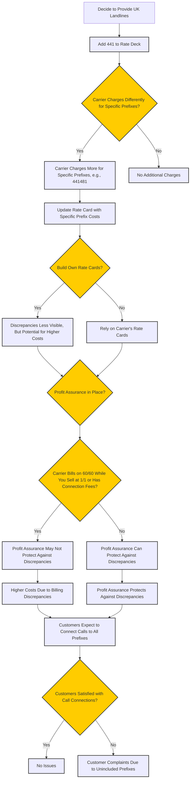
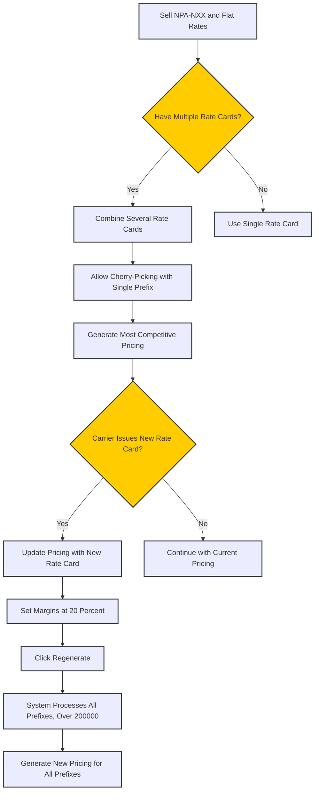

# Rate Card Overview

**Rate Cards** are an essential component in ConnexCS, playing a crucial role in both call routing and billing.

They ensure that calls are priced correctly and routed efficiently.

Rate Cards are an important ConnexCS feature because they organise the majority of the information.

When a call is made, it follows this path:
**`Customer → Customer Rate Card → Provider Rate Card → Provider`**.

This creates a **one-to-many relationship** between the customer and provider rate cards.

!!! tip
    You can associate the Customer Card with one or more Provider Cards, each of which will have different means for routing the calls and billing the call.
    We can also say that Provider Cards create Customer Cards.

!!! Warning "Proper configuration of rate cards is vital for ensuring seamless call flow and billing accuracy."

!!! Info "Rate Card Terminology"
    Several terms in ConnexCS are interchangeably used when talking about Rate Cards:

    + Provider = Carrier
    + Provider Rate Card = Parent Card 
    + Customer Rate Card = Child Rate Card

The ConnexCS Control Panel has the following four sections for Rate Cards:

+ **Provider Cards** govern routing and rates based on the carrier. You can find the Details under [**Provider Rate Cards**](https://docs.connexcs.com/provider-ratecard/).
+ **Customer Cards** are typically derived from Provider Cards, and allow for additional customer management. You can find the Details under [**Customer Rate Cards**](https://docs.connexcs.com/customer-ratecard/).
+ **Routing** gives an overview of the routing for customers and links to configure customers.
+ **Global Search** provides a way to search for routes and rates based on the Provider and Direction.

![alt text][rc-global]

## Types of Rate Cards

Rate Cards in ConnexCS are categorized into two types:

1. **Origination Rate Cards**:
      + Handles DIDs (Direct Inward Dialing).
      + Manages incoming calls from the PSTN (Public Switched Telephone Network).
      + The upstream carrier is responsible for handling these calls.
      + Less commonly used by customers compared to termination rate cards.

2. **Termination Rate Cards**:
      + Manages outgoing calls to the PSTN.
      + Majority of ConnexCS customers primarily use termination rate cards.
      + Directs outbound calls via providers.

## Key Features

1. **Code and Billing Accuracy**: It's always sound practice to base Rate Cards on the information in Provider cards.
Code accuracy is perhaps one of the most important of these benefits.

    In any system with card-based profiles, code accuracy is one of the means to ensure the accuracy of the whole system.
It also increases the reliability of all data passed or collected.

2. **Comprehensive Call Routing & Billing**: Ensures that both routing and billing work seamlessly.

3. **Parent-Child Relationship Management**: Helps in tracking dependencies between provider and customer rate cards.

4. **Bulk Editing**: Allows quick modifications across multiple entries.

5. **Real-Time Updates**: Ensures that rate cards remain up to date to prevent stale entries.

## **Benefits**

1. **Efficiency**: Automates call rating and billing processes, reducing manual errors.

2. **Scalability**: Supports multiple rate cards, allowing businesses to scale operations effortlessly.

3. **Transparency**: Detailed breakdown of charges and call duration billing.

4. **Flexibility**: Customize billing based on provider agreements.
5. **Comprehensive audit trails**: Maintain a full history of changes.
6. **Automated rate activation**: Schedule rate changes in advance.
7. **Bulk upload support**: Manage large datasets efficiently.

## Rate Card Compilation Engine

ConnexCS features a comprehensive rate card building engine that can import several carrier rate cards (Parent Rate cards) in either NPA-NXX or single-cost (column) and output NPA-NXX or single-cost. These can take the minimum, maximum, or average values.

### Different Length Prefixes

The ConnexCS rate card engine handles arbitrary length prefixes and understands the strict rules required to merge them.

!!! note "Why do I have so many long prefixes?"
    To ensure accuracy, it may be necessary to **normalize** rate cards when combining them.

    The process may add prefixes to make all cards comparable. (These changes are safe, but included to increase granularity; they won't introduce errors.) 
    
    After compilation, you need to run additional scripts to make the rate card smaller; but, the primary goal of the engine is accuracy.

### Combining

#### Between Cards

If you have multiple carrier cards and you want to compile them into a single card, pay attention to the **Rate Compact** variable. It forms the strategy we use to output a cost per destination.

For instance, use **Min** if you are dealing with cost-sensitive routing or **Max** if you are looking at quality-driven prices.

!!! note "What happens when the **Min** route fails?"

    The cheapest provider receives calls first if you use **Min** as the default setting. But if that provider doesn't take the call, it will failover to a more expensive provider. Keep in mind that this provider's costs may exceed your profit margins. 
    
    You can enable Profit Assurance to help ease this, but be prepared: Profit Assurance can't protect against different billing pulses or connection fees.

#### Different Card Types

If you wish to transform an NPA-NXX price into a single cost-per-code, you will need to collapse your rate card.

This takes similar settings to **Rate Compact**, but you can apply this when picking out a single cost per prefix per provider.

It's joined with other providers AFTER this process has taken place.

### Why should I Use Rate Card Building

#### Example 1

You may want to provide UK landlines to your customers and decide to add `441` to your rate deck. Your carrier may charge more to deliver calls to Gurnsey, so they would have a higher cost for `441481`. Building your own rate cards might make discrepancies like this less visible.

One possible consequence is that your carrier will charge you more in these instances.

Profit Assurance can protect you against this sometimes, but not if your carrier bills on 60/60 and you are selling at 1/1, or if your carrier has connection fees.

Also, customers might expect to connect calls to prefixes that aren't included if you rely purely on profit assurance.

#### Example 2

If you sell NPA-NXX but also have some flat rates (and allowed cherry-picking) with just one prefix, you can combine several cards to generate the most competitive pricing. Then, you can place the margins at 20% once a carrier issues you a new rate card.

Click regenerate and the system will deal with all 200,000 prefixes on each and generate new pricing.

#### Example 3

Take the following cards, each with a different Rate Compact.

| Prefix  |     Destination     |  Cost |
|----------|:-------------:|------:|
| **Provider Rate Card A**|   |  |
| 441 |    UK Landline |  0.01 |
| 442 | UK Landline |    0.01 |
| **Provider Rate Card A** |  |     |
| 441 | UK Landline |  0.0075 |
| 442 | UK Landline |   0.0075 |
| **Provider Rate Card A** |  |  |
| 441 |  UK Landline |  0.02|
| 442 |  UK Landline |    0.02 |

After merging the 3 providers, we would have the following 3 cards output:

| Prefix  |     Destination     |  Merged Cost |
|----------|:-------------:|------:|
| **Merged Cost (min)**|   |  |
| 441 |    UK Landline |  0.0075 |
| 442 | UK Landline |   0.0075 |
| **Merged Cost (max)**|   |  |
| 441 |    UK Landline |  0.02 |
| 442 | UK Landline |   0.02 |
| **Merged Cost (avg)**|   |  |
| 441 |    UK Landline |  0.0125 |
| 442 | UK Landline |   0.0125 |

[rc-global]: /misc/img/rc-global.png "Rate Card Global"
