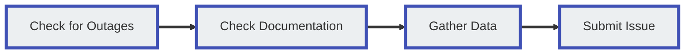

# Customer Support

ConnexCS doesn't charge for support, but there is a reasonable level of expectation from both parties involved. (Unless you are paying for dedicated support NOC (Network Operations Center) on Demand).

## Expectations

### ConnexCS Server Provider Obligations

ConnexCS support engineers make all efforts to fix reported problems within a time-frame deemed appropriate for the severity of the issue.

We make our best efforts to reply 24/7.

### Customer Obligations

We expect the following from you as a customer:

* Basic level or above of computer operation.
* Basic level or above of Telephony.
* Act as a liaison with your customers and carriers.
* For initial investigation of the problem, first-line support should be internal to your company.
* Problem Isolation (See [**Debugging guide**](/guides/debugging/))

## Support Channels

Several methods of contacting ConnexCS for guidance are outlined below.

If you need to Report a Problem, please make sure you check that section for information on issue classification and response times, and some tips for reporting issues so we can best address your needs.

!!! tip "ConnexCS System Status"
    Before reporting a problem, please check the [**ConnexCS System Status Page**](https://status.connexcs.com/) for current known issues.

### Online Chat

**Online Chat** allows for real-time guidance. Initial communication is with a bot. If the bot is unable to help, it will tell you to type "Human" to connect with a support representative.

Click this button to alert staff, and the first person to become available will reply as soon as possible. We find that most questions get their resolution efficiently this way.

**Please note that the chat system is for one-on-one communication about a specific problem, not for multiple concerns or system-wide change requests.**

### Support Tickets

**Support Ticket** (found at the bottom of the ConnexCS navigation menu) displays all open tickets for an account.

#### Steps to Raise a Ticket appropriately

1. Email the issue to support@connexcs.com
2. Compose a subject that's descriptive and accurately summarises the issue.
3. Include crucial data regarding the issue, such as:

    3.1. When the issue first commenced

    3.2. Measures taken by you to fix or isolate the problem

    3.3. Any other pertinent information

4. Please distinguish between your assumptions and actual observations.

5. Please provide us with single or multiple calls if you were successful in isolating the issue

!!! note "Follow the guidelines below and help us serve you better"
    1. Don't send us 100's calls to find the one call with the issue.
    2. If you send us more than 1 call, be sure that each one displays the issue. We don't want to test one of them and then discover that there is no issue.
    3. Please be clear and precise about your problem.
    4. Please respond to our comments. It will speed up the process of fixing the issue.
    5. Please don't excessively complain about the issue (when you engage with our support team), as it will delay finding a solution.
    6. Please be patient with us and answer our queries regarding the issue.
    7. When your problem gets fixed and say after 10 days the issue re-occurs, please **open the existing ticket**. It's not recommended to create a new ticket.
    
#### Ticket Lifecycle

### Phone

To speak to a Support Representative, please call our office number listed at [**www.connexcs.com**](https://www.connexcs.com/).

!!! error "When to call the support number"
    Our support line connects directly to our engineers. Unless there is a critical issue, please call this number between 9:00 AM and 23:00 PM UTC.

### SMS

Contact us using **SMS**:

* UK: +44 7481 346 455
* USA: +1 408 475 9494

### Telegram

Contact us via **Telegram**:

* <https://t.me/connexcs_support_bot>
* @connexcs_support_bot

### NOC-On-Demand

If you're interested in **NOC-on-Demand** or Enhanced Support, which would give 24/7 (or cover your specific time zone) operational support, please contact us directly to discuss this option.

## Report a Problem

This section covers the best practises for reporting problems to ConnexCS support.

We encourage feedback but also want to make sure you have the most efficient means of expressing a problem so there are no delays.

### Problem Escalation Matrix

Customers are bound to face some difficulties and problems throughout their tenure with you. Not all problems are the same and require different levels of attention and assistance.

Resolving problems at the earliest is a necessity when it comes to maximizing positive customer experience. To achieve this it is necessary to categorize and prioritize problems based on their severity and impact.

For this, a proper framework is needed. This framework is known as a problem escalation matrix.

A problem escalation matrix is a set of guidelines that enable you to categorize and prioritize problems in the best possible manner. This ensures the right expert is working on the issue and delivers a resolution at the earliest.

With that said, we can now define the framework of an ideal customer support function.

**1st Line Support Executive**

A 1st Line Support Executive functions as the primary point of contact between your customer support team and the customer. They should have a good understanding of how everything works and how to troubleshoot the most common problems.

The primary responsibility of the 1st Line Support Executive is to assist customers in troubleshooting common problems that are easy to fix. They are supposed to collect all available information from the customer and maintain a record of it.

In case a problem is not a common occurrence and outside the scope of the expertise of a 1st Line Support Executive, they’re supposed to escalate the problem and pass it on to the 2nd Line Support Executive.

**2nd Line Support Executive**

A 2nd Line Support Executive is a certified expert for the platform and serves as the second in line to the 1st Line Support Executive in the Customer Support Function.

The primary responsibility of the 2nd Line Support Executive is to assess the information about the problem gathered by the 1st Line Support Executive. Then they proceed to deliver a resolution at the earliest based on the assessment.

2nd Line Support Executives handle problems that may arise due to misconfiguration, improper setup, mismanaged advanced settings, etc.

A very small number of problems fall out of the scope of the 2nd Line Support Executive’s expertise. In such circumstances, the problem is further escalated to the Senior Support Executive.

**Senior Support Executive**

A Senior Support Executive is usually a developer with significant hands-on experience with the platform. They not only know the ins and outs of the platform but also are capable of resolving issues that may occur due to a malfunctioning code or component.

Their primary responsibility is to assist customers with only the most severe problems. Senior Support Executives also assist customers with API integrations, platform plugins, payment gateway integrations and much more.

Another important responsibility shouldered by them is to determine whether a particular problem is caused by internal factors, customer actions, external factors or the Connex platform.

If a particular issue is identified as being caused due to a malfunction in the Connex Platform, the Senior Support Executive is expected to gather all the necessary information and inform the Vendor Support Team at ConnexCS.

### ConnexCS Escalation Matrix

We at ConnexCS follow a similar approach to handling customer problems. As our customers, we want you to know how our escalation matrix functions.

This will help you report the problems properly, request for escalation and have a thorough understanding of how your problems are being resolved.

**1st Line Support Specialists**

Our 1st Line Support Specialists are NOC Engineers who are highly trained and certified in managing SIP servers, SIP troubleshooting and platform management.

Once you’ve identified that the problem you’re facing is due to some issue with our platform, you’re expected to inform the 1st Line Support Specialists.

Provide them with all the necessary information that was gathered. Our NOC Engineers will assess the situation and provide a resolution at the earliest.

In case the problem is still now resolved or is identified as a critical issue, the problem shall be escalated to our 2nd Line Senior Experts.

**2nd Line Experts**

Our 2nd Line Experts are senior network engineers that are responsible for monitoring and ensuring the ConnexCS platform works as intended.

They are not only more experienced but actively contributing to the improvements in the platform. Thus, they have the necessary access and expertise to troubleshoot complex technical issues that are fairly uncommon.

Most of the operational problems will be easily resolved at this level.

In the rare instances where a critical operations component breaks, system-wide network failure occurs or severe service stability is reported, the problem is escalated to our 3rd Line Senior Developers.

**3rd Line Senior Developers**

Our 3rd Line Senior Developers consist of a team of senior developers who have built the ConnexCS platform from the ground up.

This makes them the ideal choice for handling any critical problem that may have system-wide effects.

Our 3rd Line Senior Developers also entertain requests for particular features, functionality or capability requirements from the customers. These additional services are subjected to additional costs.

### NOC-as-a-Service

Hiring a NOC Engineer and having them trained to operate our platform may be a time and cost-intensive undertaking. We have a solution to this!

Any of our customers can request a ConnexCS-certified expert NOC Engineer. The NOC Engineer will be trained and managed by us.

They shall be responsible for operating and maintaining all your systems, handling and assisting customers with any difficulties they might face.

This ad-on service would cost you $500 a month for each NOC Engineer you may wish to secure the services of.

### How to confirm an issue has occurred?

The moment a consumer reports a problem. You must begin an inquiry, utilizing the training and documentation we've provided you.

Customer's / Provider's issues shouldn't be escalated directly to ConnexCS. The issues should undergo initial troubleshooting steps.

If a customer reports channel variance, the customer is making an observation rather than reporting a problem. This makes it necessary to investigate the problems at the elemental level.

If a problem is with poor stats, compare it with formerly recorded positive numbers.

### Issue Classification and Response times

ConnexCS classifies issues based on a combination of **Category** and **Severity**. If you aren't able to determine the Category or Severity, we can help with this.

#### Categories

* **Platform**: Refers to the stability of the ConnexCS system (typically outside customer control). For example, the ConnexCS platform is down.
* **Operational**: Any configuration related issues, which are typically within the customer's control. For example, the misconfiguration issue.

#### Severity Levels

|Level|Severity|Example|
|---|---|---|
|**P0**|Critical|ConnexCS is down; this is affecting all customers, and all calls are failing. The best thing to do is to monitor <https://status.connexcs.com/> and await updates.
|**P1**|Critical|A customer of ConnexCS is down, and it's affecting all calls.|
|**P2**|Critical|A customer of our customer's calls is down, or there is a serious User Interface problem.|
|**P3**|Important|A partial outage on the part of a customer or carrier, and / or some but not all calls get affected, or there is a serious User Interface problem.|
|**P4**|Trivial|A feature gets broken but business can continue (User Interface problem, or a low-impact problem affecting calls).|
|**P5**|Trivial|A feature doesn't work as expected, or an enhancement is required.|

!!! tip "Paid Support Escalation"
    If you have a **P3 or P4** and we're out of working hours and you have a problem that internally you consider it to be critical, you have the option to escalate it. We will charge $150 per hour for our support (min 1 hour).

    A **P5** feature request may be escalated, but a project cost may be involved; please discuss this with us if you are considering it.

!!! warning "Classification Usage"
    These Severity levels are here to assess the impact of a problem, but they aren't followed. We will try to answer support requests 24/7, but repeated instances of misreporting incidents as Critical beyond normal working hours may result in fines on the account or account termination.

#### Response Times

* Platform for P2+ (Critical) Issues = 24/7 support.
  * Platform Issue.
  * Our Monitoring will alert Us.
  * Check our status page; ETA's will get issued if we've them available.
  * You can contact us, but please don't expect any detailed replies while we're focused on troubleshooting the issue.
  * 24/7 response incidents.

* All other Platform (non-Critical) and Operational Issues from 8:00 AM - 8:00 PM UTC business hours support.
Whenever possible, we strive to provide best-effort support outside these times if we're available.
  We're a small team, so we request that you keep this in mind when reporting the severity of an issue:
  * Operational or Configuration Issue.
  * Our Monitoring won't alert Us.
  * Our status page won't show this problem.
  * Contact us immediately.
  * Problems get resolved during working hours or best effort.

!!! tip "Issues with new interconnects"
    Issues encountered when turning up a new interconnect that isn't working aren't considered Critical.

!!! tip "Issues when making changes"
    Issues encountered when you are making a change, testing a new feature, or on-boarding a new customer aren't considered Critical.

#### Internal vs External Failure

It's important to identify from where the issue has started; whether it's an internal failure (ConnexCS) or an external failure (Upstream).

The following measures can help you identify the failure problems:

1. You can check where the **error message** is coming from and it will help you identify the failure.
2. You can debug specific calls and find the issue.
3. You can debug performance problems as well to find the commencement of error messages. When investigating a performance issue, it's recommended to only focus on the issue and distinguish between your assumptions and observations.

### Requested Troubleshooting and Information

For best results when reporting an issue, please provide us with the following information. This will help our support staff and engineers best address reported problems.

**Step 1: Check for Outages**

Please check the [**ConnexCS System Status Page**](https://status.connexcs.com/) for current known issues.

**Step 2: Check the Documentation**

The ConnexCS onsite documentation, found at [**docs.connexcs.com**](https://docs.connexcs.com/), serves several functions:

* To provide a repository where you can search for information relevant to your problem.
* To inform your questions when you contact support.

Sometimes, complications are resolved by turning off parameters that aren't compatible. Sometimes, a little troubleshooting might solve it.

Sometimes, you will need help; understanding the documentation will speed up our efforts to remedy larger concerns.

*Whenever possible, please refer to the ConnexCS documentation before contacting support.*

**Step 3: Gather data**

This step helps us understand and resolve your issue as soon as possible. Whenever possible, we recommend you follow a standardized troubleshooting process, such as our recommended [**Debugging**](/guides/debugging/) steps.

* **User Interface Issues**: Including a screenshot along with a clear description of the problem can help us understand the issue. For an efficient utility to take UI screenshots, we recommend a browser plugin called "Lightshot" or using your OS's built-in snipping tool.

* **Problems with Calls**: For problems with call flow, the [**Call-ID**](/guides/howto/callid/) is how we identify affected calls. It helps us isolate customers, providers, and/or channels that may get affected.

    Find a Call-ID in the [**Logging**](/logging/) section by clicking on a call, and then copying the ID to the right of the panel.

* **Clear and Concise Issue Description**: The above steps contain more ways for you to be able to identify your problem, troubleshoot it, and then communicate the problem(s) clearly in the event of contact.

!!! failure "Respectful communications"
    Where possible, we're also happy to talk with you about broader SIP topics outside of our switch.
    Under no circumstance will we tolerate rude behaviour, intimidation, or threats.

    We're all SSVVP and SSCA qualified, and whenever possible, we will cite references or point you to SIP traces for fact-checking information.

### Reporting Multiple Problems

If you have more than one problem to report, we ask you to:

1. Create a separate ticket for each request so that it's routed to the correct staff member.
2. Allow an adequate amount of time for us to assess the problem and resolve it.
3. We first find if the problems are connected, adding extra time onto finding the roots themselves.
4. Call instead of sending an email: This helps us to get a concise reading on all concerns instantly and ask follow-up questions instantly.

## Importance of Replication

Being able to replicate (on-demand) an issue is the best method to solve it.
If we can do this, the issue can get resolved without the input of the customer, and we'll be able to do it without your help as well.

For example,

If you make a call to **A** and the call connects:

a. When you disconnect, the call terminates successfully.

b. When A disconnects, the call doesn't end inadequately.

**Poor Scenario**

The issue occurs at irregular events, or it's an uncommon problem.

**Good Scenario**

When you're unable to recreate the issue in isolation and on request, the customer can replicate the issue.

**Ideal Scenario: Isolation**

You can take steps without the customer's involvement. You can make a call-on-demand example that illustrates an issue. Then you can make a change and illustrate how things continue to function without that particular modification.

### User Interface Problems

Making a video is the best way to get the issue resolved, including the User Interface. You may then send the video to us so that we can see the exact problem with clarity. We'll be in a better position to fix the problem.

**Instructions for recording a video in Windows**

1. Enable Screen Recording
2. Record Your Screen:
   2.1. Launch the recording app of your choice. The majority of programs and windows allow you to begin recording, although the Windows desktop, File Explorer, and several other Windows apps don't.
   2.2. To snap a quick screenshot, click the camera icon, or press the Start Recording button to record your screen activity.
   2.3 Click the Recording button on the floating bar to halt the recording. You receive a notice letting you know the video got recorded. When you click the notice, your video appears in a new window.
   2.4 To watch the video, use the Play button.
   2.5 Your video's location in File Explorer, which is by default C:Users[username]\Videos\Captures. You may always change the location of where video captures get saved if you don't like the default setting.
3. Enable Background Recording

## ConnexCS Internal Steps for Problem Resolution

1. If ConnexCS receives a problem from you and is unable to identify the problem instantly, we'll attempt to replicate the problem.
2. If we aren't able to replicate the problem, we'll be replying to ask for your assistance.
3. If you can include this information when you submit the ticket, the problem will be resolved more quickly.

## Steps to Prepare an Incident Report

1. Provide with the Caller-ID details, if the incident is related to the call
2. Mention A/B examples
3. Mention the commonalities
4. Feed us with appropriate assumptions

## Commonality Analysis

Consider a situation where there are 100 calls that go as planned and 100 calls that don't. Thus,  commonality analysis might help spot the reasons why they fall short

To accomplish this, connected calls must be examined to determine what they had in-common. Similarly, the calls which didn't connect had in common.

## Confirming a Fix

It's important to test when a resolution has been achieved for the problem.

It may require simulating a call, or sometimes you're required to make a real-time call. Thus, it's important to test the resolution yourself before informing the other parties.

If the resolution doesn't work, make sure the problem gets marked as unresolved and the required parties are informed about the status.

Additionally, it's good practice to update the ticket status after a successful resolution.

## How to Handle a Customer Complaint

Handling customer complaints is an important function for any business. How well you perform this function determines how well your business will do in the long run.

While one shouldn't restrict themselves to a certain framework for handling complaints, there are a few ideas and principles that are a must when managing aggravated customers. These are as follows:

**Be a Patient Listener**

A customer who has run into a problem or is facing some difficulty is already having a bad experience. Being too direct or being as concise as possible in terms of communication isn't recommended.

Gauge the situation carefully. If the customer is infuriated and wants to express themselves, let them. Not only will this make the customer more manageable, but it will also make communication more fruitful and clear.

**Try To Understand The Problem Thoroughly**

As they say, a lot of details are lost in translation. Details are very important especially for SaaS, B2B and Online Businesses to resolve any reported incident.

The best approach to retain all details is to ask the customers to describe the incident in detail and if possible over an email. Walk with them through the details in a step-by-step manner to ensure nothing goes unreported.

**Gather As Much Information As Possible**

Problem resolution can be tricky as so many variables and factors may have led to the incident occurring. To identify the actual root cause, you will need to eliminate all the other possibilities.

This can be only done when you have all the required information, so gather as much information as you can. This may be logs, screenshots, reports, etc.

In case the problem is more severe than initially thought, passing on this information to the technical team or developers will make their work easy.

**Be Emphatic**

Showing empathy towards your customers is the first step in building a good long-term relationship with them. This not only helps in customer retention but promotes brand loyalty and customer TLV.

Another benefit of being empathic is that the customer is bound to be more patient with you and not push for a quick resolution. Having this understanding and a personal connection with the customer cushions any bad experience from impacting negatively.

**Conduct Yourself Professionally**

Your objective is to serve the customers and ensure they’re happy and well taken care of. This has to be achieved within the constraints of professionalism. Avoid apologizing too much, being overly friendly or casual and maintain polite conduct.

Remember your scope of work and responsibility and never stray away from that. Don't be pushovers, set clear boundaries and don't encourage or put up with disrespectful conduct. Patience and politeness are the keys to this.

We hope this was helpful for you to become better at customer relations and conflict management. If you wish to keep learning and improving in this department, consider subscribing to our newsletter!
