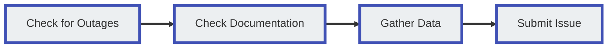

# Customer Support

ConnexCS doesn't charge for support, but there is a reasonable level of expectation from both parties involved. (Unless you are paying for dedicated support NOC (Network Operations Center) on Demand).

## Expectations

### ConnexCS Server Provider Obligations

ConnexCS support engineers make all efforts to fix reported problems within a timeframe deemed appropriate for the severity of the issue.

We make our best efforts to reply 24/7.

### Customer Obligations

We expect the following from you as a customer:

* Basic level or above of computer operation.
* Basic level or above of Telephony.
* Act as a liaison with your customers and carriers.
* Initial investigation of the problem.
* Problem Isolation (See [**Debugging guide**](/guides/debugging/))

## Support Channels

Several methods of contacting ConnexCS for assistance are outlined below.

If you need to Report a Problem, please make sure you check that section for information on issue classification and response times, and some tips for reporting issues so we can best address your needs.

!!! tip "ConnexCS System Status"
    Before reporting a problem, please check the [**ConnexCS System Status Page**](https://status.connexcs.com/) for current known issues.

### Online Chat

**Online Chat** allows for real-time assistance. Initial communication is with a bot. If the bot is unable to help, it will tell you to type "Human" to connect with a support representative.

Click this button to alert staff, and the first person to become available will reply as soon as possible. We find that most questions are resolved efficiently this way.

**Please note that the chat system is for one-on-one communication about a specific problem, not for multiple concerns or system-wide change requests.**

### Support Tickets

**Support Ticket** (found at the bottom of the ConnexCS navigation menu) displays all open tickets for an account.

To create a ticket, send an email to [**support@connexcs.com**](support@connexcs.com).

### Phone

To speak to a Support Representative, please call our office number listed at [**www.connexcs.com**](https://www.connexcs.com/).

!!! error "When to call the support number"
    Our support line connects directly to our engineers. Unless there is a critical issue, please call this number between 9:00 a.m. and 23:00 p.m. UTC.

### SMS

Contact us using **SMS**:

* UK: +44 7481 346 455
* USA: +1 408 475 9494

### Telegram

Contact us via **Telegram**:

* <https://t.me/connexcs_support_bot>
* @connexcs_support_bot

### NOC-On-Demand

If you are interested in **NOC-on-Demand** or Enhanced Support, which would give 24/7 (or cover your specific time zone) operational support, please contact us directly to discuss this option.

## Report a Problem

This section covers the best practises for reporting problems to ConnexCS support.

We encourage feedback but also want to make sure you have the most efficient means of expressing a problem so there are no delays.

### Issue Classification and Response times

ConnexCS classifies issues based on a combination of **Category** and **Severity**. If you aren't able to determine the Category or Severity, we can help with this.

#### Categories

* **Platform**: Refers to the stability of the ConnexCS system (typically outside customer control). For example, the ConnexCS platform is down.
* **Operational**: Any configuration related issues, which are typically within the customer's control. For example, the Misconfiguration issue.

#### Severity Levels

|Level|Severity|Example|
|---|---|---|
|**P0**|Critical|ConnexCS is down; this is affecting all customers, and all calls are failing. The best thing to do is to monitor <https://status.connexcs.com/> and await updates. As we're a small team, we may be focusing on resolving the issue, and although a reply may only take 10 seconds, we will have 100's of customers asking the same thing.|
|**P1**|Critical|A customer of ConnexCS is down, and it's affecting all calls.|
|**P2**|Critical|A customer of our customer's calls is down, or there is a serious User Interface problem.|
|**P3**|Important|A partial outage on the part of a customer or carrier, and / or some but not all calls are affected, or there is a serious User Interface problem.|
|**P4**|Trivial|A feature is broken but business can continue (User Interface problem, or a low-impact problem affecting calls).|
|**P5**|Trivial|A feature doesn't work as expected, or an enhancement is required.|

!!! tip "Paid Support Escalation"
    If you have a **P3 or P4** and we're out of working hours and you have a problem that internally you consider it to be critical, you have the option to escalate it. We will charge $150 per hour for our support (min 1 hour).
    A **P5** feature request may be escalated, but a project cost may be involved; please discuss this with us if you are considering it.

!!! warning "Classification Usage"
    These Severity levels are here to assess the impact of a problem, but they aren't followed. We will try to answer support requests 24/7, but repeated instances of misreporting incidents as Critical beyond normal working hours may result in fines on the account or account termination.

#### Response Times

* Platform for P2+ (Critical) Issues = 24/7 support.
  * Platform Issue.
  * Our Monitoring will alert Us.
  * Check our status page; ETA's will be issued if we have them available.
  * You can contact us, but please don't expect any detailed replies while we're focused on troubleshooting the issue.
  * 24/7 response incidents.

* All other Platform (non-Critical) and Operational Issues from 8:00 am - 8:00 pm UTC business hours support.
  Whenever possible, we strive to provide best-effort support outside these times if we are available.
  We're a small team, so we request that you keep this in mind when reporting the severity of an issue:
  * Operational or Configuration Issue.
  * Our Monitoring won't alert Us.
  * Our status page won't show this problem.
  * Contact us immediately.
  * Problem are resolved during working hours or best effort.

!!! tip "Issues with new interconnects"
    Issues encountered when turning up a new interconnect that isn't working aren't considered Critical.

!!! tip "Issues when making changes"
    Issues encountered when you are making a change, testing a new feature, or onboarding a new customer aren't considered Critical.

### Requested Troubleshooting and Information

For best results when reporting an issue, please provide us with the following information. This will help our support staff and engineers best address reported problems.

**Step 1: Check for Outages**

Please check the [**ConnexCS System Status Page**](https://status.connexcs.com/) for current known issues.

**Step 2: Check the Documentation**

The ConnexCS onsite documentation, found at [**docs.connexcs.com**](https://docs.connexcs.com/), serves multiple functions:

* To provide a repository where you can search for information relevant to your problem.
* To inform your questions when you contact support.

Sometimes, complications are easily resolved by turning off parameters that aren't compatible. In some instances, a little troubleshooting might solve it.

In some instances, you will need help; understanding the documentation will speed up our efforts to remedy larger concerns.

*Whenever possible, please refer to the ConnexCS documentation before contacting support.*

**Step 3: Gather data**

This step helps us understand and resolve your issue as soon as possible. Whenever possible, we recommend you follow a standardized troubleshooting process, such as our recommended [**Debugging**](/guides/debugging/) steps.

* **User Interface Issues**: Including a screenshot along with a clear description of the problem can really help us understand the issue. For an efficient utility to take UI screenshots, we recommend a browser plugin called "Lightshot" or using your OS's built-in snipping tool.

* **Problems with Calls**: For problems with call flow, the [**Call-ID**](/guides/howto/callid/) is how we identify affected calls. It helps us isolate customers, providers, and/or channels that may be affected.

    Find a Call-ID in the [**Logging**](/logging/) section by clicking on a call, and then copying the ID to the right of the panel.

* **Clear and Concise Issue Description**: The above steps contain more ways for you to be able to identify your problem, troubleshoot it, and then communicate the problem(s) clearly in the event of contact.

!!! failure "Respectful communications"
    Where possible, we're also happy to talk with you about broader SIP topics outside of our switch.
    Under no circumstance will we tolerate rude behaviour, intimidation, or threats.
    We're all SSVVP and SSCA qualified, and whenever possible, we will cite references or point you to SIP traces for fact-checking information.

### Reporting Multiple Problems

If you have more than one problem to report, we ask you to:

1. Create a separate ticket for each request so that it's routed to the correct staff member.
2. Allow an adequate amount of time for us to assess the problem and resolve it.
3. We first find if the problems are connected, adding extra time onto finding the roots themselves.
4. Call instead of sending an email: This helps us to get a concise reading on all concerns quickly and ask follow-up questions on the spot.
