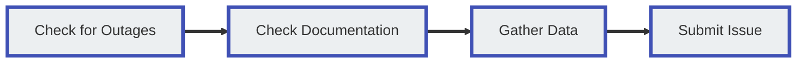

# Customer Support
There are several methods of contacting ConnexCS for assistance outlined below. If you need to Report a Problem, please make sure you check that section for information on issue classification and response times, and some tips for rerpoting issues so we can best address your needs. 

!!! tip "ConnexCS System Status"
    Before reporting a problem, please check the [**ConnexCS System Status Page**](https://status.connexcs.com/) for current known issues. 

## Support Channels

### Online Chat
**Online Chat** allows for real-time assistance. Initial communication is done with a bot. If the bot is unable to help, it will advise you to type "Human" to be connected with a support representative. Clicking this button alerts staff, and the first person to become available will reply as soon as possible.  We find that most questions get resolved efficiently this way. Please note that the chat system is for one-on-one communication about a specific problem, not for multiple concerns or system-wide change requests. 

### Support Tickets
**Support Ticket** (found at the bottom of the ConnexCS navigation menu) displays all open tickets for an account. Tickets are created by sending an email to [**support@connexcs.com**](support@connexcs.com).

### Phone
To speak to a Support Representative, please call our office number listed at [**www.connexcs.com**](https://www.connexcs.com/). 

!!! error "When to call the support number"
    Our support line rings directly to our engineers. We kindly ask that you only ring this number during 9:00am - 23:00pm UTC, unless there is a CRITICAL issue.
    
### SMS
Contact us using **SMS**:

+ UK: +44 7481 346 455
+ USA: +1 408 475 9494

### Telegram
Contact us via **Telegram**:

+ https://t.me/connexcs_support_bot
+ @connexcs_support_bot

### NOC-On-Demand
If you are interested in **NOC-on-Demand** or Enhanced Support, which would give 24/7 (or to cover their time zone) operational support, please contact us directly to discuss this option. 

## Report a Problem
This section covers the best practices for reporting problems to ConnexCS support.  We encourage feedback but also want to make sure you have the most efficient means of expressing a problem so there are no delays.

### Issue Classification and Response times
Issues are classified based on a combination of Category and Severity. If you are not able to determine the Category or Severity, we can help with this. 

#### Categories

**Platform**- Refers to the stability of the ConnexCS system (typically outside customer control). Ex: ConnexCS platform is down. 

**Operational** - Anything within the customer's control. Ex: Configuration issues. 

#### Severity Levels

|Level|Severity|Example|
|---|---|---|
|P0|Critical|ConnexCS is down, this is affecting all of our customers and no calls are able to be made.|
|P1|Critical|A customer of ConnexCS is down and it is affecting all calls.|
|P2|Critical|A customer of our customers calls are down, or there is a serious User Interface problem.|
|P3|Important|There is medium impact problem which is affecting some, calls of 1 or more customers. Or there is a serious User Interface Problem.|
|P4|Trivial|There is a User Interface problem, or a low impact problem affecting calls.|
|P5|Trivial|There is a minor UI Bug or a feature enhancement.|

!!! tip "Reporting issues with new interconnects"
    When reporting an issue with a new interconnect that is not working, please be advised that this is not considered a Critical issue. 

#### Response Times

+ Platform support for P2+ Issues = 24/7.
+ All other Platform issues and Operational Support = 8:00am - 8:00pm UTC (regular working hours). Whenever possible, we may provide support outside these times if we are available (best effort). We are a small team, so we request you keep this in mind when reporting issue severity. 

!!! note "Classification usage"
    These Severity levels are here to assess the impact of a problem but are not followed blindly. We will attempt to answer support requests 24/7, however repeated instances of reporting Critical incidents beyond normal working hours may result in fines on the account or account termination.

### Requested Troubleshooting and Information
For best results when reporting an issue, please provide us with the following information. This will help our support staff and engineers best address reported problems. 

**Step 1: Check for Outages**

Please check the [**ConnexCS System Status Page**](https://status.connexcs.com/) for current known issues. 

**Step 2: Check Documentation**

ConnexCS onsite documentation, found at [**docs.connexcs.com**](https://docs.connexcs.com/), serves multiple functions:

* To provide a repository where you can search for information relevant to your problem.
* To inform your questions when you contact support.

Sometimes complications are resolved easily by turning off parameters that are not compatible. These are instances where a little troubleshooting might solve it. There are other times where a bit of help is needed as well; understanding the documentation will speed our efforts to remedy larger concerns. Whenever possible please consult the ConnexCS documentation before contacting support. 

**Step 3: Gather data**

This step helps us understand and resolve your issue as quickly as possible.

* **User Interface Issues**: Including a screenshot along with a clear description of the problem can really help us understand what needs to be resolved. For an efficient utility to take UI screenshots, we recommend a browser plugin called "Lightshot", or use your OS's built-in snipping tool.
* **Problems with Calls**: For problems with call flow, the **Call-ID** is how we identify which calls are affected. It helps us isolate customers, providers, and/or channels that may be affected. Call-ID is found in the **Logging** section by clicking on a call, and then copying the ID to right of the panel.
* **Clear and Concise Issue Description**: All of the above steps contain more ways for you to be able to identify your problem, troubleshoot it, and then communicate the problem(s) clearly in the event of contact.

!!! failure "Respectful communications"
    We are also happy to talk with you about wider SIP topics outside of our switch where possible. Under no circumstance will we tolerate rude behaviour, intimidation or threats. We are all SSVVP and SSCA qualified, and whenever possible, we will cite references or point you to SIP traces for fact-checking information.

### Reporting Multiple Problems
If you have more than one problem to report, we ask:

1. Create a separate ticket for each request.  This so that the individual concerns get routed to the correct staff.
2. Allow an adequate amount of time for us to assess the problem and resolve it.  We first have to assess if the problems are connected, adding extra time onto finding the roots themselves.
3. Call instead of emailing.  This is so we can get a concise reading on all concerns quickly and ask follow-up questions on the spot.
